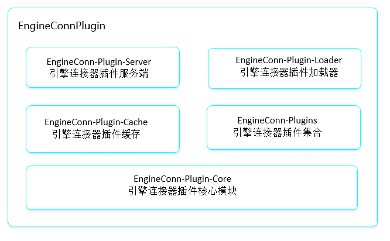

EngineConnPlugin（ECP）架构设计
===============================

引擎连接器插件是一种能够动态加载引擎连接器并减少版本冲突发生的实现，具有方便扩展、快速刷新、选择加载的特性。为了能让开发用户自由扩展Linkis的Engine引擎，并动态加载引擎依赖避免版本冲突，设计研发了EngineConnPlugin，允许以实现既定的插件化接口的方式引入新引擎到计算中间件的执行生命周期里，
插件化接口对引擎的定义做了拆解，包括参数初始化、分配引擎资源，构建引擎连接以及设定引擎默认标签。

一、ECP架构图

二级模块介绍：
==============

EngineConn-Plugin-Server
------------------------

引擎连接器插件服务是对外提供注册插件、管理插件，以及插件资源构建的入口服务。成功注册加载的引擎插件会包含资源分配和启动参数配置的逻辑，在引擎初始化过程中，EngineConn
Manager等其他服务通过RPC请求调用Plugin Server里对应插件的逻辑。

| 核心类                           | 核心功能                              |
|----------------------------------|---------------------------------------|
| EngineConnLaunchService          | 负责构建引擎连接器启动请求            |
| EngineConnResourceFactoryService | 负责生成引擎资源                      |
| EngineConnResourceService        | 负责从BML下载引擎连接器使用的资源文件 |

EngineConn-Plugin-Loader 引擎连接器插件加载器
---------------------------------------

引擎连接器插件加载器是用来根据请求参数动态加载引擎连接器插件的加载器，并具有缓存的特性。具体加载流程主要由两部分组成：1）插件资源例如主程序包和程序依赖包等加载到本地(未开放)。2）插件资源从本地动态加载入服务进程环境中，例如通过类加载器加载入JVM虚拟机。

| 核心类                          | 核心功能                                     |
|---------------------------------|----------------------------------------------|
| EngineConnPluginsResourceLoader | 加载引擎连接器插件资源                       |
| EngineConnPluginsLoader         | 加载引擎连接器插件实例，或者从缓存加载已有的 |
| EngineConnPluginClassLoader     | 动态从jar中实例化引擎连接器实例              |

EngineConn-Plugin-Cache 引擎插件缓存模组
----------------------------------------

引擎连接器插件缓存是专门用来缓存已经加载的引擎连接器的缓存服务，并支持读取、更新、移除的能力。已经加载进服务进程的插件会被连同其类加载器一起缓存起来，避免多次加载影响效率；同时缓存模组会定时通知加载器去更新插件资源，如果发现有变动，会重新加载并自动刷新缓存。

| 核心类                      | 核心功能                     |
|-----------------------------|------------------------------|
| EngineConnPluginCache       | 缓存已经加载的引擎连接器实例 |
| RefreshPluginCacheContainer | 定时刷新缓存的引擎连接器     |

EngineConn-Plugin-Core:引擎连接器插件核心模组
---------------------------------------------

引擎连接器插件核心模块是引擎连接器插件的核心模块。包含引擎插件基本功能实现，如引擎连接器启动命令构建，引擎资源工厂构建和引擎连接器插件核心接口实现。

| 核心类                  | 核心功能                                                 |
|-------------------------|----------------------------------------------------------|
| EngineConnLaunchBuilder | 构建引擎连接器启动请求                                   |
| EngineConnFactory       | 创建引擎连接器                                           |
| EngineConnPlugin        | 引擎连接器插件实现接口，包括资源，命令，实例的构建方法。 |
| EngineResourceFactory   | 引擎资源的创建工厂                                       |

EngineConn-Plugins:引擎连接插件集合
-----------------------------------

引擎连接插件集合是用来放置已经基于我们定义的插件接口实现的默认引擎连接器插件库。提供了默认引擎连接器实现，如jdbc、spark、python、shell等。用户可以基于自己的需求参考已经实现的案例，实现更多的引擎连接器。

| 核心类              | 核心功能         |
|---------------------|------------------|
| engineplugin-jdbc   | jdbc引擎连接器   |
| engineplugin-shell  | shell引擎连接器  |
| engineplugin-spark  | spark引擎连接器  |
| engineplugin-python | python引擎连接器 |

