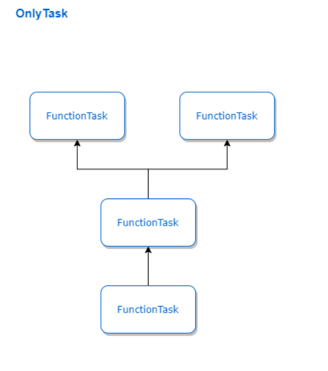

Orchestrator 整体架构设计
===

## 一. Orchestrator概念
&nbsp;&nbsp;&nbsp;&nbsp;&nbsp;Orchestrator计算编排是Linkis1.0的核心价值实现，基于Orchestrator可以实现全栈引擎+丰富计算策略的支持，通过对用户提交的任务进行编排，可以实现对双读、双写、AB等策略类型进行支持。并通过和标签进行配合可以对多种任务场景进行支持：
- 当Orchestrator模块和Entrance进行结合的时候，可以完成对0.X的交互式计算场景进行支持；
- 当Orchestrator模块和引擎连接器EngineConn进行结合的时候，可以完成对常驻式和一次性作业场景进行支持；
- 当Orchestrator模块和Linkis-Client进行对接时，作为RichClient可以对存储式作业场景进行支持，如支持Hbase的双读双写；

## 二. Orchestrator整体架构：
&nbsp;&nbsp;&nbsp;&nbsp;&nbsp;Orchestrator编排整体架构参考Apache Calcite的架构进行实现将一个任务编排划分了如下几步：
- Converter（转换）：完成对用户提交的JobReq(任务请求)装换为编排的Job，该步骤会对用户提交的Job进行参数检查和信息补充，如变量替换等
- Pareser（解析）：完成对Job的解析，并拆封装Job的Stage信息，形成Ast树
- Validator（校验）： 完成对Job和Stage的信息检验，如必须的Label信息检验
- Planner（计划）：完成对Ast阶段的Job和Stage的对象转换为Logical计划，形成Logical树，将Job和Stage分别转换为LogicalTask，并封装执行单元的LogicalTask，如对于交互式的CodeLogicalUnit，转为为CodeLogicalUnitTask
- Optimizer(优化阶段)：完成对Logical Tree转换为Physical Tree，并对树进行优化，如命中缓存型的优化
- Execution（执行）：调度执行物理计划的Physical Tree，按照依赖进行执行
- Reheater（再热）：检测在执行阶段的可重试的失败Task（如ReTryExecption），调整物理计划重新执行
- Plugins（插件）： 插件模块，主要用于Orchestrator对接外部模块进行使用，如EngineConnManagerPlugin用于对接LinkisManager和EngineConn完成对引擎的申请和任务执行\

## 三. Orchestrator实体流转：
&nbsp;&nbsp;&nbsp;&nbsp;&nbsp;Orchestrator编排过程中，主要是完成对输入的JobReq进行转换，主要分为AST、Logical、Physical三个阶段，最终执行的是Physical阶段的ExecTask。整个过程如下：

&nbsp;&nbsp;&nbsp;&nbsp;&nbsp;以下以交互式场景为例简单介绍，下面以codeLogicalUnit:`select * from test`的交互式Job为例，可视化各个阶段的树形图
1. AST阶段：由Parser对ASTJob进行解析后的结构，Job和Stage有属性进行关联，Job里面有getStage信息，Stage里面有Job信息，不是通过parents和children决定（parents和children都为null）：

2. Logical阶段：由Plan对ASTJob进行转换后的结构，包含Job/stage/CodeTask，存在树形结构，关系由parents和children进行决定\,start和end由Desc决定：

3. Physical阶段：由Optimizer转换后的结构，包含Job/Stage/Code ExecTask，存在树形结构，关系由parents和children进行决定\,start和end由Desc决定：

## 四. Orchestrator Core各层级模块详解

### 4.1 Converter模块：
&nbsp;&nbsp;&nbsp;&nbsp;&nbsp; Converter主要用于将一个JobReq转换成一个Job，并完成对JobReq的检查和补充、包括参数检查、变量补充等。JobReq是用户实际提交的一个作业，这个作业可以是交互式作业（这时Orchestrator会与Entrance进行集成，对外提供交互式访问能力），也可以是常驻式/一次性作业（这时Orchestrator会与EngineConn进行集成，直接对外提供执行能力），也可以是存储式作业，这时Orchestrator会与Client进行集成，将直接与EngineConn进行对接。相对应的JobReq有很多实现类，基于场景类型分为ComputationJobReq（交互式）、ClusteredJobReq（常驻式）和StorageJobReq（存储型）。
&nbsp;&nbsp;&nbsp;&nbsp;&nbsp; 这里需区分一下Orchestrator和Entrance的职责范围，一般情况下，Orchestrator对于RichClient、Entrance、EngineConn是必需单元，但是Entrance则不是必需的，所以Converter会提供一系列的检查拦截单元，用于自定义变量的替换和CS相关文件、自定义变量的补充。

### 4.2 Parser模块：
&nbsp;&nbsp;&nbsp;&nbsp;&nbsp; Parser主要用于将一个Job解析为多个Stage，按照不能的计算策略，在Parser阶段生成的AstTree也会不相同，对于普通的交互式计算策略Parser会将Job解析为一个Stage，但是对于双读、双写等计算策略下会将Job解析为多个Stage，每个Stage对应的操作相同去操作不同的集群。

### 4.3 Validator模块：
&nbsp;&nbsp;&nbsp;&nbsp;&nbsp; AstTree在plan生成可执行的Tasks之前，还需先经过Validator。Validator主要用于校验Ast阶段的Job和Stage的合法性，并补充一些必要的信息，例如必要标签信息检查和补充。

### 4.4 Planner模块
&nbsp;&nbsp;&nbsp;&nbsp;&nbsp; Planner模块主要完成对Ast阶段的Job和Stage转换为对应的LogicalTask，形式LogicalTree。Planner会构造LogicalTree，将Job解析为JobEndTask和JobStartTask，将Stage解析为StageEndTask和StageStartTask，以及将实际的执行单元转换为具体的LogicalTask（如对于交互式的CodeLogicalUnit，转为为CodeLogicalUnitTask）。如下图：

### 4.5 Optimizer模块
&nbsp;&nbsp;&nbsp;&nbsp;&nbsp; Optimizer是Orchestrator的优化器，主要用于优化整个LogicalTree转换为PhysicalTree的ExecTask。根据优化的类型不同，Optimizer主要分为两个步骤：第一步是完成对logciaTree的优化，第二部完成对LogicalTree的转换。已经实现的优化策略主要有以下：
- CacheTaskOptimizer（TaskOptimizer级）：判断ExecTask是否可以使用缓存的执行结果，如果命中cache，则调整Tree。
- YarnQueueOptimizer（TaskOptimizer级）：如果用户指定提交的队列现在资源很紧张，且该用户存在其他可用空闲队列，自动为用户做优化。
- PlaybackOptimizer（TaskOptimizer级）：主要用于支持回放。即多写时，如果某个集群存在需要回放的任务，先根据任务时延要求，进行一定数量的任务回放，以便追回。同时对该任务进行关联分析，如果与历史回放任务关联则改为将任务信息写入PlaybackService（或如果是select类别的不执行），不关联则继续执行。
- ConfigurationOptimizer(StageOptimizer级)：优化用户的运行时参数或启动参数。

### 4.6 Execution模块
&nbsp;&nbsp;&nbsp;&nbsp;&nbsp; Execution是Orchestrator的执行模块，用于执行PhysicalTree，支持同步执行和异步执行，执行的过程中通过解析PhysicalTree进行依赖执行。

### 4.7 Reheater模块
&nbsp;&nbsp;&nbsp;&nbsp;&nbsp; Reheater再热允许Execution在执行过程中，动态调整PhysicalTree的执行计划，比如为申请引擎失败的ExecTask发起重新执行等

## 五. Orchestrator编排流程

&nbsp;&nbsp;&nbsp;&nbsp;&nbsp; 对于使用方来说整体编排分为三步：
1. 第一步通过Orchestrator获取OrchestratorSession该对象类似于SparkSession一般进程单例
2. 第二步通过OrchestratorSession进行编排，获取Orchestration对象，编排后返回的唯一对象
3. 第三步通过调用Orchestration 的执行方法机进行支持，支持异步和同步执行模式
整体流程如下图所示：

## 六. Orchestrator常用物理计划示例

1. 交互式分析，拆封成两个Stage的类型

2. Command等只有function类的ExecTask

3. Reheat情型

4. 事务型

5. 命中缓存型

