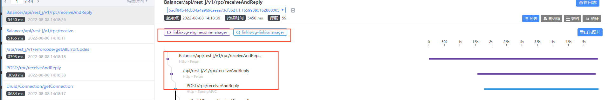
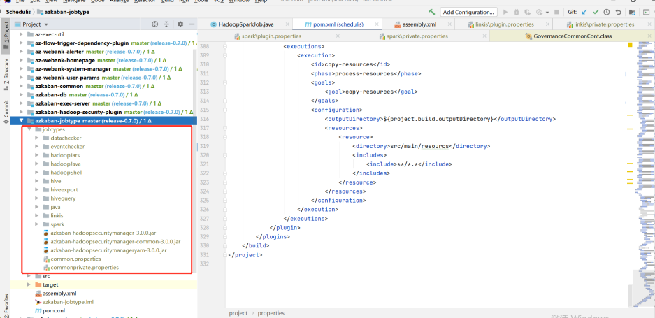
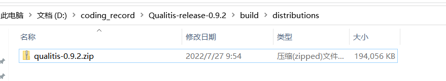
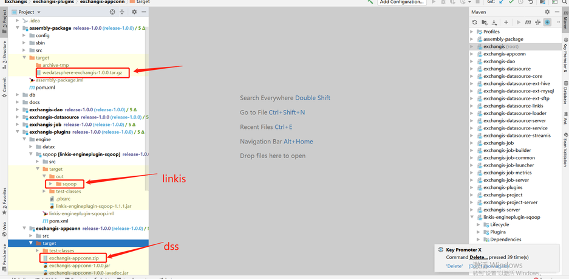
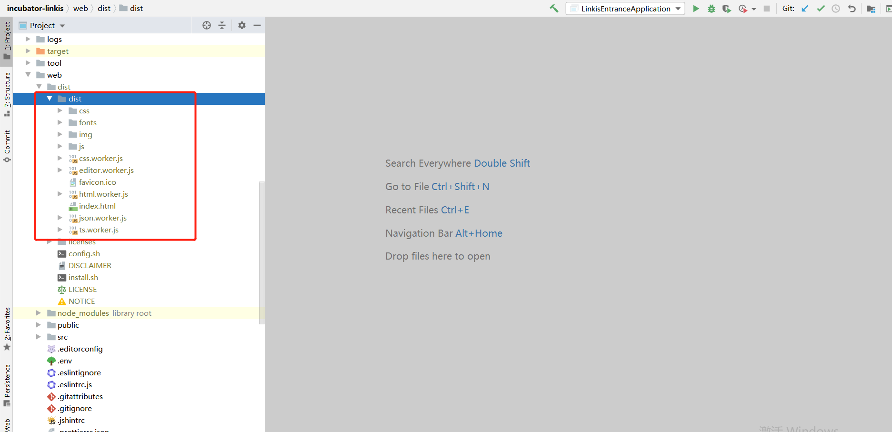
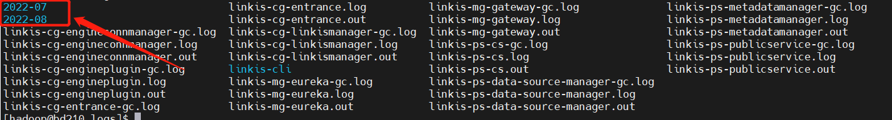

## Environment and Version

- jdk-8 , maven-3.6.3
- node-14.15.0(Compiling the front end requires)
- Gradle-4.6(Compile qualitis quality service)
- hadoop-3.1.1,Spark-3.0.1,Hive-3.1.2,Flink-1.13.2,Sqoop-1.4.7 (Apache version)
- linkis-1.1.1
- DataSphereStudio-1.1.0
- Schudulis-0.7.0
- Qualitis-0.9.2
- Visualis-1.0.0
- Streamis-0.2.0
- Exchangis-1.0.0
- Chrome recommends versions below 100

## Scenarios and versions of each component

| System name      | Version | scene                                                        |
| ---------------- | ------- | ------------------------------------------------------------ |
| linkis           | 1.1.1   | Engine orchestration, running and executing hive, spark, flinksql, shell, python, etc., unified data source management, etc |
| DataSphereStudio | 1.1.0   | Implement DAG scheduling of tasks, integrate the specifications of other systems and provide unified access, and provide sparksql based service API |
| Schudulis        | 0.7.0   | Task scheduling, as well as scheduling details and rerouting, and provide trap data based on the selected time |
| Qualitis         | 0.9.2   | Provide built-in SQL version and other functions, check common data quality and customizable SQL, verify some data that does not conform to the rules, and write it to the corresponding library |
| Exchangis        | 1.0.0   | Hive to MySQL, data exchange between MySQL and hive          |
| Streamis         | 0.2.0   | Streaming development and Application Center                 |
| Visualis         | 1.0.0   | Visual report display, can share external links              |


## Deployment sequence

  You can select and adjust the sequence after serial number 3 However, one thing to pay attention to when deploying exchangis is to copy the sqoop engine plug-in of exchangis to the engine plug-in package under lib of linkis
  Schedulis, qualitis, exchangis, streamis, visualis and other systems are integrated with DSS through their respective appconn. Note that after integrating the component appconn, restart the service module corresponding to DSS or restart DSS

1. linkis
1. DataSphereStudio
1. Schedulis
1. Qualitis
1. Exchangis
1. Streamis
1. Visualis


If you integrate skywalking, you can see the service status and connection status in the extended topology diagram, as shown in the following figure:

At the same time, you can also clearly see the call link in the trace, as shown in the following figure, which is also convenient for you to locate the error log file of the specific service


## Dependency adjustment and packaging

### linkis

Since spark uses version 3. X, Scala also needs to be upgraded to version 12
[Original project code address](https://github.com/apache/incubator-linkis/tree/release-1.1.1)
[Adaptation modification code reference address](https://github.com/ruY9527/incubator-linkis/tree/release-1.1.1-hadoop3.x)

#### The pom file of linkis

```xml
<hadoop.version>3.1.1</hadoop.version>
<scala.version>2.12.10</scala.version>
<scala.binary.version>2.12</scala.binary.version>

<!-- hadoop-hdfs replace with hadoop-hdfs-client -->
<dependency>
    <groupId>org.apache.hadoop</groupId>
    <artifactId>hadoop-hdfs-client</artifactId>
    <version>${hadoop.version}</version>
```

#### The pom file of linkis-hadoop-common

```xml
       <!-- Notice here <version>${hadoop.version}</version> , adjust according to whether you have encountered any errors --> 
       <dependency>
            <groupId>org.apache.hadoop</groupId>
            <artifactId>hadoop-hdfs-client</artifactId>
            <version>${hadoop.version}</version>
        </dependency>
```

#### The pom file of linkis-engineplugin-hive

```xml
<hive.version>3.1.2</hive.version>
```

#### The pom file of linkis-engineplugin-spark

```xml
<spark.version>3.0.1</spark.version>
```

The getfield method in sparkscalaexecutor needs to adjust the following code

```java
protected def getField(obj: Object, name: String): Object = {
    // val field = obj.getClass.getField(name)
    val field = obj.getClass.getDeclaredField("in0")
        field.setAccessible(true)
        field.get(obj)
  }
```

#### The pom file of linkis-engineplugin-flink

```xml
<flink.version>1.13.2</flink.version>
```

Due to the adjustment of some classes in Flink 1.12.2 and 1.13.2, we refer to the temporary "violence" method given by the community students: copy the classes in part 1.12.2 to 1.13.2, adjust the scala version to 12, and compile them by ourselves
It involves the specific modules of flink: flink-sql-client_${scala.binary.version}

```
-- Note that the following classes are copied from 1.12.2 to 1.13.2
org.apache.flink.table.client.config.entries.DeploymentEntry
org.apache.flink.table.client.config.entries.ExecutionEntry
org.apache.flink.table.client.gateway.local.CollectBatchTableSink
org.apache.flink.table.client.gateway.local.CollectStreamTableSink
```


#### linkis-engineplugin-python

[Reference pr](https://github.com/apache/incubator-linkis/commit/7a26e85c53fc7cd55ddefbd78b1748b00f85ddd6)
If resource / Python's python In the PY file, there is import pandas as PD. If you do not want to install pandas, you need to remove it

#### linkis-label-common

org.apache.linkis.manager.label.conf.LabelCommonConfig
Modify the default version to facilitate the use of subsequent self compilation scheduling components

```
    public static final CommonVars<String> SPARK_ENGINE_VERSION =
            CommonVars.apply("wds.linkis.spark.engine.version", "3.0.1");

    public static final CommonVars<String> HIVE_ENGINE_VERSION =
            CommonVars.apply("wds.linkis.hive.engine.version", "3.1.2");
```

#### linkis-computation-governance-common

org.apache.linkis.governance.common.conf.GovernanceCommonConf
Modify the default version to facilitate the use of subsequent self compilation scheduling components

```
  val SPARK_ENGINE_VERSION = CommonVars("wds.linkis.spark.engine.version", "3.0.1")

  val HIVE_ENGINE_VERSION = CommonVars("wds.linkis.hive.engine.version", "3.1.2")
```

#### Compile

Ensure that the above modifications and environments are available and implemented in sequence

```shell
    cd incubator-linkis-x.x.x
    mvn -N  install
    mvn clean install -DskipTests
```

#### Compilation error troubleshooting

- If there is an error when you compile, try to enter a module to compile separately to see if there is an error and adjust it according to the specific error
- For example, the following example (the py4j version does not adapt when the group Friends adapt to the lower version of CDH): if you encounter this problem, you can adjust the version with the corresponding method to determine whether to adapt


### DataSphereStudio

[Original project code address](https://github.com/WeBankFinTech/DataSphereStudio/tree/1.1.0)
[Adaptation modification code reference address](https://github.com/ruY9527/DataSphereStudio/tree/1.1.0-hadoop3.x)

#### The pom file of DataSphereStudio

Since DSS relies on linkis, all compilers should compile linkis before compiling DSS

```xml
<!-- scala consistent environment -->
<scala.version>2.12.10</scala.version>
```

#### dss-dolphinschuduler-token

DolphinSchedulerTokenRestfulApi: Remove type conversion

```
responseRef.getValue("expireTime")
```

#### web tuning

 [Front end compilation address](https://github.com/WeBankFinTech/DataSphereStudio-Doc/blob/main/zh_CN/%E5%BC%80%E5%8F%91%E6%96%87%E6%A1%A3/%E5%89%8D%E7%AB%AF%E7%BC%96%E8%AF%91%E6%96%87%E6%A1%A3.md)
[Reference pr](https://github.com/WeBankFinTech/DataSphereStudio/commit/1dc9d99648e9f78b2dfb4776df4b9f46ef530c8a)
Overwrite the contents of the following directories from the master branch, or build the web based on the master branch


#### Compile

```shell
    cd DataSphereStudio
    mvn -N  install
    mvn clean install -DskipTests
```

### Schedulis

[Original project code address](https://github.com/WeBankFinTech/Schedulis/tree/release-0.7.0)
[Adaptation modification code reference address](https://github.com/ruY9527/Schedulis/tree/release-0.7.0-hadoop.x)

#### The pom file of Schedulis

```xml
       <hadoop.version>3.1.1</hadoop.version>
       <hive.version>3.1.2</hive.version>
       <spark.version>3.0.1</spark.version>
```

####  azkaban-jobtype

Download the jobtype file of the corresponding version (note the corresponding version): [Download address:](https://github.com/WeBankFinTech/Schedulis/blob/master/docs/schedulis_deploy_cn.md)
After downloading, put the entire jobtypes under jobtypes


### Qualitis

[Original project code address](https://github.com/WeBankFinTech/Qualitis/tree/release-0.9.2)

#### Forgerock package download

[release地址](https://github.com/WeBankFinTech/Qualitis/releases) of [release-0.9.1](https://github.com/WeBankFinTech/Qualitis/releases/tag/release-0.9.1),after decompression, put it under. m2\repository\org

#### Compile

Gradle version 4.6

```shell
cd Qualitis
gradle clean distZip
```

After compiling, there will be a qualitis-0.9.2.zip file under qualitis


#### dss-qualitis-appconn compile

Copy the appconn to the appconns under datasphere studio (create the DSS quality appconn folder), as shown in the following figure:
Compile the DSS qualitis appconn. The qualitis under out is the package of integrating qualitis with DSS


### Exchangis

[Original project code address](https://github.com/WeBankFinTech/Exchangis/tree/release-1.0.0)
[Adaptation modification code reference address](https://github.com/ruY9527/Exchangis/tree/release-1.0.0-hadoop3.x)

#### The pom file of Exchangis

```xml
<!-- scala Consistent version -->
<scala.version>2.12.10</scala.version>
```

#### Back end compilation

[Official compiled documents](https://github.com/WeBankFinTech/Exchangis/blob/dev-1.0.0/docs/zh_CN/ch1/exchangis_deploy_cn.md)
In the target package of the assembly package, wedatasphere-exchangis-1.0.0.tar.gz is its own service package
Linkis engineplug sqoop needs to be put into linkis (lib/linkis enginecon plugins)
Exchangis-appconn.zip needs to be put into DSS (DSS appconns)

```xml
mvn clean install 
```



#### Front end compilation

If you deploy the front-end using nginx yourself, you need to pay attention to the dist folder under dist


### Visualis

[Original project code address](https://github.com/WeBankFinTech/Visualis/tree/v1.0.0)
[Adaptation modification code reference address](https://github.com/ruY9527/Visualis/tree/v1.0.0-hadoop3.x)

#### The pom file of Visualis

```xml
<scala.version>2.12.10</scala.version>
```

#### Compile

 [Official compiled documents](https://github.com/WeBankFinTech/Visualis/blob/master/visualis_docs/zh_CN/Visualis_deploy_doc_cn.md)
In the target under assembly, visuis server zip is the package of its own service
The target of visualis appconn is visualis.zip, which is the package required by DSS (DSS appconns)
Build is the package printed by the front end

```xml
cd Visualis
mvn -N install
mvn clean package -DskipTests=true
```


### Streamis

[Original project code address](https://github.com/WeBankFinTech/Streamis/tree/0.2.0)
[Adaptation modification code reference address](https://github.com/ruY9527/Streamis/tree/0.2.0-hadoop3.x)

#### The pom file of Streamis

```xml
<scala.version>2.12.10</scala.version>
```

The pom file of streamis-project-server

```xml
       <!-- If you are 1.0.1 here, adjust it to ${dss.version} -->
       <dependency>
            <groupId>com.webank.wedatasphere.dss</groupId>
            <artifactId>dss-sso-integration-standard</artifactId>
            <version>${dss.version}</version>
            <scope>compile</scope>
        </dependency>
```

#### Compile

 [Official compiled documents](https://github.com/WeBankFinTech/Streamis/blob/main/docs/zh_CN/0.2.0/Streamis%E5%AE%89%E8%A3%85%E6%96%87%E6%A1%A3.md)
Under assembly, the target package wedatasphere-streams-0.2.0-dist.tar.gz is the package of its own back-end service
The stream.zip package of target under stream appconn is required by DSS (DSS appconns)
dist under dist is the front-end package

```xml
cd ${STREAMIS_CODE_HOME}
mvn -N install
mvn clean install
```


## Installation deployment

[Official deployment address](https://linkis.apache.org/zh-CN/docs/1.1.1/deployment/quick-deploy)
[Common error address](https://linkis.apache.org/zh-CN/blog/2022/02/21/linkis-deploy)

### Path unification

It is recommended to deploy the relevant components in the same path (for example, I unzip them all in /home/hadoop/application)


### Notes on linkis deployment

#### Deploy config folder

db.sh, the address of the links connection configured by mysql, and the metadata connection address of hive
linkis-env.sh

```shell
-- The path to save the script script. Next time, there will be a folder with the user's name, and the script of the corresponding user will be stored in this folder
WORKSPACE_USER_ROOT_PATH=file:///home/hadoop/logs/linkis
-- Log files for storing materials and engine execution
HDFS_USER_ROOT_PATH=hdfs:///tmp/linkis
-- Log of each execution of the engine and information related to starting engineconnexec.sh
ENGINECONN_ROOT_PATH=/home/hadoop/logs/linkis/apps
-- Access address of yarn master node (active resource manager)
YARN_RESTFUL_URL
-- Conf address of Hadoop / hive / spark
HADOOP_CONF_DIR
HIVE_CONF_DIR
SPARK_CONF_DIR
-- Specify the corresponding version
SPARK_VERSION=3.0.1
HIVE_VERSION=3.1.2
-- Specify the path after the installation of linkis. For example, I agree to specify the path under the corresponding component here
LINKIS_HOME=/home/hadoop/application/linkis/linkis-home
```

#### flink

If you use Flink, you can try importing it from [flink-engine.sql](./img/flink-engine.sql)  into the database of linkis

Need to modify @Flink_LABEL version is the corresponding version, and the queue of yarn is default by default

At the same time, in this version, if you encounter the error of "1g" converting digital types, try to remove the 1g unit and the regular check rules. Refer to the following:


#### lzo

If your hive uses LZO, copy the corresponding LZO jar package to the hive path. For example, the following path:

```
lib/linkis-engineconn-plugins/hive/dist/v3.1.2/lib
```

#### Frequently asked questions and precautions

- The MySQL driver package must be copied to /lib/linkis-commons/public-module/ and /lib/linkis-spring-cloud-services/linkis-mg-gateway/
- Initialization password in conf/linkis-mg-gateway.properties -> wds.linkis.admin.password
- ps-cs in the startup script,there may be failures, if any,use sh linkis-daemon.sh ps-cs , start it separately
- At present, if there is time to back up the log, sometimes if the previous error log cannot be found, it may be backed up to the folder of the corresponding date
- At present lib/linkis-engineconn-plugins have only spark/shell/python/hive,If you want appconn, flink and sqoop, go to DSS, linkis and exchangis to get them
- Configuration file version check

```shell
linkis.properties,flink see if it is used
wds.linkis.spark.engine.version=3.0.1
wds.linkis.hive.engine.version=3.1.2
wds.linkis.flink.engine.version=1.13.2
```




#### Error record

1. Incompatible versions. If you encounter the following error, it is whether the scala version is not completely consistent. Check and compile it


2. Yarn configures the active node address. If the standby address is configured, the following error will appear:


### Considerations for DSS deployment

[Official installation document](https://github.com/WeBankFinTech/DataSphereStudio-Doc/tree/main/zh_CN)

#### config folder

db.sh: configure the database of DSS
config.sh

```shell
-- The installation path of DSS, for example, is defined in the folder under DSS
DSS_INSTALL_HOME=/home/hadoop/application/dss/dss
```

#### conf folder

dss.properties

```properties
# Mainly check whether spark / hive and other versions are available. If not, add
wds.linkis.spark.engine.version=3.0.1
wds.linkis.hive.engine.version=3.1.2
wds.linkis.flink.engine.version=1.13.2
```

dss-flow-execution-server.properties

```properties
# Mainly check whether spark / hive and other versions are available. If not, add
wds.linkis.spark.engine.version=3.0.1
wds.linkis.hive.engine.version=3.1.2
wds.linkis.flink.engine.version=1.13.2
```

If you want to use dolphin scheduler for scheduling, please add the corresponding spark / hive version to this pr
[Reference pr](https://github.com/WeBankFinTech/DataSphereStudio/pull/914/files)

#### dss-appconns

Exchangis, qualitis, streamis and visualis should be obtained from the projects of exchangis, qualitis, streamis and visualis respectively

#### Frequently asked questions and precautions

- Since we integrate scheduleis, qualitis, exchangis and other components into DSS, all the interfaces of these components will be called synchronously when creating a project, so we ensure that dss_appconn_instance  configuration paths in the instance are correct and accessible
- The Chrome browser recommends that the kernel use version 100 or below. Otherwise, there will be a problem that you can separate scdulis, qaulitis and other components, but you cannot log in successfully through DSS
- Hostname and IP. If IP access is used, make sure it is IP when executing appconn-install.sh installation Otherwise, when accessing other components, you will be prompted that you do not have login or permission


### Schedulis deployment considerations

 [Official deployment document](https://github.com/WeBankFinTech/Schedulis/blob/master/docs/schedulis_deploy_cn.md)

#### conf folder

azkaban.properties

```properties
# azkaban.jobtype.plugin.dir and executor.global.properties. It's better to change the absolute path here
# Azkaban JobTypes Plugins
azkaban.jobtype.plugin.dir=/home/hadoop/application/schedulis/apps/schedulis_0.7.0_exec/plugins/jobtypes

# Loader for projects
executor.global.properties=/home/hadoop/application/schedulis/apps/schedulis_0.7.0_exec/conf/global.properties

# Engine version
wds.linkis.spark.engine.version=3.0.1
wds.linkis.hive.engine.version=3.1.2
wds.linkis.flink.engine.version=1.13.2
```

#### web modular

plugins/viewer/system/conf:  Here, you need to configure the database connection address to be consistent with scheduleis
azkaban.properties:  Configuration of user parameters and system management

```properties
viewer.plugins=system
viewer.plugin.dir=/home/hadoop/application/schedulis/apps/schedulis_0.7.0_web/plugins/viewer
```

#### Frequently asked questions and precautions

If there are resources or there are no static files such as CSS in the web interface, change the relevant path to an absolute path
If the configuration file cannot be loaded, you can also change the path to an absolute path
For example:

```
### web module
web.resource.dir=/home/hadoop/application/schedulis/apps/schedulis_0.7.0_web/web/
viewer.plugin.dir=/home/hadoop/application/schedulis/apps/schedulis_0.7.0_web/plugins/viewer

### exec module
azkaban.jobtype.plugin.dir=/home/hadoop/application/schedulis/apps/schedulis_0.7.0_exec/plugins/jobtypes
executor.global.properties=/home/hadoop/application/schedulis/apps/schedulis_0.7.0_exec/conf/global.properties
```

### Considerations for qualitis deployment

[Official deployment document](https://github.com/WeBankFinTech/Qualitis/blob/master/docs/zh_CN/ch1/%E5%BF%AB%E9%80%9F%E6%90%AD%E5%BB%BA%E6%89%8B%E5%86%8C%E2%80%94%E2%80%94%E5%8D%95%E6%9C%BA%E7%89%88.md)

#### conf folder

application-dev.yml

```properties
  # The correct spark version is configured here
  spark:
    application:
      name: IDE
      reparation: 50
    engine:
      name: spark
      version: 3.0.1
```

### Exchange deployment considerations

[Official deployment document](https://github.com/WeBankFinTech/Exchangis/blob/dev-1.0.0/docs/zh_CN/ch1/exchangis_deploy_cn.md)

#### Frequently asked questions and precautions

If you click the data source and there is an error that has not been published, you can try to add linkis_ps_dm_datasource_ -> published_version_id Modify the published_version_id value to 1 (if it is null)

### Visualis

[Official deployment document](https://github.com/WeBankFinTech/Visualis/blob/master/visualis_docs/zh_CN/Visualis_deploy_doc_cn.md)

#### Frequently asked questions and precautions

If the preview view is inconsistent, please check whether the bin / phantomjs file is uploaded completely
If you can see the following results, the upload is complete

```properties
./phantomjs -v
2.1.1
```

### Streamis

 [Official deployment document](https://github.com/WeBankFinTech/Streamis/blob/main/docs/zh_CN/0.2.0/Streamis%E5%AE%89%E8%A3%85%E6%96%87%E6%A1%A3.md)

### dss-appconn

Qualitis, exchangis, streams and visualis are compiled from various modules, copied to DSS appconns under DSS, and then executed appconn-install.sh under bin to install their components
If you find the following SQL script errors during integration, please check whether there are comments around the wrong SQL. If so, delete the comments and try appconn install again

For example, for qualitis, the following IP and host ports are determined according to their specific use

```
qualitis
172.21.129.78
8090
```

## Nginx deployment example

 linkis.conf:   dss/linkis/visualis front end
 exchangis.conf:  exchangis front end
 streamis.conf:      streamis front end
Scheduling and Qaulitis are in their own projects
Linkis / Visualis needs to change the dist or build packaged from the front end to the name of the corresponding component here


#### linkis.conf

```
server {
listen       8089;# Access port:
server_name  localhost;
#charset koi8-r;
#access_log  /var/log/nginx/host.access.log  main;

location /dss/visualis {
# Modify to your own front-end path
root   /home/hadoop/application/webs; # Static file directory
autoindex on;
}

location /dss/linkis {
# Modify to your own front-end path
root   /home/hadoop/application/webs; # linkis Static file directory of management console
autoindex on;
}

location / {
# Modify to your own front-end path
root   /home/hadoop/application/webs/dist; # Static file directory
#root /home/hadoop/dss/web/dss/linkis;
index  index.html index.html;
}

location /ws {
proxy_pass http://172.21.129.210:9001;#Address of back-end linkis
proxy_http_version 1.1;
proxy_set_header Upgrade $http_upgrade;
proxy_set_header Connection upgrade;
}

location /api {
proxy_pass http://172.21.129.210:9001; #Address of back-end linkis
proxy_set_header Host $host;
proxy_set_header X-Real-IP $remote_addr;
proxy_set_header x_real_ipP $remote_addr;
proxy_set_header remote_addr $remote_addr;
proxy_set_header X-Forwarded-For $proxy_add_x_forwarded_for;
proxy_http_version 1.1;
proxy_connect_timeout 4s;
proxy_read_timeout 600s;
proxy_send_timeout 12s;
proxy_set_header Upgrade $http_upgrade;
proxy_set_header Connection upgrade;
}

#error_page  404              /404.html;
# redirect server error pages to the static page /50x.html
#
error_page   500 502 503 504  /50x.html;
location = /50x.html {
root   /usr/share/nginx/html;
}
}

```

#### exchangis.conf

```
server {
            listen       9800; # Access port: if the port is occupied, it needs to be modified
            server_name  localhost;
            #charset koi8-r;
            #access_log  /var/log/nginx/host.access.log  main;
            location / {
            # Modify to own path
            root   /home/hadoop/application/webs/exchangis/dist/dist; #Modify to your own path
            autoindex on;
            }

            location /api {
            proxy_pass http://172.21.129.210:9001;  # The address of the backend link needs to be modified
            proxy_set_header Host $host;
            proxy_set_header X-Real-IP $remote_addr;
            proxy_set_header x_real_ipP $remote_addr;
            proxy_set_header remote_addr $remote_addr;
            proxy_set_header X-Forwarded-For $proxy_add_x_forwarded_for;
            proxy_http_version 1.1;
            proxy_connect_timeout 4s;
            proxy_read_timeout 600s;
            proxy_send_timeout 12s;
            proxy_set_header Upgrade $http_upgrade;
            proxy_set_header Connection upgrade;
            }

            #error_page  404              /404.html;
            # redirect server error pages to the static page /50x.html
            #
            error_page   500 502 503 504  /50x.html;
            location = /50x.html {
            root   /usr/share/nginx/html;
            }
        }

```

#### streamis.conf

```
server {
    listen       9088;# Access port: if the port is occupied, it needs to be modified
    server_name  localhost;
    location / {
    # Modify to your own path
        root   /home/hadoop/application/webs/streamis/dist/dist;  #Modify to your own path
        index  index.html index.html;
    }
    location /api {
    proxy_pass http://172.21.129.210:9001;        # The address of the backend link needs to be modified
    proxy_set_header Host $host;
    proxy_set_header X-Real-IP $remote_addr;
    proxy_set_header x_real_ipP $remote_addr;
    proxy_set_header remote_addr $remote_addr;
    proxy_set_header X-Forwarded-For $proxy_add_x_forwarded_for;
    proxy_http_version 1.1;
    proxy_connect_timeout 4s;
    proxy_read_timeout 600s;
    proxy_send_timeout 12s;
    proxy_set_header Upgrade $http_upgrade;
    proxy_set_header Connection upgrade;
    }

    #error_page  404              /404.html;
    # redirect server error pages to the static page /50x.html
    #
    error_page   500 502 503 504  /50x.html;
    location = /50x.html {
    root   /usr/share/nginx/html;
    }
}
```

