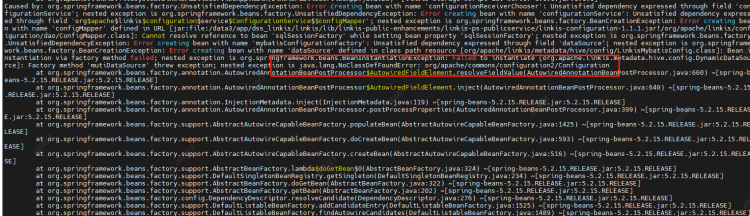

With the development of business and the update and iteration of community products, we found that Linkis1. X has greatly improved its performance in terms of resource management and engine management, which can better meet the requirements of the construction of data middle stations. Compared with version 0.9.3 and the platform we used before, the user experience has also been greatly improved, and the problems such as the inability to view details on the task failure page have also been improved. Therefore, we decided to upgrade Linkis and the WDS suite. The following are the specific practical operations, which we hope will give you a reference.

# 1.Environment

## CDH6.3.2 Component versions

* hadoop:3.0.0-cdh6.3.2
* hive:2.1.1-cdh6.3.2
* spark：2.4.8

## hardware environment 

128G cloud physical machine*2

# 2. Linkis installation and deployment

## 2.1 Compile code or release installation package?

This installation deployment adopts the release installation package method. In order to adapt to the company's CDH6.3.2 version, the dependency packages of hadoop and hive need to be replaced with the CDH6.3.2 version. Here, the installation package is directly replaced. The dependent packages and modules to be replaced are shown in the following list.

```plain
// Modules involved 

linkis-engineconn-plugins/spark
linkis-engineconn-plugins/hive
/linkis-commons/public-module
/linkis-computation-governance/
```

```plain
// List of cdh packages that need to be replaced

./lib/linkis-engineconn-plugins/spark/dist/v2.4.8/lib/hive-shims-0.23-2.1.1-cdh6.3.2.jar
./lib/linkis-engineconn-plugins/spark/dist/v2.4.8/lib/hive-shims-scheduler-2.1.1-cdh6.3.2.jar
./lib/linkis-engineconn-plugins/spark/dist/v2.4.8/lib/hadoop-annotations-3.0.0-cdh6.3.2.jar
./lib/linkis-engineconn-plugins/spark/dist/v2.4.8/lib/hadoop-auth-3.0.0-cdh6.3.2.jar
./lib/linkis-engineconn-plugins/spark/dist/v2.4.8/lib/hadoop-common-3.0.0-cdh6.3.2.jar
./lib/linkis-engineconn-plugins/spark/dist/v2.4.8/lib/hadoop-hdfs-3.0.0-cdh6.3.2.jar
./lib/linkis-engineconn-plugins/spark/dist/v2.4.8/lib/hadoop-hdfs-client-3.0.0-cdh6.3.2.jar
./lib/linkis-engineconn-plugins/hive/dist/v2.1.1/lib/hadoop-client-3.0.0-cdh6.3.2.jar
./lib/linkis-engineconn-plugins/hive/dist/v2.1.1/lib/hadoop-mapreduce-client-common-3.0.0-cdh6.3.2.jar
./lib/linkis-engineconn-plugins/hive/dist/v2.1.1/lib/hadoop-mapreduce-client-jobclient-3.0.0-cdh6.3.2.jar
./lib/linkis-engineconn-plugins/hive/dist/v2.1.1/lib/hadoop-yarn-api-3.0.0-cdh6.3.2.jar
./lib/linkis-engineconn-plugins/hive/dist/v2.1.1/lib/hadoop-yarn-client-3.0.0-cdh6.3.2.jar
./lib/linkis-engineconn-plugins/hive/dist/v2.1.1/lib/hadoop-yarn-server-common-3.0.0-cdh6.3.2.jar
./lib/linkis-engineconn-plugins/hive/dist/v2.1.1/lib/hadoop-hdfs-client-3.0.0-cdh6.3.2.jar
./lib/linkis-engineconn-plugins/hive/dist/v2.1.1/lib/hadoop-mapreduce-client-core-3.0.0-cdh6.3.2.jar
./lib/linkis-engineconn-plugins/hive/dist/v2.1.1/lib/hadoop-mapreduce-client-shuffle-3.0.0-cdh6.3.2.jar
./lib/linkis-engineconn-plugins/hive/dist/v2.1.1/lib/hadoop-yarn-common-3.0.0-cdh6.3.2.jar
./lib/linkis-engineconn-plugins/flink/dist/v1.12.2/lib/hadoop-annotations-3.0.0-cdh6.3.2.jar
./lib/linkis-engineconn-plugins/flink/dist/v1.12.2/lib/hadoop-auth-3.0.0-cdh6.3.2.jar
./lib/linkis-engineconn-plugins/flink/dist/v1.12.2/lib/hadoop-mapreduce-client-core-3.0.0-cdh6.3.2.jar
./lib/linkis-engineconn-plugins/flink/dist/v1.12.2/lib/hadoop-yarn-api-3.0.0-cdh6.3.2.jar
./lib/linkis-engineconn-plugins/flink/dist/v1.12.2/lib/hadoop-yarn-client-3.0.0-cdh6.3.2.jar
./lib/linkis-engineconn-plugins/flink/dist/v1.12.2/lib/hadoop-yarn-common-3.0.0-cdh6.3.2.jar
./lib/linkis-commons/public-module/hadoop-annotations-3.0.0-cdh6.3.2.jar
./lib/linkis-commons/public-module/hadoop-auth-3.0.0-cdh6.3.2.jar
./lib/linkis-commons/public-module/hadoop-common-3.0.0-cdh6.3.2.jar
./lib/linkis-commons/public-module/hadoop-hdfs-client-3.0.0-cdh6.3.2.jar
./lib/linkis-computation-governance/linkis-cg-linkismanager/hadoop-annotations-3.0.0-cdh6.3.2.jar
./lib/linkis-computation-governance/linkis-cg-linkismanager/hadoop-auth-3.0.0-cdh6.3.2.jar
./lib/linkis-computation-governance/linkis-cg-linkismanager/hadoop-yarn-api-3.0.0-cdh6.3.2.jar
./lib/linkis-computation-governance/linkis-cg-linkismanager/hadoop-yarn-client-3.0.0-cdh6.3.2.jar
./lib/linkis-computation-governance/linkis-cg-linkismanager/hadoop-yarn-common-3.0.0-cdh6.3.2.jar

```


## 2.2 Problems encountered during deployment

### 2.2.1  Kerberos configuration

It needs to be added in the linkis.properties public configuration

Each engine conf also needs to be added

```plain
wds.linkis.keytab.enable=true
wds.linkis.keytab.file=/hadoop/bigdata/kerberos/keytab
wds.linkis.keytab.host.enabled=false
wds.linkis.keytab.host=your_host
```

### 2.2.2  Error is reported after Hadoop dependency package is replaced

java.lang.NoClassDefFoundError:org/apache/commons/configuration2/Configuration



Cause: Configuration class conflict. Add a commons-configuration2-2.1.1.jar under the linkis commons module to resolve the conflict

### 

### 2.2.3 Running spark, python, etc. in script reports no plugin for XXX

Phenomenon: After modifying the version of Spark/Python in the configuration file, the startup engine reports no plugin for XXX


Reason: LabelCommonConfig.java and GovernanceCommonConf In scala, the version of the engine is written dead, the corresponding version is modified, and all jars containing these two classes (linkis computation governance common-1.1.1. jar and linkis label common-1.1.1. jar) in linkis and other components (including scheduleris) are replaced after compilation

### 2.2.4 Python engine execution error, initialization failed

* Modify python. py and remove the imported pandas module
* Configure the python loading directory and modify the python engine's linkis-enginecon.properties

```plain
pythonVersion=/usr/local/bin/python3.6
```

### 2.2.5 Failed to run the pyspark task and reported an error


Reason: PYSPARK is not set_ VERSION

resolvent:

Set two parameters in/etc/profile
```
export PYSPARK_ PYTHON=/usr/local/bin/python3.6
export PYSPARK_ DRIVER_PYTHON=/usr/local/bin/python3.6
```
### 2.2.6 Error occurs when executing the pyspark task

java.lang.NoSuchFieldError: HIVE_ STATS_ JDBC_ TIMEOUT


 

Reason: Spark 2.4.8 uses the hive1.2.1 package, but our hive has been upgraded to version 2.1.1. This parameter has been removed from hive2. Then the code in spark sql still calls the hive parameter, and then an error is reported,

Therefore, HIVE is deleted from the spark sql/hive code_ STATS_ JDBC_ TIMEOUT This parameter is recompiled and packaged to replace the spark hive in spark 2.4.8_ 2.11-2.4.8.jar

### 2.2.7 Proxy user exception during jdbc engine execution

Phenomenon: User A is used to execute a jdbc task 1. The engine chooses to reuse it. Then I also use User B to execute a jdbc task 2. It is found that the submitter of task 2 is A

Analysis reason:

ConnectionManager::getConnection


When creating a datasource, we judge whether to create it according to the key. The key is a jdbc url, but this granularity may be a bit large, because different users may access the same datasource, such as hive. Their urls are the same, but their account passwords are different. So when the first user creates a datasource, the username has been specified. When the second user comes in, If the data source is found to exist, it will be used directly instead of creating a new data source. Therefore, the code submitted by user B will be executed by user A.

Solution: Reduce the key granularity of the data source cache map, and change it to jdbc. url+jdbc. user.

3.  DSS deployment
    The installation process refers to the official website documents for installation configuration. The following describes some issues encountered in the installation and debugging process.

## 3.1 The database list displayed on the left side of the DSS is incomplete

Analysis: The database information displayed in the DSS data source module is from the hive metabase. However, because of the permission control through the Sentry in CDH6, most of the hive table metadata information does not exist in the hive metastore, so the displayed data is missing.

resolvent:

The original logic is transformed into the way of using jdbc to link hive and obtain table data display from jdbc.

Simple logic description:

The properties information of jdbc is obtained through the IDE jdbc configuration information configured on the linkis console.

DBS: Get the schema through connection. getMetaData()

TBS: connection. getMetaData(). getTables() Get the tables under the corresponding db

COLUMNS: Get the columns information of the table by executing describe table

## 3.2 Error jdbc is reported when executing jdbc script in DSS workflow name is empty

Analysis: The default creator in the dss workflow is Schedulis. Because the related engine parameters of Schedulis are not configured in the management console, the parameters read are all empty.

Adding a category of Schedulis to the console gives an error, ”The Schedulis directory already exists. Because the creator in the scheduling system is schedulis, the Schedulis Category cannot be added. In order to better identify each system, the default creator in the dss workflow is changed to nod_exception. This parameter can add wds. linkis. flow. job. creator. v1=nod_execution in the dss flow execution server. properties.


