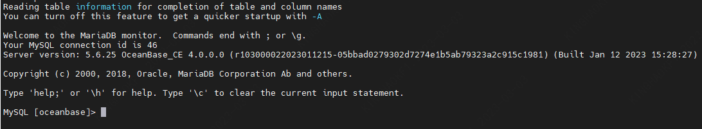
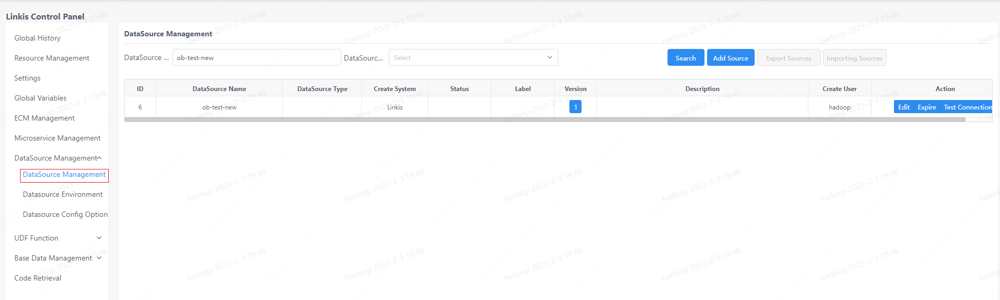
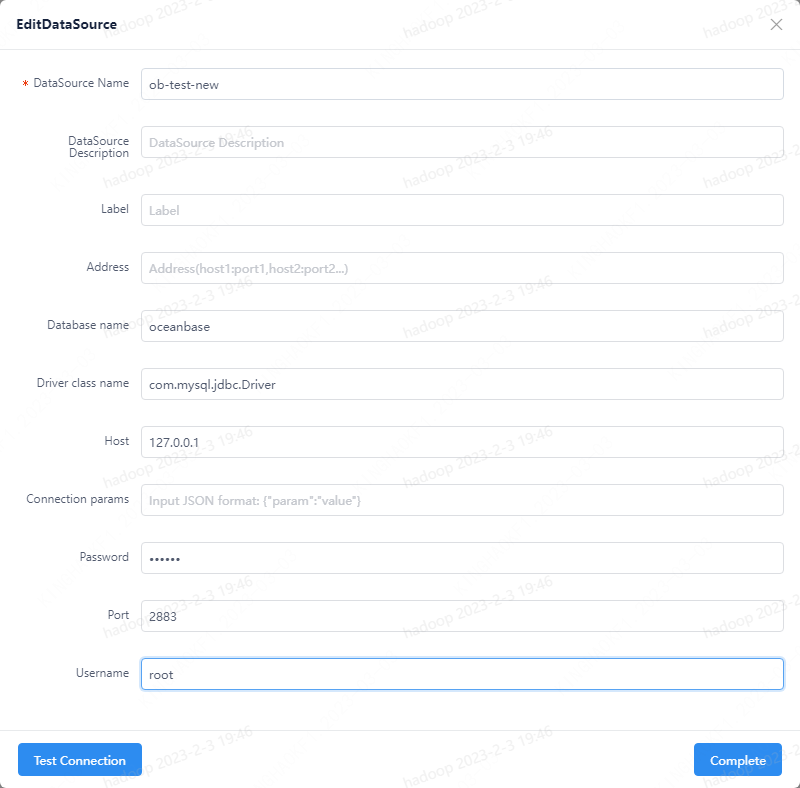
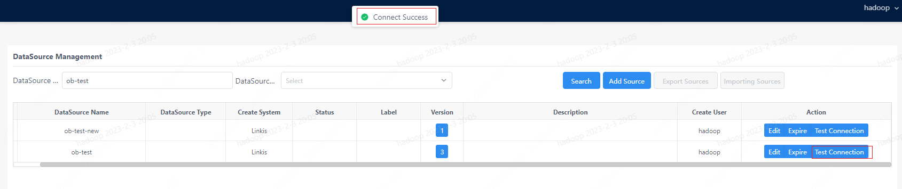
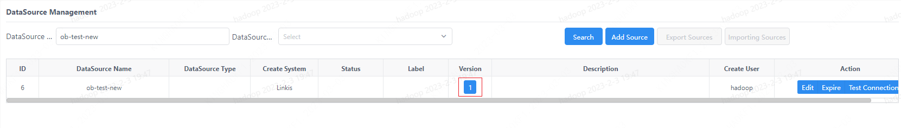
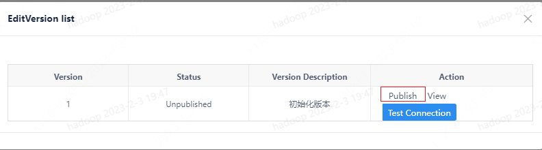
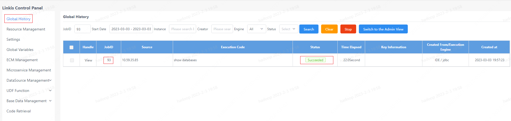

--- 
title: Linkis 1.3.2 Integration with OceanBase
sidebar_position: 3
--- 

This article mainly introduces the integration of OceanBase database in `Linkis` 1.3.2 version. OceanBase database is compatible with most functions and syntax of MySQL 5.7/8.0. Therefore, the OceanBase database can be used as MySQL.

## 1. Preparations
### 1.1 Environment installation

Install and deploy the OceanBase database, see [Quick experience](https://en.oceanbase.com/docs/community-observer-en-10000000000829647)

### 1.2 Environment Verification
You can use the MySQL command to verify the installation of the OceanBase database.
```sql 
mysql -h${ip} -P${port} -u${username} -p${password} -D${db_name}
```
The connection is successful as shown in the figure below:


## 2. Linkis submits OceanBase database tasks
### 2.1 Submit tasks through the shell
shell

```shell
 sh ./bin/linkis-cli -engineType jdbc-4 -codeType jdbc -code "show tables" -submitUser hadoop -proxyUser hadoop -runtimeMap wds.linkis.jdbc.connect.url=jdbc:mysql://${ip} :${port}/${db_name} -runtimeMap wds.linkis.jdbc.driver=com.mysql.jdbc.Driver -runtimeMap wds.linkis.jdbc.username=${username} -runtimeMap wds.linkis.jdbc.password =${password} 
``` 

### 2.2 Submit tasks through Linkis SDK
`Linkis` provides `SDK` of `Java` and `Scala` to submit tasks to `Linkis` server. For details, please refer to [JAVA SDK Manual](/docs/latest/user-guide/sdk-manual.md). For `OceanBase` tasks, you only need to modify `EngineConnType` and `CodeType` parameters in `Demo`:
```java 
Map<String, Object> labels = new HashMap<String, Object>(); 
labels.put (LabelKeyConstant.ENGINE_TYPE_KEY, "jdbc-4"); // required engineType Label
labels.put(LabelKeyConstant.USER_CREATOR_TYPE_KEY, "hadoop-IDE");// required execute user and creator 
labels.put(LabelKeyConstant.CODE_TYPE_KEY, "jdbc"); // required codeType 
``` 

### 2.3 Multi-data source support
Address: Login Management Platform --> Data Source Management

Step 1: Create a new data source





Step 2: Connection test

Click Test Connect button to test


Step 3: Publish data source





Step 4: Submit the OceanBase task by specifying the data source name

Request URL: `http://${gateway_url}:${port}/api/rest_j/v1/entrance/submit` Request

method: POST

Request parameter:
```json 
{
    "executionContent": {
        "code": "show databases",
        "runType": "jdbc"
    },
    "params": {
        "variable": {},
        "configuration": {
            "startup": {},
            "runtime": {
                "wds.linkis.engine.runtime.datasource": "ob-test"
            }
        }
    },
    "labels": {
        "engineType": "jdbc-4"
    }
}
```
Response：
```json
{
  "method": "/api/entrance/submit",
  "status": 0,
  "message": "OK",
  "data": {
    "taskID": 93,
    "execID": "exec_id018017linkis-cg-entrance000830fb1364:9104IDE_hadoop_jdbc_0"
  }
}
```

