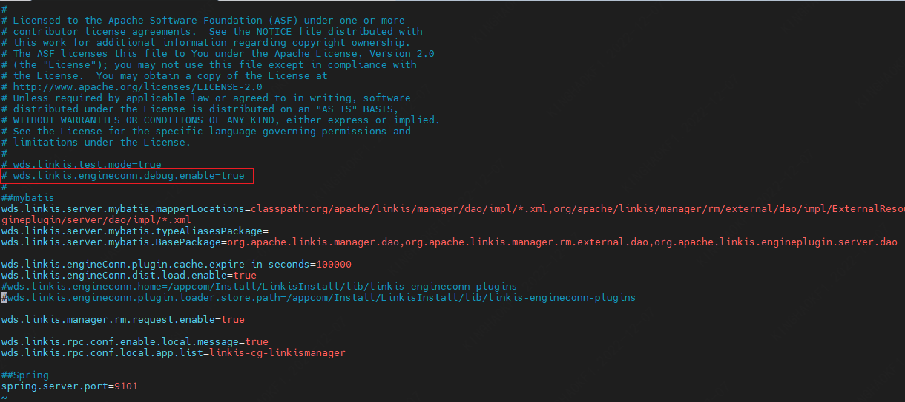

# 1. Recommended configuration of hardware and software environment

Linkis builds a layer of computing middleware between the upper application and the underlying engine. As an open source distributed computing middleware, it can be well deployed and run on Intel architecture servers and mainstream virtualization environments, and supports mainstream Linux operating system environments

## 1.1. Linux operating system version requirements

| OS | Version |
| --- | --- |
| Red Hat Enterprise Linux | 7.0 and above |
| CentOS | 7.0 and above |
| Oracle Enterprise Linux | 7.0 and above |
| Ubuntu LTS | 16.04 and above |

> **Note:** The above Linux operating systems can run on physical servers and mainstream virtualization environments such as VMware, KVM, and XEN

## 1.2. Server recommended configuration

Linkis supports 64-bit general-purpose hardware server platforms running on the Intel x86-64 architecture. The following recommendations are made for the server hardware configuration of the production environment:

### Production Environment

| **CPU** | **Memory** | **Disk type** | **Network** | **Number of instances** |
| --- | --- | --- | --- | --- |
| 16 cores + | 32GB + | SAS | Gigabit network card | 1+ |

> **Note:**
>
> - The above recommended configuration is the minimum configuration for deploying Linkis, and a higher configuration is strongly recommended for production environments
> - The hard disk size configuration is recommended to be 50GB+, and the system disk and data disk are separated

## 1.3. Software requirements

Linkis binary packages are compiled based on the following software versions:

| Component | Version | Description |
| --- | --- | --- |
| Hadoop | 2.7.2 | |
| Hive | 2.3.3 | |
| Spark | 2.4.3 | |
| Flink | 1.12.2 | |
| openLooKeng | 1.5.0 | |
| Sqoop | 1.4.6 | |
| ElasticSearch | 7.6.2 | |
| Presto | 0.234 | |
| Python | Python2 | |

> **Note:**
> If the locally installed component version is inconsistent with the above, you need to modify the corresponding component version and compile the binary package yourself for installation.

## 1.4. Client web browser requirements

Linkis recommends Chrome version 73 for front-end access

# 2. Common scenarios

## 2.1 Open test mode
The development process requires a password-free interface, which can be replaced or appended to `linkis.properties`

| parameter name | default value | description |
| ------------------------- | ------- | --------------- -----------------------------------------------|
| wds.linkis.test.mode | false | Whether to enable debugging mode, if set to true, all microservices support password-free login, and all EngineConn open remote debugging ports |
| wds.linkis.test.user | hadoop | When wds.linkis.test.mode=true, the default login user for password-free login |

## 2.2 Login user settings
Apache Linkis uses configuration files to manage admin users by default, and this configuration can be replaced or appended to `linkis-mg-gateway.properties`. For multi-user access LDAP implementation.

| parameter name | default value | description |
| ------------------------- | ------- | --------------- -----------------------------------------------|
| wds.linkis.admin.user | hadoop | admin username |
| wds.linkis.admin.password | 123456 | Admin user password |

## 2.3 LDAP Settings
Apache Linkis can access LDAP through parameters to achieve multi-user management, and this configuration can be replaced or added in `linkis-mg-gateway.properties`.

| parameter name | default value | description |
| ------------------------- | ------- | --------------- -----------------------------------------------|
| wds.linkis.ldap.proxy.url | None | LDAP URL address |
| wds.linkis.ldap.proxy.baseDN | None | LDAP baseDN address |
| wds.linkis.ldap.proxy.userNameFormat | None | |

## 2.4 Turn off resource checking
Apache Linkis sometimes debugs exceptions when submitting tasks, such as: insufficient resources; you can replace or append this configuration in `linkis-cg-linkismanager.properties`.

| parameter name | default value | description |
| ------------------------- | ------- | --------------- -----------------------------------------------|
| wds.linkis.manager.rm.request.enable | true | resource check |

## 2.5 Enable engine debugging
Apache Linkis EC can enable debugging mode, and this configuration can be replaced or added in `linkis-cg-linkismanager.properties`.

| parameter name | default value | description |
| ------------------------- | ------- | --------------- -----------------------------------------------|
| wds.linkis.engineconn.debug.enable | true | Whether to enable engine debugging |

## 2.6 Hive metadata configuration
The public-service service of Apache Linkis needs to read hive metadata; this configuration can be replaced or appended in `linkis-ps-publicservice.properties`.

| parameter name | default value | description |
| ------------------------- | ------- | --------------- -----------------------------------------------|
| hive.meta.url | None | The URL of the HiveMetaStore database. |
| hive.meta.user | none | user of the HiveMetaStore database |
| hive.meta.password | None | password for the HiveMetaStore database |

## 2.7 Linkis database configuration
Apache Linkis access uses Mysql as data storage by default, you can replace or append this configuration in `linkis.properties`.

| parameter name | default value | description |
| ------------------------- | ------- | --------------- -----------------------------------------------|
| wds.linkis.server.mybatis.datasource.url | None | Database connection string, for example: jdbc:mysql://127.0.0.1:3306/dss?characterEncoding=UTF-8 |
| wds.linkis.server.mybatis.datasource.username | None | Database user name, for example: root |
| wds.linkis.server.mybatis.datasource.password | None | Database password, for example: root |

## 2.8 Linkis Session cache configuration
Apache Linkis supports using redis for session sharing; this configuration can be replaced or appended in `linkis.properties`.

| parameter name | default value | description |
| ------------------------- | ------- | --------------- -----------------------------------------------|
| linkis.session.redis.cache.enabled | None | Whether to enable |
| linkis.session.redis.host | 127.0.0.1 | hostname |
| linkis.session.redis.port | 6379 | Port, eg |
| linkis.session.redis.password | None | password |

## 2.9 Linkis module development configuration
When developing Apache Linkis, you can use this parameter to customize the database, Rest interface, and entity objects of the loading module; you can modify it in `linkis-ps-publicservice.properties`, and use commas to separate multiple modules.

| parameter name | default value | description |
| ------------------------- | ------- | --------------- -----------------------------------------------|
| wds.linkis.server.restful.scan.packages | None | restful scan packages, for example: org.apache.linkis.basedatamanager.server.restful |
| wds.linkis.server.mybatis.mapperLocations | None | Mybatis mapper file path, for example: classpath*:org/apache/linkis/basedatamanager/server/dao/mapper/*.xml|
| wds.linkis.server.mybatis.typeAliasesPackage | None | Entity alias scanning package, for example: org.apache.linkis.basedatamanager.server.domain |
| wds.linkis.server.mybatis.BasePackage | None | Database dao layer scan, for example: org.apache.linkis.basedatamanager.server.dao |

## 2.10 Linkis module development configuration
This parameter can be used to customize the route of loading modules during Apache Linkis development; it can be modified in `linkis.properties`, and commas are used to separate multiple modules.

| parameter name | default value | description |
| ------------------------- | ------- | --------------- -----------------------------------------------|
| wds.linkis.gateway.conf.publicservice.list | cs,contextservice,data-source-manager,metadataQuery,metadatamanager,query,jobhistory,application,configuration,filesystem,udf,variable,microservice,errorcode,bml,datasource,basedata -manager | publicservice services support routing modules |

## 2.11 Linkis file system and material storage path
This parameter can be used to customize the route of loading modules during Apache Linkis development; it can be modified in `linkis.properties`, and commas are used to separate multiple modules.

| parameter name | default value | description |
| ------------------------- | ------- | --------------- -----------------------------------------------|
| wds.linkis.filesystem.root.path | file:///tmp/linkis/ | Local user directory, a folder named after the user name needs to be created under this directory |
| wds.linkis.filesystem.hdfs.root.path | hdfs:///tmp/ | HDFS user directory |
| wds.linkis.bml.is.hdfs | true | Whether to enable hdfs |
| wds.linkis.bml.hdfs.prefix | /apps-data | hdfs path |
| wds.linkis.bml.local.prefix | /apps-data | local path |

