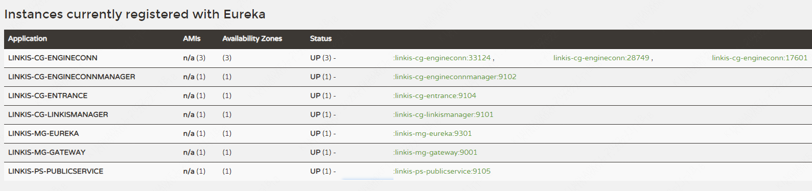

## 1. Preparing for the first installation

### 1.1 Linux Server

**Hardware requirements**
Install nearly 10 linkis microservices with at least 3G memory. The size of the jvm -Xmx memory started by the default configuration of each microservice is 512M (if the memory is not enough, you can try to reduce it to 256/128M, and you can also increase it if the memory is sufficient)


### 1.2 Add deployment user
 
>Deployment user: the startup user of the linkis core process, and this user will be the administrator privilege by default. <font color="red">The corresponding administrator login password will be generated during the deployment process, located in `conf/linkis-mg-gateway .properties` file</font>
Linkis supports specifying the user who submits and executes. The linkis main process service will switch to the corresponding user through `sudo -u ${linkis-user}`, and then execute the corresponding engine start command, so the user to which the engine `linkis-engine` process belongs is the executor of the task (so the deployment The user needs to have sudo permissions, and it is password-free)

Take hadoop user as an example:

First check whether there is already a hadoop user in the system. If it already exists, you can directly authorize it; if not, create a user first, and then authorize.

Check if a hadoop user already exists
```shell script
$ id hadoop
uid=2001(hadoop) gid=2001(hadoop) groups=2001(hadoop)
````

If it does not exist, you need to create a hadoop user and join the hadoop user group
```shell script
$ sudo useradd hadoop -g hadoop
$ vi /etc/sudoers
#Secret-free configuration
hadoop ALL=(ALL) NOPASSWD: NOPASSWD: ALL
````

<font color='red'>The following operations are performed under the hadoop user</font>


## 2. Configuration modification

### 2.1 Installation package preparation

- Method 1: From the official website [download address](https://linkis.apache.org/download/main): https://linkis.apache.org/download/main
, download the corresponding The installation package (project installation package and management console installation package)
- Method 2: Compile the project installation package and management console according to [Linkis Compile and Package](../development/build) and [Front-end Management Console Compile](../development/build-console) Installation package

After uploading the installation package `apache-linkis-x.x.x-incubating-bin.tar.gz`, decompress the installation package

```shell script
$ tar -xvf apache-linkis-x.x.x-incubating-bin.tar.gz
````

The unzipped directory structure is as follows
```shell script
-rw-r--r-- 1 hadoop hadoop 531847342 Feb 21 10:10 apache-linkis-1.0.3-incubating-bin.tar.gz
drwxrwxr-x 2 hadoop hadoop 4096 Feb 21 10:13 bin //Script to perform environment check and install
drwxrwxr-x 2 hadoop hadoop 4096 Feb 21 10:13 deploy-config // Environment configuration information such as DB that depends on deployment
-rw-r--r-- 1 hadoop hadoop 1707 Jan 22 2020 DISCLAIMER-WIP
-rw-r--r-- 1 hadoop hadoop 66058 Jan 22 2020 LICENSE
drwxrwxr-x 2 hadoop hadoop 16384 Feb 21 10:13 licenses
drwxrwxr-x 7 hadoop hadoop 4096 Feb 21 10:13 linkis-package // The actual package, including lib/service startup script tool/db initialization script/microservice configuration file, etc.
-rw-r--r-- 1 hadoop hadoop 83126 Jan 22 2020 NOTICE
-rw-r--r-- 1 hadoop hadoop 7900 Jan 22 2020 README_CN.md
-rw-r--r-- 1 hadoop hadoop 8184 Jan 22 2020 README.md

````

### 2.2 Configure database information

`vim deploy-config/db.sh`

```shell script
# Database information of Linkis' own business
MYSQL_HOST=xx.xx.xx.xx
MYSQL_PORT=3306
MYSQL_DB=linkis_test
MYSQL_USER=test
MYSQL_PASSWORD=xxxxx

# Provide the DB information of the Hive metadata database. If the hive engine is not involved (or just a simple trial), you can not configure it
#Mainly used with scripts, if not configured, it will try to obtain it through the configuration file in $HIVE_CONF_DIR by default
HIVE_META_URL="jdbc:mysql://10.10.10.10:3306/hive_meta_demo?useUnicode=true&amp;characterEncoding=UTF-8"
HIVE_META_USER=demo # User of HiveMeta Metabase
HIVE_META_PASSWORD=demo123 # HiveMeta metabase password
````


### 2.3 Configure basic variables

The file is located at `deploy-config/linkis-env.sh`

#### deploy user
```shell script
deployUser=hadoop #The user who executes the deployment is the user created in step 1.2
````

#### base directory configuration (optional)
:::caution note
Determine whether you need to adjust according to the actual situation, you can choose to use the default value
:::


```shell script

# Specify the directory path used by the user, which is generally used to store the user's script files and log files, and is the user's workspace. The corresponding configuration file configuration item is wds.linkis.filesystem.root.path(linkis.properties)
WORKSPACE_USER_ROOT_PATH=file:///tmp/linkis

# File paths such as result set logs, used to store the result set files of the Job wds.linkis.resultSet.store.path(linkis-cg-entrance.properties) //If not configured, use the configuration of HDFS_USER_ROOT_PATH
RESULT_SET_ROOT_PATH=file:///tmp/linkis

# File path such as result set log, used to store the result set file of Job wds.linkis.filesystem.hdfs.root.path(linkis.properties)
HDFS_USER_ROOT_PATH=hdfs:///tmp/linkis
  
# Store the working path of the execution engine. You need to deploy a local directory with write permissions for the user wds.linkis.engineconn.root.dir(linkis-cg-engineconnmanager.properties)
ENGINECONN_ROOT_PATH=/appcom/tmp
````

#### Yarn's ResourceManager address

:::caution note
If you need to use the Spark engine, you need to configure
:::

```shell script

#You can confirm whether it can be accessed normally by visiting the http://xx.xx.xx.xx:8088/ws/v1/cluster/scheduler interface
YARN_RESTFUL_URL=http://xx.xx.xx.xx:8088
````
When executing spark tasks, you need to use the ResourceManager of yarn. By default, linkis does not enable permission verification. If the ResourceManager has password permission verification enabled, please install and deploy it.
Modify the database table `linkis_cg_rm_external_resource_provider` to insert yarn data information. For details, please refer to [Check whether the yarn address is configured correctly] (#811-Check whether the yarn address is configured correctly)

#### Basic component environment information

:::caution note
It can be configured through the user's system environment variables. If configured through the system environment variables, the deploy-config/linkis-env.sh configuration file can be directly commented out without configuration.
:::

```shell script
##If you do not use Hive, Spark and other engines and do not rely on Hadoop, you do not need to configure the following environment variables

#HADOOP
HADOOP_HOME=/appcom/Install/hadoop
HADOOP_CONF_DIR=/appcom/config/hadoop-config

#Hive
HIVE_HOME=/appcom/Install/hive
HIVE_CONF_DIR=/appcom/config/hive-config

#Spark
SPARK_HOME=/appcom/Install/spark
SPARK_CONF_DIR=/appcom/config/spark-config
````


#### LDAP login configuration (optional)

:::caution note
The default is to use a static user and password. The static user is the deployment user. The static password will generate a random password string during deployment and store it in `{LINKIS_HOME}/conf/linkis-mg-gateway.properties`(>=1.0.3 Version)
:::


```shell script
#LDAP configuration, Linkis only supports deployment user login by default. If you need to support multi-user login, you can use LDAP. You need to configure the following parameters:
#LDAP_URL=ldap://localhost:1389/
#LDAP_BASEDN=dc=webank,dc=com
````


#### JVM memory configuration (optional)
>The microservice starts the jvm memory configuration, which can be adjusted according to the actual situation of the machine. If the machine memory resources are few, you can try to adjust it to 256/128M
```shell script
## java application default jvm memory
export SERVER_HEAP_SIZE="512M"
````

#### Installation directory configuration (optional)
> Linkis will eventually be installed in this directory. If it is not configured, it will be in the same level directory as the current installation package by default.

```shell script
##The decompression directory and the installation directory need to be inconsistent
LINKIS_HOME=/appcom/Install/LinkisInstall
````

#### No HDFS mode deployment (optional >1.1.2 version support hold)

> Deploy Linkis services in an environment without HDFS to facilitate more lightweight learning and debugging. Deploying in HDFS mode does not support tasks such as hive/spark/flink engines

Modify the `linkis-env.sh` file and modify the following
```bash
#Use the [file://] path pattern instead of the [hdfs://] pattern
WORKSPACE_USER_ROOT_PATH=file:///tmp/linkis/
HDFS_USER_ROOT_PATH=file:///tmp/linkis
RESULT_SET_ROOT_PATH=file:///tmp/linkis

export ENABLE_HDFS=false
export ENABLE_HIVE=false
export ENABLE_SPARK=false
```

#### kerberos authentication (optional)

> By default, kerberos authentication is disabled on Linkis. If kerberos authentication is enabled in the hive cluster, you need to set the following parameters:

Modify the `linkis-env.sh` file and modify the following

```bash
#HADOOP
HADOOP_KERBEROS_ENABLE=true
HADOOP_KEYTAB_PATH=/appcom/keytab/
```

## 3. Install and start

### 3.1 Execute the installation script:

```bash
    sh bin/install.sh
````

The install.sh script will ask you if you need to initialize the database and import metadata. If you choose to initialize, the table data in the database will be emptied and reinitialized.

**<font color="red">Empty database must be selected for the first installation</font>**

:::tip Note
- If an error occurs, and it is unclear what command to execute to report the error, you can add the -x parameter `sh -x bin/install.sh` to print out the shell script execution process log, which is convenient for locating the problem
- Permission problem: `mkdir: cannot create directory 'xxxx': Permission denied`, please confirm whether the deployment user has read and write permissions for the path
:::

The prompt for successful execution is as follows:
```shell script
`Congratulations! You have installed Linkis 1.0.3 successfully, please use sh /data/Install/linkis/sbin/linkis-start-all.sh to start it!
Your default account password is [hadoop/5e8e312b4]`
````

### <font color="red">3.2 Add mysql driver package</font>

:::caution note
Because the mysql-connector-java driver is under the GPL2.0 protocol, it does not meet the license policy of the Apache open source protocol. Therefore, starting from version 1.0.3, the official deployment package of the Apache version provided by default is no mysql-connector-java-x.x.x.jar (**If it is installed through the integrated family bucket material package, you do not need to add it manually**), you need to add dependencies to the corresponding lib package by yourself during installation and deployment. You can check whether it exists in the corresponding directory, if not, you need to add

:::

To download the mysql driver, take version 5.1.49 as an example: [download link](https://repo1.maven.org/maven2/mysql/mysql-connector-java/5.1.49/mysql-connector-java-5.1.49.jar)

Copy the mysql driver package to the lib package
````
cp mysql-connector-java-5.1.49.jar {LINKIS_HOME}/lib/linkis-spring-cloud-services/linkis-mg-gateway/
cp mysql-connector-java-5.1.49.jar {LINKIS_HOME}/lib/linkis-commons/public-module/
````

### 3.3 Configuration Adjustment (Optional)
> The following operations are related to the dependent environment. According to the actual situation, determine whether the operation is required

#### 3.3.1 kerberos authentication
If the hive cluster used has kerberos mode authentication enabled, modify the configuration `${LINKIS_HOME}/conf/linkis.properties` (<=1.1.3) file
```shell script
#Append the following configuration
echo "wds.linkis.keytab.enable=true" >> linkis.properties
````
#### 3.3.2 Yarn Authentication

When executing spark tasks, you need to use the ResourceManager of yarn, which is controlled by the configuration item `YARN_RESTFUL_URL=http://xx.xx.xx.xx:8088 `.
During installation and deployment, the `YARN_RESTFUL_URL=http://xx.xx.xx.xx:8088` information will be updated to the database table `linkis_cg_rm_external_resource_provider`. By default, access to yarn resources does not require permission verification.
If password authentication is enabled in yarn's ResourceManager, please modify the yarn data information generated in the database table `linkis_cg_rm_external_resource_provider` after installation and deployment.
For details, please refer to [Check whether the yarn address is configured correctly] (#811-Check whether the yarn address is configured correctly)

#### 3.3.2 session
If you are upgrading to Linkis. Deploy DSS or other projects at the same time, but the dependent linkis version introduced in other software is <1.1.1 (mainly in the lib package, the linkis-module-x.x.x.jar package of the dependent Linkis is <1.1.1), you need to modify the linkis located in ` ${LINKIS_HOME}/conf/linkis.properties` file
```shell
echo "wds.linkis.session.ticket.key=bdp-user-ticket-id" >> linkis.properties
````

### 3.4 Start the service
```shell script
sh sbin/linkis-start-all.sh
````

### 3.5 Modification of post-installation configuration
After the installation is complete, if you need to modify the configuration (because of port conflicts or some configuration problems, you need to adjust the configuration), you can re-execute the installation, or modify the configuration `${LINKIS_HOME}/conf/*properties` file of the corresponding service, Restart the corresponding service, such as: `sh sbin/linkis-daemon.sh start ps-publicservice`


### 3.6 Check whether the service starts normally
Visit the eureka service page (http://eurekaip:20303),
The Linkis will start 6 microservices by default, and the linkis-cg-engineconn service in the figure below will be started only for running tasks


```shell script
LINKIS-CG-ENGINECONNMANAGER Engine Management Services
LINKIS-CG-ENGINEPLUGIN Engine Plugin Management Service
LINKIS-CG-ENTRANCE Computing Governance Entry Service
LINKIS-CG-LINKISMANAGER Computing Governance Management Service
LINKIS-MG-EUREKA Microservice registry service
LINKIS-MG-GATEWAY gateway service
LINKIS-PS-CS context service
LINKIS-PS-PUBLICSERVICE Public Service
````

Note: Linkis-ps-cs, Linkis-ps-data-source-Manager and Linkis-Ps-Metadatamanager services have been merged into Linkis-Ps-PublicService in Linkis 1.3.1 and merge LINKIS-CG-ENGINECONNMANAGER services into LINKIS-CG-LINKISMANAGER.

If any services are not started, you can view detailed exception logs in the corresponding log/${service name}.log file.


## 4. Install the web frontend
The web side uses nginx as the static resource server, and the access request process is:
`Linkis console request->nginx ip:port->linkis-gateway ip:port->other services`

### 4.1 Download the front-end installation package and unzip it
```shell script
tar -xvf apache-linkis-x.x.x-incubating-web-bin.tar.gz
````

### 4.2 Modify the configuration config.sh
```shell script
#Access the port of the console
linkis_port="8188"

#linkis-mg-gatewayService Address
linkis_url="http://localhost:9020"
````

### 4.3 Execute the deployment script

```shell script
# nginx requires sudo privileges to install
sudo sh install.sh
````
After installation, linkis' nginx configuration file is by default in `/etc/nginx/conf.d/linkis.conf`
nginx log files are in `/var/log/nginx/access.log` and `/var/log/nginx/error.log`
An example of the nginx configuration file of the generated linkis console is as follows:
````nginx

        server {
            listen 8188;# access port If the port is occupied, it needs to be modified
            server_name localhost;
            #charset koi8-r;
            #access_log /var/log/nginx/host.access.log main;
            location / {
            root /appcom/Install/linkis-web/dist; # static file directory
            index index.html index.html;
            }
            location /ws {
            proxy_pass http://localhost:9020;#Address of backend Linkis
            proxy_http_version 1.1;
            proxy_set_header Upgrade $http_upgrade;
            proxy_set_header Connection upgrade;
            }

            location /api {
            proxy_pass http://localhost:9020; #Address of backend Linkis
            proxy_set_header Host $host;
            proxy_set_header X-Real-IP $remote_addr;
            proxy_set_header x_real_ipP $remote_addr;
            proxy_set_header remote_addr $remote_addr;
            proxy_set_header X-Forwarded-For $proxy_add_x_forwarded_for;
            proxy_http_version 1.1;
            proxy_connect_timeout 4s;
            proxy_read_timeout 600s;
            proxy_send_timeout 12s;
            proxy_set_header Upgrade $http_upgrade;
            proxy_set_header Connection upgrade;
            }

            #error_page 404 /404.html;
            # redirect server error pages to the static page /50x.html
            #
            error_page 500 502 503 504 /50x.html;
            location = /50x.html {
            root /usr/share/nginx/html;
            }
        }
````

If you need to modify the port or static resource directory, etc., please modify the `/etc/nginx/conf.d/linkis.conf` file and execute the `sudo nginx -s reload` command
:::caution note
- At present, the visualis function is not integrated. During the installation process, if you are prompted that the installation of linkis/visualis fails, you can ignore it
- Check whether nginx starts normally: check whether the nginx process exists `ps -ef |grep nginx`
- Check if nginx is configured correctly `sudo nginx -T`
- If the port is occupied, you can modify the service port `/etc/nginx/conf.d/linkis.conf`listen port value started by nginx, save it and restart it
- If interface 502 appears in the access management console, or `Unexpected token < in JSON at position 0` is abnormal, please confirm whether linkis-mg-gateway starts normally. If it starts normally, check the linkis-mg-gateway configured in the nginx configuration file Is the service address correct?
:::

### 4.4 Login to the console

Browser login `http://xx.xx.xx.xx:8188/#/login`
Username/password can be found in `{LINKIS_HOME}/conf/linkis-mg-gateway.properties`
```shell script
wds.linkis.admin.user= #User
wds.linkis.admin.password= #Password

````
Refer to the [User Manual](../user-guide/console-manual.md) for the usage guide of the console

## 5. Verify basic functionality
>Verify the corresponding engine tasks according to actual needs

````
#The version number of the engineType of the engine must match the actual version. The following example is the default version number
#shell engine tasks
sh bin/linkis-cli -submitUser hadoop -engineType shell-1 -codeType shell -code "whoami"

#hive engine tasks
sh bin/linkis-cli -submitUser hadoop -engineType hive-2.3.3 -codeType hql -code "show tables"

#spark engine tasks
sh bin/linkis-cli -submitUser hadoop -engineType spark-2.4.3 -codeType sql -code "show tables"

#python engine task
sh bin/linkis-cli -submitUser hadoop -engineType python-python2 -codeType python -code 'print("hello, world!")'
````
If the verification fails, please refer to [Step 8] for troubleshooting

## 6 Installation of development tool IDE (Scriptis) (optional)
>After installing the Scripti tool, it can support writing SQL, Pyspark, HiveQL and other scripts online on the web page

For detailed instructions, see [Installation and Deployment of Tool Scriptis](./install-scriptis)

## 7. Supported Engines

### 7.1 Engine Adaptation List

Please note: The separate installation package of Linkis only contains four engines by default: Python/Shell/Hive/Spark. If there are other engines (such as jdbc/flink/sqoop and other engines) usage scenarios, you can install them manually. For details, please refer to [ EngineConnPlugin Engine Plugin Installation Documentation](install-engineconn).

The list of supported engines that have been adapted in this version is as follows:

| Engine type | Adaptation | Does the official installation package contain |
|---------------|-------------------|------|
| Python | >=1.0.0 Adapted | Included |
| Shell | >=1.0.0 Adapted | Included |
| Hive | >=1.0.0 Adapted | Included |
| Spark | >=1.0.0 Adapted | Included |
| Pipeline | >=1.0.0 Adapted | **Excludes** |
| JDBC | >=1.0.0 Adapted | **Excludes** |
| Flink | >=1.0.0 already adapted | **Not included** |
| OpenLooKeng | >=1.1.1 has been adapted | **Not included** |
| Sqoop | >=1.1.2 Adapted | **Excludes** |


### 7.2 View the deployed engine

#### Method 1: View the engine lib package directory

````
$ tree linkis-package/lib/linkis-engineconn-plugins/ -L 3
linkis-package/lib/linkis-engineconn-plugins/
├── hive
│ ├── dist
│ │ └── v2.3.3 #version is 2.3.3 engineType is hive-2.3.3
│ └── plugin
│ └── 2.3.3
├── python
│ ├── dist
│ │ └── vpython2
│ └── plugin
│ └── python2 #version is python2 engineType is python-python2
├── shell
│ ├── dist
│ │ └── v1
│ └── plugin
│ └── 1
└── spark
    ├── dist
    │ └── v2.4.3
    └── plugin
        └── 2.4.3
````

#### Method 2: View the database table of linkis
```shell script
select * from linkis_cg_engine_conn_plugin_bml_resources
````


## 8. Troubleshooting Guidelines for Common Abnormal Problems
### 8.1. Yarn Queue Check

>If you need to use spark/hive/flink engine

After logging in, check whether the yarn queue resources can be displayed normally (click the button in the lower right corner of the page) (the front end needs to be installed first)
Normally as shown below:


If it cannot be displayed: You can adjust it according to the following guidelines

#### 8.1.1 Check whether the yarn address is configured correctly
Database table `linkis_cg_rm_external_resource_provider` `
Insert yarn data information
```sql
INSERT INTO `linkis_cg_rm_external_resource_provider`
(`resource_type`, `name`, `labels`, `config`) VALUES
('Yarn', 'sit', NULL,
'{\r\n"rmWebAddress": "http://xx.xx.xx.xx:8088",\r\n"hadoopVersion": "2.7.2",\r\n"authorEnable":false, \r\n"user":"hadoop",\r\n"pwd":"123456"\r\n}'
);

config field properties

"rmWebAddress": "http://xx.xx.xx.xx:8088", #need to bring http and port
"hadoopVersion": "2.7.2",
"authorEnable":true, //Whether authentication is required You can verify the username and password by visiting http://xx.xx.xx.xx:8088 in the browser
"user":"user",//username
"pwd":"pwd"//Password

````
After the update, because the cache is used in the program, if you want to take effect immediately, you need to restart the linkis-cg-linkismanager service
```shell script
sh sbin/linkis-daemon.sh restart cg-linkismanager
````

#### 8.1.2 Check whether the yarn queue exists
Exception information: `desc: queue ide is not exists in YARN.` indicates that the configured yarn queue does not exist and needs to be adjusted

Modification method: `linkis management console/parameter configuration> global settings>yarn queue name [wds.linkis.rm.yarnqueue]`, modify a yarn queue that can be used, and the yarn queue to be used can be found at `rmWebAddress:http:// xx.xx.xx.xx:8088/cluster/scheduler`

View available yarn queues
- View yarn queue address: http://ip:8888/cluster/scheduler

### 8.2 Check whether the engine material resource is uploaded successfully

```sql
#Login to the linkis database
select * from linkis_cg_engine_conn_plugin_bml_resources
````

The normal is as follows:


Check whether the material record of the engine exists (if there is an update, check whether the update time is correct).

- If it does not exist or is not updated, first try to manually refresh the material resource (for details, see [Engine Material Resource Refresh](install-engineconn#23-Engine Refresh)).
- Check the specific reasons for material failure through `log/linkis-cg-engineplugin.log` log. In many cases, it may be caused by the lack of permissions in the hdfs directory
- Check whether the gateway address configuration is correct. The configuration item `wds.linkis.gateway.url` of `conf/linkis.properties`

The material resources of the engine are uploaded to the hdfs directory by default as `/apps-data/${deployUser}/bml`

```shell script
hdfs dfs -ls /apps-data/hadoop/bml
#If there is no such directory, please manually create the directory and grant ${deployUser} read and write permissions
hdfs dfs -mkdir /apps-data
hdfs dfs -chown hadoop:hadoop/apps-data
````

### 8.3 Login password problem

By default, linkis uses a static user and password. The static user is the deployment user. The static password will randomly generate a password string during deployment and store it in
`{LINKIS_HOME}/conf/linkis-mg-gateway.properties` (>=1.0.3 version)

### 8.4 version compatibility issues

The engine supported by linkis by default, the compatibility with dss can be viewed [this document](https://github.com/apache/incubator-linkis/blob/master/README.md)


### 8.5 How to locate the server exception log

Linkis has many microservices. If you are unfamiliar with the system, sometimes you cannot locate the specific module that has an exception. You can search through the global log.
```shell script
tail -f log/* |grep -5n exception (or tail -f log/* |grep -5n ERROR)
less log/* |grep -5n exception (or less log/* |grep -5n ERROR)
````


### 8.6 Exception troubleshooting of execution engine tasks

** step1: Find the startup deployment directory of the engine **

- Method 1: If it is displayed in the execution log, you can view it on the management console as shown below:

- Method 2: If it is not found in method 1, you can find the parameter `wds.linkis.engineconn.root.dir` configured in `conf/linkis-cg-engineconnmanager.properties`, which is the directory where the engine is started and deployed. Subdirectories are segregated by the user executing the engine

```shell script
# If you don't know the taskid, you can select it after sorting by time ll -rt /appcom/tmp/${executed user}/${date}/${engine}/
cd /appcom/tmp/${executed user}/${date}/${engine}/${taskId}
````
The directory is roughly as follows
```shell script
conf -> /appcom/tmp/engineConnPublickDir/6a09d5fb-81dd-41af-a58b-9cb5d5d81b5a/v000002/conf #engine configuration file
engineConnExec.sh #Generated engine startup script
lib -> /appcom/tmp/engineConnPublickDir/45bf0e6b-0fa5-47da-9532-c2a9f3ec764d/v000003/lib #Engine dependent packages
logs #Engine startup and execution related logs
````

** step2: View the log of the engine **
```shell script
less logs/stdout
````

**step3: try to execute the script manually (if needed)**
Debugging can be done by trying to execute the script manually
````
sh -x engineConnExec.sh
````

### 8.7 How to modify the port of the registry eureka
Sometimes when the eureka port is occupied by other services and the default eureka port cannot be used, the eureka port needs to be modified. Here, the modification of the eureka port is divided into two situations: before the installation is performed and after the installation is performed.
1. Modify the eureka port of the registry before performing the installation
````
1. Enter the decompression directory of apache-linkis-x.x.x-incubating-bin.tar.gz
2. Execute vi deploy-config/linkis-env.sh
3. Modify EUREKA_PORT=20303 to EUREKA_PORT=port number
````
2. Modify the eureka port of the registry after the installation is performed
````
1. Go to the ${LINKIS_HOME}/conf directory

2. Execute grep -r 20303 ./* , the query result is as follows:
      ./application-eureka.yml: port: 20303
      ./application-eureka.yml: defaultZone: http://ip:20303/eureka/
      ./application-linkis.yml: defaultZone: http://ip:20303/eureka/
      ./linkis-env.sh:EUREKA_PORT=20303
      ./linkis.properties:wds.linkis.eureka.defaultZone=http://ip:20303/eureka/

3. Change the port in the corresponding location to the new port, and restart all services sh restart sbin/linkis-start-all.sh
````


### 8.8 Notes on CDH adaptation version

CDH itself is not the official standard hive/spark package used. When adapting, it is best to modify the hive/spark version dependencies in the source code of linkis to recompile and deploy.
For details, please refer to the CDH adaptation blog post
[[Linkis1.0 - Installation and Stepping in the CDH5 Environment]](https://mp.weixin.qq.com/s/__QxC1NoLQFwme1yljy-Nw)
[[DSS1.0.0+Linkis1.0.2——Trial record in CDH5 environment]](https://mp.weixin.qq.com/s/9Pl9P0hizDWbbTBf1yzGJA)
[[DSS1.0.0 and Linkis1.0.2——Summary of JDBC engine related issues]](https://mp.weixin.qq.com/s/vcFge4BNiEuW-7OC3P-yaw)
[[DSS1.0.0 and Linkis1.0.2——Summary of Flink engine related issues]](https://mp.weixin.qq.com/s/VxZ16IPMd1CvcrvHFuU4RQ)

### 8.9 Debugging of Http interface

- Method 1 can enable [Login-Free Mode Guide] (/docs/latest/api/login-api/#2 Login-Free Configuration)
- In method 2 postman, the request header brings the cookie value of the successful login
  The cookie value can be obtained after successful login on the browser side
  

```shell script
Cookie: bdp-user-ticket-id=xxxxxxxxxxxxxxxxxxxxxxxxxxxxxx
````
- Method 3 Add a static Token to the http request header
  Token is configured in conf/token.properties
  Such as: TEST-AUTH=hadoop,root,user01
```shell script
Token-Code: TEST-AUTH
Token-User:hadoop
````

### 8.10 Troubleshooting process for abnormal problems

First, follow the above steps to check whether the service/environment, etc. are all started normally
Troubleshoot basic problems according to some of the scenarios listed above
[QA documentation](https://docs.qq.com/doc/DSGZhdnpMV3lTUUxq) Find out if there is a solution, link: https://docs.qq.com/doc/DSGZhdnpMV3lTUUxq
See if you can find a solution by searching the content in the issue

Through the official website document search, for some problems, you can search for keywords through the official website, such as searching for "deployment". (If 404 appears, please refresh your browser)


## 9. How to obtain relevant information
Linkis official website documents are constantly improving, you can view/keyword search related documents on this official website.
Related blog post links
- Linkis technical blog collection https://github.com/apache/incubator-linkis/issues/1233
- Technical blog post on the official account https://mp.weixin.qq.com/mp/homepage?__biz=MzI4MDkxNzUxMg==&hid=1&sn=088cbf2bbed1c80d003c5865bc92ace8&scene=18
- Official website documentation https://linkis.apache.org/docs/latest/introduction
- bili technology sharing video https://space.bilibili.com/598542776?spm_id_from=333.788.b_765f7570696e666f.2
