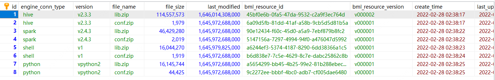
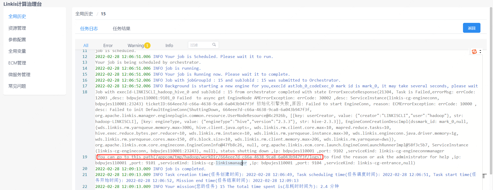
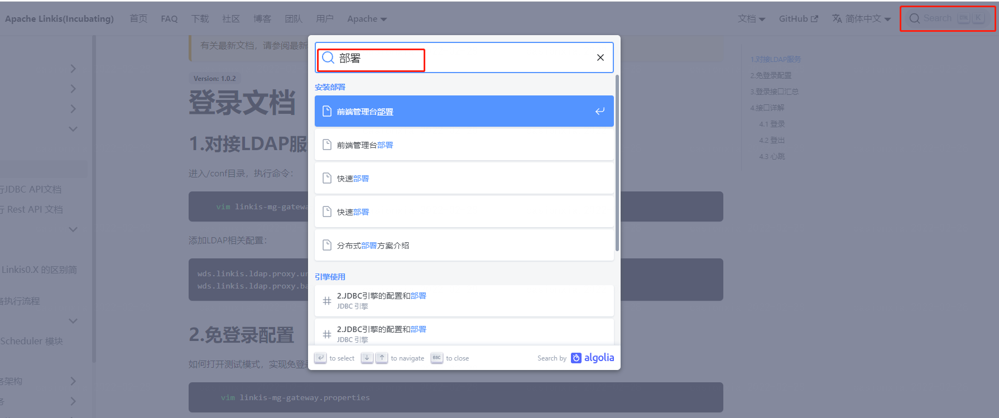

## 1. First-time installation preparations

### 1.1 Linux server

**Hardware Requirements**  
Install nearly 6 linkis microservices, at least 3G memory. The default jvm -Xmx memory size of each microservice is 512M (if the memory is not enough, you can try to reduce it to 256/128M, and you can also increase it if the memory is enough).


### 1.2 Add deployment user
 
>Deployment user: The starting user of the linkis core process, and this user will be the administrator by default. <font color="red">The corresponding administrator login password will be generated during the deployment process, located in `conf/linkis-mg-gateway .properties`file</font>
Linkis supports specifying users for submission and execution. The linkis main process service will switch to the corresponding user through `sudo -u ${linkis-user}`, and then execute the corresponding engine start command, so the user of the engine `linkis-engine` process is the executor of the task (so the deployment The user needs to have sudo authority, and it is password-free).

Take hadoop users as an example (<font color="red">Many configuration users in linkis use hadoop users by default. It is recommended that first-time installers use hadoop users, otherwise many unexpected errors may be encountered during the installation process</font >):

First check whether there is already a hadoop user in the system, if it already exists, just authorize it directly, if not, create a user first, and then authorize.

Check if hadoop user already exists
```shell script
$ id hadoop
uid=2001(hadoop) gid=2001(hadoop) groups=2001(hadoop)
```

If it does not exist, you need to create a hadoop user and join the hadoop user group
```shell script
$ sudo useradd hadoop -g hadoop
$ vi /etc/sudoers
#Secret-free configuration
hadoop ALL=(ALL) NOPASSWD: NOPASSWD: ALL
```

<font color='red'>The following operations are performed under the hadoop user</font>

### 1.3 installation dependencies 

Linkis depends on such engines as bellow，all the mandatory engines will be check in installation scripts`${LINKIS_HOME}/bin/checkEnv.sh`

| EngineType     | Necessary | Installation Guide                                                                                                 |
|----------------|-----------|--------------------------------------------------------------------------------------------------------------------|
| JDK（1.8.0 141） | mandatory | [Install JDK and setting JAVA_HOME](https://docs.oracle.com/cd/E19509-01/820-5483/6ngsiu065/index.html)            |
| mysql（5.5+）    | mandatory | [MySQL installation](https://docs.oracle.com/cd/E69403_01/html/E56873/mysql.html)                                  |
| Python(3.6.8)  | mandatory | [Python installation and user guide](https://docs.python.org/zh-cn/3/using/index.html)                             |
| Nginx(1.14.1)  | mandatory | [Nginx installation](http://nginx.org/en/linux_packages.html#instructions)                                         |
| Hadoop（(2.7.2） | mandatory | [Hadoop quickstart](https://hadoop.apache.org/docs/r1.0.4/cn/quickstart.html#%E5%AE%89%E8%A3%85%E8%BD%AF%E4%BB%B6) |
| Spark（2.4.3）   | mandatory | [Spark download and installtion](https://spark.apache.org/downloads.html)                                          |
| Hive(3.1.3)    | mandatory | [Hive installation](https://cwiki.apache.org/confluence/display/hive/adminmanual+installation)                     |


## 2. Configuration modification

### 2.1 Installation package preparation

- Method 1: From the official website [download address] (https://linkis.apache.org/zh-CN/download/main): https://linkis.apache.org/zh-CN/download/main
, download the corresponding installation package (project installation package and management console installation package).
- Method 2: Compile the project installation package and console installation package according to [Linkis Compilation and Packaging](../development/build) and [Front-end Console Compilation](../development/build-console).

After uploading the installation package `apache-linkis-xxx-bin.tar.gz`, decompress the installation package

```shell script
$ tar -xvf apache-linkis-xxx-bin.tar.gz
```

The directory structure after decompression is as follows
```shell script
-rw-r--r-- 1 hadoop hadoop 518192043 Jun 20 09:50 apache-linkis-xxx-bin.tar.gz
drwxrwxr-x 2 hadoop hadoop 4096 Jun 20 09:56 bin //execute environment check and install script
drwxrwxr-x 2 hadoop hadoop 4096 Jun 20 09:56 deploy-config // Deployment dependent DB and other environment configuration information
drwxrwxr-x 4 hadoop hadoop 4096 Jun 20 09:56 docker
drwxrwxr-x 4 hadoop hadoop 4096 Jun 20 09:56 helm
-rwxrwxr-x 1 hadoop hadoop 84732 Jan 22 2020 LICENSE
drwxr-xr-x 2 hadoop hadoop 20480 Jun 20 09:56 licenses
drwxrwxr-x 7 hadoop hadoop 4096 Jun 20 09:56 linkis-package // actual software package, including lib/service startup script tool/db initialization script/microservice configuration file, etc.
-rwxrwxr-x 1 hadoop hadoop 119503 Jan 22 2020 NOTICE
-rw-r--r-- 1 hadoop hadoop 11959 Jan 22 2020 README_CN.md
-rw-r--r-- 1 hadoop hadoop 12587 Jan 22 2020 README.md

```

### 2.2 Configure database information

`vim deploy-config/linkis-env.sh`

```shell script
# Select linkis business database type, default mysql
# If using postgresql, please change to postgresql
# Note: The current configuration only applies to linkis>=1.4.0
dbType=mysql
```

`vim deploy-config/db.sh`

```shell script
# Linkis's own business database information - mysql
MYSQL_HOST=xx.xx.xx.xx
MYSQL_PORT=3306
MYSQL_DB=linkis_test
MYSQL_USER=test
MYSQL_PASSWORD=xxxxx

# Linkis's own business database information - postgresql
# Note: The following configuration is only applicable to linkis>=1.4.0
PG_HOST=xx.xx.xx.xx
PG_PORT=5432
PG_DB=linkis_test
PG_SCHEMA=linkis_test
PG_USER=test
PG_PASSWORD=123456

# Provide the DB information of the Hive metadata database. If the hive engine is not involved (or just a simple trial), it is not necessary to configure
#Mainly used together with scriptis, if not configured, it will try to get it through the configuration file in $HIVE_CONF_DIR by default
HIVE_META_URL="jdbc:mysql://10.10.10.10:3306/hive_meta_demo?useUnicode=true&characterEncoding=UTF-8"
HIVE_META_USER=demo # User of the HiveMeta metabase
HIVE_META_PASSWORD=demo123 # Password of the HiveMeta metabase
```


### 2.3 Configure basic variables

The file is located at `deploy-config/linkis-env.sh`.

#### Deploy User
```shell script
deployUser=hadoop #The user who executes the deployment is the user created in step 1.2
```

#### Basic directory configuration (optional)
:::caution Caution
Determine whether it needs to be adjusted according to the actual situation, and you can choose to use the default value
:::


```shell script

# Specify the directory path used by the user, which is generally used to store the user's script files and log files, etc., and is the user's workspace. The corresponding configuration file configuration item is wds.linkis.filesystem.root.path(linkis.properties)
WORKSPACE_USER_ROOT_PATH=file:///tmp/linkis

# The result set log and other file paths are used to store the result set file of the Job wds.linkis.resultSet.store.path(linkis-cg-entrance.properties) //If the configuration of HDFS_USER_ROOT_PATH is not configured
RESULT_SET_ROOT_PATH=file:///tmp/linkis

# Result set log and other file paths, used to store the result set file of Job wds.linkis.filesystem.hdfs.root.path(linkis.properties)
HDFS_USER_ROOT_PATH=hdfs:///tmp/linkis
  
# To store the working path of the execution engine, a local directory wds.linkis.engineconn.root.dir(linkis-cg-engineconnmanager.properties) where the deployment user has write permissions is required
ENGINECONN_ROOT_PATH=/appcom/tmp
```

#### Yarn's ResourceManager address

:::caution Caution
If you need to use the Spark engine, you need to configure
:::

```shell script

#You can check whether it can be accessed normally by visiting http://xx.xx.xx.xx:8088/ws/v1/cluster/scheduler interface
YARN_RESTFUL_URL=http://xx.xx.xx.xx:8088
```
When executing the spark task, you need to use the ResourceManager of yarn. Linkis defaults that permission verification is not enabled. If the ResourceManager has enabled password permission verification, please install and deploy.
Modify the database table `linkis_cg_rm_external_resource_provider` to insert yarn data information, for details, please refer to [Check whether the yarn address is configured correctly] (#811-Check whether the yarn address is configured correctly)

#### Basic component environment information

:::caution Caution
It can be configured through the user's system environment variables. If it is configured through the system environment variables, it can be commented out directly without configuration in the deploy-config/linkis-env.sh configuration file.
:::

```shell script
##If you do not use Hive, Spark and other engines and do not rely on Hadoop, you do not need to configure the following environment variables

#HADOOP  
HADOOP_HOME=/appcom/Install/hadoop
HADOOP_CONF_DIR=/appcom/config/hadoop-config

#Hive
HIVE_HOME=/appcom/Install/hive
HIVE_CONF_DIR=/appcom/config/hive-config

#Spark
SPARK_HOME=/appcom/Install/spark
SPARK_CONF_DIR=/appcom/config/spark-config
```


#### LDAP login configuration (optional)

:::caution Caution
The default is to use a static user and password. The static user is the deployment user. The static password will randomly generate a password string during deployment and store it in `${LINKIS_HOME}/conf/linkis-mg-gateway.properties`(>=1.0. 3 version).
:::


```shell script
#LDAP configuration, by default Linkis only supports deployment user login, if you need to support multi-user login, you can use LDAP, you need to configure the following parameters:
#LDAP_URL=ldap://localhost:1389/
#LDAP_BASEDN=dc=webank,dc=com
```


#### JVM memory configuration (optional)
>Microservice starts jvm memory configuration, which can be adjusted according to the actual situation of the machine. If the machine has less memory resources, you can try to reduce it to 256/128M
```shell script
## java application default jvm memory
export SERVER_HEAP_SIZE="512M"
```

#### Installation directory configuration (optional)
> Linkis will eventually be installed in this directory, if not configured, it will be in the same directory as the current installation package by default

```shell script
##The decompression directory and the installation directory need to be inconsistent
LINKIS_HOME=/appcom/Install/LinkisInstall
```

#### No HDFS mode deployment (optional >1.1.2 version support)

> Deploy the Linkis service in an environment without HDFS to facilitate lighter learning, use and debugging. Deploying in HDFS mode does not support tasks such as hive/spark/flink engines

Modify `linkis-env.sh` file, modify the following content
```bash
#Use [file://] path pattern instead of [hdfs://] pattern
WORKSPACE_USER_ROOT_PATH=file:///tmp/linkis/
HDFS_USER_ROOT_PATH=file:///tmp/linkis
RESULT_SET_ROOT_PATH=file:///tmp/linkis

export ENABLE_HDFS=false
export ENABLE_HIVE=false
export ENABLE_SPARK=false
```

#### kerberos authentication (optional)

> Linkis does not enable kerberos authentication by default. If the hive cluster used enables kerberos authentication, the following parameters need to be configured.

Modify the `linkis-env.sh` file, the modified content is as follows
```bash
#HADOOP
HADOOP_KERBEROS_ENABLE=true
HADOOP_KEYTAB_PATH=/appcom/keytab/
```

### 2.4 Configure Token
The file is located in `bin/install.sh`

Linkis 1.3.2 version has changed the Token value to 32-bit random generation to ensure system security. For details, please refer to [Token Change Description](https://linkis.apache.org/zh-CN/docs/1.3.2/ feature/update-token/).

Using randomly generated Token, you will encounter a lot of Token verification failure problems when connecting with [WDS other components](https://github.com/WeDataSphere/DataSphereStudio/blob/master/README-ZH.md) for the first time. It is recommended to install it for the first time When not using random generated Token, modify the following configuration to true.

```
DEBUG_MODE=true
```

### 2.5 Precautions

**Full installation**

For the full installation of the new version of Linkis, the install.sh script will automatically process the configuration file and keep the database Token consistent. Therefore, the Token of the Linkis service itself does not need to be modified. Each application can query and use the new token through the management console.

**version upgrade**

When the version is upgraded, the database Token is not modified, so there is no need to modify the configuration file and application Token.

**Token expiration issue**

When the Token token is invalid or has expired, you can check whether the Token is configured correctly. You can query the Token through the management console ==> Basic Data Management ==> Token Management.

**Python version issue**
After Linkis is upgraded to 1.4.0, the default Spark version is upgraded to 3.x, which is not compatible with python2. Therefore, if you need to use the pyspark function, you need to make the following modifications.
1. Map python2 commands to python3
```
sudo ln -snf /usr/bin/python3 /usr/bin/python2
```
2. Spark engine connector configuration $LINKIS_HOME/lib/linkis-engineconn-plugins/spark/dist/3.2.1/conf/linkis-engineconn.properties Add the following configuration to specify the python installation path
```
pyspark.python3.path=/usr/bin/python3
```

## 3. Install and start

### 3.1 Execute the installation script:

```bash
    sh bin/install.sh
```

The install.sh script will ask you if you want to initialize the database and import metadata. If you choose to initialize, the table data in the database will be cleared and reinitialized.

**<font color="red">You must choose to clear the database for the first installation</font>**

:::tip note
- If an error occurs, and it is not clear what command to execute to report the error, you can add the -x parameter `sh -x bin/install.sh` to print out the log of the shell script execution process, which is convenient for locating the problem.
- Permission problem: `mkdir: cannot create directory 'xxxx': Permission denied`, please confirm whether the deployment user has read and write permissions for this path.
:::

The prompt for successful execution is as follows:
```shell script
`Congratulations! You have installed Linkis xxx successfully, please use sh /data/Install/linkis/sbin/linkis-start-all.sh to start it!  
Your default account password is [hadoop/5e8e312b4]`
```

### <font color="red">3.2 Add mysql driver package</font>

:::caution Caution
Because the mysql-connector-java driver is under the GPL2.0 agreement, it does not meet the license policy of the Apache open source agreement. Therefore, starting from version 1.0.3, the official deployment package of the Apache version provided does not have mysql-connector-java-xxxjar by default. Dependency package (**If you install it through the integrated family bucket material package, you don’t need to add it manually**), you need to add dependencies to the corresponding lib package yourself when installing and deploying. You can check whether it exists in the corresponding directory. If it does not exist, you need to add it.

:::

Download mysql driver Take version 8.0.28 as an example: [Download link](https://repo1.maven.org/maven2/mysql/mysql-connector-java/8.0.28/mysql-connector-java-8.0.28. jar)

Copy the mysql driver package to the lib package
```
cp mysql-connector-java-8.0.28.jar ${LINKIS_HOME}/lib/linkis-spring-cloud-services/linkis-mg-gateway/
cp mysql-connector-java-8.0.28.jar ${LINKIS_HOME}/lib/linkis-commons/public-module/
```
### 3.3 Add postgresql driver package (optional)
If you choose to use postgresql as the business database, you need to manually add the postgresql driver
Download postgresql driver Take version 42.5.4 as an example: [Download link](https://repo1.maven.org/maven2/org/postgresql/postgresql/42.5.4/postgresql-42.5.4.jar)
Copy the postgresql driver package to the lib package
```
cp postgresql-42.5.4.jar ${LINKIS_HOME}/lib/linkis-spring-cloud-services/linkis-mg-gateway/
cp postgresql-42.5.4.jar ${LINKIS_HOME}/lib/linkis-commons/public-module/
```
### 3.4 Configuration adjustment (optional)
> The following operations are related to the dependent environment. According to the actual situation, determine whether the operation is required

#### 3.4.1 Yarn authentication

When executing spark tasks, you need to use the ResourceManager of yarn, which is controlled by the configuration item `YARN_RESTFUL_URL=http://xx.xx.xx.xx:8088`.
When performing installation and deployment, the `YARN_RESTFUL_URL=http://xx.xx.xx.xx:8088` information will be updated to `linkis_cg_rm_external_resource_provider` in the database table. By default, access to yarn resources does not require authorization verification.
If the resourcemanager of yarn has enabled the password authentication, please modify the yarn data information generated in the database table `linkis_cg_rm_external_resource_provider` after installation and deployment,
For details, please refer to [Check whether the yarn address is configured correctly] (#811-Check whether the yarn address is configured correctly).

#### 3.4.2 session
If you are an upgrade to Linkis. Deploy DSS or other projects at the same time, but the version of linkis introduced in other software is <1.1.1 (mainly in the lib package, the linkis-module-xxxjar package of Linkis that depends on it <1.1.1), you need to modify the `$ {LINKIS_HOME}/conf/linkis.properties` file.
```shell
echo "wds.linkis.session.ticket.key=bdp-user-ticket-id" >> linkis.properties
```

#### 3.4.3 S3 mode
> Currently supports storing engine execution logs and results to the S3 file system
>
> Note: linkis does not adapt permissions to S3, so it cannot perform authorization operations on it

`vim $LINKIS_HOME/conf/linkis.properties`
```shell script
# s3 file system
linkis.storage.s3.access.key=xxx
linkis.storage.s3.secret.key=xxx
linkis.storage.s3.endpoint=http://xxx.xxx.xxx.xxx:xxx
linkis.storage.s3.region=xxx
linkis.storage.s3.bucket=xxx
```

`vim $LINKIS_HOME/conf/linkis-cg-entrance.properties`
```shell script
wds.linkis.entrance.config.log.path=s3:///linkis/logs
wds.linkis.resultSet.store.path=s3:///linkis/results
```

### 3.5 Start the service
```shell script
sh sbin/linkis-start-all.sh
```

### 3.6 Modification of configuration after installation
After the installation is complete, if you need to modify the configuration (the configuration needs to be adjusted due to port conflicts or some configuration problems), you can re-execute the installation, or modify the configuration `${LINKIS_HOME}/conf/*properties` file of the corresponding service, Restart the corresponding service, such as: `sh sbin/linkis-daemon.sh start ps-publicservice`.


### 3.7 Check whether the service starts normally
Visit the eureka service page (http://eurekaip:20303),
By default, 6 Linkis microservices will be started, and the linkis-cg-engineconn service in the figure below will only be started for running tasks.


```shell script
LINKIS-CG-ENGINECONNMANAGER Engine Management Service
LINKIS-CG-ENTRANCE computing governance entry service
LINKIS-CG-LINKISMANAGER Computing Governance Management Service 
LINKIS-MG-EUREKA Microservice Registry Service   
LINKIS-MG-GATEWAY Gateway Service
LINKIS-PS-PUBLICSERVICE Public Service
```

Note: In Linkis 1.3.1, LINKIS-PS-CS, LINKIS-PS-DATA-SOURCE-MANAGER, LINKIS-PS-METADATAMANAGER services have been merged into LINKIS-PS-PUBLICSERVICE, and LINKIS-CG-ENGINEPLUGIN services have been merged into LINKIS -CG-LINKISMANAGER.

If any service is not started, you can check the detailed exception log in the corresponding log/${service name}.log file.

### 3.8 Configure Token

Linkis's original default Token is fixed and the length is too short, posing security risks. Therefore, Linkis 1.3.2 changes the original fixed Token to random generation, and increases the length of the Token.

New Token format: application abbreviation - 32-bit random number, such as BML-928a721518014ba4a28735ec2a0da799.

Token may be used in the Linkis service itself, such as executing tasks through Shell, uploading BML, etc., or it may be used in other applications, such as DSS, Qualitis and other applications to access Linkis.

#### View Token
**View via SQL statement**
```sql
select * from linkis_mg_gateway_auth_token;
```
**View via Admin Console**

Log in to the management console -> basic data management -> token management


#### Check Token configuration

When the Linkis service itself uses Token, the Token in the configuration file must be consistent with the Token in the database. Match by applying the short name prefix.

$LINKIS_HOME/conf/linkis.properties file Token configuration

```
linkis.configuration.linkisclient.auth.token.value=BML-928a721518014ba4a28735ec2a0da799
wds.linkis.client.common.tokenValue=BML-928a721518014ba4a28735ec2a0da799
wds.linkis.bml.auth.token.value=BML-928a721518014ba4a28735ec2a0da799
wds.linkis.context.client.auth.value=BML-928a721518014ba4a28735ec2a0da799
wds.linkis.errorcode.auth.token=BML-928a721518014ba4a28735ec2a0da799

wds.linkis.client.test.common.tokenValue=LINKIS_CLI-215af9e265ae437ca1f070b17d6a540d

wds.linkis.filesystem.token.value=WS-52bce72ed51741c7a2a9544812b45725
wds.linkis.gateway.access.token=WS-52bce72ed51741c7a2a9544812b45725

wds.linkis.server.dsm.auth.token.value=DSM-65169e8e1b564c0d8a04ee861ca7df6e
```

$LINKIS_HOME/conf/linkis-cli/linkis-cli.properties file Token configuration
```
wds.linkis.client.common.tokenValue=BML-928a721518014ba4a28735ec2a0da799
```

When other applications use Token, they need to modify their Token configuration to be consistent with the Token in the database.

## 4. Install the web front end
The web side uses nginx as the static resource server, and the access request process is:
`Linkis management console request->nginx ip:port->linkis-gateway ip:port->other services`

### 4.1 Download the front-end installation package and decompress it
```shell script
tar -xvf apache-linkis-xxx-web-bin.tar.gz
```

### 4.2 Modify configuration config.sh
```shell script
#Access the port of the management console
linkis_port="8188"

#linkis-mg-gateway service address
linkis_url="http://localhost:9020"
```

### 4.3 Execute the deployment script

```shell script
# nginx needs sudo permission to install
sudo sh install.sh
```
After installation, the nginx configuration file of linkis is in `/etc/nginx/conf.d/linkis.conf` by default
The log files of nginx are in `/var/log/nginx/access.log` and `/var/log/nginx/error.log`
An example of the generated nginx configuration file of the linkis management console is as follows:
```nginx

        server {
            listen 8188;# If the access port is occupied, it needs to be modified
            server_name localhost;
            #charset koi8-r;
            #access_log /var/log/nginx/host.access.log main;
            location / {
            root /appcom/Install/linkis-web/dist; # static file directory
            index index.html index.html;
            }
            location /ws {
            proxy_pass http://localhost:9020;#The address of the backend Linkis
            proxy_http_version 1.1;
            proxy_set_header Upgrade $http_upgrade;
            proxy_set_header Connection upgrade;
            }

            location /api {
            proxy_pass http://localhost:9020; #The address of the backend Linkis
            proxy_set_header Host $host;
            proxy_set_header X-Real-IP $remote_addr;
            proxy_set_header x_real_ipP $remote_addr;
            proxy_set_header remote_addr $remote_addr;
            proxy_set_header X-Forwarded-For $proxy_add_x_forwarded_for;
            proxy_http_version 1.1;
            proxy_connect_timeout 4s;
            proxy_read_timeout 600s;
            proxy_send_timeout 12s;
            proxy_set_header Upgrade $http_upgrade;
            proxy_set_header Connection upgrade;
            }

            #error_page 404 /404.html;
            # redirect server error pages to the static page /50x.html
            #
            error_page 500 502 503 504 /50x.html;
            location = /50x.html {
            root /usr/share/nginx/html;
            }
        }
```

If you need to modify the port or static resource directory, etc., please modify the `/etc/nginx/conf.d/linkis.conf` file and execute the `sudo nginx -s reload` command
:::caution Caution
- At present, the visualis function is not integrated. During the installation process, if you are prompted to fail to install linkis/visualis, you can ignore it.
- Check whether nginx starts normally: check whether the nginx process exists `ps -ef |grep nginx`.
- Check whether the configuration of nginx is correct `sudo nginx -T`.
- If the port is occupied, you can modify the service port `/etc/nginx/conf.d/linkis.conf`listen port value started by nginx, save and restart.
- If there is an interface 502 when accessing the management console, or `Unexpected token < in JSON at position 0` is abnormal, please confirm whether the linkis-mg-gateway is started normally. If it is started normally, check the linkis-mg-gateway configured in the nginx configuration file Whether the service address is correct.
:::

### 4.4 Log in to the management console

Browser login `http://xx.xx.xx.xx:8188/#/login`
Username/password can be checked in `{LINKIS_HOME}/conf/linkis-mg-gateway.properties`.
```shell script
wds.linkis.admin.user= #user
wds.linkis.admin.password= #password

```

## 5. Verify basic functions
> Verify the corresponding engine tasks according to actual needs

```
#The version number of the engineType stitching of the engine must match the actual one. The following example is the default version number
#shell engine tasks
sh bin/linkis-cli -submitUser hadoop -engineType shell-1 -codeType shell -code "whoami"

#hive engine tasks
sh bin/linkis-cli -submitUser hadoop -engineType hive-3.1.3 -codeType hql -code "show tables"

#spark engine tasks
sh bin/linkis-cli -submitUser hadoop -engineType spark-3.2.1 -codeType sql -code "show tables"

#python engine tasks
sh bin/linkis-cli -submitUser hadoop -engineType python-python2 -codeType python -code 'print("hello, world!")'
```
If the verification fails, please refer to [Step 8] for troubleshooting.

## 6. Installation of development tool IDE (Scriptis) (optional)
After installing the Scripti tool, you can write SQL, Pyspark, HiveQL and other scripts online on the web page. For detailed instructions, see [Tool Scriptis Installation and Deployment] (integrated/install-scriptis).

## 7. Supported engines

### 7.1 Engine adaptation list

Please note: the separate installation package of Linkis only includes Python, Shell, Hive, and Spark by default. If there are other engine usage scenarios (such as jdbc/flink/sqoop, etc.), you can install them manually. For details, please refer to [EngineConnPlugin Engine Plugin installation documentation](install-engineconn).

The list of supported engines adapted to this version is as follows:

| Engine type| Adaptation situation| Whether the official installation package contains |
|---------------|-------------------|------|
| Python | >=1.0.0 Adapted | Contains |
| Shell | >=1.0.0 adapted | contains |
| Hive | >=1.0.0 adapted | contains |
| Spark | >=1.0.0 adapted | contains |
| Pipeline | >=1.0.0 Adapted | **Not Included** |
| JDBC | >=1.0.0 Adapted | **Not Included** |
| Flink | >=1.0.0 Adapted | **Excludes** |
| openLooKeng | >=1.1.1 Adapted | **Not Included** |
| Sqoop | >=1.1.2 Adapted | **Not Included** |
| Trino | >=1.3.2 Adapted | **Excluded** |
| Presto | >=1.3.2 Adapted | **Excluded** |
| Elasticsearch | >=1.3.2 Adapted | **Excludes** |
| Seatunnel | >=1.3.2 Adapted | **Not Included** |
| Impala | >=1.4.0 Adapted | **Excludes** |


### 7.2 View deployed engines

#### Method 1: View the engine lib package directory

```
$ tree linkis-package/lib/linkis-engineconn-plugins/ -L 3
linkis-package/lib/linkis-engineconn-plugins/
├──hive
│ ├── dist
│ │ └── 3.1.3 #version is 3.1.3 engineType is hive-3.1.3
│ └── plugin
│ └── 3.1.3
├── python
│ ├── dist
│ │ └── python2
│ └── plugin
│ └── python2 #version is python2 engineType is python-python2
├── shell
│ ├── dist
│ │ └── 1
│ └── plugin
│ └── 1
└── spark
    ├── dist
    │ └── 3.2.1
    └── plugin
        └── 3.2.1
```
#### Method 2: View the database table of linkis
```shell script
select * from linkis_cg_engine_conn_plugin_bml_resources
````
### 7.3 additional engines check
The additonal engines check are done manually by executing the script`sh $LINKIS_HOME/bin/checkAdd.sh ${engineType}`. Please refer to the directory (`$LINKIS_HOME/bin/checkAdd.sh`) . The specific checking method is as follows:
```shell script
function print_usage(){
  echo "Usage: checkAdd [EngineName]"
  echo " EngineName : The Engine name that you want to check"
  echo " Engine list as bellow: JDBC Flink openLooKeng Pipeline Presto Sqoop Elasticsearch "
}

```
The parameters used in the addtional engines checking process are divided into two categories: one for  the data engine connection information, defined in `$LINKIS_HOME/deploy-config/db.sh`; the other  is the reference parameters, including check switches, version definitions, Java paths, etc., defined in `$LINKIS_HOME/deploy-config/db.sh`.  engines and parameters descriptions are as follows:
| EngineType    | Parameters         | parameter description  |
|---------------|--------------------|----------------------|
| JDBC          | ${MYSQL_HOST}, ${MYSQL_PORT}, ${MYSQL_DB}, ${MYSQL_USER}, ${MYSQL_PASSWORD} | MySQL engine connection information, including host IP, port, database name, username, password|
| JDBC          | ${MYSQL_CONNECT_JAVA_PATH} | MySQL JDBC Driver directory|
| Flink         | ${FLINK_HOME}          | he installation directory of Flink, including Flink execution scripts and samples    |
| openLooKeng   | ${OLK_HOST}, ${OLK_PORT}, ${OLK_CATALOG}, ${OLK_SCHEMA}, {OLK_USER}, ${OLK_PASSWORD}| openLooKeng engine connection information, including host IP, port, catalog, schema, username, password|
| openLooKeng   | ${OLK_JDBC_PATH} | openLooKeng connector directory|
| Presto        | ${PRESTO_HOST}, ${PRESTO_PORT}, ${PRESTO_CATALOG}, ${PRESTO_SCHEMA}| Presto engine connection information, including host IP, port, catalog, schema|
| Sqoop         | ${HIVE_META_URL}, ${HIVE_META_USER}, ${HIVE_META_PASSWORD}| sqoop connection information for connecting to Hive, including service address, username, password|
| Elasticsearch | ${ES_RESTFUL_URL} | Elasticsearch RestfulAPI URL    |
| Impala        | ${IMPALA_HOST}, ${IMPALA_PORT}| Impala connection information, including host IP and port|
| Trino         | ${TRINO_COORDINATOR_HOST}, ${TRINO_COORDINATOR_PORT}, ${TRINO_COORDINATOR_CATALOG}, ${TRINO_COORDINATOR_SCHEMA}| Trino connection information, including host IP, port, catalog, and schema|
| Seatunnel     | ${SEATUNNEL_HOST}, ${SEATUNNEL_PORT} | Seatunnel connection information, including host IP and port|

## 8. Troubleshooting Guidelines for Common Abnormal Problems
### 8.1. Yarn Queue Check

#### 8.1.1 Check whether the yarn address is configured correctly
Database table `linkis_cg_rm_external_resource_provider``
Insert yarn data information
```sql
INSERT INTO `linkis_cg_rm_external_resource_provider`
(`resource_type`, `name`, `labels`, `config`) VALUES
('Yarn', 'default', NULL,
'{\r\n"rmWebAddress": "http://xx.xx.xx.xx:8088",\r\n"hadoopVersion": "3.3.4",\r\n"authorEnable":false, \r\n"user":"hadoop",\r\n"pwd":"123456"\r\n}'
);

config field attribute

"rmWebAddress": "http://xx.xx.xx.xx:8088", #Need to bring http and port
"hadoopVersion": "3.3.4",
"authorEnable":true, //Whether authentication is required You can verify the username and password by visiting http://xx.xx.xx.xx:8088 in the browser
"user": "user", //username
"pwd": "pwd"//password

```
After the update, because the cache is used in the program, if you want to take effect immediately, you need to restart the linkis-cg-linkismanager service.
```shell script
sh sbin/linkis-daemon.sh restart cg-linkismanager
```

#### 8.1.2 Check whether the yarn queue exists
Exception information: `desc: queue ide is not exists in YARN.` indicates that the configured yarn queue does not exist and needs to be adjusted.

Modification method: `linkis management console/parameter configuration>global settings>yarn queue name [wds.linkis.rm.yarnqueue]`, modify a yarn queue that can be used, and the yarn queue to be used can be found at `rmWebAddress:http:// xx.xx.xx.xx:8088/cluster/scheduler`.

View available yarn queues
- View yarn queue address: http://ip:8888/cluster/scheduler

### 8.2 Check whether the engine material resources are uploaded successfully

```sql
#Log in to the linkis database
select * from linkis_cg_engine_conn_plugin_bml_resources
```

Normally as follows:


Check whether the material record of the engine exists (if there is an update, check whether the update time is correct)

- If it does not exist or is not updated, first try to manually refresh the material resource (see [Engine Material Resource Refresh](install-engineconn#23-engine refresh) for details).
- Use `log/linkis-cg-linkismanager.log` to check the specific reason for the failure of the material. In many cases, it may be caused by the lack of permission in the hdfs directory.
- Check whether the gateway address configuration is correct. The configuration item `wds.linkis.gateway.url` in `conf/linkis.properties`.

The material resources of the engine are uploaded to the hdfs directory by default as `/apps-data/${deployUser}/bml`.

```shell script
hdfs dfs -ls /apps-data/hadoop/bml
#If there is no such directory, please manually create the directory and grant ${deployUser} read and write permissions
hdfs dfs -mkdir /apps-data
hdfs dfs -chown hadoop:hadoop /apps-data
```

### 8.3 Login password problem

Linkis uses static users and passwords by default. Static users are deployment users. Static passwords will randomly generate a password string during deployment and store it in

`${LINKIS_HOME}/conf/linkis-mg-gateway.properties` (>=version 1.0.3).

### 8.4 version compatibility issues

The engine supported by linkis by default, and the compatibility relationship with dss can be viewed in [this document](https://github.com/apache/linkis/blob/master/README.md).


### 8.5 How to locate server-side exception logs

Linkis has many microservices. If you are not familiar with the system, sometimes you cannot locate the specific module that has an exception. You can search through the global log.
```shell script
tail -f log/* |grep -5n exception (or tail -f log/* |grep -5n ERROR)  
less log/* |grep -5n exception (or less log/* |grep -5n ERROR)  
```


### 8.6 Execution engine task exception troubleshooting

** step1: Find the startup deployment directory of the engine**  

- Method 1: If it is displayed in the execution log, you can view it on the management console as shown below:        

- Method 2: If not found in method 1, you can find the `wds.linkis.engineconn.root.dir` parameter configured in `conf/linkis-cg-engineconnmanager.properties`, and this value is the directory where the engine starts and deploys. Subdirectories are segregated by user of the execution engine

```shell script
# If you don't know the taskid, you can sort by time and choose ll -rt /appcom/tmp/${executed user}/${date}/${engine}/  
cd /appcom/tmp/${user executed}/${date}/${engine}/${taskId}  
```
The directory is roughly as follows
```shell script
conf -> /appcom/tmp/engineConnPublicDir/6a09d5fb-81dd-41af-a58b-9cb5d5d81b5a/v000002/conf #engine configuration file  
engineConnExec.sh #generated engine startup script  
lib -> /appcom/tmp/engineConnPublicDir/45bf0e6b-0fa5-47da-9532-c2a9f3ec764d/v000003/lib #engine-dependent packages  
logs #Related logs of engine startup execution  
```

**step2: Check the log of the engine**
```shell script
less logs/stdout  
```

**step3: Try to execute the script manually (if needed)**  
You can debug by trying to execute the script manually
```
sh -x engineConnExec.sh  
```

### 8.7 How to modify the port of the registration center eureka
Sometimes when the eureka port is occupied by other services and the default eureka port cannot be used, it is necessary to modify the eureka port. Here, the modification of the eureka port is divided into two cases: before the installation and after the installation.

1. Modify the eureka port of the registration center before performing the installation
```
1. Enter the decompression directory of apache-linkis-xxx-bin.tar.gz
2. Execute vi deploy-config/linkis-env.sh
3. Modify EUREKA_PORT=20303 to EUREKA_PORT=port number
```
2. Modify the registry eureka port after installation  
```
1. Enter the ${LINKIS_HOME}/conf directory

2. Execute grep -r 20303 ./* , the query results are as follows:
      ./application-eureka.yml: port: 20303
      ./application-eureka.yml: defaultZone: http://ip:20303/eureka/
      ./application-linkis.yml: defaultZone: http://ip:20303/eureka/
      ./linkis-env.sh:EUREKA_PORT=20303
      ./linkis.properties:wds.linkis.eureka.defaultZone=http://ip:20303/eureka/

3. Change the port at the corresponding location to a new port, and restart all services sh restart sbin/linkis-start-all.sh
```


### 8.8 Notes for CDH adaptation version

CDH itself is not an official standard hive/spark package. When adapting, it is best to modify the hive/spark version dependencies in the linkis source code and recompile and deploy.  
For details, please refer to the CDH adaptation blog post    
[[Linkis1.0——Installation and stepping in the CDH5 environment]](https://mp.weixin.qq.com/s/__QxC1NoLQFwme1yljy-Nw)  
[[DSS1.0.0+Linkis1.0.2——Trial record in CDH5 environment]](https://mp.weixin.qq.com/s/9Pl9P0hizDWbbTBf1yzGJA)  
[[DSS1.0.0 and Linkis1.0.2 - Summary of JDBC engine-related issues]](https://mp.weixin.qq.com/s/vcFge4BNiEuW-7OC3P-yaw)  
[[DSS1.0.0 and Linkis1.0.2——Summary of issues related to Flink engine]](https://mp.weixin.qq.com/s/VxZ16IPMd1CvcrvHFuU4RQ)

### 8.9 Debugging of Http interface

- Method 1 can enable [Guide to Free Login Mode](/docs/latest/api/login-api/#2 Login-free configuration)
- In method 2 postman, the cookie value of successful login on the request header
  The cookie value can be obtained after successful login on the browser side
  

```shell script
Cookie: bdp-user-ticket-id=xxxxxxxxxxxxxxxxxxxxxxxxxxxxxx
```
- Method 3 http request header to add a static Token token  
  Token is configured in conf/linkis.properties
  Such as: TEST-AUTH=hadoop,root,user01
```shell script
Token-Code: TEST-AUTH
Token-User: hadoop
```

### 8.10 Troubleshooting process for abnormal problems

First, check whether the service/environment is started normally according to the above steps, and then check the basic problems according to some scenarios listed above.

[QA document](https://docs.qq.com/doc/DSGZhdnpMV3lTUUxq) Find out if there is a solution, link: https://docs.qq.com/doc/DSGZhdnpMV3lTUUxq  
See if you can find a solution by searching the contents of the issue.    
    
Through the official website document search, for some questions, you can search keywords on the official website, such as searching for "deployment". (If 404 appears, please refresh the browser)          



## 9. How to obtain relevant information
Linkis official website documents are constantly being improved, and you can view related documents on this official website.

Related blog posts are linked below.
- Linkis' technical blog collection https://github.com/apache/linkis/issues/1233
- Public account technical blog post https://mp.weixin.qq.com/mp/homepage?__biz=MzI4MDkxNzUxMg==&hid=1&sn=088cbf2bbed1c80d003c5865bc92ace8&scene=18
- Official website documentation https://linkis.apache.org/zh-CN/docs/latest/about/introduction
- bili technology sharing video https://space.bilibili.com/598542776?spm_id_from=333.788.b_765f7570696e666f.2  

