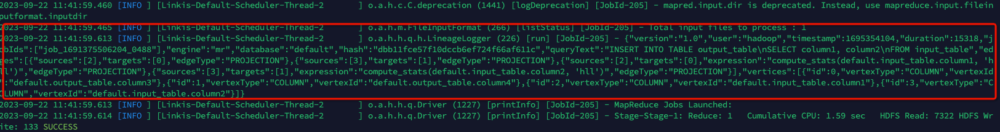

This paper mainly introduces the 'Hive' engine blood collection scheme in 'Linkis'.


## 1. Introduction

Hive provides a built-in lineage hook called LineageLogger, which is used to capture and record lineage information generated during query execution. By using the LineageLogger hook, you can capture and log the input and output tables, as well as column-level lineage relationships for queries.

## 2. The Hive lineage collected into the log

### 2.1 Modify `hive-site.xml`

```shell
vim $HIVE_HOME/conf/hive-site.xml

Add the following configuration
<property>
    <name>hive.exec.post.hooks</name>
    <value>org.apache.hadoop.hive.ql.hooks.LineageLogger</value>
</property>
```

### 2.2 Modify `hive-log4j2.properties`

```shell
vim $HIVE_HOME/conf/hive-log4j2.properties

Add the following configuration
og4j.logger.org.apache.hadoop.hive.ql.hooks.LineageLogger=INFO
```

### 2.3 Submit task
```shell
sh ./bin/linkis-cli -engineType hive-3.1.3 \
-codeType hql -code  \
"CREATE TABLE input_table (
  column1 INT,
  column2 STRING
);
CREATE TABLE output_table (
  column3 INT,
  column4 STRING
);
INSERT INTO TABLE output_table
SELECT column1, column2
FROM input_table;"  \
-submitUser hadoop -proxyUser hadoop
```

### 2.4 View logs
```shell
cat /appcom/tmp/hadoop/20230922/hive/946375fe-f189-487c-b3a7-f9fa821edace/logs/stdout 
```

The output is as follows:


Details are as follows:
```json
{
  "version":"1.0",
  "user":"hadoop",
  "timestamp":1695354104,
  "duration":15318,
  "jobIds":[
    "job_1691375506204_0488"
  ],
  "engine":"mr",
  "database":"default",
  "hash":"dbb11fce57f10dccb6ef724f66af611c",
  "queryText":"INSERT INTO TABLE output_table\nSELECT column1, column2\nFROM input_table",
  "edges":[
    {
      "sources":[
        2
      ],
      "targets":[
        0
      ],
      "edgeType":"PROJECTION"
    },
    {
      "sources":[
        3
      ],
      "targets":[
        1
      ],
      "edgeType":"PROJECTION"
    },
    {
      "sources":[
        2
      ],
      "targets":[
        0
      ],
      "expression":"compute_stats(default.input_table.column1, 'hll')",
      "edgeType":"PROJECTION"
    },
    {
      "sources":[
        3
      ],
      "targets":[
        1
      ],
      "expression":"compute_stats(default.input_table.column2, 'hll')",
      "edgeType":"PROJECTION"
    }
  ],
  "vertices":[
    {
      "id":0,
      "vertexType":"COLUMN",
      "vertexId":"default.output_table.column3"
    },
    {
      "id":1,
      "vertexType":"COLUMN",
      "vertexId":"default.output_table.column4"
    },
    {
      "id":2,
      "vertexType":"COLUMN",
      "vertexId":"default.input_table.column1"
    },
    {
      "id":3,
      "vertexType":"COLUMN",
      "vertexId":"default.input_table.column2"
    }
  ]
}
```

