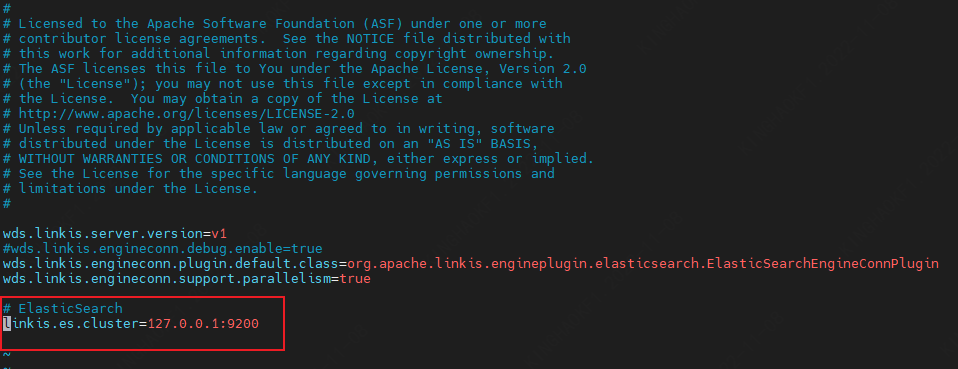

This article mainly introduces the installation, usage and configuration of the `ElasticSearch` engine plugin in `Linkis`.

## 1. Preliminary work
### 1.1 Engine installation

If you want to use the `ElasticSearch` engine on your `Linkis` service, you need to install the `ElasticSearch` service and make sure the service is available.

### 1.2 Service Authentication
Use the following command to verify whether the `ElasticSearch` engine service is available. If the service has enabled user authentication, you need to add `--user username:password`
```
curl [--user username:password] http://ip:port/_cluster/healty?pretty
```
The following output means that the `ElasticSearch` service is available, note that the cluster `status` is `green`
```json
{
  "cluster_name" : "docker-cluster",
  "status" : "green",
  "timed_out" : false,
  "number_of_nodes" : 1,
  "number_of_data_nodes" : 1,
  "active_primary_shards" : 7,
  "active_shards" : 7,
  "relocating_shards" : 0,
  "initializing_shards" : 0,
  "unassigned_shards" : 0,
  "delayed_unassigned_shards" : 0,
  "number_of_pending_tasks" : 0,
  "number_of_in_flight_fetch" : 0,
  "task_max_waiting_in_queue_millis" : 0,
  "active_shards_percent_as_number" : 100.0
}
```
## 2. Engine plugin installation

### 2.1 Engine plugin preparation (choose one) [non-default engine](./overview.md)

Method 1: Download the engine plug-in package directly

[Linkis Engine Plugin Download](https://linkis.apache.org/zh-CN/blog/2022/04/15/how-to-download-engineconn-plugin)

Method 2: Compile the engine plug-in separately (maven environment is required)

```
# compile
cd ${linkis_code_dir}/linkis-engineconn-plugins/elasticsearch/
mvn clean install
# The compiled engine plug-in package is located in the following directory
${linkis_code_dir}/linkis-engineconn-plugins/elasticsearch/target/out/
```

[EngineConnPlugin Engine Plugin Installation](../deployment/install-engineconn.md)

### 2.2 Upload and load engine plugins

Upload the engine plug-in package in 2.1 to the engine directory of the server
```bash 
${LINKIS_HOME}/lib/linkis-engineplugins
```
The directory structure after uploading is as follows
```
linkis-engineconn-plugins/
├── elasticsearch
│   ├── dist
│ │ └── v7.6.2
│   │       ├── conf
│ │ └── lib
│   └── plugin
│ └── 7.6.2
```
### 2.3 Engine refresh

#### 2.3.1 Restart and refresh
Refresh the engine by restarting the `linkis-cg-linkismanager` service
```bash
cd ${LINKIS_HOME}/sbin
sh linkis-daemon.sh restart cg-linkismanager
```

### 2.3.2 Check if the engine is refreshed successfully
You can check whether the `last_update_time` of this table in the `linkis_engine_conn_plugin_bml_resources` in the database is the time when the refresh is triggered.

```sql
#Login to the linkis database
select * from linkis_cg_engine_conn_plugin_bml_resources;
```

## 3. Engine usage

### 3.1 Submit tasks through `Linkis-cli`
**`-codeType` parameter description**
- `essql`: Execute `ElasticSearch` engine tasks through `SQL` scripts
- `esjson`: Execute `ElasticSearch` engine tasks through `JSON` script

**`essql` method example**

**Note:** Using this form, the `ElasticSearch` service must install the SQL plug-in, please refer to the installation method: https://github.com/NLPchina/elasticsearch-sql#elasticsearch-762
```shell
 sh ./bin/linkis-cli -submitUser Hadoop \
 -engineType elasticsearch-7.6.2 -codeType essql \
 -code '{"sql": "select * from kibana_sample_data_ecommerce limit 10' \
 -runtimeMap linkis.es.http.method=GET \
 -runtimeMap linkis.es.http.endpoint=/_sql \
 -runtimeMap linkis.es.datasource=hadoop  \
 -runtimeMap linkis.es.cluster=127.0.0.1:9200
```

**`esjson` style example**
```shell
sh ./bin/linkis-cli -submitUser Hadoop \
-engineType elasticsearch-7.6.2 -codeType esjson \
-code '{"query": {"match": {"order_id": "584677"}}}' \
-runtimeMap linkis.es.http.method=GET \
-runtimeMap linkis.es.http.endpoint=/kibana_sample_data_ecommerce/_search \
-runtimeMap linkis.es.datasource=hadoop  \
-runtimeMap linkis.es.cluster=127.0.0.1:9200
```

More `Linkis-Cli` command parameter reference: [`Linkis-Cli` usage](../user-guide/linkiscli-manual.md)

## 4. Engine configuration instructions

### 4.1 Default Configuration Description

| Configuration | Default | Required | Description |
| ------------------------ | ------------------- | ---| ------------------------------------------- |
| linkis.es.cluster | 127.0.0.1:9200 | yes | ElasticSearch cluster, multiple nodes separated by commas |
| linkis.es.datasource        | hadoop            |是  | ElasticSearch datasource |
| linkis.es.username | none | no | ElasticSearch cluster username |
| linkis.es.password | none | no | ElasticSearch cluster password |
| linkis.es.auth.cache | false | No | Whether the client caches authentication |
| linkis.es.sniffer.enable | false | No | Whether the client enables sniffer |
| linkis.es.http.method | GET |No| Call method |
| linkis.es.http.endpoint | /_search | No | Endpoint called by JSON script |
| linkis.es.sql.endpoint | /_sql | No | Endpoint called by SQL script |
| linkis.es.sql.format | {"query":"%s"} |No | Template called by SQL script, %s is replaced with SQL as the request body to request Es cluster |
| linkis.es.headers.* | None | No | Client Headers Configuration |
| linkis.engineconn.concurrent.limit | 100|No| Maximum concurrent engine |

### 4.2 Configuration modification
If the default parameters are not satisfied, there are the following ways to configure some basic parameters

#### 4.2.1 Management console configuration


Note: After modifying the configuration under the `IDE` tag, you need to specify `-creator IDE` to take effect (other tags are similar), such as:

```shell
sh ./bin/linkis-cli -creator IDE -submitUser hadoop \
-engineType elasticsearch-7.6.2 -codeType esjson \
-code '{"query": {"match": {"order_id": "584677"}}}' \
-runtimeMap linkis.es.http.method=GET \
-runtimeMap linkis.es.http.endpoint=/kibana_sample_data_ecommerce/_search 
```

#### 4.2.2 Task interface configuration
Submit the task interface, configure it through the parameter `params.configuration.runtime`

```shell
Example of http request parameters
{
    "executionContent": {"code": "select * from kibana_sample_data_ecommerce limit 10;", "runType":  "essql"},
    "params": {
                    "variable": {},
                    "configuration": {
                            "runtime": {
                                "linkis.es.cluster":"http://127.0.0.1:9200",
                                "linkis.es.datasource":"hadoop",
                                "linkis.es.username":"",
                                "linkis.es.password":""
                                }
                            }
                    },
    "labels": {
        "engineType": "elasticsearch-7.6.2",
        "userCreator": "hadoop-IDE"
    }
}
```

#### 4.2.3 File Configuration
Configure by modifying the `linkis-engineconn.properties` file in the directory `${LINKIS_HOME}/lib/linkis-engineconn-plugins/elasticsearch/dist/v7.6.2/conf/`, as shown below:



### 4.3 Engine related data sheet

`Linkis` is managed through the engine tag, and the data table information involved is shown below.

```
linkis_ps_configuration_config_key: key and default values ​​of configuration parameters inserted into the engine
linkis_cg_manager_label: Insert engine label such as: elasticsearch-7.6.2
linkis_ps_configuration_category: Insert the directory association of the engine
linkis_ps_configuration_config_value: The configuration that the insertion engine needs to display
linkis_ps_configuration_key_engine_relation: The relationship between the configuration item and the engine
```

The initial data related to the engine in the table is as follows

```sql
-- set variable
SET @ENGINE_LABEL="elasticsearch-7.6.2";
SET @ENGINE_ALL=CONCAT('*-*,',@ENGINE_LABEL);
SET @ENGINE_IDE=CONCAT('*-IDE,',@ENGINE_LABEL);
SET @ENGINE_NAME="elasticsearch";

-- engine label
insert into `linkis_cg_manager_label` (`label_key`, `label_value`, `label_feature`, `label_value_size`, `update_time`, `create_time`) VALUES ('combined_userCreator_engineType', @ENGINE_ALL, 'OPTIONAL', 2, now(), now());
insert into `linkis_cg_manager_label` (`label_key`, `label_value`, `label_feature`, `label_value_size`, `update_time`, `create_time`) VALUES ('combined_userCreator_engineType', @ENGINE_IDE, 'OPTIONAL', 2, now(), now());

select @label_id := id from `linkis_cg_manager_label` where label_value = @ENGINE_IDE;
insert into `linkis_ps_configuration_category` (`label_id`, `level`) VALUES (@label_id, 2);

-- configuration key
INSERT INTO `linkis_ps_configuration_config_key` (`key`, `description`, `name`, `default_value`, `validate_type`, `validate_range`, `engine_conn_type`, `is_hidden`, `is_advanced`, `level`, `treeName`) VALUES ('linkis.es.cluster', 'eg: http://127.0.0.1:9200', 'connection address', 'http://127.0.0.1:9200', 'None', '', @ENGINE_NAME , 0, 0, 1, 'data source conf');
INSERT INTO `linkis_ps_configuration_config_key` (`key`, `description`, `name`, `default_value`, `validate_type`, `validate_range`, `engine_conn_type`, `is_hidden`, `is_advanced`, `level`, `treeName`) VALUES ('linkis.es.datasource', 'Connection Alias', 'Connection Alias', 'hadoop', 'None', '', @ENGINE_NAME, 0, 0, 1, 'Datasource Configuration');
INSERT INTO `linkis_ps_configuration_config_key` (`key`, `description`, `name`, `default_value`, `validate_type`, `validate_range`, `engine_conn_type`, `is_hidden`, `is_advanced`, `level`, `treeName`) VALUES ('linkis.es.username', 'username', 'ES cluster username', 'No', 'None', '', @ENGINE_NAME, 0, 0, 1, 'data source conf');
INSERT INTO `linkis_ps_configuration_config_key` (`key`, `description`, `name`, `default_value`, `validate_type`, `validate_range`, `engine_conn_type`, `is_hidden`, `is_advanced`, `level`, `treeName`) VALUES ('linkis.es.password', 'password', 'ES cluster password', 'None', 'None', '', @ENGINE_NAME, 0, 0, 1, 'data source conf');
INSERT INTO `linkis_ps_configuration_config_key` (`key`, `description`, `name`, `default_value`, `validate_type`, `validate_range`, `engine_conn_type`, `is_hidden`, `is_advanced`, `level`, `treeName`) VALUES ('linkis.es.auth.cache', 'Does the client cache authentication', 'Does the client cache authentication', 'false', 'None', '', @ENGINE_NAME, 0, 0, 1, 'data source conf');
INSERT INTO `linkis_ps_configuration_config_key` (`key`, `description`, `name`, `default_value`, `validate_type`, `validate_range`, `engine_conn_type`, `is_hidden`, `is_advanced`, `level`, `treeName`) VALUES ('linkis.es.sniffer.enable', 'Whether the client enables sniffer', 'Whether the client enables sniffer', 'false', 'None', '', @ENGINE_NAME, 0, 0, 1, 'data source conf');
INSERT INTO `linkis_ps_configuration_config_key` (`key`, `description`, `name`, `default_value`, `validate_type`, `validate_range`, `engine_conn_type`, `is_hidden`, `is_advanced`, `level`, `treeName`) VALUES ('linkis.es.http.method', 'call method', 'HTTP request method', 'GET', 'None', '', @ENGINE_NAME, 0, 0, 1, 'data source conf');
INSERT INTO `linkis_ps_configuration_config_key` (`key`, `description`, `name`, `default_value`, `validate_type`, `validate_range`, `engine_conn_type`, `is_hidden`, `is_advanced`, `level`, `treeName`) VALUES ('linkis.es.http.endpoint', '/_search', 'JSON script Endpoint', '/_search', 'None', '', @ENGINE_NAME, 0, 0, 1, 'data source conf');
INSERT INTO `linkis_ps_configuration_config_key` (`key`, `description`, `name`, `default_value`, `validate_type`, `validate_range`, `engine_conn_type`, `is_hidden`, `is_advanced`, `level`, `treeName`) VALUES ('linkis.es.sql.endpoint', '/_sql', 'SQL script Endpoint', '/_sql', 'None', '', @ENGINE_NAME, 0, 0, 1, 'data source conf');
INSERT INTO `linkis_ps_configuration_config_key` (`key`, `description`, `name`, `default_value`, `validate_type`, `validate_range`, `engine_conn_type`, `is_hidden`, `is_advanced`, `level`, `treeName`) VALUES ('linkis.es.sql.format', 'The template called by the SQL script, replace %s with SQL as the request body to request the Es cluster', 'request body', '{"query":"%s"}', 'None', '', @ENGINE_NAME, 0, 0, 1, 'data source conf');
INSERT INTO `linkis_ps_configuration_config_key` (`key`, `description`, `name`, `default_value`, `validate_type`, `validate_range`, `engine_conn_type`, `is_hidden`, `is_advanced`, `level`, `treeName`) VALUES ('linkis.es.headers.*', 'Client Headers Configuration', 'Client Headers Configuration', 'None', 'None', '', @ENGINE_NAME, 0, 0, 1, 'data source conf');
INSERT INTO `linkis_ps_configuration_config_key` (`key`, `description`, `name`, `default_value`, `validate_type`, `validate_range`, `engine_conn_type`, `is_hidden`, `is_advanced`, `level`, `treeName`) VALUES ('linkis.engineconn.concurrent.limit', 'engine max concurrency', 'engine max concurrency', '100', 'None', '', @ENGINE_NAME, 0, 0, 1, 'data source conf') ;

-- key engine relation
insert into `linkis_ps_configuration_key_engine_relation` (`config_key_id`, `engine_type_label_id`)
(select config.id as config_key_id, label.id AS engine_type_label_id FROM `linkis_ps_configuration_config_key` config
INNER JOIN `linkis_cg_manager_label` label ON config.engine_conn_type = @ENGINE_NAME and label_value = @ENGINE_ALL);

-- engine default configuration
insert into `linkis_ps_configuration_config_value` (`config_key_id`, `config_value`, `config_label_id`)
(select relation.config_key_id AS config_key_id, '' AS config_value, relation.engine_type_label_id AS config_label_id FROM `linkis_ps_configuration_key_engine_relation` relation
INNER JOIN `linkis_cg_manager_label` label ON relation.engine_type_label_id = label.id AND label.label_value = @ENGINE_ALL);

```