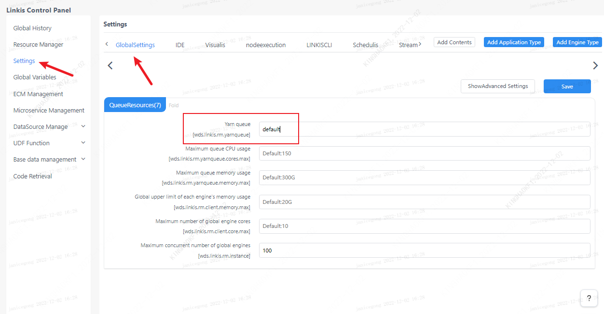
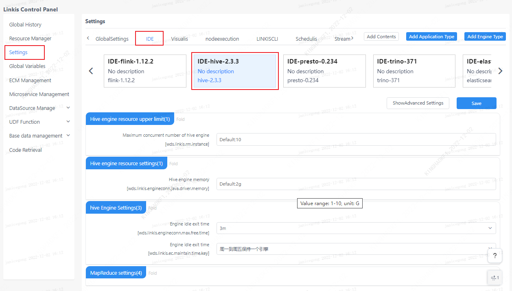

This article mainly introduces the installation, usage and configuration of the `Hive` engine plugin in `Linkis`.

## 1. Preliminary work
### 1.1 Environment configuration before engine use

If you want to use the `hive` engine on your server, you need to ensure that the following environment variables have been set correctly and the engine startup user has these environment variables.

It is strongly recommended that you check these environment variables for the executing user before executing `hive` tasks.

| Environment variable name | Environment variable content | Remarks |
|-----------------|----------------|------|
| JAVA_HOME | JDK installation path | Required |
| HADOOP_HOME | Hadoop installation path | Required |
| HADOOP_CONF_DIR | Hadoop configuration path | required |
| HIVE_CONF_DIR | Hive configuration path | required |

### 1.1 Environment verification
```
# link hive
bin/hive

# test command
show databases;

# Being able to link successfully and output database information normally means that the environment configuration is successful
hive (default)> show databases;
OK
databases_name
default
```

## 2. Engine plugin installation [default engine](./overview.md)

The binary installation package released by `linkis` includes the `Hive` engine plug-in by default, and users do not need to install it additionally.

The version of `Hive` supports `hive1.x` and `hive2.x`. The default is to support `hive on MapReduce`. If you want to change to `Hive on Tez`, you need to modify it according to this `pr`.

<https://github.com/apache/incubator-linkis/pull/541>

The `hive` version supported by default is 2.3.3, if you want to modify the `hive` version, you can find the `linkis-engineplugin-hive` module, modify the \<hive.version\> tag, and then compile this module separately Can

[EngineConnPlugin engine plugin installation](../deployment/install-engineconn.md)

## 3. Engine usage

### 3.1 Submitting tasks via `Linkis-cli`

```shell
sh ./bin/linkis-cli -engineType hive-2.3.3 \
-codeType hql -code "show databases"  \
-submitUser hadoop -proxyUser hadoop
```

More `Linkis-Cli` command parameter reference: [`Linkis-Cli` usage](../user-guide/linkiscli-manual.md)

### 3.2 Submit tasks through Linkis SDK

`Linkis` provides `SDK` of `Java` and `Scala` to submit tasks to `Linkis` server. For details, please refer to [JAVA SDK Manual](../user-guide/sdk-manual.md).
For the `Hive` task, you only need to modify `EngineConnType` and `CodeType` parameters in `Demo`:

```java
Map<String, Object> labels = new HashMap<String, Object>();
labels.put(LabelKeyConstant.ENGINE_TYPE_KEY, "hive-2.3.3"); // required engineType Label
labels.put(LabelKeyConstant.USER_CREATOR_TYPE_KEY, "hadoop-IDE");// required execute user and creator
labels.put(LabelKeyConstant.CODE_TYPE_KEY, "hql"); // required codeType
```

## 4. Engine configuration instructions

### 4.1 Default Configuration Description
| Configuration | Default | Required | Description |
| ------------------------ | ------------------- | ---| ------------------------------------------- |
| wds.linkis.rm.instance | 10 | no | engine maximum concurrency |
| wds.linkis.engineconn.java.driver.memory | 1g | No | engine initialization memory size |
| wds.linkis.engineconn.max.free.time | 1h | no | engine idle exit time |

### 4.2 Queue resource configuration
The `MapReduce` task of `hive` needs to use `yarn` resources, so a queue needs to be set

    

### 4.3 Configuration modification
If the default parameters are not satisfied, there are the following ways to configure some basic parameters

#### 4.3.1 Management Console Configuration



Note: After modifying the configuration under the `IDE` tag, you need to specify `-creator IDE` to take effect (other tags are similar), such as:

```shell
sh ./bin/linkis-cli -creator IDE \
-engineType hive-2.3.3 -codeType hql \
-code "show databases"  \
-submitUser hadoop -proxyUser hadoop
```

#### 4.3.2 Task interface configuration
Submit the task interface, configure it through the parameter `params.configuration.runtime`

```shell
Example of http request parameters
{
    "executionContent": {"code": "show databases;", "runType":  "sql"},
    "params": {
                    "variable": {},
                    "configuration": {
                            "runtime": {
                                "wds.linkis.rm.instance":"10"
                                }
                            }
                    },
    "labels": {
        "engineType": "hive-2.3.3",
        "userCreator": "hadoop-IDE"
    }
}
```

### 4.4 Engine related data table

`Linkis` is managed through engine tags, and the data table information involved is as follows.

```
linkis_ps_configuration_config_key: Insert the key and default values ​​​​of the configuration parameters of the engine
linkis_cg_manager_label: insert engine label such as: hive-2.3.3
linkis_ps_configuration_category: Insert the directory association of the engine
linkis_ps_configuration_config_value: The configuration that the insertion engine needs to display
linkis_ps_configuration_key_engine_relation: The relationship between the configuration item and the engine
```

The initial data related to the engine in the table is as follows

```sql
-- set variable
SET @HIVE_LABEL="hive-2.3.3";
SET @HIVE_ALL=CONCAT('*-*,',@HIVE_LABEL);
SET @HIVE_IDE=CONCAT('*-IDE,',@HIVE_LABEL);

-- engine label
insert into `linkis_cg_manager_label` (`label_key`, `label_value`, `label_feature`, `label_value_size`, `update_time`, `create_time`) VALUES ('combined_userCreator_engineType', @HIVE_ALL, 'OPTIONAL', 2, now(), now());
insert into `linkis_cg_manager_label` (`label_key`, `label_value`, `label_feature`, `label_value_size`, `update_time`, `create_time`) VALUES ('combined_userCreator_engineType', @HIVE_IDE, 'OPTIONAL', 2, now(), now());

select @label_id := id from linkis_cg_manager_label where `label_value` = @HIVE_IDE;
insert into linkis_ps_configuration_category (`label_id`, `level`) VALUES (@label_id, 2);

-- configuration key
INSERT INTO `linkis_ps_configuration_config_key` (`key`, `description`, `name`, `default_value`, `validate_type`, `validate_range`, `is_hidden`, `is_advanced`, `level`, `treeName`, `engine_conn_type`) VALUES ('wds.linkis.rm.instance', 'range: 1-20, unit: piece', 'hive engine maximum concurrent number', '10', 'NumInterval', '[1,20]', '0 ', '0', '1', 'Queue resource', 'hive');
INSERT INTO `linkis_ps_configuration_config_key` (`key`, `description`, `name`, `default_value`, `validate_type`, `validate_range`, `is_hidden`, `is_advanced`, `level`, `treeName`, `engine_conn_type`) VALUES ('wds.linkis.engineconn.java.driver.memory', 'Value range: 1-10, unit: G', 'hive engine initialization memory size', '1g', 'Regex', '^([ 1-9]|10)(G|g)$', '0', '0', '1', 'hive engine settings', 'hive');
INSERT INTO `linkis_ps_configuration_config_key` (`key`, `description`, `name`, `default_value`, `validate_type`, `validate_range`, `is_hidden`, `is_advanced`, `level`, `treeName`, `engine_conn_type`) VALUES ('hive.client.java.opts', 'hive client process parameters', 'jvm parameters when the hive engine starts','', 'None', NULL, '1', '1', '1', 'hive engine settings', 'hive');
INSERT INTO `linkis_ps_configuration_config_key` (`key`, `description`, `name`, `default_value`, `validate_type`, `validate_range`, `is_hidden`, `is_advanced`, `level`, `treeName`, `engine_conn_type`) VALUES ('mapred.reduce.tasks', 'Range: -1-10000, unit: number', 'reduce number', '-1', 'NumInterval', '[-1,10000]', '0', '1', '1', 'hive resource settings', 'hive');
INSERT INTO `linkis_ps_configuration_config_key` (`key`, `description`, `name`, `default_value`, `validate_type`, `validate_range`, `is_hidden`, `is_advanced`, `level`, `treeName`, `engine_conn_type`) VALUES ('wds.linkis.engineconn.max.free.time', 'Value range: 3m,15m,30m,1h,2h', 'Engine idle exit time','1h', 'OFT', '[\ "1h\",\"2h\",\"30m\",\"15m\",\"3m\"]', '0', '0', '1', 'hive engine settings', ' hive');

-- key engine relation
insert into `linkis_ps_configuration_key_engine_relation` (`config_key_id`, `engine_type_label_id`)
(select config.id as `config_key_id`, label.id AS `engine_type_label_id` FROM linkis_ps_configuration_config_key config
INNER JOIN linkis_cg_manager_label label ON config.engine_conn_type = 'hive' and label_value = @HIVE_ALL);

-- engine default configuration
insert into `linkis_ps_configuration_config_value` (`config_key_id`, `config_value`, `config_label_id`)
(select `relation`.`config_key_id` AS `config_key_id`, '' AS `config_value`, `relation`.`engine_type_label_id` AS `config_label_id` FROM linkis_ps_configuration_key_engine_relation relation
INNER JOIN linkis_cg_manager_label label ON relation.engine_type_label_id = label.id AND label.label_value = @HIVE_ALL);
```

## 5. Hive modification log display
The default log interface does not display `application_id` and the number of `task` completed, users can output the log according to their needs
The code blocks that need to be modified in the `log4j2-engineconn.xml/log4j2.xml` configuration file in the engine are as follows
1. Need to add under the `appenders` component
```xml
        <Send name="SendPackage" >
            <PatternLayout pattern="%d{yyyy-MM-dd HH:mm:ss.SSS} %-5level [%t] %logger{36} %L %M - %msg%xEx%n"/>
        </Send>
```
2. Need to add under `root` component
```xml
        <appender-ref ref="SendPackage"/>
```
3. Need to add under `loggers` component
```xml
        <logger name="org.apache.hadoop.hive.ql.exec.StatsTask" level="info" additivity="true">
            <appender-ref ref="SendPackage"/>
        </logger>
```
After making the above related modifications, the log can add task `task` progress information, which is displayed in the following style
```
2022-04-08 11:06:50.228 INFO  [Linkis-Default-Scheduler-Thread-3] SessionState 1111 printInfo - Status: Running (Executing on YARN cluster with App id application_1631114297082_432445)
2022-04-08 11:06:50.248 INFO  [Linkis-Default-Scheduler-Thread-3] SessionState 1111 printInfo - Map 1: -/-	Reducer 2: 0/1	
2022-04-08 11:06:52.417 INFO  [Linkis-Default-Scheduler-Thread-3] SessionState 1111 printInfo - Map 1: 0/1	Reducer 2: 0/1	
2022-04-08 11:06:55.060 INFO  [Linkis-Default-Scheduler-Thread-3] SessionState 1111 printInfo - Map 1: 0(+1)/1	Reducer 2: 0/1	
2022-04-08 11:06:57.495 INFO  [Linkis-Default-Scheduler-Thread-3] SessionState 1111 printInfo - Map 1: 1/1	Reducer 2: 0(+1)/1	
2022-04-08 11:06:57.899 INFO  [Linkis-Default-Scheduler-Thread-3] SessionState 1111 printInfo - Map 1: 1/1	Reducer 2: 1/1	
```

An example of a complete `xml` configuration file is as follows:
```xml
<!--
  ~ Copyright 2019 WeBank
  ~
  ~ Licensed under the Apache License, Version 2.0 (the "License");
  ~ you may not use this file except in compliance with the License.
  ~ You may obtain a copy of the License at
  ~
  ~ http://www.apache.org/licenses/LICENSE-2.0
  ~
  ~ Unless required by applicable law or agreed to in writing, software
  ~ distributed under the License is distributed on an "AS IS" BASIS,
  ~ WITHOUT WARRANTIES OR CONDITIONS OF ANY KIND, either express or implied.
  ~ See the License for the specific language governing permissions and
  ~ limitations under the License.
  -->
  
<configuration status="error" monitorInterval="30">
    <appenders>
        <Console name="Console" target="SYSTEM_OUT">
            <ThresholdFilter level="INFO" onMatch="ACCEPT" onMismatch="DENY"/>
            <PatternLayout pattern="%d{yyyy-MM-dd HH:mm:ss.SSS} %-5level [%t] %logger{36} %L %M - %msg%xEx%n"/>
        </Console>

        <Send name="Send" >
            <Filters>
                <ThresholdFilter level="WARN" onMatch="ACCEPT" onMismatch="DENY" />
            </Filters>
            <PatternLayout pattern="%d{yyyy-MM-dd HH:mm:ss.SSS} %-5level [%t] %logger{36} %L %M - %msg%xEx%n"/>
        </Send>

        <Send name="SendPackage" >
            <PatternLayout pattern="%d{yyyy-MM-dd HH:mm:ss.SSS} %-5level [%t] %logger{36} %L %M - %msg%xEx%n"/>
        </Send>

        <Console name="stderr" target="SYSTEM_ERR">
            <ThresholdFilter level="ERROR" onMatch="ACCEPT" onMismatch="DENY" />
            <PatternLayout pattern="%d{HH:mm:ss.SSS} %-5level %class{36} %L %M - %msg%xEx%n"/>
        </Console>
    </appenders>

    <loggers>
      <root level="INFO">
            <appender-ref ref="stderr"/>
            <appender-ref ref="Console"/>
            <appender-ref ref="Send"/>
            <appender-ref ref="SendPackage"/>
        </root>
        <logger name="org.apache.hadoop.hive.ql.exec.StatsTask" level="info" additivity="true">
            <appender-ref ref="SendPackage"/>
        </logger>
        <logger name="org.springframework.boot.diagnostics.LoggingFailureAnalysisReporter" level="error" additivity="true">
            <appender-ref ref="stderr"/>
        </logger>
        <logger name="com.netflix.discovery" level="warn" additivity="true">
            <appender-ref ref="Send"/>
        </logger>
        <logger name="org.apache.hadoop.yarn" level="warn" additivity="true">
            <appender-ref ref="Send"/>
        </logger>
        <logger name="org.springframework" level="warn" additivity="true">
            <appender-ref ref="Send"/>
        </logger>
        <logger name="org.apache.linkis.server.security" level="warn" additivity="true">
            <appender-ref ref="Send"/>
        </logger>
        <logger name="org.apache.hadoop.hive.ql.exec.mr.ExecDriver" level="fatal" additivity="true">
            <appender-ref ref="Send"/>
        </logger>
        <logger name="org.apache.hadoop.hdfs.KeyProviderCache" level="fatal" additivity="true">
            <appender-ref ref="Send"/>
        </logger>
        <logger name="org.spark_project.jetty" level="ERROR" additivity="true">
            <appender-ref ref="Send"/>
        </logger>
        <logger name="org.eclipse.jetty" level="ERROR" additivity="true">
            <appender-ref ref="Send"/>
        </logger>
        <logger name="org.springframework" level="ERROR" additivity="true">
            <appender-ref ref="Send"/>
        </logger>
        <logger name="org.reflections.Reflections" level="ERROR" additivity="true">
            <appender-ref ref="Send"/>
        </logger>

        <logger name="org.apache.hadoop.ipc.Client" level="ERROR" additivity="true">
            <appender-ref ref="Send"/>
        </logger>

   </loggers>
</configuration>
```