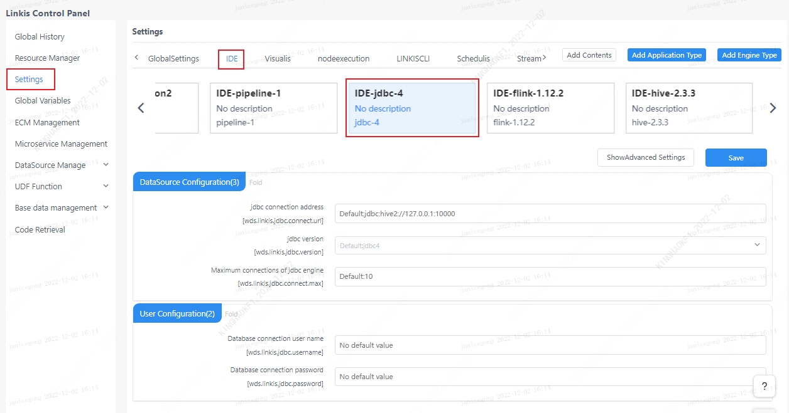

This article mainly introduces the installation, use and configuration of the `JDBC` engine plugin in `Linkis`.

## 1. Preliminary work
### 1.1 Environment Installation

If you want to use `JDBC` engine on your server, you need to prepare `JDBC` connection information, such as `MySQL` database connection address, username and password, etc.

### 1.2 Environment verification (take `Mysql` as an example)
```
mysql -uroot -P 3306 -h 127.0.0.1 -p 123456
```
The output of the following information means that the `JDBC` connection information is available
```
mysql: [Warning] Using a password on the command line interface can be insecure.
Welcome to the MySQL monitor.  Commands end with ; or \g.
Your MySQL connection id is 9
Server version: 5.7.39 MySQL Community Server (GPL)

Copyright (c) 2000, 2022, Oracle and/or its affiliates.

Oracle is a registered trademark of Oracle Corporation and/or its
affiliates. Other names may be trademarks of their respective
owners.

Type 'help;' or '\h' for help. Type '\c' to clear the current input statement.

mysql>
```

## 2. Engine plugin installation

### 2.1 Engine plugin preparation (choose one) [non-default engine](./overview.md)

Method 1: Download the engine plug-in package directly

[`Linkis` engine plugin download](https://linkis.apache.org/zh-CN/blog/2022/04/15/how-to-download-engineconn-plugin)

Method 2: Compile the engine plug-in separately (requires a `maven` environment)

```
# compile
cd ${linkis_code_dir}/linkis-engineconn-plugins/jdbc/
mvn clean install
# The compiled engine plug-in package is located in the following directory
${linkis_code_dir}/linkis-engineconn-plugins/jdbc/target/out/
```

[`EngineConnPlugin` engine plugin installation](../deployment/install-engineconn.md)

### 2.2 Upload and load engine plugins

Upload the engine plug-in package in 2.1 to the engine directory of the server
```bash 
${LINKIS_HOME}/lib/linkis-engineplugins
```
The directory structure after uploading is as follows
```
linkis-engineconn-plugins/
├── jdbc
│   ├── dist
│ │ └── v4
│   │       ├── conf
│ │ └── lib
│   └── plugin
│ └── 4
```

### 2.3 Engine refresh

#### 2.3.1 Restart and refresh
Refresh the engine by restarting the `linkis-cg-linkismanager` service
```bash
cd ${LINKIS_HOME}/sbin
sh linkis-daemon.sh restart cg-linkismanager
```

### 2.3.2 Check whether the engine is refreshed successfully

You can check whether the `last_update_time` of the `linkis_engine_conn_plugin_bml_resources` table in the database is the time to trigger the refresh.

```sql
#Login to the `linkis` database
select * from linkis_cg_engine_conn_plugin_bml_resources;
```

## 3. Engine usage

### 3.1 Submit tasks through `Linkis-cli`

```shell
sh ./bin/linkis-cli -engineType jdbc-4 \
-codeType jdbc -code "show tables" \
-submitUser hadoop -proxyUser hadoop
```

More `Linkis-Cli` command parameter reference: [`Linkis-Cli` usage](../user-guide/linkiscli-manual.md)

### 3.2 Submitting tasks through `Linkis SDK`

`Linkis` provides `SDK` of `Java` and `Scala` to submit tasks to `Linkis` server. For details, please refer to [JAVA SDK Manual](../user-guide/sdk-manual.md). For the `JDBC` task, you only need to modify `EngineConnType` and `CodeType` parameters in `Demo`:

```java
Map<String, Object> labels = new HashMap<String, Object>();
labels.put(LabelKeyConstant.ENGINE_TYPE_KEY, "jdbc-4"); // required engineType Label
labels.put(LabelKeyConstant.USER_CREATOR_TYPE_KEY, "hadoop-IDE");// required execute user and creator
labels.put(LabelKeyConstant.CODE_TYPE_KEY, "jdbc"); // required codeType
```

### 3.3 Multiple data source support
Starting from `Linkis 1.2.0`, it provides support for multiple data sources in the `JDBC` engine. First, we can manage different data sources in the console. Address: Log in to the management console-->Data source management-->Add data source


Figure 3-3 Data source management


Figure 3-4 Data source connection test

After the data source is added, you can use the multi-data source switching function of the `JDBC` engine. There are two ways:
1. Specify the data source name parameter through the interface parameter, as shown below:


Example parameters:
```json
{
    "executionContent": {"code": "show databases", "runType":  "jdbc"},
    "params": {"variable": {}, "configuration": {"startup":{}, 
    "runtime": 
    	{
    		"dataSources": {"wds.linkis.engine.runtime.datasource": "test_mysql"
    	}
    }}},
    "source":  {"scriptPath": ""},
    "labels": {
        "engineType": "jdbc-4",
        "userCreator": "hadoop-IDE"
    }
}
```

Parameter: `wds.linkis.engine.runtime.datasource` is a configuration with a fixed name, do not modify the name definition at will

2. Use the `Scripts` code of `DSS` to submit the entry drop-down to filter the data sources that need to be submitted, as shown in the figure below:

Currently `dss-1.1.0` does not support drop-down selection of data source name, `PR` is under development, you can wait for the subsequent release or pay attention to related `PR`:
(https://github.com/WeBankFinTech/DataSphereStudio/issues/940)


Function description of multiple data sources:

1) In the previous version, the `JDBC` engine's support for data sources was not perfect, especially when used with Scripts, the `JDBC` script type can only bind a set of `JDBC` engine parameters of the console.
When we need to switch multiple data sources, we can only modify the connection parameters of the `JDBC` engine, which is troublesome.

2) To cooperate with data source management, we introduce the multi-data source switching function of `JDBC` engine, which can realize that only setting the data source name can submit jobs to different `JDBC` services, and ordinary users do not need to
It maintains the connection information of the data source, avoids the complicated configuration, and also meets the security requirements of the data source connection password and other configurations.

3) The data sources set in the multi-data source management can be loaded by the `JDBC` engine only after they have been released and have not expired, otherwise different types of exception prompts will be fed back to the user.

4) The loading priority of `JDBC` engine parameters is: task submission parameters > data source selection parameters > console JDBC engine parameters


## 4. Engine configuration instructions

### 4.1 Default Configuration Description

| Configuration | Default | Required | Description |
| ------------------------ | ------------------- | ---| ------------------------------------------- |
| wds.linkis.jdbc.connect.url | jdbc:mysql://127.0.0.1:10000 | yes | jdbc connection address |
| wds.linkis.jdbc.driver | no | yes | jdbc connection driver |
| wds.linkis.jdbc.username | no | yes | database connection username |
| wds.linknis.jdbc.password | no | yes | database link password |
| wds.linkis.jdbc.connect.max | 10 | No | The maximum number of jdbc engine connections |
| wds.linkis.jdbc.version | jdbc4 | no | jdbc version |

### 4.2 Configuration modification
If the default parameters are not satisfied, there are the following ways to configure some basic parameters


#### 4.2.1 Management console configuration



Note: After modifying the configuration under the `IDE` tag, you need to specify `-creator IDE` to take effect (other tags are similar), such as:

```shell
sh ./bin/linkis-cli -creator IDE \
-engineType jdbc-4 -codeType jdbc \
-code "show tables"  \
-submitUser hadoop -proxyUser hadoop \
-runtimeMap wds.linkis.jdbc.connect.url=jdbc:mysql://127.0.0.1:3306 \
-runtimeMap wds.linkis.jdbc.driver=com.mysql.jdbc.Driver \
-runtimeMap wds.linkis.jdbc.username=root \
-runtimeMap wds.linkis.jdbc.password=123456 \
```

#### 4.2.2 Task interface configuration
Submit the task interface, configure it through the parameter `params.configuration.runtime`

```shell
Example of http request parameters
{
    "executionContent": {"code": "show databases;", "runType":  "jdbc"},
    "params": {
                    "variable": {},
                    "configuration": {
                            "runtime": {
                                    "wds.linkis.jdbc.connect.url":"jdbc:mysql://127.0.0.1:3306/test",  
                                    "wds.linkis.jdbc.driver":"com.mysql.jdbc.Driver",
                                    "wds.linkis.jdbc.username":"test",
                                    "wds.linkis.jdbc.password":"test23"
                                }
                            }
                    },
    "labels": {
        "engineType": "jdbc-4",
        "userCreator": "hadoop-IDE"
    }
}
```
### 4.3 Engine related data sheet

`Linkis` is managed through engine tags, and the data table information involved is as follows.

```
linkis_ps_configuration_config_key: key and default values ​​of configuration parameters inserted into the engine
linkis_cg_manager_label: Insert engine label such as: jdbc-4
linkis_ps_configuration_category: The directory association relationship of the insertion engine
linkis_ps_configuration_config_value: The configuration that the insertion engine needs to display
linkis_ps_configuration_key_engine_relation: The relationship between the configuration item and the engine
```

The initial data related to the engine in the table is as follows

```sql
-- set variable
SET @JDBC_LABEL="jdbc-4";
SET @JDBC_ALL=CONCAT('*-*,',@JDBC_LABEL);
SET @JDBC_IDE=CONCAT('*-IDE,',@JDBC_LABEL);

-- engine label
insert into `linkis_cg_manager_label` (`label_key`, `label_value`, `label_feature`, `label_value_size`, `update_time`, `create_time`) VALUES ('combined_userCreator_engineType', @JDBC_ALL, 'OPTIONAL', 2, now(), now());
insert into `linkis_cg_manager_label` (`label_key`, `label_value`, `label_feature`, `label_value_size`, `update_time`, `create_time`) VALUES ('combined_userCreator_engineType', @JDBC_IDE, 'OPTIONAL', 2, now(), now());

select @label_id := id from linkis_cg_manager_label where `label_value` = @JDBC_IDE;
insert into linkis_ps_configuration_category (`label_id`, `level`) VALUES (@label_id, 2);

-- configuration key
insert into `linkis_ps_configuration_config_key` (`key`, `description`, `name`, `default_value`, `validate_type`, `validate_range`, `is_hidden`, `is_advanced`, `level`, `treeName`, `engine_conn_type`) VALUES ('wds.linkis.jdbc.connect.url', 'For example: jdbc:mysql://127.0.0.1:10000', 'jdbc connection address', 'jdbc:mysql://127.0.0.1:10000', 'Regex', '^\\s*jdbc:\\w+://([^:]+)(:\\d+)(/[^\\?]+)?(\\?\\S* )?$', '0', '0', '1', 'Datasource configuration', 'jdbc');
insert into `linkis_ps_configuration_config_key` (`key`, `description`, `name`, `default_value`, `validate_type`, `validate_range`, `is_hidden`, `is_advanced`, `level`, `treeName`, `engine_conn_type`) VALUES ('wds.linkis.jdbc.driver', 'For example: com.mysql.jdbc.Driver', 'jdbc connection driver', '', 'None', '', '0', '0', '1 ', 'User Configuration', 'jdbc');
insert into `linkis_ps_configuration_config_key` (`key`, `description`, `name`, `default_value`, `validate_type`, `validate_range`, `is_hidden`, `is_advanced`, `level`, `treeName`, `engine_conn_type`) VALUES ('wds.linkis.jdbc.version', 'Value range: jdbc3,jdbc4', 'jdbc version','jdbc4', 'OFT', '[\"jdbc3\",\"jdbc4\"]' , '0', '0', '1', 'userconfig', 'jdbc');
insert into `linkis_ps_configuration_config_key` (`key`, `description`, `name`, `default_value`, `validate_type`, `validate_range`, `is_hidden`, `is_advanced`, `level`, `treeName`, `engine_conn_type`) VALUES ('wds.linkis.jdbc.username', 'username', 'Database connection username', '', 'None', '', '0', '0', '1', 'User configuration', 'jdbc');
insert into `linkis_ps_configuration_config_key` (`key`, `description`, `name`, `default_value`, `validate_type`, `validate_range`, `is_hidden`, `is_advanced`, `level`, `treeName`, `engine_conn_type`) VALUES ('wds.linkis.jdbc.password', 'password', 'Database connection password', '', 'None', '', '0', '0', '1', 'User configuration', ' jdbc');
insert into `linkis_ps_configuration_config_key` (`key`, `description`, `name`, `default_value`, `validate_type`, `validate_range`, `is_hidden`, `is_advanced`, `level`, `treeName`, `engine_conn_type`) VALUES ('wds.linkis.jdbc.connect.max', 'range: 1-20, unit: piece', 'jdbc engine maximum number of connections', '10', 'NumInterval', '[1,20]', '0', '0', '1', 'Datasource configuration', 'jdbc');

-- key engine relation
insert into `linkis_ps_configuration_key_engine_relation` (`config_key_id`, `engine_type_label_id`)
(select config.id as `config_key_id`, label.id AS `engine_type_label_id` FROM linkis_ps_configuration_config_key config
INNER JOIN linkis_cg_manager_label label ON config.engine_conn_type = 'jdbc' and label_value = @JDBC_ALL);

insert into `linkis_ps_configuration_config_value` (`config_key_id`, `config_value`, `config_label_id`)
(select `relation`.`config_key_id` AS `config_key_id`, '' AS `config_value`, `relation`.`engine_type_label_id` AS `config_label_id` FROM linkis_ps_configuration_key_engine_relation relation
INNER JOIN linkis_cg_manager_label label ON relation.engine_type_label_id = label.id AND label.label_value = @JDBC_ALL);
```