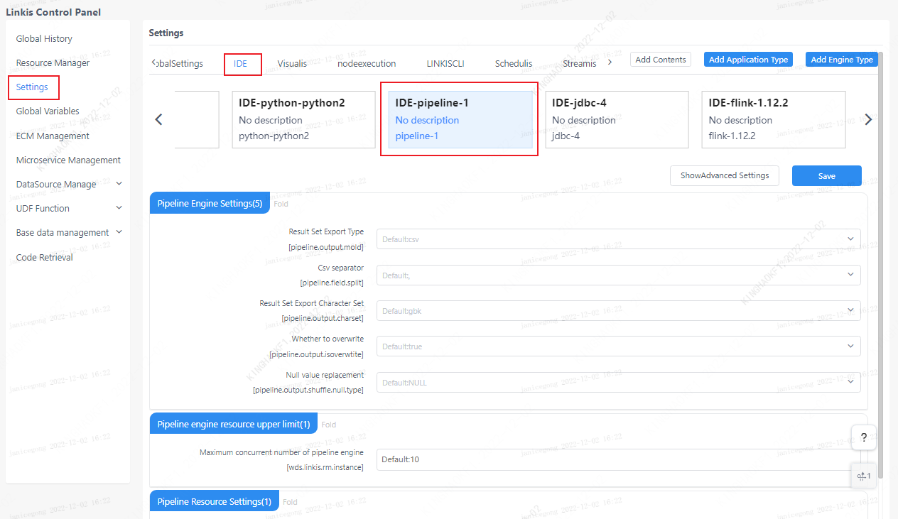

`Pipeline` is mainly used to import and export files. This article mainly introduces the installation, use and configuration of the `Hive` engine plugin in `Linkis`.

## 1. Engine plugin installation

### 1.1 Engine plugin preparation (choose one) [non-default engine](./overview.md)

Method 1: Download the engine plug-in package directly

[Linkis Engine Plugin Download](https://linkis.apache.org/zh-CN/blog/2022/04/15/how-to-download-engineconn-plugin)

Method 2: Compile the engine plug-in separately (maven environment is required)

```
# compile
cd ${linkis_code_dir}/linkis-engineconn-plugins/pipeline/
mvn clean install
# The compiled engine plug-in package is located in the following directory
${linkis_code_dir}/linkis-engineconn-plugins/pipeline/target/out/
```
[EngineConnPlugin engine plugin installation](../deployment/install-engineconn.md)

### 1.2 Uploading and loading of engine plugins

Upload the engine plug-in package in 1.1 to the engine directory of the server
```bash 
${LINKIS_HOME}/lib/linkis-engineplugins
```
The directory structure after uploading is as follows
```
linkis-engineconn-plugins/
├── pipeline
│   ├── dist
│ │ └── v1
│   │       ├── conf
│ │ └── lib
│   └── plugin
│ └── 1
```
### 1.3 Engine refresh

#### 1.3.1 Restart and refresh
Refresh the engine by restarting the `linkis-cg-linkismanager` service
```bash
cd ${LINKIS_HOME}/sbin
sh linkis-daemon.sh restart cg-linkismanager
```

### 1.3.2 Check if the engine is refreshed successfully
You can check whether the `last_update_time` of the `linkis_engine_conn_plugin_bml_resources` table in the database is the time to trigger the refresh.

```sql
#Log in to the linkis database
select * from linkis_cg_engine_conn_plugin_bml_resources;
```

## 2 Engine usage

Because the `pipeline` engine is mainly used to import and export files, now we assume that importing files from A to B is an introduction case

### 2.1 Submit tasks through `Linkis-cli`

```shell
sh bin/linkis-cli -submitUser Hadoop \
-engineType pipeline-1  -codeType pipeline  \
-code "from hdfs:///000/000/000/A.dolphin  to file:///000/000/000/B.csv"
```
`from hdfs:///000/000/000/A.dolphin to file:///000/000/000/B.csv` This content is explained in 2.3

More `Linkis-Cli` command parameter reference: [Linkis-Cli usage](../user-guide/linkiscli-manual.md)

## 3. Engine configuration instructions

### 3.1 Default configuration description

| Configuration | Default | Required | Description |
| ------------------------ | ------------------- | ---| ------------------------------------------- |
| pipeline.output.mold | csv | no | result set export type |
| pipeline.field.split | , |no | csv separator |
| pipeline.output.charset | gbk | no | result set export character set |
| pipeline.output.isoverwrite | true | no | overwrite |
| wds.linkis.rm.instance | 3 | No | Maximum concurrent number of pipeline engines |
| pipeline.output.shuffle.null.type | NULL | No | Null replacement |
| wds.linkis.engineconn.java.driver.memory | 2g | no | pipeline engine initialization memory size |

### 4.2 Configuration modification
If the default parameters are not satisfied, there are the following ways to configure some basic parameters

#### 4.2.1 Management console configuration



Note: After modifying the configuration under the `IDE` tag, you need to specify `-creator IDE` to take effect (other tags are similar), such as:

```shell
sh bin/linkis-cli -creator IDE \
-submitUser hadoop \
-engineType pipeline-1  \
-codeType pipeline \
-code "from hdfs:///000/000/000/A.dolphin to file:///000/000/000/B.csv"
```

#### 4.2.2 Task interface configuration
Submit the task interface, configure it through the parameter `params.configuration.runtime`

```shell
Example of http request parameters
{
    "executionContent": {"code": "from hdfs:///000/000/000/A.dolphin to file:///000/000/000/B.csv", "runType":  "pipeline"},
    "params": {
                    "variable": {},
                    "configuration": {
                            "runtime": {
                                "pipeline.output.mold":"csv",
                                "pipeline.output.charset":"gbk"
                                }
                            }
                    },
    "labels": {
        "engineType": "pipeline-1",
        "userCreator": "hadoop-IDE"
    }
}
```

### 4.3 Engine related data sheet

`Linkis` is managed through engine tags, and the data table information involved is as follows.

```
linkis_ps_configuration_config_key: key and default values ​​of configuration parameters inserted into the engine
linkis_cg_manager_label: insert engine label such as: pipeline-1
linkis_ps_configuration_category: The directory association relationship of the insertion engine
linkis_ps_configuration_config_value: Insert the configuration that the engine needs to display
linkis_ps_configuration_key_engine_relation: The relationship between the configuration item and the engine
```

The initial data related to the engine in the table is as follows

```sql
-- set variable
SET @PIPELINE_LABEL="pipeline-1";
SET @PIPELINE_ALL=CONCAT('*-*,',@PIPELINE_LABEL);
SET @PIPELINE_IDE=CONCAT('*-IDE,',@PIPELINE_LABEL);

-- engine label
insert into `linkis_cg_manager_label` (`label_key`, `label_value`, `label_feature`, `label_value_size`, `update_time`, `create_time`) VALUES ('combined_userCreator_engineType', @PIPELINE_ALL, 'OPTIONAL', 2, now(), now());
insert into `linkis_cg_manager_label` (`label_key`, `label_value`, `label_feature`, `label_value_size`, `update_time`, `create_time`) VALUES ('combined_userCreator_engineType', @PIPELINE_IDE, 'OPTIONAL', 2, now(), now());

select @label_id := id from linkis_cg_manager_label where `label_value` = @PIPELINE_IDE;
insert into linkis_ps_configuration_category (`label_id`, `level`) VALUES (@label_id, 2);

-- configuration key
INSERT INTO `linkis_ps_configuration_config_key` (`key`, `description`, `name`, `default_value`, `validate_type`, `validate_range`, `is_hidden`, `is_advanced`, `level`, `treeName`, `engine_conn_type`) VALUES ('pipeline.output.mold', 'Value range: csv or excel', 'Result set export type','csv', 'OFT', '[\"csv\",\"excel\"]' , '0', '0', '1', 'pipeline engine settings', 'pipeline');
INSERT INTO `linkis_ps_configuration_config_key` (`key`, `description`, `name`, `default_value`, `validate_type`, `validate_range`, `is_hidden`, `is_advanced`, `level`, `treeName`, `engine_conn_type`) VALUES ('pipeline.field.split', 'value range:, or \\t', 'csv delimiter',',', 'OFT', '[\",\",\"\\\\ t\"]', '0', '0', '1', 'pipeline engine settings', 'pipeline');
INSERT INTO `linkis_ps_configuration_config_key` (`key`, `description`, `name`, `default_value`, `validate_type`, `validate_range`, `is_hidden`, `is_advanced`, `level`, `treeName`, `engine_conn_type`) VALUES ('pipeline.output.charset', 'value range: utf-8 or gbk', 'result set export character set','gbk', 'OFT', '[\"utf-8\",\" gbk\"]', '0', '0', '1', 'pipeline engine settings', 'pipeline');
INSERT INTO `linkis_ps_configuration_config_key` (`key`, `description`, `name`, `default_value`, `validate_type`, `validate_range`, `is_hidden`, `is_advanced`, `level`, `treeName`, `engine_conn_type`) VALUES ('pipeline.output.isoverwrite', 'Value range: true or false', 'Whether to overwrite','true', 'OFT', '[\"true\",\"false\"]', '0', '0', '1', 'pipeline engine settings', 'pipeline');
INSERT INTO `linkis_ps_configuration_config_key` (`key`, `description`, `name`, `default_value`, `validate_type`, `validate_range`, `is_hidden`, `is_advanced`, `level`, `treeName`, `engine_conn_type`) VALUES ('wds.linkis.rm.instance', 'Range: 1-3, Unit: Piece', 'Maximum concurrent number of pipeline engines','3', 'NumInterval', '[1,3]', '0 ', '0', '1', 'pipeline engine settings', 'pipeline');
INSERT INTO `linkis_ps_configuration_config_key` (`key`, `description`, `name`, `default_value`, `validate_type`, `validate_range`, `is_hidden`, `is_advanced`, `level`, `treeName`, `engine_conn_type`) VALUES ('wds.linkis.engineconn.java.driver.memory', 'value range: 1-10, unit: G', 'pipeline engine initialization memory size','2g', 'Regex', '^([ 1-9]|10)(G|g)$', '0', '0', '1', 'pipeline resource settings', 'pipeline');
INSERT INTO `linkis_ps_configuration_config_key` (`key`, `description`, `name`, `default_value`, `validate_type`, `validate_range`, `is_hidden`, `is_advanced`, `level`, `treeName`, `engine_conn_type`) VALUES ('pipeline.output.shuffle.null.type', 'Value range: NULL or BLANK', 'Null value replacement','NULL', 'OFT', '[\"NULL\",\"BLANK\ "]', '0', '0', '1', 'pipeline engine settings', 'pipeline');

-- key engine relation
insert into `linkis_ps_configuration_key_engine_relation` (`config_key_id`, `engine_type_label_id`)
(select config.id as `config_key_id`, label.id AS `engine_type_label_id` FROM linkis_ps_configuration_config_key config
INNER JOIN linkis_cg_manager_label label ON config.engine_conn_type = 'pipeline' and label_value = @PIPELINE_ALL);

-- engine default configuration
insert into `linkis_ps_configuration_config_value` (`config_key_id`, `config_value`, `config_label_id`)
(select `relation`.`config_key_id` AS `config_key_id`, '' AS `config_value`, `relation`.`engine_type_label_id` AS `config_label_id` FROM linkis_ps_configuration_key_engine_relation relation
INNER JOIN linkis_cg_manager_label label ON relation.engine_type_label_id = label.id AND label.label_value = @PIPELINE_ALL);

```