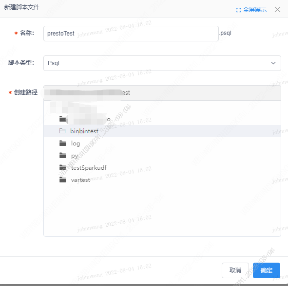
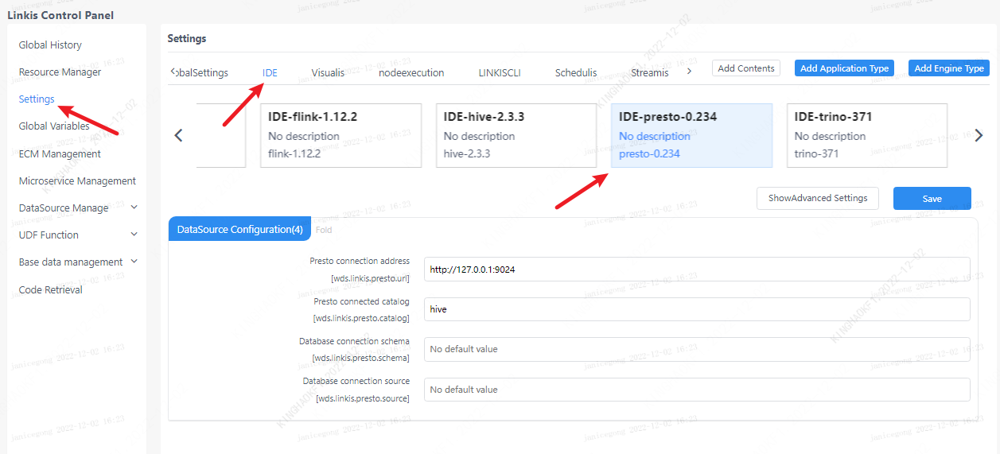
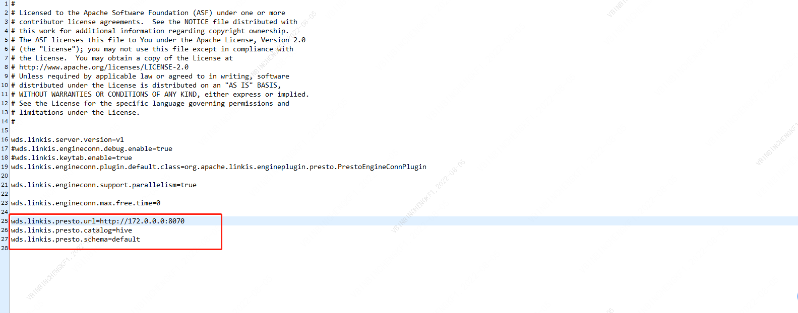

This article mainly introduces the installation, use and configuration of the Presto engine plugin in Linkis.


## 1. Preliminary work

### 1.1 Engine Installation

If you want to use the Presto engine on your Linkis service, you need to install the Presto service and make sure the service is available.

### 1.2 Service Verification

```shell
# prepare presto-cli
wget https://repo1.maven.org/maven2/com/facebook/presto/presto-cli/0.234/presto-cli-0.234-executable.jar
mv presto-cli-0.234-executable.jar presto-cli
chmod + x presto-cli

# execute task
./presto-cli --server localhost:8082 --execute 'show tables from system.jdbc'

# Get the following output to represent the service is available
"attributes"
"catalogs"
"columns"
"procedure_columns"
"procedures"
"pseudo_columns"
"schemas"
"super_tables"
"super_types"
"table_types"
"tables"
"types"
"udts"
```

## 2. Engine plugin deployment

### 2.1 Engine plug-in preparation (choose one of two)

Method 1: Download the engine plug-in package directly

[Linkis Engine Plugin Download](https://linkis.apache.org/zh-CN/blog/2022/04/15/how-to-download-engineconn-plugin)

Method 2: Compile the engine plug-in separately (maven environment is required)

```
# compile
cd ${linkis_code_dir}/linkis-engineconn-plugins/presto/
mvn clean install
# The compiled engine plug-in package is located in the following directory
${linkis_code_dir}/linkis-engineconn-plugins/presto/target/out/
```

### 2.2 Uploading and loading of engine plugins

Upload the engine package in 2.1 to the engine directory of the server
```bash 
${LINKIS_HOME}/lib/linkis-engineplugins
```
The directory structure after uploading is as follows
```
linkis-engineconn-plugins/
├── soon
│   ├── dist
│ │ └── v0.234
│   │       ├── conf
│ │ └── lib
│   └── plugin
│ └── 0.234
```

### 2.3 Engine refresh

#### 2.3.1 Restart and refresh
Refresh the engine by restarting the linkis-cg-linkismanager service
```bash
cd ${LINKIS_HOME}/sbin
sh linkis-daemon.sh restart cg-linkismanager
```

### 2.3.2 Check if the engine is refreshed successfully
You can check whether the last_update_time of the linkis_engine_conn_plugin_bml_resources table in the database is the time when the refresh is triggered.

```sql
#Login to the linkis database
select * from linkis_cg_engine_conn_plugin_bml_resources;
```

## 3 The use of the engine

### 3.1 Submit tasks through Linkis-cli

To submit a task through linkis-cli, you need to specify the corresponding EngineConn and CodeType tag types. The use of presto is as follows:

**Note:** The `engineType presto-0.234` engine version setting is prefixed. For example, if the `presto` version is `0.234`, set it to `presto-0.234`

```shell
 sh ./bin/linkis-cli -engineType presto-0.234 -codeType psql -code 'show tables;' -submitUser hadoop -proxyUser hadoop
```

If the management console, task interface, and configuration file are not configured (see 4.2 for configuration methods), they can be configured in the cli client through the `-runtimeMap` property

```shell
sh ./bin/linkis-cli -engineType presto-0.234 -codeType  tsql -code 'show tables;'  -runtimeMap wds.linkis.presto.url=http://127.0.0.1:8080 -runtimeMap wds.linkis.presto.catalog=hive -runtimeMap  wds.linkis.presto.schema=default  -runtimeMap wds.linkis.presto.catalog=hive -submitUser hadoop -proxyUser hadoop
```

More Linkis-Cli command parameter reference: [Linkis-Cli usage](../user-guide/linkiscli-manual.md)

### 3.2 Submitting tasks through Scriptis

[Scriptis](https://github.com/WeBankFinTech/Scriptis) is the easiest to use. You can directly enter the Scriptis workspace module and right-click to create a new script of type `psql`



## 4. Engine configuration instructions

### 4.1 Default configuration description

| Configuration | Default | Description | Required |
| -------------------------------------- | ---------- ----------- | -------------------------------------- ----- | -------- |
| wds.linkis.presto.url | http://127.0.0.1:8080 | Presto Cluster Connection | true |
| wds.linkis.presto.username | default | Presto cluster username | false |
| wds.linkis.presto.password | none | Presto cluster password | false |
| wds.linkis.presto.catalog | system | Catalog for queries | true |
| wds.linkis.presto.schema | None | Query Schema | true |
| wds.linkis.presto.source | global | source used by the query | false |
| presto.session.query_max_total_memory | 8GB | query uses maximum memory | false |
| wds.linkis.presto.http.connectTimeout | 60 | Presto client connect timeout (unit: seconds) | false |
| wds.linkis.presto.http.readTimeout | 60 | Presto client read timeout (unit: seconds) | false |
| wds.linkis.engineconn.concurrent.limit | 100 | The maximum number of concurrent Presto engines | false |

### 4.2 Configuration modification

If the default parameters are not satisfied, there are the following ways to configure some basic parameters

#### 4.2.1 Management console configuration



Note: After modifying the configuration under the IDE tag, you need to specify -creator IDE to take effect (other tags are similar), such as:

```shell
sh ./bin/linkis-cli -creator IDE -engineType presto-0.234 -codeType  tsql -code 'show tables;' -submitUser hadoop -proxyUser hadoop
```

#### 4.2.2 Task interface configuration
Submit the task interface and configure it through the parameter params.configuration.runtime

```shell
Example of http request parameters
{
    "executionContent": {"code": "show teblas;", "runType":  "psql"},
    "params": {
                    "variable": {},
                    "configuration": {
                            "runtime": {
                                "wds.linkis.presto.url":"http://127.0.0.1:9090",
                                "wds.linkis.presto.catalog ":"hive",
                                "wds.linkis.presto.schema ":"default",
                                "wds.linkis.presto.source ":""
                                }
                            }
                    },
    "source":  {"scriptPath": "file:///mnt/bdp/hadoop/1.sql"},
    "labels": {
        "engineType": "presto-0.234",
        "userCreator": "hadoop-IDE"
    }
}
```

#### 4.2.3 File Configuration
Configure by modifying the linkis-engineconn.properties file in the directory install path/lib/linkis-engineconn-plugins/presto/dist/v0.234/conf/, as shown below:



### 4.3 Engine related data sheet

Linkis is managed through engine tags, and the data table information involved is shown below.

```
linkis_ps_configuration_config_key: key and default values ​​of configuration parameters inserted into the engine
linkis_cg_manager_label: Insert engine label such as: presto-0.234
linkis_ps_configuration_category: The directory association relationship of the insertion engine
linkis_ps_configuration_config_value: The configuration that the insertion engine needs to display
linkis_ps_configuration_key_engine_relation: The relationship between the configuration item and the engine
```

The initial data related to the engine in the table is as follows


```sql
-- set variable
SET @PRESTO_LABEL="presto-0.234";
SET @PRESTO_ALL=CONCAT('*-*,',@PRESTO_LABEL);
SET @PRESTO_IDE=CONCAT('*-IDE,',@PRESTO_LABEL);
SET @PRESTO_NAME="presto";

-- engine label
insert into `linkis_cg_manager_label` (`label_key`, `label_value`, `label_feature`, `label_value_size`, `update_time`, `create_time`) VALUES ('combined_userCreator_engineType',@PRESTO_ALL, 'OPTIONAL', 2, now(), now());
insert into `linkis_cg_manager_label` (`label_key`, `label_value`, `label_feature`, `label_value_size`, `update_time`, `create_time`) VALUES ('combined_userCreator_engineType',@PRESTO_IDE, 'OPTIONAL', 2, now(), now());

select @label_id := id from `linkis_cg_manager_label` where `label_value` = @PRESTO_IDE;
insert into `linkis_ps_configuration_category` (`label_id`, `level`) VALUES (@label_id, 2);

-- configuration key
INSERT INTO `linkis_ps_configuration_config_key` (`key`, `description`, `name`, `default_value`, `validate_type`, `validate_range`, `engine_conn_type`, `is_hidden`, `is_advanced`, `level`, `treeName`) VALUES ('wds.linkis.presto.url', 'Presto cluster connection', 'presto connection address', 'http://127.0.0.1:8080', 'None', NULL, @PRESTO_NAME, 0, 0, 1 , 'Data source configuration');
INSERT INTO `linkis_ps_configuration_config_key` (`key`, `description`, `name`, `default_value`, `validate_type`, `validate_range`, `engine_conn_type`, `is_hidden`, `is_advanced`, `level`, `treeName`) VALUES ('wds.linkis.presto.catalog', 'Query's Catalog', 'presto-connected catalog', 'hive', 'None', NULL, @PRESTO_NAME, 0, 0, 1, 'Datasource configuration') ;
INSERT INTO `linkis_ps_configuration_config_key` (`key`, `description`, `name`, `default_value`, `validate_type`, `validate_range`, `engine_conn_type`, `is_hidden`, `is_advanced`, `level`, `treeName`) VALUES ('wds.linkis.presto.schema', 'Query schema', 'Database connection schema', '', 'None', NULL, @PRESTO_NAME, 0, 0, 1, 'Datasource configuration');
INSERT INTO `linkis_ps_configuration_config_key` (`key`, `description`, `name`, `default_value`, `validate_type`, `validate_range`, `engine_conn_type`, `is_hidden`, `is_advanced`, `level`, `treeName`) VALUES ('wds.linkis.presto.source', 'source used for query', 'database connection source', '', 'None', NULL, @PRESTO_NAME, 0, 0, 1, 'data source configuration');

-- key engine relation
insert into `linkis_ps_configuration_key_engine_relation` (`config_key_id`, `engine_type_label_id`)
(select config.id as `config_key_id`, label.id AS `engine_type_label_id` FROM linkis_ps_configuration_config_key config
INNER JOIN linkis_cg_manager_label label ON config.engine_conn_type = @PRESTO_NAME and label_value = @PRESTO_ALL);

-- engine default configuration
insert into `linkis_ps_configuration_config_value` (`config_key_id`, `config_value`, `config_label_id`)
(select `relation`.`config_key_id` AS `config_key_id`, '' AS `config_value`, `relation`.`engine_type_label_id` AS `config_label_id` FROM linkis_ps_configuration_key_engine_relation relation
INNER JOIN linkis_cg_manager_label label ON relation.engine_type_label_id = label.id AND label.label_value = @PRESTO_ALL);
```