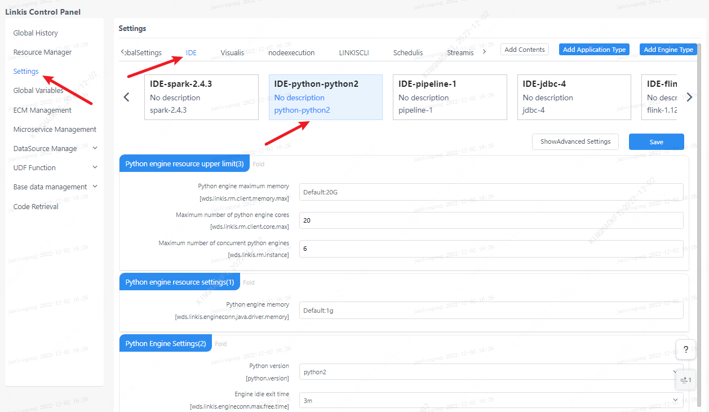

This article mainly introduces the installation, use and configuration of the `Python` engine plugin in `Linkis`.

## 1. Preliminary work
### 1.1 Environment Installation

If you want to use the `python` engine on your server, you need to ensure that the user's `PATH` has the `python` execution directory and execution permissions.

### 1.2 Environment verification
```
python --version
```
Normal output of `Python` version information means `Python` environment is available
```
Python 3.6.0
```

## 2. Engine plugin installation [default engine](./overview.md)

The binary installation package released by `linkis` includes the `Python` engine plug-in by default, and users do not need to install it additionally.

[EngineConnPlugin Engine Plugin Installation](../deployment/install-engineconn.md)

## 3. Engine usage

### 3.1 Submitting tasks via `Linkis-cli`

```shell
sh ./bin/linkis-cli -engineType python-python2 \
-codeType python -code "print(\"hello\")"  \
-submitUser hadoop -proxyUser hadoop
```
More `Linkis-Cli` command parameter reference: [Linkis-Cli usage](../user-guide/linkiscli-manual.md)

### 3.2 Submit tasks through `Linkis SDK`

`Linkis` provides `SDK` of `Java` and `Scala` to submit tasks to `Linkis` server. For details, please refer to [JAVA SDK Manual](../user-guide/sdk-manual.md). For` For Python` tasks, you only need to modify `EngineConnType` and `CodeType` parameters.

```java
Map<String, Object> labels = new HashMap<String, Object>();
labels.put(LabelKeyConstant.ENGINE_TYPE_KEY, "python-python2"); // required engineType Label
labels.put(LabelKeyConstant.USER_CREATOR_TYPE_KEY, "hadoop-IDE");// required execute user and creator
labels.put(LabelKeyConstant.CODE_TYPE_KEY, "python"); // required codeType 
```

## 4. Engine configuration instructions

### 4.1 Configuration modification
The `Python` engine plug-in supports `python2` and `python3`, you can simply change the configuration to complete the switch of `Python` version without recompiling the `python` engine version. The `Python` engine supports a variety of configuration modification methods, the specific operations are as follows.

#### 4.1.1 Display designation through command parameters (only the current command takes effect)

```shell
#1: Submit tasks via cli to switch versions, and set the version python.version=python3 at the end of the command (python3: the name of the file generated when creating a soft link, which can be customized)
sh ./bin/linkis-cli -engineType python-python2 \
-codeType python -code "print(\"hello\")"  \
-submitUser hadoop -proxyUser hadoop  \
-confMap  python.version=python3

#2: The cli method is used to submit tasks for version switching, and the command is set to add the version path python.version=/usr/bin/python (/usr/bin/python: the path to the file generated when creating a soft link)
sh ./bin/linkis-cli -engineType python-python2 \
-codeType python -code "print(\"hello\")"  \
-submitUser hadoop -proxyUser hadoop  \
-confMap  python.version=/usr/bin/python

```

#### 4.1.2 Management console configuration



Note: After modifying the configuration under the IDE tag, you need to specify `-creator IDE` to take effect (other tags are similar), such as:

```shell
sh ./bin/linkis-cli -creator IDE -engineType \
python-python2 -codeType python -code "print(\"hello\")"  \
-submitUser hadoop -proxyUser hadoop  \
-confMap  python.version=python3
```

#### 4.2.2 Task interface configuration
Submit the task interface, configure it through the parameter `params.configuration.runtime`

```shell
Example of http request parameters
{
    "executionContent": {"code": "print(\"hello\")", "runType":  "python"},
    "params": {
                "variable": {},
                "configuration": {
                        "runtime": {
                                "python.version":"python2",
                                "wds.linkis.engineconn.max.free.time":"1h"
                        }
                }
        },
    "labels": {
        "engineType": "python-python2",
        "userCreator": "IDE"
    }
}
```

#### 4.2.3 File Configuration
Configure by modifying the `linkis-engineconn.properties` file in the directory `${LINKIS_HOME}/lib/linkis-engineconn-plugins/python/dist/vpython2/conf/`, as shown below:


### 4.3 Engine related data sheet

`Linkis` is managed through engine tags, and the data table information involved is as follows.

```
linkis_ps_configuration_config_key: Insert the key and default values ​​​​of the configuration parameters of the engine
linkis_cg_manager_label: Insert engine label such as: python-python2
linkis_ps_configuration_category: Insert the directory association of the engine
linkis_ps_configuration_config_value: The configuration that the insertion engine needs to display
linkis_ps_configuration_key_engine_relation: The relationship between the configuration item and the engine
```

The initial data related to the engine in the table is as follows

```sql
-- set variable
SET @PYTHON_LABEL="python-python2";
SET @PYTHON_ALL=CONCAT('*-*,',@PYTHON_LABEL);
SET @PYTHON_IDE=CONCAT('*-IDE,',@PYTHON_LABEL);

-- engine label
insert into `linkis_cg_manager_label` (`label_key`, `label_value`, `label_feature`, `label_value_size`, `update_time`, `create_time`) VALUES ('combined_userCreator_engineType', @PYTHON_ALL, 'OPTIONAL', 2, now(), now());
insert into `linkis_cg_manager_label` (`label_key`, `label_value`, `label_feature`, `label_value_size`, `update_time`, `create_time`) VALUES ('combined_userCreator_engineType', @PYTHON_IDE, 'OPTIONAL', 2, now(), now());

select @label_id := id from linkis_cg_manager_label where `label_value` = @PYTHON_IDE;
insert into linkis_ps_configuration_category (`label_id`, `level`) VALUES (@label_id, 2);

-- configuration key
INSERT INTO `linkis_ps_configuration_config_key` (`key`, `description`, `name`, `default_value`, `validate_type`, `validate_range`, `is_hidden`, `is_advanced`, `level`, `treeName`, `engine_conn_type`) VALUES ('wds.linkis.rm.client.memory.max', 'Value range: 1-100, unit: G', 'Python driver memory upper limit', '20G', 'Regex', '^([ 1-9]\\d{0,1}|100)(G|g)$', '0', '0', '1', 'queue resource', 'python');
INSERT INTO `linkis_ps_configuration_config_key` (`key`, `description`, `name`, `default_value`, `validate_type`, `validate_range`, `is_hidden`, `is_advanced`, `level`, `treeName`, `engine_conn_type`) VALUES ('wds.linkis.rm.client.core.max', 'Value range: 1-128, unit: a', 'Python drive core number upper limit', '10', 'Regex', '^( ?:[1-9]\\d?|[1234]\\d{2}|128)$', '0', '0', '1', 'queue resource', 'python');
INSERT INTO `linkis_ps_configuration_config_key` (`key`, `description`, `name`, `default_value`, `validate_type`, `validate_range`, `is_hidden`, `is_advanced`, `level`, `treeName`, `engine_conn_type`) VALUES ('wds.linkis.rm.instance', 'Range: 1-20, unit: a', 'Python engine maximum concurrent number', '10', 'NumInterval', '[1,20]', '0 ', '0', '1', 'queue resource', 'python');
INSERT INTO `linkis_ps_configuration_config_key` (`key`, `description`, `name`, `default_value`, `validate_type`, `validate_range`, `is_hidden`, `is_advanced`, `level`, `treeName`, `engine_conn_type`) VALUES ('wds.linkis.engineconn.java.driver.memory', 'value range: 1-2, unit: G', 'python engine initialization memory size', '1g', 'Regex', '^([ 1-2])(G|g)$', '0', '0', '1', 'python engine settings', 'python');
INSERT INTO `linkis_ps_configuration_config_key` (`key`, `description`, `name`, `default_value`, `validate_type`, `validate_range`, `is_hidden`, `is_advanced`, `level`, `treeName`, `engine_conn_type`) VALUES ('python.version', 'Value range: python2,python3', 'python version','python2', 'OFT', '[\"python3\",\"python2\"]', '0' , '0', '1', 'python engine settings', 'python');
INSERT INTO `linkis_ps_configuration_config_key` (`key`, `description`, `name`, `default_value`, `validate_type`, `validate_range`, `is_hidden`, `is_advanced`, `level`, `treeName`, `engine_conn_type`) VALUES ('wds.linkis.engineconn.max.free.time', 'Value range: 3m,15m,30m,1h,2h', 'Engine idle exit time','1h', 'OFT', '[\ "1h\",\"2h\",\"30m\",\"15m\",\"3m\"]', '0', '0', '1', 'python engine settings', ' python');

-- key engine relation
insert into `linkis_ps_configuration_key_engine_relation` (`config_key_id`, `engine_type_label_id`)
(select config.id as `config_key_id`, label.id AS `engine_type_label_id` FROM linkis_ps_configuration_config_key config
INNER JOIN linkis_cg_manager_label label ON config.engine_conn_type = 'python' and label_value = @PYTHON_ALL);

-- engine default configuration
insert into `linkis_ps_configuration_config_value` (`config_key_id`, `config_value`, `config_label_id`)
(select `relation`.`config_key_id` AS `config_key_id`, '' AS `config_value`, `relation`.`engine_type_label_id` AS `config_label_id` FROM linkis_ps_configuration_key_engine_relation relation
INNER JOIN linkis_cg_manager_label label ON relation.engine_type_label_id = label.id AND label.label_value = @PYTHON_ALL);
```