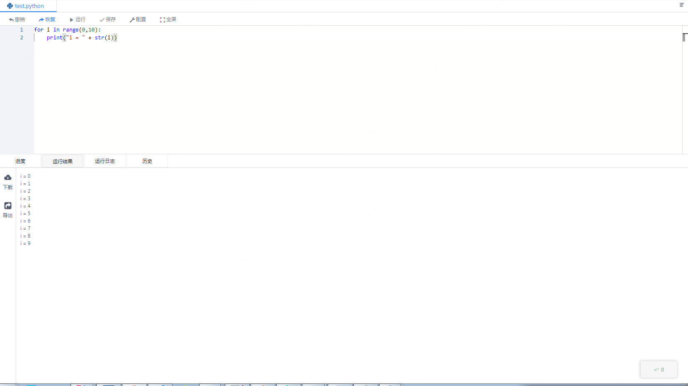
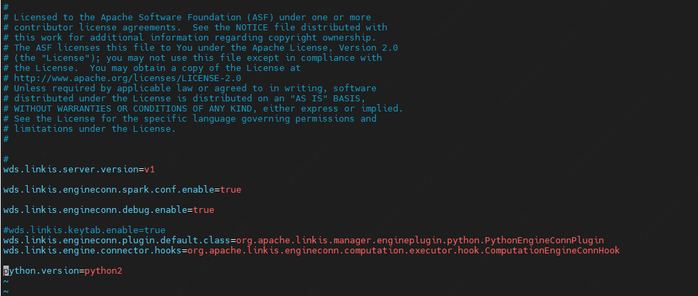

This article mainly introduces the installation, use and configuration of the Python engine plugin in Linkis.

## 1. Pre-work
### 1.1 Environment Installation

If you want to use the python engine on your server, you need to ensure that the user's PATH has the python execution directory and execute permission.

### 1.2 Environment verification
```
python --version
```
Normal output of Python version information means that the Python environment is available
```
Python 3.6.0
```

## 2. Engine plugin installation

The binary installation package released by linkis includes the Python engine plug-in by default, and users do not need to install it additionally.

## 3. The use of the engine

### 3.1 Submit tasks through Linkis-cli

```shell
sh ./bin/linkis-cli -engineType python-python2 -codeType python -code "print(\"hello\")"  -submitUser hadoop -proxyUser hadoop
```
More Linkis-Cli command parameter reference: [Linkis-Cli usage](../user-guide/linkiscli-manual.md)

### 3.2 Submit tasks through Linkis SDK

Linkis provides Java and Scala SDKs to submit tasks to the Linkis server. For details, please refer to [JAVA SDK Manual](../user-guide/sdk-manual.md). For Python tasks you only need to modify the EngineConnType and CodeType parameters.

```java
Map<String, Object> labels = new HashMap<String, Object>();
labels.put(LabelKeyConstant.ENGINE_TYPE_KEY, "python-python2"); // required engineType Label
labels.put(LabelKeyConstant.USER_CREATOR_TYPE_KEY, "hadoop-IDE");// required execute user and creator
labels.put(LabelKeyConstant.CODE_TYPE_KEY, "python"); // required codeType 
```
### 3.3 Submitting tasks through Scriptis

The use of Scriptis is the easiest. You can directly enter Scriptis, right-click the directory, create a new python script, write python code, and click to execute.

The execution logic of python is to start a python gateway through Py4j, and then the Python engine submits the code to the python executor for execution.



## 4. Engine configuration instructions

### 4.1 Configuration modification
The Python engine plugin supports python2 and python3. You can simply change the configuration to switch the Python version without recompiling the python engine version. The Python engine supports a variety of configuration modification methods. The specific operations are as follows.

#### 4.1.1 Display designation through command parameters (only the current command takes effect)

```
#1: Submit the task by cli for version switching, and set the version at the end of the command python.version=python3 (python3: The name of the file generated when creating a soft connection, you can customize the name)
sh ./bin/linkis-cli -engineType python-python2 -codeType python -code "print(\"hello\")"  -submitUser hadoop -proxyUser hadoop  -confMap  python.version=python3

#2: Submit the task in the cli method for version switching, and the command setting is added to the version path python.version=/usr/bin/python (/usr/bin/python: the path to the generated file when creating a soft link)
sh ./bin/linkis-cli -engineType python-python2 -codeType python -code "print(\"hello\")"  -submitUser hadoop -proxyUser hadoop  -confMap  python.version=/usr/bin/python

```

#### 4.1.2 Management console configuration


Note: After modifying the configuration under the IDE tag, you need to specify -creator IDE to take effect (other tags are similar), such as:

```shell
sh ./bin/linkis-cli -creator IDE -engineType python-python2 -codeType python -code "print(\"hello\")"  -submitUser hadoop -proxyUser hadoop  -confMap  python.version=python3
```

#### 4.2.2 Task interface configuration
Submit the task interface and configure it through the parameter params.configuration.runtime

```shell
Example of http request parameters
{
    "executionContent": {"code": "print(\"hello\")", "runType":  "python"},
    "params": {
                "variable": {},
                "configuration": {
                        "runtime": {
                                "python.version":"python2",
                                "wds.linkis.engineconn.max.free.time":"1h"
                        }
                }
        },
    "labels": {
        "engineType": "python-python2",
        "userCreator": "IDE"
    }
}
```

#### 4.2.3 File configuration
Configure by modifying the linkis-engineconn.properties file in the directory ${LINKIS_HOME}/lib/linkis-engineconn-plugins/python/dist/vpython2/conf/, as shown below:



### 4.3 Engine related data sheet

Linkis is managed through engine tags, and the data table information involved is shown below.

```
linkis_ps_configuration_config_key: key and default values ​​of configuration parameters inserted into the engine
linkis_cg_manager_label: Insert engine label such as: python-python2
linkis_ps_configuration_category: The directory association relationship of the insertion engine
linkis_ps_configuration_config_value: The configuration that the insertion engine needs to display
linkis_ps_configuration_key_engine_relation: The relationship between the configuration item and the engine
```

The initial data related to the engine in the table is as follows

```sql
-- set variable
SET @PYTHON_LABEL="python-python2";
SET @PYTHON_ALL=CONCAT('*-*,',@PYTHON_LABEL);
SET @PYTHON_IDE=CONCAT('*-IDE,',@PYTHON_LABEL);

-- engine label
insert into `linkis_cg_manager_label` (`label_key`, `label_value`, `label_feature`, `label_value_size`, `update_time`, `create_time`) VALUES ('combined_userCreator_engineType', @PYTHON_ALL, 'OPTIONAL', 2, now(), now());
insert into `linkis_cg_manager_label` (`label_key`, `label_value`, `label_feature`, `label_value_size`, `update_time`, `create_time`) VALUES ('combined_userCreator_engineType', @PYTHON_IDE, 'OPTIONAL', 2, now(), now());

select @label_id := id from linkis_cg_manager_label where `label_value` = @PYTHON_IDE;
insert into linkis_ps_configuration_category (`label_id`, `level`) VALUES (@label_id, 2);

-- configuration key
INSERT INTO `linkis_ps_configuration_config_key` (`key`, `description`, `name`, `default_value`, `validate_type`, `validate_range`, `is_hidden`, `is_advanced`, `level`, `treeName`, `engine_conn_type`) VALUES ('wds.linkis.rm.client.memory.max', 'value range: 1-100, unit: G', 'python drive memory usage upper limit', '20G', 'Regex', '^([ 1-9]\\d{0,1}|100)(G|g)$', '0', '0', '1', 'Queue resource', 'python');
INSERT INTO `linkis_ps_configuration_config_key` (`key`, `description`, `name`, `default_value`, `validate_type`, `validate_range`, `is_hidden`, `is_advanced`, `level`, `treeName`, `engine_conn_type`) VALUES ('wds.linkis.rm.client.core.max', 'value range: 1-128, unit: pc', 'python drive core maximum', '10', 'Regex', '^( ?:[1-9]\\d?|[1234]\\d{2}|128)$', '0', '0', '1', 'Queue resource', 'python');
INSERT INTO `linkis_ps_configuration_config_key` (`key`, `description`, `name`, `default_value`, `validate_type`, `validate_range`, `is_hidden`, `is_advanced`, `level`, `treeName`, `engine_conn_type`) VALUES ('wds.linkis.rm.instance', 'Range: 1-20, Unit: Pieces', 'The maximum number of concurrent python engines', '10', 'NumInterval', '[1,20]', '0 ', '0', '1', 'Queue resource', 'python');
INSERT INTO `linkis_ps_configuration_config_key` (`key`, `description`, `name`, `default_value`, `validate_type`, `validate_range`, `is_hidden`, `is_advanced`, `level`, `treeName`, `engine_conn_type`) VALUES ('wds.linkis.engineconn.java.driver.memory', 'value range: 1-2, unit: G', 'python engine initialization memory size', '1g', 'Regex', '^([ 1-2])(G|g)$', '0', '0', '1', 'python engine settings', 'python');
INSERT INTO `linkis_ps_configuration_config_key` (`key`, `description`, `name`, `default_value`, `validate_type`, `validate_range`, `is_hidden`, `is_advanced`, `level`, `treeName`, `engine_conn_type`) VALUES ('python.version', 'value range: python2,python3', 'python version','python2', 'OFT', '[\"python3\",\"python2\"]', '0' , '0', '1', 'python engine settings', 'python');
INSERT INTO `linkis_ps_configuration_config_key` (`key`, `description`, `name`, `default_value`, `validate_type`, `validate_range`, `is_hidden`, `is_advanced`, `level`, `treeName`, `engine_conn_type`) VALUES ('wds.linkis.engineconn.max.free.time', 'Value range: 3m,15m,30m,1h,2h', 'Engine idle exit time','1h', 'OFT', '[\ "1h\",\"2h\",\"30m\",\"15m\",\"3m\"]', '0', '0', '1', 'python engine settings', ' python');

-- key engine relation
insert into `linkis_ps_configuration_key_engine_relation` (`config_key_id`, `engine_type_label_id`)
(select config.id as `config_key_id`, label.id AS `engine_type_label_id` FROM linkis_ps_configuration_config_key config
INNER JOIN linkis_cg_manager_label label ON config.engine_conn_type = 'python' and label_value = @PYTHON_ALL);

-- engine default configuration
insert into `linkis_ps_configuration_config_value` (`config_key_id`, `config_value`, `config_label_id`)
(select `relation`.`config_key_id` AS `config_key_id`, '' AS `config_value`, `relation`.`engine_type_label_id` AS `config_label_id` FROM linkis_ps_configuration_key_engine_relation relation
INNER JOIN linkis_cg_manager_label label ON relation.engine_type_label_id = label.id AND label.label_value = @PYTHON_ALL);
```