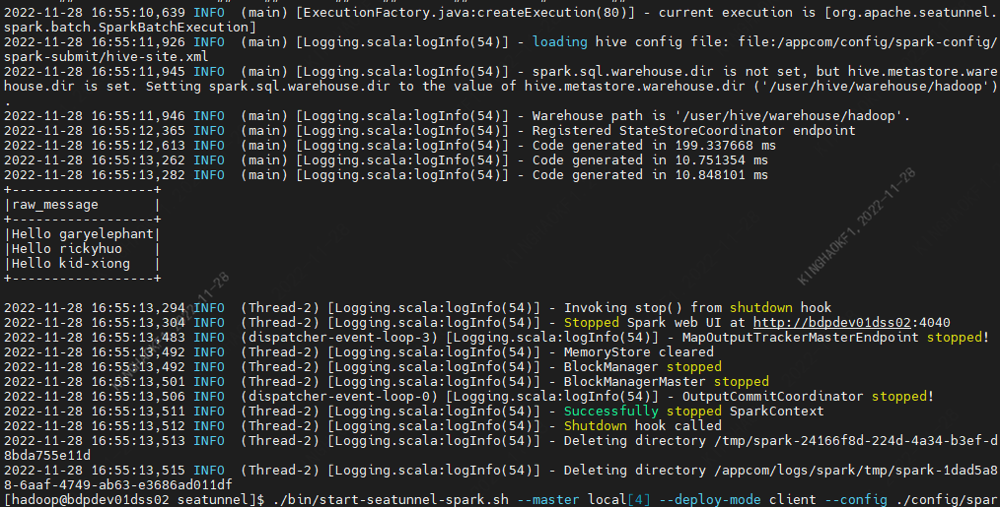

This article mainly introduces the installation, usage and configuration of the `Seatunnel` engine plugin in `Linkis`.

## 1. Pre-work

### 1.1 Engine installation

If you want to use `Seatunnel` engine on your `Linkis` service, you need to install `Seatunnel` engine. Moreover, `Seatunnel` depends on the `Spark` or `Flink` environment. Before using the `linkis-seatunnel` engine, it is strongly recommended to run through the `Seatunnel` environment locally.

`Seatunnel 2.1.2` download address: https://dlcdn.apache.org/incubator/seatunnel/2.1.2/apache-seatunnel-incubating-2.1.2-bin.tar.gz

| Environment variable name | Environment variable content | Required or not |
|-----------------|----------------|-------------- -----------------------------|
| JAVA_HOME | JDK installation path | Required |
| SEATUNNEL_HOME | Seatunnel installation path | required |
|SPARK_HOME| Spark installation path| Seatunnel needs to run based on Spark |
|FLINK_HOME| Flink installation path| Seatunnel execution is based on Flink |

Table 1-1 Environment configuration list

| Linkis variable name| variable content| required |
| --------------------------- | --------------------- -------------------------------------- | ------------ --------------------------------------------------- |
| wds.linkis.engine.seatunnel.plugin.home | Seatunnel installation path | Yes |

### 1.2 Engine Environment Verification

Take the execution of `Spark` tasks as an example

```shell
cd $SEATUNNEL_HOME
./bin/start-seatunnel-spark.sh --master local[4] --deploy-mode client --config ./config/spark.batch.conf.template
```
The output is as follows:



## 2. Engine plugin deployment

### 2.1 Engine plugin preparation (choose one) [non-default engine](./overview.md)

Method 1: Download the engine plug-in package directly

[Linkis Engine Plugin Download](https://linkis.apache.org/zh-CN/blog/2022/04/15/how-to-download-engineconn-plugin)

Method 2: Compile the engine plug-in separately (requires `maven` environment)

```
# compile
cd ${linkis_code_dir}/linkis-engineconn-plugins/seatunnel/
mvn clean install
# The compiled engine plug-in package is located in the following directory
${linkis_code_dir}/linkis-engineconn-plugins/seatunnel/target/out/
```
[EngineConnPlugin Engine Plugin Installation](../deployment/install-engineconn.md)

### 2.2 Upload and load engine plugins

Upload the engine package in 2.1 to the engine directory of the server
```bash
${LINKIS_HOME}/lib/linkis-engineplugins
```
The directory structure after uploading is as follows
```
linkis-engineconn-plugins/
├── seat tunnel
│ ├── dist
│ │ └── v2.1.2
│ │ ├── conf
│ │ └── lib
│ └── plugin
│ └── 2.1.2
```

### 2.3 Engine refresh

#### 2.3.1 Restart and refresh
Refresh the engine by restarting the `linkis-cg-linkismanager` service
```bash
cd ${LINKIS_HOME}/sbin
sh linkis-daemon.sh restart cg-linkismanager
```

### 2.3.2 Check whether the engine is refreshed successfully
You can check whether the `last_update_time` of the `linkis_engine_conn_plugin_bml_resources` table in the database is the time to trigger the refresh.

```sql
#login to `linkis` database
select * from linkis_cg_engine_conn_plugin_bml_resources;
```

## 3. Engine usage

### 3.1 Submit tasks through `Linkis-cli`


```shell
sh ./bin/linkis-cli --mode once -code 'test' -engineType seatunnel-2.1.2 -codeType sspark -labelMap userCreator=hadoop-seatunnel -labelMap engineConnMode=once -jobContentMap code='env {
   spark.app.name = "SeaTunnel"
   spark.executor.instances = 2
   spark.executor.cores = 1
   spark.executor.memory = "1g"
   }
   source {
     Fake {
       result_table_name = "my_dataset"
     }
   }
   transform {}
   sink {Console {}}' -jobContentMap master=local[4] -jobContentMap deploy-mode=client -sourceMap jobName=OnceJobTest -submitUser hadoop -proxyUser hadoop
```

### 3.2 Submit tasks through OnceEngineConn

OnceEngineConn calls LinkisManager's createEngineConn interface through LinkisManagerClient, and sends the code to the created Seatunnel engine, and then Seatunnel engine starts to execute. The use of Client is also very simple, first create a new maven project, or introduce the following dependencies in the project

```xml
<dependency>
    <groupId>org.apache.linkis</groupId>
    <artifactId>linkis-computation-client</artifactId>
    <version>${linkis.version}</version>
</dependency>
```

**Example Code**
```java
package org.apache.linkis.computation.client;
import org.apache.linkis.common.conf.Configuration;
import org.apache.linkis.computation.client.once.simple.SubmittableSimpleOnceJob;
import org.apache.linkis.computation.client.utils.LabelKeyUtils;
public class SeatunnelOnceJobTest {
    public static void main(String[] args) {
        LinkisJobClient.config().setDefaultServerUrl("http://ip:9001");
        String code =
                "\n"
                        + "env {\n"
                        + " spark.app.name = \"SeaTunnel\"\n"
                        + "spark.executor.instances = 2\n"
                        + "spark.executor.cores = 1\n"
                        + " spark.executor.memory = \"1g\"\n"
                        + "}\n"
                        + "\n"
                        + "source {\n"
                        + "Fake {\n"
                        + " result_table_name = \"my_dataset\"\n"
                        + " }\n"
                        + "\n"
                        + "}\n"
                        + "\n"
                        + "transform {\n"
                        + "}\n"
                        + "\n"
                        + "sink {\n"
                        + " Console {}\n"
                        + "}";
        SubmittableSimpleOnceJob onceJob =
                LinkisJobClient.once()
                        .simple()
                        .builder()
                        .setCreateService("seatunnel-Test")
                        .setMaxSubmitTime(300000)
                        .addLabel(LabelKeyUtils.ENGINE_TYPE_LABEL_KEY(), "seatunnel-2.1.2")
                        .addLabel(LabelKeyUtils.USER_CREATOR_LABEL_KEY(), "hadoop-seatunnel")
                        .addLabel(LabelKeyUtils.ENGINE_CONN_MODE_LABEL_KEY(), "once")
                        .addStartupParam(Configuration.IS_TEST_MODE().key(), true)
                        .addExecuteUser("hadoop")
                        .addJobContent("runType", "sspark")
                        .addJobContent("code", code)
                        .addJobContent("master", "local[4]")
                        .addJobContent("deploy-mode", "client")
                        .addSource("jobName", "OnceJobTest")
                        .build();
        onceJob. submit();
        System.out.println(onceJob.getId());
        onceJob. waitForCompleted();
        System.out.println(onceJob.getStatus());
        LinkisJobMetrics jobMetrics = onceJob. getJobMetrics();
        System.out.println(jobMetrics.getMetrics());
    }
}
```
## 4. Engine configuration instructions

### 4.1 Default Configuration Description

| Configuration | Default | Description | Required |
| ----------------------------------------- | ---------- ----------- | -------------------------------------- ----- | -------- |
| wds.linkis.engine.seatunnel.plugin.home | /opt/linkis/seatunnel | Seatunnel installation path | true |
### 4.2 Configuration modification

If the default parameters are not satisfied, there are the following ways to configure some basic parameters

#### 4.2.1 Client Configuration Parameters

```shell
sh ./bin/linkis-cli --mode once-code 'test' \
-engineType seatunnel-2.1.2 -codeType sspark\
-labelMap userCreator=hadoop-seatunnel -labelMap engineConnMode=once \
-jobContentMap code='env {
   spark.app.name = "SeaTunnel"
   spark.executor.instances = 2
   spark.executor.cores = 1
   spark.executor.memory = "1g"
   }
   source {
     Fake {
       result_table_name = "my_dataset"
     }
   }
   transform {}
   sink {Console {}}' -jobContentMap master=local[4] \
   -jobContentMap deploy-mode=client \
   -sourceMap jobName=OnceJobTest\
   -runtimeMap wds.linkis.engine.seatunnel.plugin.home=/opt/linkis/seatunnel \
   -submitUser hadoop -proxyUser hadoop
```

#### 4.2.2 Task interface configuration
Submit the task interface and configure it through the parameter `params.configuration.runtime`

```shell
Example of http request parameters
{
    "executionContent": {"code": 'env {
    spark.app.name = "SeaTunnel"
    spark.executor.instances = 2
    spark.executor.cores = 1
    spark.executor.memory = "1g"
    }
    source {
        Fake {
            result_table_name = "my_dataset"
        }
    }
    transform {}
    sink {Console {}}',
    "runType": "sql"},
    "params": {
        "variable": {},
        "configuration": {
                "runtime": {
                    "wds.linkis.engine.seatunnel.plugin.home":"/opt/linkis/seatunnel"
                    }
                }
        },
    "labels": {
        "engineType": "seatunnel-2.1.2",
        "userCreator": "hadoop-IDE"
    }
}
```