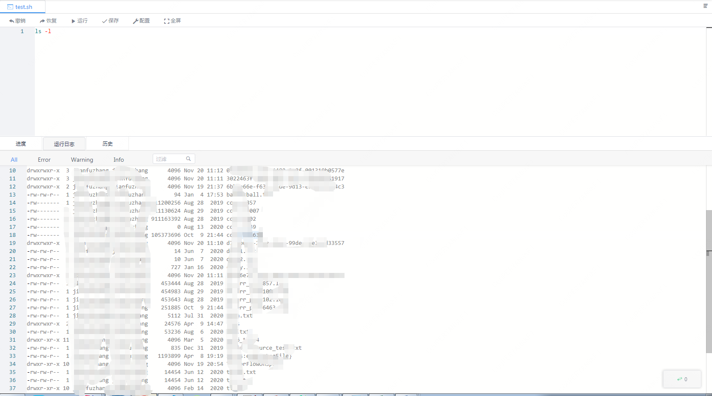

This article mainly introduces the installation, use and configuration of the Shell engine plug-in in Linkis.

## 1. Pre-work

### 1.1 Environment Installation
If you want to use the shell engine on your server, you need to ensure that the user's PATH has the bash execution directory and execute permission.

### 1.2 Environment verification
```
echo $SHELL
```
The following information is output on behalf of the shell environment is available
```
/bin/bash
```
or
```
/bin/sh
```

## 2. Engine plugin installation

The binary installation package released by linkis contains the Shell engine plug-in by default, and users do not need to install it additionally.

## 3. The use of the engine

### 3.1 Submit tasks through Linkis-cli

```shell
sh ./bin/linkis-cli -engineType shell-1 -codeType shell -code "echo \"hello\" " -submitUser hadoop -proxyUser hadoop
```
More Linkis-Cli command parameter reference: [Linkis-Cli usage](../user-guide/linkiscli-manual.md)

### 3.2 Submit tasks through Linkis SDK

Linkis provides Java and Scala SDKs to submit tasks to the Linkis server. For details, please refer to [JAVA SDK Manual](../user-guide/sdk-manual.md).
For Shell tasks, you only need to modify the EngineConnType and CodeType parameters in the Demo:

```java
Map<String, Object> labels = new HashMap<String, Object>();
labels.put(LabelKeyConstant.ENGINE_TYPE_KEY, "shell-1"); // required engineType Label
labels.put(LabelKeyConstant.USER_CREATOR_TYPE_KEY, "hadoop-IDE");// required execute user and creator
labels.put(LabelKeyConstant.CODE_TYPE_KEY, "shell"); // required codeType
```

### 3.3 Submitting tasks through Scriptis

The use of Scriptis is the easiest. You can directly enter Scriptis, right-click the directory, create a new shell script, write the shell code, and click to execute.

The execution principle of the shell is that the shell engine starts a system process for execution through the ProcessBuilder that comes with java, and redirects the output of the process to the engine and writes it to the log.



## 4. Engine configuration instructions

The shell engine can generally set the maximum memory of the engine JVM.