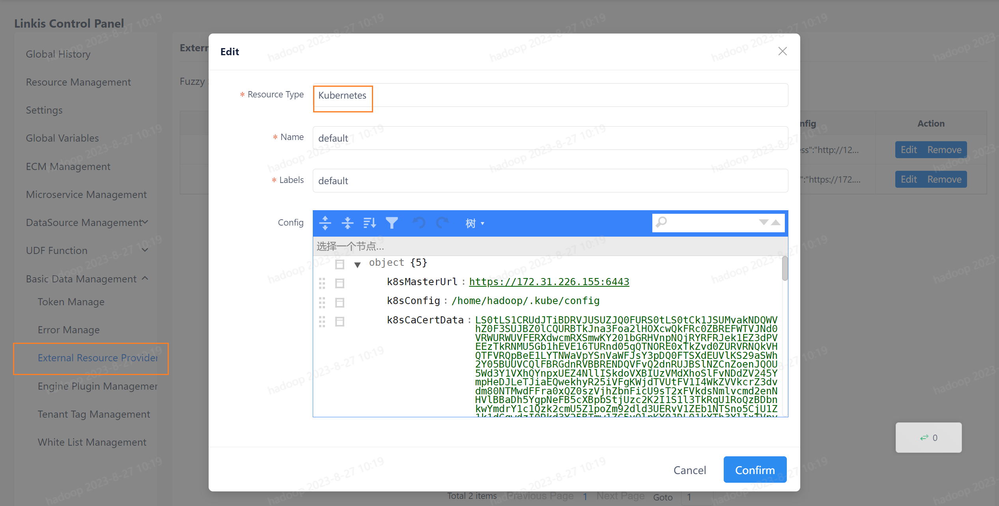
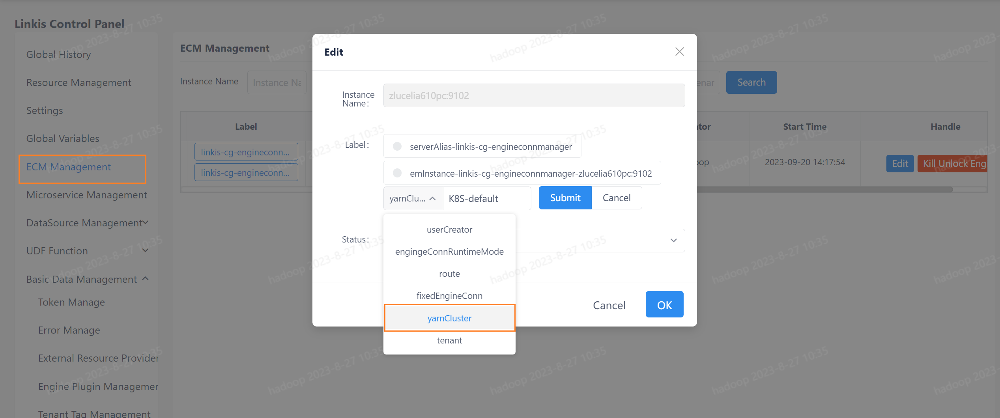

This article mainly introduces the installation, use and configuration of the `Spark` engine plugin in `Linkis`.

## 1. Preliminary work
### 1.1 Engine installation

If you wish to use the `spark` engine on your server, you need to ensure that the following environment variables are set correctly and that the engine's starting user has these environment variables.

It is strongly recommended that you check these environment variables for the executing user before executing a `spark` job.

| Environment variable name | Environment variable content | Remarks |
|-----------------|----------------|-------------- -----------------------------|
| JAVA_HOME | JDK installation path | Required |
| HADOOP_HOME | Hadoop installation path | Required |
| HADOOP_CONF_DIR | Hadoop configuration path | required |
| HIVE_CONF_DIR | Hive configuration path | required |
| SPARK_HOME | Spark installation path | Required |
| SPARK_CONF_DIR | Spark configuration path | Required |
| python | python | It is recommended to use anaconda's python as the default python |

### 1.2 Environment verification
Verify that `Spark` is successfully installed by `pyspark`
```
pyspark

#After entering the pyspark virtual environment, the spark logo appears, indicating that the environment is successfully installed
Welcome to
      ______
     /__/__ ___ _____/ /__
    _\ \/ _ \/ _ `/ __/ '_/
   /__ / .__/\_,_/_/ /_/\_\   version 3.2.1
      /_/

Using Python version 2.7.13 (default, Sep 30 2017 18:12:43)
SparkSession available as 'spark'.
```

## 2. Engine plugin installation [default engine](./overview.md)

The `Spark` engine plugin is included in the binary installation package released by `linkis` by default, and users do not need to install it additionally.

In theory `Linkis` supports all versions of `spark2.x` and above. The default supported version is `Spark3.2.1`. If you want to use another version of `spark`, such as `spark2.1.0`, you just need to modify the version of the plugin `spark` and compile it. Specifically, you can find the `linkis-engineplugin-spark` module, change the value of the `<spark.version>` tag in the `maven` dependency to 2.1.0, and then compile this module separately.

[EngineConnPlugin engine plugin installation](../deployment/install-engineconn.md)

## 3. Using the `spark` engine

### 3.1 Submitting tasks via `Linkis-cli`

```shell
# codeType correspondence py-->pyspark sql-->sparkSQL scala-->Spark scala
sh ./bin/linkis-cli -engineType spark-3.2.1 -codeType sql -code "show databases"  -submitUser hadoop -proxyUser hadoop

# You can specify the yarn queue in the submission parameter by -confMap wds.linkis.yarnqueue=dws
sh ./bin/linkis-cli -engineType spark-3.2.1 -codeType sql  -confMap wds.linkis.yarnqueue=dws -code "show databases"  -submitUser hadoop -proxyUser hadoop
```
More `Linkis-Cli` command parameter reference: [Linkis-Cli usage](../user-guide/linkiscli-manual.md)

### 3.2 Submitting tasks through `Linkis SDK`

`Linkis` provides `SDK` of `Java` and `Scala` to submit tasks to `Linkis` server. For details, please refer to [JAVA SDK Manual](../user-guide/sdk-manual.md).
For `Spark` tasks you only need to modify the `EngineConnType` and `CodeType` parameters in `Demo`:

```java
Map<String, Object> labels = new HashMap<String, Object>();
labels.put(LabelKeyConstant.ENGINE_TYPE_KEY, "spark-3.2.1"); // required engineType Label
labels.put(LabelKeyConstant.USER_CREATOR_TYPE_KEY, "hadoop-IDE");// required execute user and creator
labels.put(LabelKeyConstant.CODE_TYPE_KEY, "sql"); // required codeType py,sql,scala
```

You can also submit scala and python code:
````java

//scala 
labels.put(LabelKeyConstant.CODE_TYPE_KEY, "scala");
code:
val df=spark.sql("show tables")
show(df)        
//pyspark
/labels.put(LabelKeyConstant.CODE_TYPE_KEY, "py");
code:
df=spark.sql("show tables")
show(df)
````


### 3.3 Submitting tasks by submitting the jar package

Through `OnceEngineConn` submit tasks (through the spark-submit submit jar package mission), submission for reference `org.apache.linkis.com putation.Client.SparkOnceJobTest`.

```java
public class SparkOnceJobTest {

    public static void main(String[] args)  {

        LinkisJobClient.config().setDefaultServerUrl("http://127.0.0.1:9001");

        String submitUser = "linkis";
        String engineType = "spark";

        SubmittableSimpleOnceJob onceJob =
                // region
                LinkisJobClient.once().simple().builder()
                        .setCreateService("Spark-Test")
                        .setMaxSubmitTime(300000)
                        .setDescription("SparkTestDescription")
                        .addExecuteUser(submitUser)
                        .addJobContent("runType", "jar")
                        .addJobContent("spark.app.main.class", "org.apache.spark.examples.JavaWordCount")
                        // Parameters obtained from the submitted jar package
                        .addJobContent("spark.app.args", "hdfs:///tmp/test_word_count.txt") // WordCount test file
                        .addLabel("engineType", engineType + "-2.4.7")
                        .addLabel("userCreator", submitUser + "-IDE")
                        .addLabel("engineConnMode", "once")
                        .addStartupParam("spark.app.name", "spark-submit-jar-test-linkis") // Application Name on yarn 
                        .addStartupParam("spark.executor.memory", "1g")
                        .addStartupParam("spark.driver.memory", "1g")
                        .addStartupParam("spark.executor.cores", "1")
                        .addStartupParam("spark.executor.instance", "1")
                        .addStartupParam("spark.app.resource", "hdfs:///tmp/spark/spark-examples_2.11-2.3.0.2.6.5.0-292.jar")
                        .addSource("jobName", "OnceJobTest")
                        .build();
        // endregion
        onceJob.submit();
        onceJob.waitForCompleted(); //A temporary network interruption may cause an exception. It is recommended to modify the SDK later. If the SDK is in use at this stage, exception handling is required.
        // Temporary network failure will cause exceptions. It is recommended to modify the SDK later. For use at this stage, exception handling is required
        onceJob.waitForCompleted();
    }
}
```

### 3.4 Submitting tasks with `Restful API`

Scripts type includes `sql`、`scala`、`python`、`data_calc(content type is json)`.

[Restful API Usage](../api/linkis-task-operator.md)

```http request
POST /api/rest_j/v1/entrance/submit
Content-Type: application/json
Token-Code: dss-AUTH
Token-User: linkis

{
    "executionContent": {
        // script content, type: sql, python, scala, json
        "code": "show databases",
        // script type: sql, py（pyspark）, scala, data_calc(json)
        "runType": "sql"
    },
    "params": {
        "variable": {
        },
        "configuration": {
            // spark startup parameters, not required
            "startup": {
                "spark.executor.memory": "1g",
                "spark.driver.memory": "1g",
                "spark.executor.cores": "1",
                "spark.executor.instances": 1
            }
        }
    },
    "source":  {
        // not required, file:/// or hdfs:///
        "scriptPath": "file:///tmp/hadoop/test.sql"
    },
    "labels": {
        // pattern：engineType-version
        "engineType": "spark-3.2.1",
        // userCreator: linkis is username。IDE is system that be configed in Linkis。
        "userCreator": "linkis-IDE"
    }
}
```

### 3.5 Submitting spark yarn cluster tasks via `Linkis-cli`

Upload the jar package and configuration
```shell
# Upload the jar package under the lib of the linkis spark engine (modify the following parameters according to your actual installation directory)
cd /appcom/Install/linkis/lib/linkis-engineconn-plugins/spark/dist/3.2.1/lib
hdfs dfs -put *.jar hdfs:///spark/cluster

# Upload the linkis configuration file (modify the following parameters according to your actual installation directory)
cd /appcom/Install/linkis/conf
hdfs dfs -put * hdfs:///spark/cluster

# Upload hive-site.xml (modify the following parameters according to your actual installation directory)
cd $HIVE_CONF_DIR
hdfs dfs -put hive-site.xml hdfs:///spark/cluster
```
Can pass `linkis.spark.yarn.cluster.jars`parameters to modify`hdfs:///spark/cluster`

Execute the test case
```shell
# Use `engingeConnRuntimeMode=yarnCluster` to specify the yarn cluster mode
sh ./bin/linkis-cli -engineType spark-3.2.1 -codeType sql -labelMap engingeConnRuntimeMode=yarnCluster -submitUser hadoop -proxyUser hadoop -code "select 123"
```

### 3.6 Submitting spark K8S cluster tasks via `Linkis-cli`

Before submitting the task, please install the `metric server` on Kubernetes, as relevant APIs will be invoked during the resource validation process.

#### 3.6.1 External Resource Provider Configuration

To submit task to kubernetes cluster, you need to add cluster configuration on `Linkis Control Panel->Basic Data Management->External Resource Provider Manage` as show in the figure. The `Resource Type` must be set to `Kubernetes` while the `Name` can be customized.

 

The parameters to be set in the `Config` are shown in the following table:

| Conf              | Desc                                                         |
| ----------------- | ------------------------------------------------------------ |
| k8sMasterUrl      | Full URL of the API Server such as`https://xxx.xxx.xxx.xxx:6443`. This parameter must be configured. |
| k8sConfig         | Location of the kubeconfig file such as`/home/hadoop/.kube/config`. If this parameter is configured, the following three parameters do not need to be configured. |
| k8sCaCertData     | CA certificate for clusters in kubeconfig corresponding to `certificate-authority-data`. If `k8sConfig` is not configured, you need to configure this parameter |
| k8sClientCertData | Client certificate in kubeconfig corresponding to `client-certificate-data`，If `k8sConfig` is not configured, you need to configure this parameter |
| k8sClientKeyData  | Client private key in kubeconfig corresponding to `client-key-data`，If `k8sConfig` is not configured, you need to configure this parameter |

#### 3.6.2 Label Configuration for ECM

After external provider configuration, you need to configure corresponding cluster label information on `ECM Managerment` as shown in the figure. You need to selete `yarnCluster`for label type and `K8S-cluster name` for label value where the cluster name is the name specified in `External Resource Provider Configuration` such as `K8S-default` if the name is set to `default` in the previous step.

> Due to compatibility issues with `ClusterLabel`, the Key value has not been changed yet（yarnCluster）.



#### 3.6.3 Description of parameters

When using`linkis-cli` to submit task, the parameters that need to be set are as follows:

* Specify the cluster to execute the task. If the cluster name is `default` when configuring the external provider, you need to specify the value of the `k8sCluster` as `'K8S-default'` when submitting the task;
* To distinguish it from the `k8s-operator` submitting method, you need to specify the `spark.master` parameter as `k8s-native`;
* Currently spark once job tasks on k8s only support `cluster` deploy mode, you need to set `spark.submit.deployMode` to `cluster`.

The corresponding Spark parameter of Linkis parameters as follows:

| Linkis Parameters                       | Spark Parameters                                        | Default Value       |
| --------------------------------------- | ------------------------------------------------------- | ------------------- |
| linkis.spark.k8s.master.url             | --master                                                | empty string        |
| linkis.spark.k8s.serviceAccount         | spark.kubernetes.authenticate.driver.serviceAccountName | empty string        |
| linkis.spark.k8s.image                  | spark.kubernetes.container.image                        | apache/spark:v3.2.1 |
| linkis.spark.k8s.imagePullPolicy        | spark.kubernetes.container.image.pullPolicy             | Always              |
| linkis.spark.k8s.namespace              | spark.kubernetes.namespace                              | default             |
| linkis.spark.k8s.ui.port                | spark.ui.port                                           | 4040                |
| linkis.spark.k8s.executor.request.cores | spark.kubernetes.executor.request.cores                 | 1                   |
| linkis.spark.k8s.driver.request.cores   | spark.kubernetes.driver.request.cores                   | 1                   |

#### 3.6.4 Example of commands for submission

submitting task with jar

```shell
linkis-cli --mode once \
-engineType spark-3.2.1 \
-labelMap engineConnMode=once \
-k8sCluster 'K8S-default' \
-jobContentMap runType='jar' \
-jobContentMap spark.app.main.class='org.apache.spark.examples.SparkPi' \
-confMap spark.master='k8s-native' \
-confMap spark.app.name='spark-submit-jar-k8s' \
-confMap spark.app.resource='local:///opt/spark/examples/jars/spark-examples_2.12-3.2.1.jar' \
-confMap spark.submit.deployMode='cluster' \
-confMap linkis.spark.k8s.serviceAccount='spark' \
-confMap linkis.spark.k8s.master.url='k8s://https://xxx.xxx.xxx.xxx:6443' \
-confMap linkis.spark.k8s.config.file='/home/hadoop/.kube/config' \
-confMap linkis.spark.k8s.imagePullPolicy='IfNotPresent' \
-confMap linkis.spark.k8s.namespace='default'
```

submitting task with py

```shell
linkis-cli --mode once \
-engineType spark-3.2.1 \
-labelMap engineConnMode=once \
-k8sCluster 'K8S-default' \
-jobContentMap runType='py' \
-confMap spark.master='k8s-native' \
-confMap spark.app.name='spark-submit-py-k8s' \
-confMap spark.app.resource='local:///opt/spark/examples/src/main/python/pi.py' \
-confMap spark.submit.deployMode='cluster' \
-confMap spark.submit.pyFiles='local:///opt/spark/examples/src/main/python/wordcount.py' \
-confMap linkis.spark.k8s.serviceAccount='spark' \
-confMap linkis.spark.k8s.master.url='k8s://https://xxx.xxx.xxx.xxx:6443' \
-confMap linkis.spark.k8s.config.file='/home/hadoop/.kube/config' \
-confMap linkis.spark.k8s.imagePullPolicy='IfNotPresent' \
-confMap linkis.spark.k8s.namespace='default' \
-confMap linkis.spark.k8s.image="apache/spark-py:v3.2.1"
```

#### 3.6.5 Supplemental instructions

**Upgrade instructions for old version**

* You need to use `linkis-dist/package/db/upgrade/1.5.0_schema/mysql/linkis_ddl.sql` to upgrade the database fields. Specifically, the `label_key` field of `linkis_cg_manager_label` needs to be increased from 32 to 50 in length.

  ```sql
  ALTER TABLE `linkis_cg_manager_label` MODIFY COLUMN label_key varchar(50);
  ```

* Prior to version 1.5.0, when building CombineLabel, ClusterLabel was not included. To maintain compatibility with older versions, when the submitted ClusterLabel value is 'Yarn-default', ClusterLabel is still not included when building CombineLabel. You can disable this feature by setting `linkis.combined.without.yarn.default` to false (default is true).

  > The specific reason is that if tasks related to that ClusterLabel were submitted in old versions, corresponding resource records would exist in the database. After upgrading to the new version, since CombineLabel includes ClusterLabel, conflicts would occur in the database's resource records when submitting tasks of this type. Therefore, to maintain compatibility with older versions, the construction of CombineLabel for Yarn-default (the default value of ClusterLabel) still does not include ClusterLabel.
  > If the latest version is installed directly, this issue does not need to be considered because there are no conflicting records in the database. You can set `linkis.combined.without.yarn.default` to false to improve readability.

**Validation of submitting tasks**

Submitting a Spark Once Job to K8S involves two levels of resource validation, and the task will only be submitted to the K8S cluster after passing both levels of validation:

1. First, user resource quota validation will be performed. For detailed process, please refer to [**ResourceManager Architecture**](architecture/feature/computation-governance-services/linkis-manager/resource-manager.md).
2. Next, resource validation for the K8S cluster will be performed. If a resourceQuota is configured under the current namespace, it will be prioritized for validation. Otherwise, the available resources of the cluster will be calculated directly through the metric server for validation.

## 4. Engine configuration instructions

### 4.1 Default Configuration Description
| Configuration | Default | Required | Description |
| ------------------------ | ------------------- | ---| ------------------------------------------- |
| wds.linkis.rm.instance | 10 |No| Maximum number of concurrent engines |
| spark.executor.cores | 1 |No| Number of spark executor cores |
| spark.driver.memory | 1g | no | maximum concurrent number of spark executor instances |
| spark.executor.memory | 1g | No | spark executor memory size |
| wds.linkis.engineconn.max.free.time | 1h | No | Engine idle exit time |
| spark.python.version | python2 | no | python version |

### 4.2 Queue resource configuration
Because the execution of `spark` requires queue resources, you need to set up a queue that you can execute.    

 


### 4.3 Configuration modification
If the default parameters are not satisfied, there are the following ways to configure some basic parameters

#### 4.3.1 Management Console Configuration
Users can customize settings, such as the number of `spark` sessions `executor` and `executor` memory. These parameters are for users to set their own `spark` parameters more freely, and other `spark` parameters can also be modified, such as the `python` version of `pyspark`, etc.


Note: After modifying the configuration under the `IDE` tag, you need to specify `-creator IDE` to take effect (other tags are similar), such as:

```shell
sh ./bin/linkis-cli -creator IDE \
-engineType spark-3.2.1 -codeType sql \
-code "show databases"  \
-submitUser hadoop -proxyUser hadoop
```

#### 4.3.2 Task interface configuration
Submit the task interface, configure it through the parameter `params.configuration.runtime`

```shell
Example of http request parameters
{
    "executionContent": {"code": "show databases;", "runType":  "sql"},
    "params": {
                    "variable": {},
                    "configuration": {
                            "runtime": {
                                "wds.linkis.rm.instance":"10"
                                }
                            }
                    },
    "labels": {
        "engineType": "spark-3.2.1",
        "userCreator": "hadoop-IDE"
    }
}
```

### 4.4 Engine related data sheet

`Linkis` is managed through the engine tag, and the data table information involved is shown below.

```
linkis_ps_configuration_config_key: Insert the key and default values ​​​​of the configuration parameters of the engine
linkis_cg_manager_label: insert engine label such as: spark-3.2.1
linkis_ps_configuration_category: The directory association relationship of the insertion engine
linkis_ps_configuration_config_value: The configuration that the insertion engine needs to display
linkis_ps_configuration_key_engine_relation: The relationship between the configuration item and the engine
```

The initial data in the table related to the `spark` engine is as follows

```sql
-- set variable
SET @SPARK_LABEL="spark-3.2.1";
SET @SPARK_ALL=CONCAT('*-*,',@SPARK_LABEL);
SET @SPARK_IDE=CONCAT('*-IDE,',@SPARK_LABEL);

-- engine label
insert into `linkis_cg_manager_label` (`label_key`, `label_value`, `label_feature`, `label_value_size`, `update_time`, `create_time`) VALUES ('combined_userCreator_engineType', @SPARK_ALL, 'OPTIONAL', 2, now(), now());
insert into `linkis_cg_manager_label` (`label_key`, `label_value`, `label_feature`, `label_value_size`, `update_time`, `create_time`) VALUES ('combined_userCreator_engineType', @SPARK_IDE, 'OPTIONAL', 2, now(), now());

select @label_id := id from linkis_cg_manager_label where `label_value` = @SPARK_IDE;
insert into linkis_ps_configuration_category (`label_id`, `level`) VALUES (@label_id, 2);

-- configuration key
INSERT INTO `linkis_ps_configuration_config_key` (`key`, `description`, `name`, `default_value`, `validate_type`, `validate_range`, `is_hidden`, `is_advanced`, `level`, `treeName`, `engine_conn_type`) VALUES ('wds.linkis.rm.instance', 'Range: 1-20, unit: each', 'Maximum concurrent number of spark engine', '10', 'NumInterval', '[1,20]', '0 ', '0', '1', 'queue resources', 'spark');
INSERT INTO `linkis_ps_configuration_config_key` (`key`, `description`, `name`, `default_value`, `validate_type`, `validate_range`, `is_hidden`, `is_advanced`, `level`, `treeName`, `engine_conn_type`) VALUES ('spark.executor.instances', 'value range: 1-40, unit: individual', 'maximum concurrent number of spark executor instances', '1', 'NumInterval', '[1,40]', '0', '0', '2', 'spark resource settings', 'spark');
INSERT INTO `linkis_ps_configuration_config_key` (`key`, `description`, `name`, `default_value`, `validate_type`, `validate_range`, `is_hidden`, `is_advanced`, `level`, `treeName`, `engine_conn_type`) VALUES ('spark.executor.cores', 'Value range: 1-8, unit: number', 'Number of spark executor cores', '1', 'NumInterval', '[1,8]', ' 0', '0', '1','spark resource settings', 'spark');
INSERT INTO `linkis_ps_configuration_config_key` (`key`, `description`, `name`, `default_value`, `validate_type`, `validate_range`, `is_hidden`, `is_advanced`, `level`, `treeName`, `engine_conn_type`) VALUES ('spark.executor.memory', 'value range: 1-15, unit: G', 'spark executor memory size', '1g', 'Regex', '^([1-9]|1 [0-5])(G|g)$', '0', '0', '3', 'spark resource settings', 'spark');
INSERT INTO `linkis_ps_configuration_config_key` (`key`, `description`, `name`, `default_value`, `validate_type`, `validate_range`, `is_hidden`, `is_advanced`, `level`, `treeName`, `engine_conn_type`) VALUES ('spark.driver.cores', 'Value range: only 1, unit: number', 'Number of spark driver cores', '1', 'NumInterval', '[1,1]', '0 ', '1', '1', 'spark resource settings', 'spark');
INSERT INTO `linkis_ps_configuration_config_key` (`key`, `description`, `name`, `default_value`, `validate_type`, `validate_range`, `is_hidden`, `is_advanced`, `level`, `treeName`, `engine_conn_type`) VALUES ('spark.driver.memory', 'value range: 1-15, unit: G', 'spark driver memory size','1g', 'Regex', '^([1-9]|1[ 0-5])(G|g)$', '0', '0', '1', 'spark resource settings', 'spark');
INSERT INTO `linkis_ps_configuration_config_key` (`key`, `description`, `name`, `default_value`, `validate_type`, `validate_range`, `is_hidden`, `is_advanced`, `level`, `treeName`, `engine_conn_type`) VALUES ('wds.linkis.engineconn.max.free.time', 'Value range: 3m,15m,30m,1h,2h', 'Engine idle exit time','1h', 'OFT', '[\ "1h\",\"2h\",\"30m\",\"15m\",\"3m\"]', '0', '0', '1', 'spark engine settings', ' spark');
INSERT INTO `linkis_ps_configuration_config_key` (`key`, `description`, `name`, `default_value`, `validate_type`, `validate_range`, `is_hidden`, `is_advanced`, `level`, `treeName`, `engine_conn_type`) VALUES ('spark.tispark.pd.addresses', NULL, NULL, 'pd0:2379', 'None', NULL, '0', '0', '1', 'tidb设置', 'spark');
INSERT INTO `linkis_ps_configuration_config_key` (`key`, `description`, `name`, `default_value`, `validate_type`, `validate_range`, `is_hidden`, `is_advanced`, `level`, `treeName`, `engine_conn_type`) VALUES ('spark.tispark.tidb.addr', NULL, NULL, 'tidb', 'None', NULL, '0', '0', '1', 'tidb设置', 'spark');
INSERT INTO `linkis_ps_configuration_config_key` (`key`, `description`, `name`, `default_value`, `validate_type`, `validate_range`, `is_hidden`, `is_advanced`, `level`, `treeName`, `engine_conn_type`) VALUES ('spark.tispark.tidb.password', NULL, NULL, NULL, 'None', NULL, '0', '0', '1', 'tidb设置', 'spark');
INSERT INTO `linkis_ps_configuration_config_key` (`key`, `description`, `name`, `default_value`, `validate_type`, `validate_range`, `is_hidden`, `is_advanced`, `level`, `treeName`, `engine_conn_type`) VALUES ('spark.tispark.tidb.port', NULL, NULL, '4000', 'None', NULL, '0', '0', '1', 'tidb设置', 'spark');
INSERT INTO `linkis_ps_configuration_config_key` (`key`, `description`, `name`, `default_value`, `validate_type`, `validate_range`, `is_hidden`, `is_advanced`, `level`, `treeName`, `engine_conn_type`) VALUES ('spark.tispark.tidb.user', NULL, NULL, 'root', 'None', NULL, '0', '0', '1', 'tidb设置', 'spark');
INSERT INTO `linkis_ps_configuration_config_key` (`key`, `description`, `name`, `default_value`, `validate_type`, `validate_range`, `is_hidden`, `is_advanced`, `level`, `treeName`, `engine_conn_type`) VALUES ('spark.python.version', 'Value range: python2,python3', 'python version','python2', 'OFT', '[\"python3\",\"python2\"]', ' 0', '0', '1', 'spark engine settings', 'spark');

-- key engine relation
insert into `linkis_ps_configuration_key_engine_relation` (`config_key_id`, `engine_type_label_id`)
(select config.id as `config_key_id`, label.id AS `engine_type_label_id` FROM linkis_ps_configuration_config_key config
INNER JOIN linkis_cg_manager_label label ON config.engine_conn_type = 'spark' and label.label_value = @SPARK_ALL);

-- engine default configuration
insert into `linkis_ps_configuration_config_value` (`config_key_id`, `config_value`, `config_label_id`)
(select `relation`.`config_key_id` AS `config_key_id`, '' AS `config_value`, `relation`.`engine_type_label_id` AS `config_label_id` FROM linkis_ps_configuration_key_engine_relation relation
INNER JOIN linkis_cg_manager_label label ON relation.engine_type_label_id = label.id AND label.label_value = @SPARK_ALL);

```
