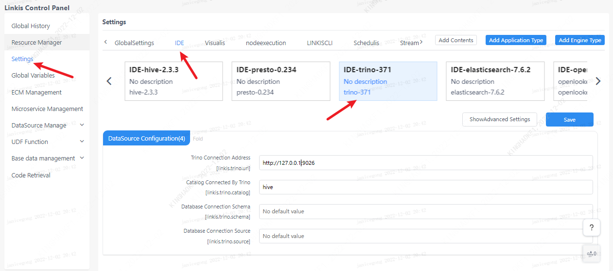

This article mainly introduces the installation, use and configuration of the `Trino` engine plugin in `Linkis`.


## 1. Pre-work

### 1.1 Engine installation

If you want to use `Trino` engine on your `Linkis` service, you need to install `Trino` service and make sure the service is available.

### 1.2 Service Verification

```shell
# prepare trino-cli
wget https://repo1.maven.org/maven2/io/trino/trino-cli/374/trino-cli-374-executable.jar
mv trill-cli-374-executable.jar trill-cli
chmod +x trino-cli

# Execute the task
./trino-cli --server localhost:8080 --execute 'show tables from system.jdbc'

# Get the following output to indicate that the service is available
"attributes"
"catalogs"
"columns"
"procedure_columns"
"procedures"
"pseudo_columns"
"schemas"
"super_tables"
"super_types"
"table_types"
"tables"
"types"
"udts"
```

## 2. Engine plugin deployment

### 2.1 Engine plugin preparation (choose one) [non-default engine](./overview.md)

Method 1: Download the engine plug-in package directly

[Linkis Engine Plugin Download](https://linkis.apache.org/zh-CN/blog/2022/04/15/how-to-download-engineconn-plugin)

Method 2: Compile the engine plug-in separately (requires `maven` environment)

```
# compile
cd ${linkis_code_dir}/linkis-engineconn-plugins/trino/
mvn clean install
# The compiled engine plug-in package is located in the following directory
${linkis_code_dir}/linkis-engineconn-plugins/trino/target/out/
```
[EngineConnPlugin Engine Plugin Installation](../deployment/install-engineconn.md)

### 2.2 Upload and load engine plugins

Upload the engine package in 2.1 to the engine directory of the server
```bash 
${LINKIS_HOME}/lib/linkis-engineplugins
```
The directory structure after uploading is as follows
```
linkis-engineconn-plugins/
├── triune
│   ├── dist
│ │ └── v371
│   │       ├── conf
│ │ └── lib
│   └── plugin
│ └── 371
```

### 2.3 Engine refresh

#### 2.3.1 Restart and refresh
Refresh the engine by restarting the `linkis-cg-linkismanager` service
```bash
cd ${LINKIS_HOME}/sbin
sh linkis-daemon.sh restart cg-linkismanager
```

### 2.3.2 Check whether the engine is refreshed successfully
You can check whether the `last_update_time` of the `linkis_engine_conn_plugin_bml_resources` table in the database is the time to trigger the refresh.

```sql
#login to `linkis` database
select * from linkis_cg_engine_conn_plugin_bml_resources;
```

## 3 Engine usage

### 3.1 Submit tasks through `Linkis-cli`

```shell
 sh ./bin/linkis-cli -submitUser Hadoop \
 -engineType trino-371 -codeType sql \
 -code 'select * from system.jdbc.schemas limit 10' \
 -runtimeMap linkis.trino.url=http://127.0.0.1:8080
```

If the management console, task interface, and configuration file are not configured (see 4.2 for the configuration method), they can be configured through the `-runtimeMap` attribute in the `Linkis-cli` client

```shell
sh ./bin/linkis-cli -engineType trino-371 \
-codeType  sql -code 'select * from system.jdbc.schemas limit 10;'  \
-runtimeMap linkis.trino.urll=http://127.0.0.1:8080 \
-runtimeMap linkis.trino.catalog=hive \
-runtimeMap linkis.trino.schema=default \
-submitUser hadoop -proxyUser hadoop
```

More `Linkis-Cli` command parameter reference: [Linkis-Cli usage](../user-guide/linkiscli-manual.md)

## 4. Engine configuration instructions

### 4.1 Default Configuration Description

| Configuration | Default | Description | Required |
| ----------------------------------------- | ---------- ----------- | -------------------------------------- ----- | -------- |
| linkis.trino.url | http://127.0.0.1:8080 | Trino cluster connection URL | true |
| linkis.trino.default.limit | 5000 | No | Limit the number of result sets |
| linkis.trino.http.connectTimeout | 60 | No | Connection timeout (seconds) |
| linkis.trino.http.readTimeout | 60 | No | Transmission timeout (seconds) |
| linkis.trino.resultSet.cache.max | 512k | no | result set buffer |
| linkis.trino.user | null | no | username |
| linkis.trino.password | null | no | password |
| linkis.trino.passwordCmd | null | no | password callback command |
| linkis.trino.catalog | system | No | Catalog |
| linkis.trino.schema | null | 否 | Schema |
| linkis.trino.ssl.insecured | false | no | verify SSL certificate |
| linkis.engineconn.concurrent.limit | 100 | No | Maximum concurrent number of engines |
| linkis.trino.ssl.key.store | null | no | keystore path |
| linkis.trino.ssl.keystore.password | null | no | keystore password |
| linkis.trino.ssl.keystore.type | null | no | keystore type |
| linkis.trino.ssl.truststore | null | 否 | truststore |
| linkis.trino.ss..truststore.type | null | no | truststore type |
| linkis.trino.ssl.truststore.password | null | no | truststore password |

### 4.2 Configuration modification

If the default parameters are not satisfied, there are the following ways to configure some basic parameters

#### 4.2.1 Management console configuration



Note: After modifying the configuration under the `IDE` tag, you need to specify `-creator IDE` to take effect (other tags are similar), such as:

```shell
sh ./bin/linkis-cli -creator IDE -submitUser hadoop \
 -engineType trino-371 -codeType sql \
 -code 'select * from system.jdbc.schemas limit 10' \
 -runtimeMap linkis.trino.url=http://127.0.0.1:8080
```

#### 4.2.2 Task interface configuration
Submit the task interface and configure it through the parameter `params.configuration.runtime`

```shell
Example of http request parameters
{
    "executionContent": {"code": "select * from system.jdbc.schemas limit 10;", "runType":  "sql"},
    "params": {
                    "variable": {},
                    "configuration": {
                            "runtime": {
                                "linkis.trino.url":"http://127.0.0.1:8080",
                                "linkis.trino.catalog ":"hive",
                                "linkis.trino.schema ":"default"
                                }
                            }
                    },
    "labels": {
        "engineType": "trino-371",
        "userCreator": "hadoop-IDE"
    }
}
```

### 4.3 Engine related data table

`Linkis` is managed through engine tags, and the data table information involved is as follows.

```
linkis_ps_configuration_config_key: Insert the key and default values ​​​​of the configuration parameters of the engine
linkis_cg_manager_label: insert engine label such as: trino-375
linkis_ps_configuration_category: Insert the directory association of the engine
linkis_ps_configuration_config_value: Insert the configuration that the engine needs to display
linkis_ps_configuration_key_engine_relation: the relationship between configuration items and engines
```

The initial data related to the engine in the table is as follows


```sql
-- set variable
SET @TRINO_LABEL="trino-371";
SET @TRINO_IDE=CONCAT('*-IDE,',@TRINO_LABEL);
SET @TRINO_ALL=CONCAT('*-*,',@TRINO_LABEL);

-- engine label
insert into `linkis_cg_manager_label` (`label_key`, `label_value`, `label_feature`, `label_value_size`, `update_time`, `create_time`) VALUES ('combined_userCreator_engineType', @TRINO_IDE, 'OPTIONAL', 2, now(), now());
insert into `linkis_cg_manager_label` (`label_key`, `label_value`, `label_feature`, `label_value_size`, `update_time`, `create_time`) VALUES ('combined_userCreator_engineType', @TRINO_ALL, 'OPTIONAL', 2, now(), now());
select @label_id := id from `linkis_cg_manager_label` where label_value = @TRINO_IDE;
insert into `linkis_ps_configuration_category` (`label_id`, `level`) VALUES (@label_id, 2);

-- configuration key
INSERT INTO `linkis_ps_configuration_config_key` (`key`, `description`, `name`, `default_value`, `validate_type`, `validate_range`, `engine_conn_type`, `is_hidden`, `is_advanced`, `level`, `treeName`) VALUES ('linkis.trino.default.limit', 'The limit on the number of query result sets returned', 'The limit on the number of result sets', '5000', 'None', '', 'trino', 0, 0, 1, 'Data source configuration');
INSERT INTO `linkis_ps_configuration_config_key` (`key`, `description`, `name`, `default_value`, `validate_type`, `validate_range`, `engine_conn_type`, `is_hidden`, `is_advanced`, `level`, `treeName`) VALUES ('linkis.trino.http.connectTimeout', 'Timeout for connecting to Trino server', 'Connection timeout (seconds)', '60', 'None', '', 'trino', 0, 0, 1 , 'Data Source Configuration');
INSERT INTO `linkis_ps_configuration_config_key` (`key`, `description`, `name`, `default_value`, `validate_type`, `validate_range`, `engine_conn_type`, `is_hidden`, `is_advanced`, `level`, `treeName`) VALUES ('linkis.trino.http.readTimeout', 'Timeout waiting for Trino server to return data', 'Transmission timeout (seconds)', '60', 'None', '', 'trino', 0, 0 , 1, 'Data source configuration');
INSERT INTO `linkis_ps_configuration_config_key` (`key`, `description`, `name`, `default_value`, `validate_type`, `validate_range`, `engine_conn_type`, `is_hidden`, `is_advanced`, `level`, `treeName`) VALUES ('linkis.trino.resultSet.cache.max', 'Trino result set buffer size', 'Result set buffer', '512k', 'None', '', 'trino', 0, 0, 1 , 'Data Source Configuration');
INSERT INTO `linkis_ps_configuration_config_key` (`key`, `description`, `name`, `default_value`, `validate_type`, `validate_range`, `engine_conn_type`, `is_hidden`, `is_advanced`, `level`, `treeName`) VALUES ('linkis.trino.url', 'Trino server URL', 'Trino server URL', 'http://127.0.0.1:9401', 'None', '', 'trino', 0, 0, 1 , 'Data Source Configuration');
INSERT INTO `linkis_ps_configuration_config_key` (`key`, `description`, `name`, `default_value`, `validate_type`, `validate_range`, `engine_conn_type`, `is_hidden`, `is_advanced`, `level`, `treeName`) VALUES ('linkis.trino.user', 'username used to connect to Trino query service', 'username', 'null', 'None', '', 'trino', 0, 0, 1, 'data source configuration');
INSERT INTO `linkis_ps_configuration_config_key` (`key`, `description`, `name`, `default_value`, `validate_type`, `validate_range`, `engine_conn_type`, `is_hidden`, `is_advanced`, `level`, `treeName`) VALUES ('linkis.trino.password', 'Password for connecting Trino query service', 'password', 'null', 'None', '', 'trino', 0, 0, 1, 'data source configuration ');
INSERT INTO `linkis_ps_configuration_config_key` (`key`, `description`, `name`, `default_value`, `validate_type`, `validate_range`, `engine_conn_type`, `is_hidden`, `is_advanced`, `level`, `treeName`) VALUES ('linkis.trino.passwordCmd', 'Password callback command for connecting to Trino query service', 'Password callback command', 'null', 'None', '', 'trino', 0, 0, 1, 'Datasource Configuration');
INSERT INTO `linkis_ps_configuration_config_key` (`key`, `description`, `name`, `default_value`, `validate_type`, `validate_range`, `engine_conn_type`, `is_hidden`, `is_advanced`, `level`, `treeName`) VALUES ('linkis.trino.catalog', 'catalog', 'Catalog', 'system', 'None', '', 'trino', 0, 0, 1, 'data source configuration' );
INSERT INTO `linkis_ps_configuration_config_key` (`key`, `description`, `name`, `default_value`, `validate_type`, `validate_range`, `engine_conn_type`, `is_hidden`, `is_advanced`, `level`, `treeName`) VALUES ('linkis.trino.schema', 'The default schema for connecting Trino query service', 'Schema', '', 'None', '', 'trino', 0, 0, 1, 'Data source configuration') ;
INSERT INTO `linkis_ps_configuration_config_key` (`key`, `description`, `name`, `default_value`, `validate_type`, `validate_range`, `engine_conn_type`, `is_hidden`, `is_advanced`, `level`, `treeName`) VALUES ('linkis.trino.ssl.insecured', 'Whether to ignore the server's SSL certificate', 'Verify SSL certificate', 'false', 'None', '', 'trino', 0, 0, 1, 'data source configuration');
INSERT INTO `linkis_ps_configuration_config_key` (`key`, `description`, `name`, `default_value`, `validate_type`, `validate_range`, `engine_conn_type`, `is_hidden`, `is_advanced`, `level`, `treeName`) VALUES ('linkis.engineconn.concurrent.limit', 'Engine maximum concurrency', 'Engine maximum concurrency', '100', 'None', '', 'trino', 0, 0, 1, 'Data source configuration' );
INSERT INTO `linkis_ps_configuration_config_key` (`key`, `description`, `name`, `default_value`, `validate_type`, `validate_range`, `engine_conn_type`, `is_hidden`, `is_advanced`, `level`, `treeName`) VALUES ('linkis.trino.ssl.keystore', 'Trino server SSL keystore path', 'keystore path', 'null', 'None', '', 'trino', 0, 0, 1, 'data source configuration ');
INSERT INTO `linkis_ps_configuration_config_key` (`key`, `description`, `name`, `default_value`, `validate_type`, `validate_range`, `engine_conn_type`, `is_hidden`, `is_advanced`, `level`, `treeName`) VALUES ('linkis.trino.ssl.keystore.type', 'Trino server SSL keystore type', 'keystore type', 'null', 'None', '', 'trino', 0, 0, 1, 'data source configuration');
INSERT INTO `linkis_ps_configuration_config_key` (`key`, `description`, `name`, `default_value`, `validate_type`, `validate_range`, `engine_conn_type`, `is_hidden`, `is_advanced`, `level`, `treeName`) VALUES ('linkis.trino.ssl.keystore.password', 'Trino server SSL keystore password', 'keystore password', 'null', 'None', '', 'trino', 0, 0, 1, 'data source configuration');
INSERT INTO `linkis_ps_configuration_config_key` (`key`, `description`, `name`, `default_value`, `validate_type`, `validate_range`, `engine_conn_type`, `is_hidden`, `is_advanced`, `level`, `treeName`) VALUES ('linkis.trino.ssl.truststore', 'Trino server SSL truststore path', 'truststore path', 'null', 'None', '', 'trino', 0, 0, 1, 'data source configuration ');
INSERT INTO `linkis_ps_configuration_config_key` (`key`, `description`, `name`, `default_value`, `validate_type`, `validate_range`, `engine_conn_type`, `is_hidden`, `is_advanced`, `level`, `treeName`) VALUES ('linkis.trino.ssl.truststore.type', 'Trino server SSL truststore type', 'truststore type', 'null', 'None', '', 'trino', 0, 0, 1, 'data source configuration');
INSERT INTO `linkis_ps_configuration_config_key` (`key`, `description`, `name`, `default_value`, `validate_type`, `validate_range`, `engine_conn_type`, `is_hidden`, `is_advanced`, `level`, `treeName`) VALUES ('linkis.trino.ssl.truststore.password', 'Trino server SSL truststore password', 'truststore password', 'null', 'None', '', 'trino', 0, 0, 1, 'data source configuration');


-- key engine relation
insert into `linkis_ps_configuration_key_engine_relation` (`config_key_id`, `engine_type_label_id`)
(select config.id as config_key_id, label.id AS engine_type_label_id FROM `linkis_ps_configuration_config_key` config
INNER JOIN `linkis_cg_manager_label` label ON config.engine_conn_type = 'trino' and label_value = @TRINO_ALL);

-- engine default configuration
insert into `linkis_ps_configuration_config_value` (`config_key_id`, `config_value`, `config_label_id`)
(select relation.config_key_id AS config_key_id, '' AS config_value, relation.engine_type_label_id AS config_label_id FROM `linkis_ps_configuration_key_engine_relation` relation
INNER JOIN `linkis_cg_manager_label` label ON relation.engine_type_label_id = label.id AND label.label_value = @TRINO_ALL);
```