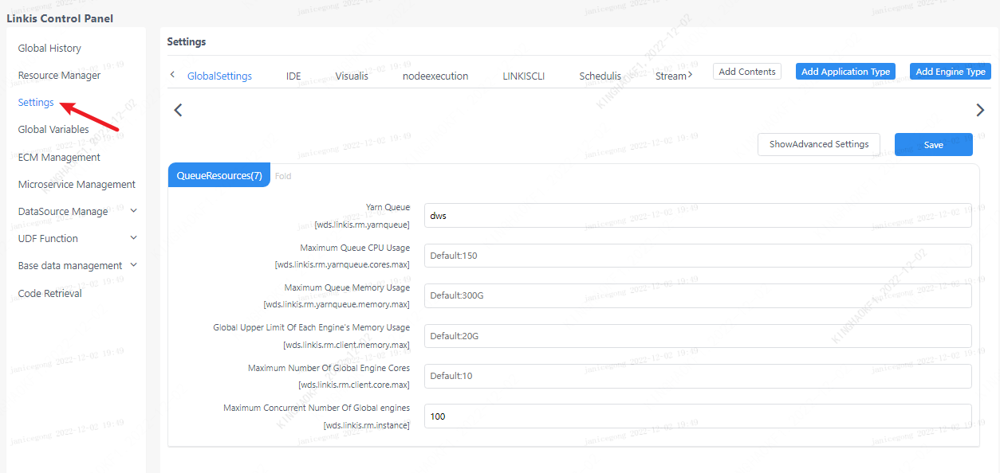
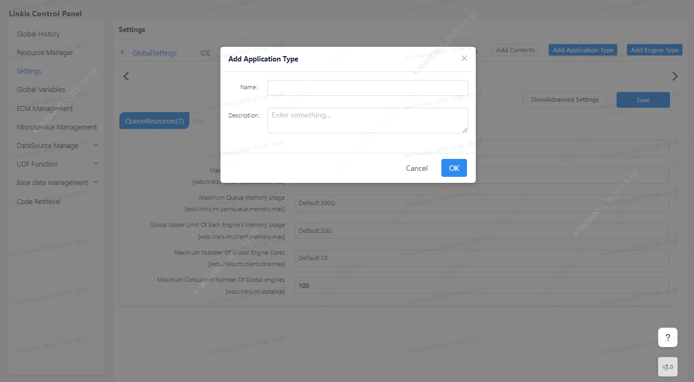

> 参数配置界面提供了用户自定义参数管理的功能，用户可以在该界面管理引擎的相关配置，管理员还能在这里新增应用类型和引擎。

用户通过点击上方的应用类型，接着选择应用中拥有的引擎类型，即可展开该目录下的所有配置信息，修改配置信息点击保存即可生效。

编辑目录和新增应用类型仅管理员可见，点击编辑按钮可以删除已有的应用和引擎配置（注意！直接删除应用会删除该应用下所有的引擎配置，并且不可恢复），或者添加引擎，点击新增应用可以添加应用类型。

 
