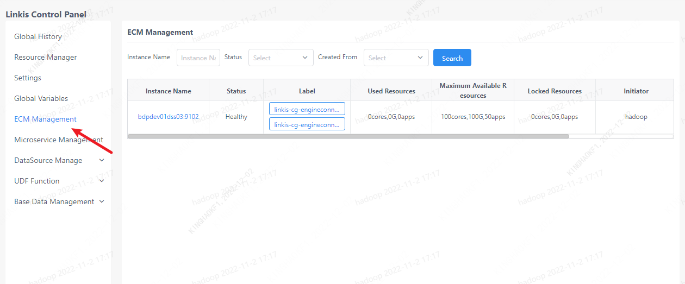
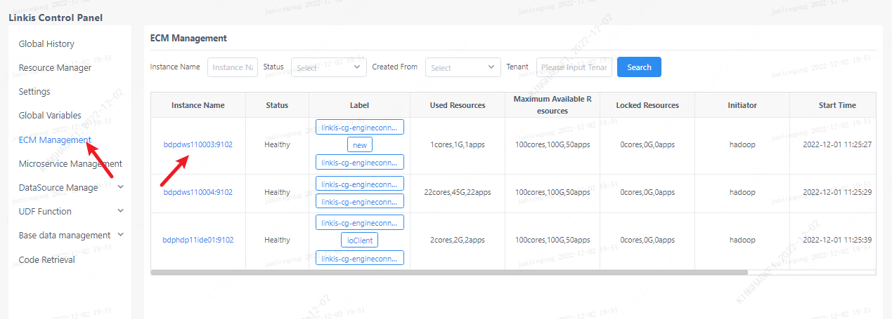
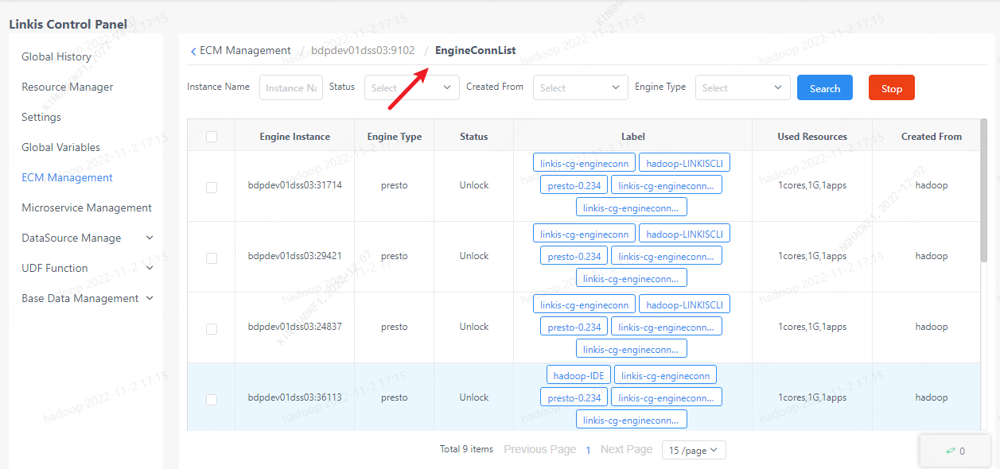

> **仅linkis计算治理台管理员可见**

ECM管理界面是用于管理员管理ECM和所有引擎的地方，该界面可以查看到ECM的状态信息、修改ECM标签信息、修改ECM状态信息以及查询各个ECM下的所有引擎信息。且仅管理员可见，管理员的配置方式可以在本文章第二大章节查看。

点击编辑按钮，可以编辑ECM的标签信息（仅允许编辑部分标签），以及修改ECM的状态。

点击ECM的实例名称，可以查看该ECM下所有的引擎信息。

同样地，可以在该界面停止引擎，并且可以编辑引擎的标签信息。
