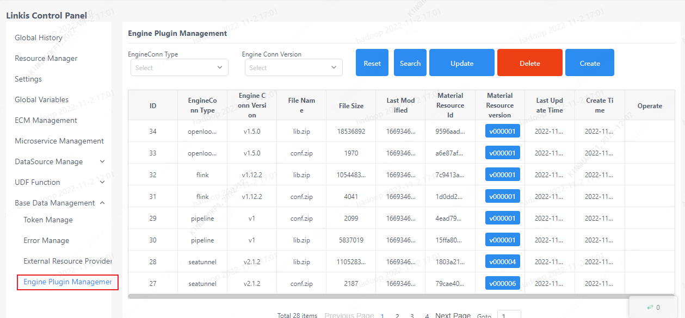

The data source management page can manage data such as user tokens, error codes, extended resources, and engine materials.

## 1. Token Management

It is used to manage Token information of each application.

## 2. Error code management

### 2.1 List of error codes

List error code information, you can query by error code or error description.

### 2.1 Common error code problem solving

[common error codes and how to deal with them](../../tuning-and-troubleshooting/error-guide/error-code.md)

## 3. Extended resource management

Used to manage extended resources, such as yarn link url, etc.

## 4. Engine material management

Used to manage Linkis engine materials, including creation, update and deletion of engine plugins.

