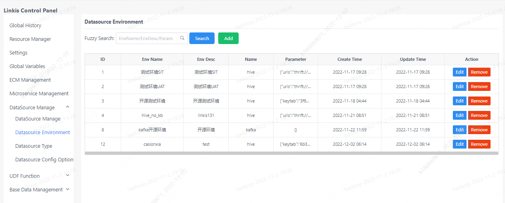
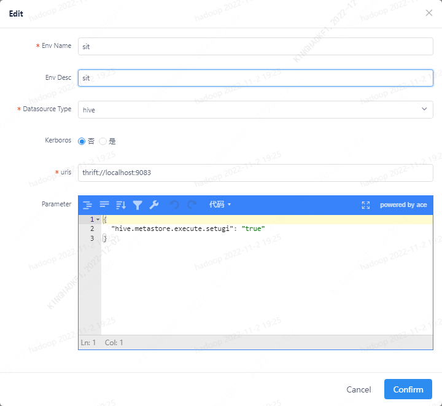
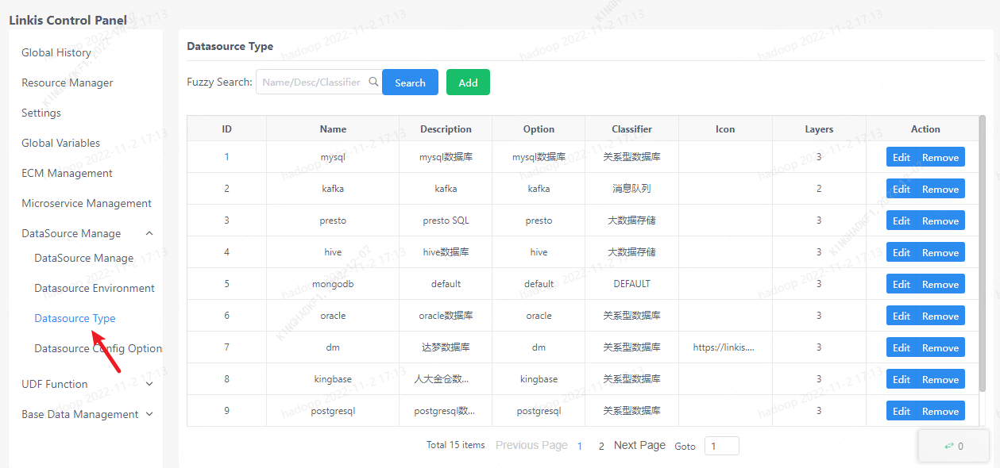
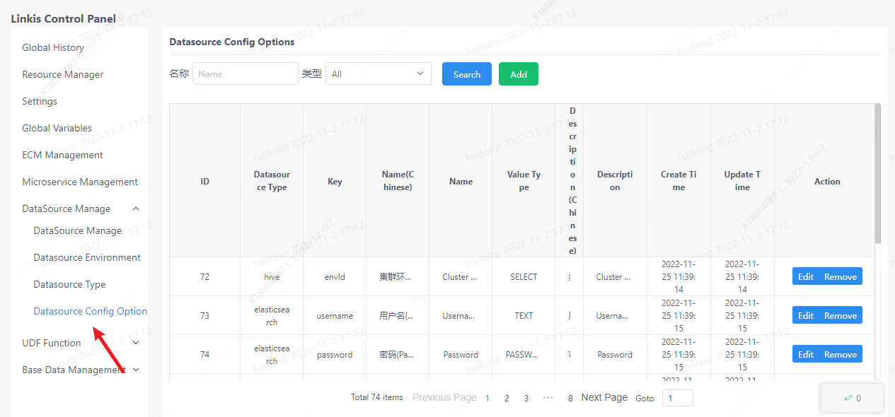

Data source management can process data source link information, data source environment, data source classification and data source permissions.

## 1. Data source management

The data source management interface can view the data source managed by Linkis. And manage the data source, including creating, modifying, testing the connection, modifying the state of the data source, etc.

## 2. Data source environment

On the data source environment page, you can view the data source environment and modify the parameters of the managed environment.

## 3. Data source classification

The data source classification page is used to manage the types of data sources. This classification is used in both data source management and data source permission pages.

## 4. Data source permissions

This page manages data source permissions.

