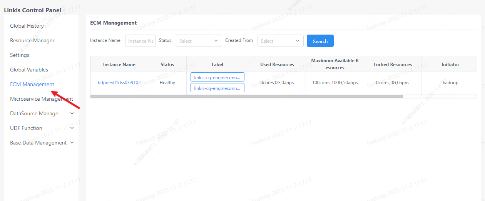

The ECM management interface is only visible to Linkis Computing Management Console administrators. This page is used to manage ECM and all engines. On this interface, you can view the status information of the ECM, modify the ECM label information, modify the ECM status information, and query all engine information under each ECM.

## 1. Instance view
An ECM instance is an ECM service. Users can start multiple ECM services according to requirements to improve request processing efficiency. On this page, you can view ECM instance information, including name, label, and resource information. In addition, ECM instances can be filtered through keywords such as instance name, status, and creator.

## 2. Tag management
The ECM service filters and processes requests based on tags. Each service contains default labels and user-defined labels. Only the request carrying the label information of the ECM service will be processed by the current service. Click the Edit button to edit the label information of the ECM (only user-defined labels are allowed), and modify the status of the ECM.

The most commonly used is the tenant label tenant, through which users can isolate tenant requests.

## 3. Engine information under ECM

Click the instance name of an ECM to view all engine information under the ECM. And manage the engine, including stopping the engine, adding or deleting user-defined tags, viewing engine logs, and other operations.

Similarly, after tagging the engine under the ECM instance, you can control the specific engine that processes the request in a finer granularity.