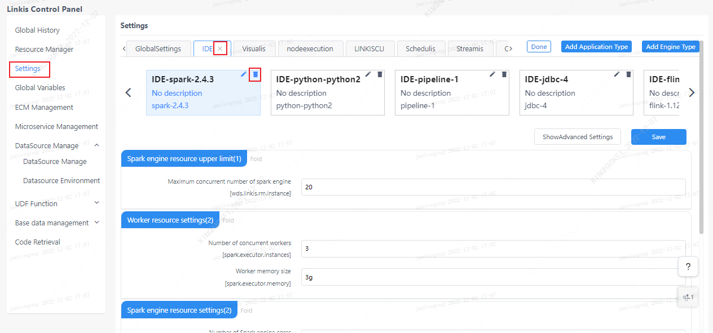

The parameter configuration interface provides the user-defined parameter management function, and the user can manage the related configuration of the engine on this interface. By default, engine configurations for `IDE`, `Visualis`, and `nodeexecution` applications are provided, and users can add or delete applications and engines according to their needs.

## 1. Parameter configuration instructions
The parameter configuration page is mainly to manage the parameters of each engine plug-in of `Linkis`. The engine configuration in `Linkis` is managed through tags, and the engine configuration parameters under different applications are isolated from each other. For engine parameters whose configuration is not displayed, the default engine parameter configuration during system initialization will be called when the task is executed.

## 2. Add new application (admin only)
The administrator can add an application through the Add Application Type button.

## 3. New engine

The engine is associated with the application, and the corresponding reference must be selected before adding an engine, such as adding an engine under the `Visualis` application.

**Note:**Engine version needs to fill in [Linkis supported engine version](./overview.md). Otherwise, an error will be reported when executing the `Linkis` task.

## 4. Editing Apps and Engines (admins only)
Administrators can delete existing applications and engine configurations through the Edit Directory button (note! Deleting an application directly will delete all engine configurations under the application and cannot be restored), or add an engine.

## 5. Global settings

The global setting is mainly to configure the parameters of the queue resources, which will take effect for all application tasks after configuration.

## 6. Engine parameter modification

After the user clicks the engine label under the corresponding application, the engine parameters can be modified, such as modifying the `JDBC` engine under the `IDE` application. After modification, click the Save button.

