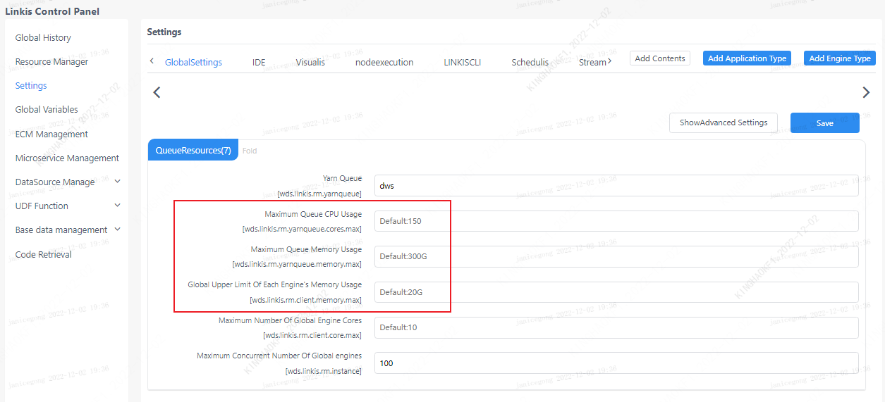
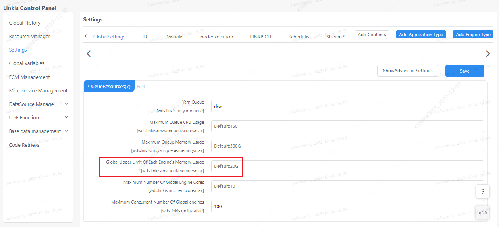
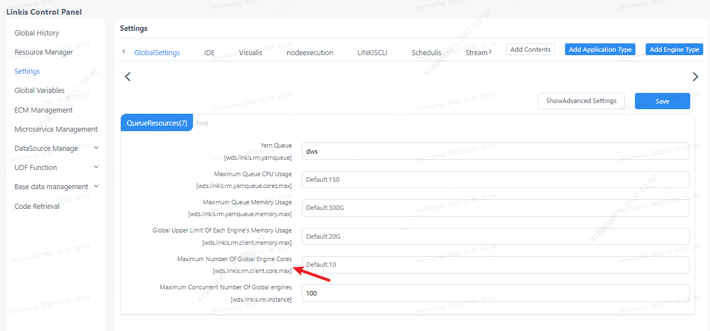
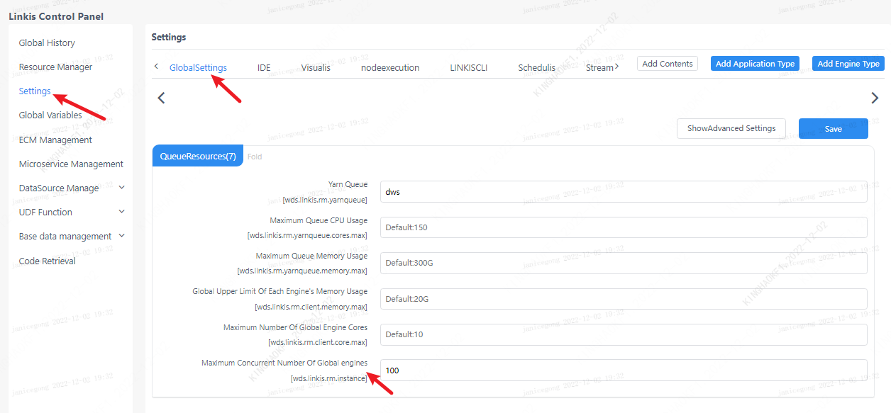

This article describes how to adjust parameters when resources such as memory and CPU are insufficient.

## 1. Insufficient queue resources
An error is reported during task execution: error code 12001, the error message queue has insufficient CPU resources, you can adjust the number of Spark executors

Click on the management console--parameter configuration--IDE--Spark--display advanced settings--woker engine resource settings (2)--adjust the concurrent number of executors

Or set the global setting to adjust the upper limit of queue resource usage.

## 2. The number of queue instances exceeds the limit

An error is reported during task execution: error code 12003, the number of error message queue instances exceeds the limit

Click Management Console--Parameter Configuration--Global Settings--Queue Resources--Maximum Number of Yarn Queue Instances [wds.linkis.rm.yarnqueue.instance.max]

## 3. Global driver memory usage limit
An error is reported during task execution: error code 12004, error message upper limit of global driver memory usage, lower driver memory can be set

Click Management Console--Parameter Configuration--Global Settings--Queue Resources--Maximum Number of Yarn Queue Memory 队列内存使用上限[wds.linkis.rm.yarnqueue.memory.max]

## 4. Exceeded the upper limit of the CPU number of the global driver

An error is reported during task execution: error code 12005, the error message exceeds the upper limit of the number of CPUs in the global drive, and idle engines can be cleaned up

Click Management Console - Parameter Configuration - Global Settings - Queue Resources - Upper Limit of The Number of Engine Cores[wds.linkis.rm.client.core.max]

Or solve it by cleaning idle engines.

## 5. Exceeded the upper limit of the engine's maximum concurrent number

An error is reported during task execution: error code 12006, the error message exceeds the maximum concurrency limit of the engine, and idle engines can be cleaned up

Click Management Console--Parameter Configuration--Global Settings--Queue Resources--Maximum concurrent number of each engine globally [wds.linkis.rm.instance]

**Spark engine**

**Hive engine**

Other engine settings are similar to Spark and Hive engines.