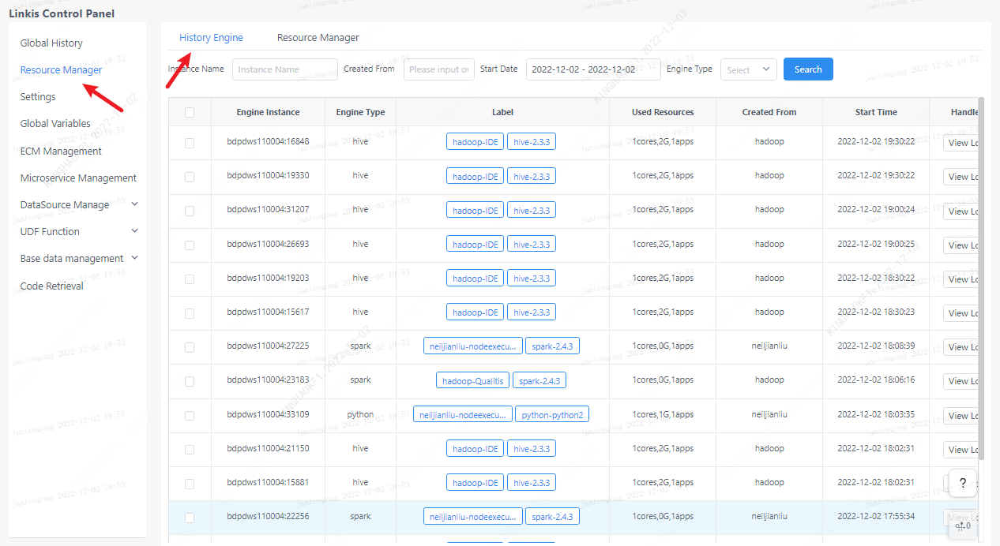
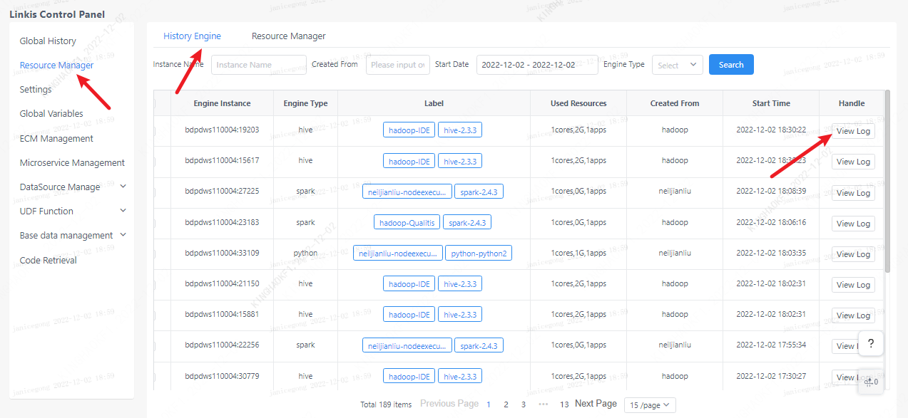
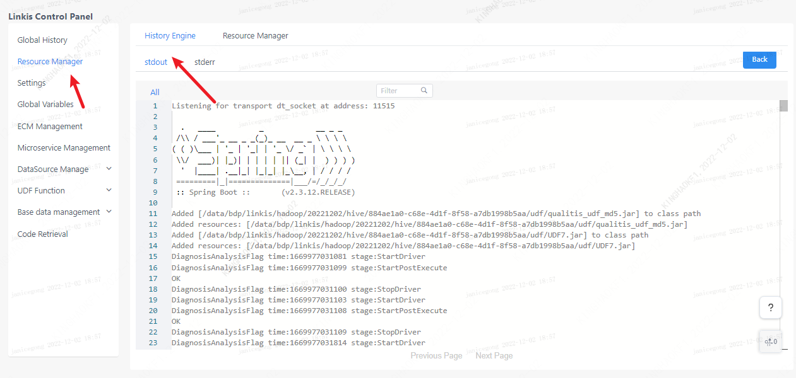
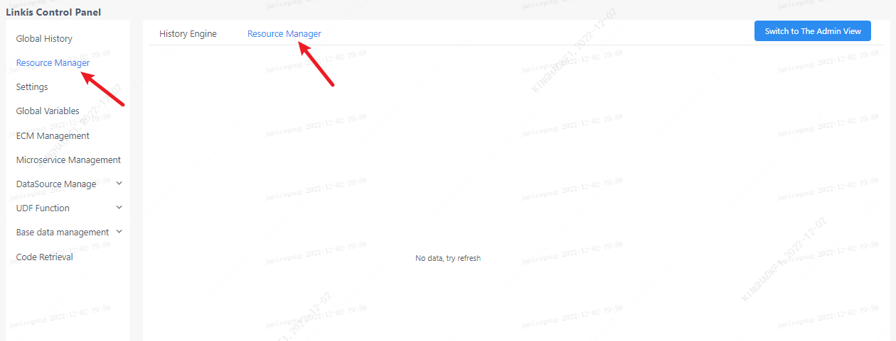
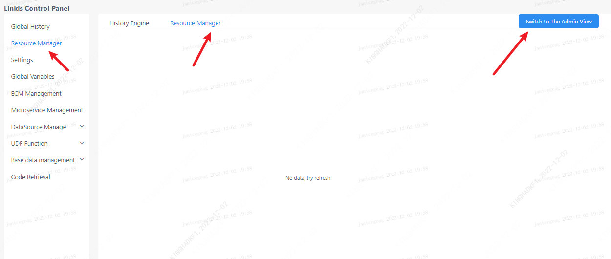

On the resource management page, you can view historically started engines and manage the status of existing engine resources.

## 1. History Engine

In the historical engine column of resource management, users can see the status of their currently started engines, including the engine type, creator, and resource occupancy. At the same time, you can also filter based on keywords such as instance name, creation user, and engine type.

## 2. Engine log
Click the view log button on the right side of the historical engine to view the engine startup log. If the engine fails to start, you can also check the cause of the failure through the error log.

## 3. Resource management
In the history engine bar of resource management, users can see the status of the engine they are currently starting and the resource usage, and they can also stop the engine through the page.

## 4. Admin view
For linkis computing console administrators, you can view all user engine resources by clicking the switch administrator view on the resource management page.

