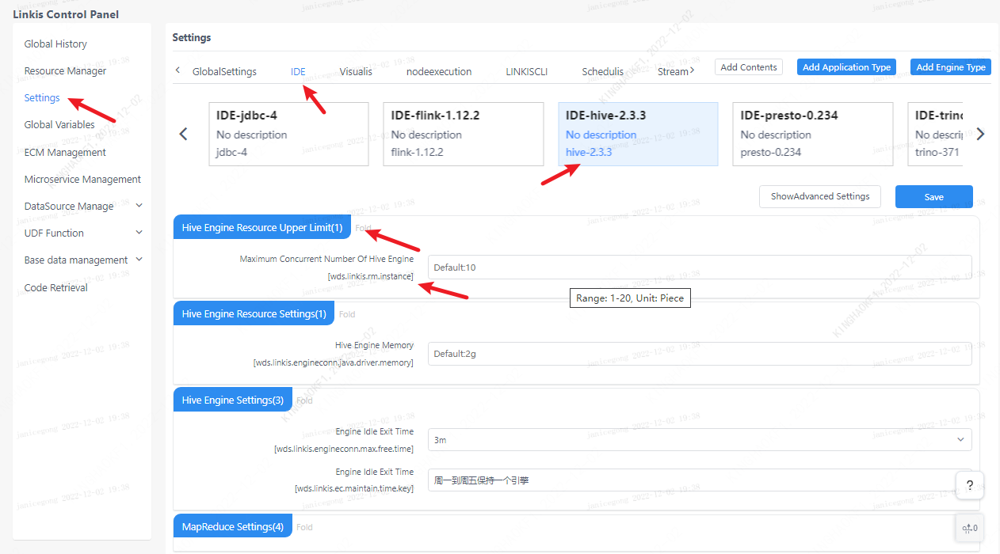
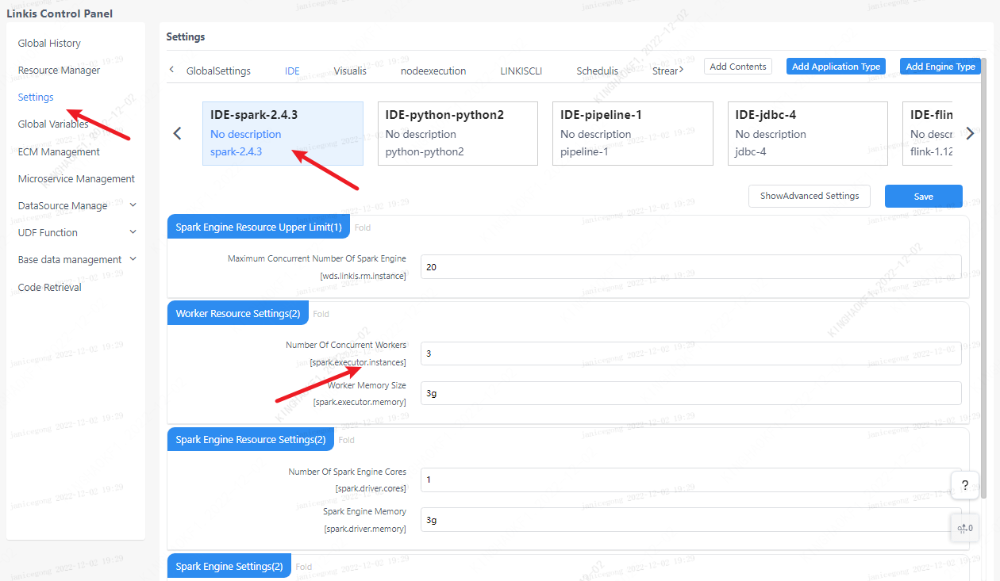
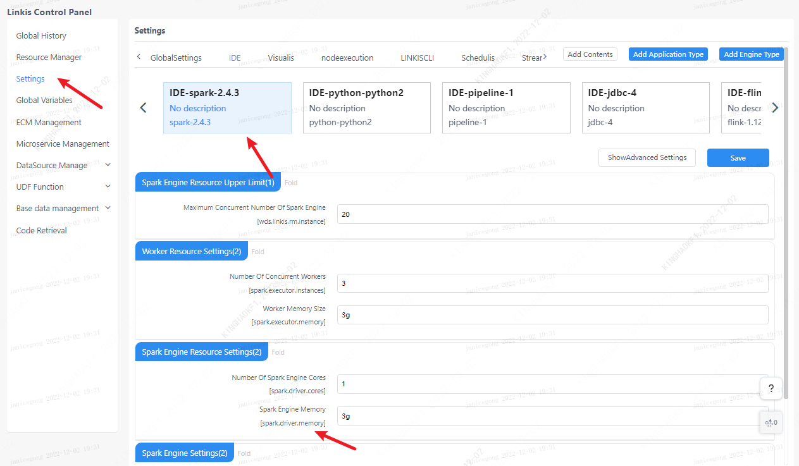

This article describes how to adjust the parameters of the Spark engine.

## 1. Adjust engine parameters

Users can adjust Spark parameters on the management console according to their needs. Linkis management console == "parameter setting ==" select the corresponding application == "click the Spark engine to display the parameters that can be set by Spark.

## 2. Increase engine execution speed

If you want the engine to execute faster, you can adjust the number of executors. The more executor cores, the higher the execution efficiency.

## 3. Driver handles big data

If you need to pull large data and then process it with the Driver, you need to adjust the driver memory parameters.

