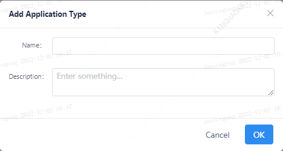

This article describes how to adjust the parameters of the Spark engine.

## 1. View or add application types

Linkis can parameterize engines in different applications. Users can create applications according to their needs.

## 2. New engine
Select the Spark engine and fill in the correct engine version.
[Check the engine version supported by Linkis](../../engine-usage/overview.md)

Note: Before adding an engine, select the corresponding application first.

## 3. Adjust engine parameters

After adding the Spark engine, click the Spark engine to display the parameters that can be set by Spark.

