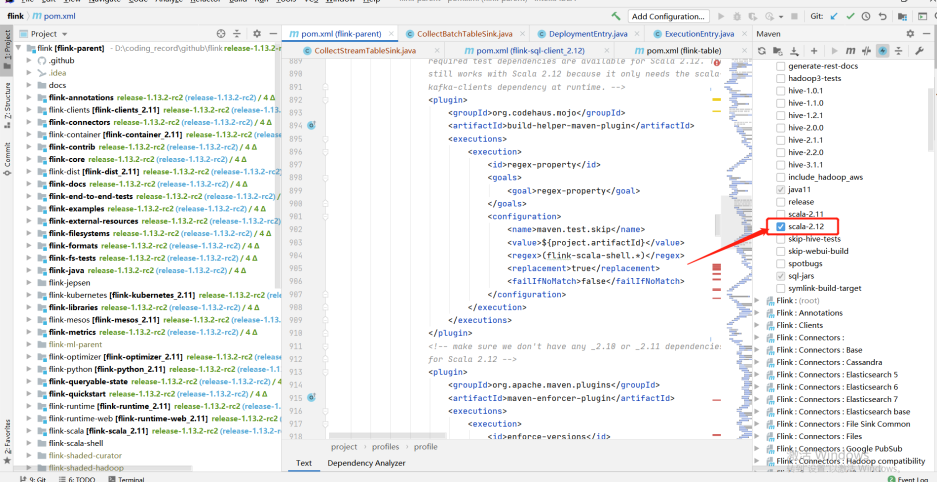
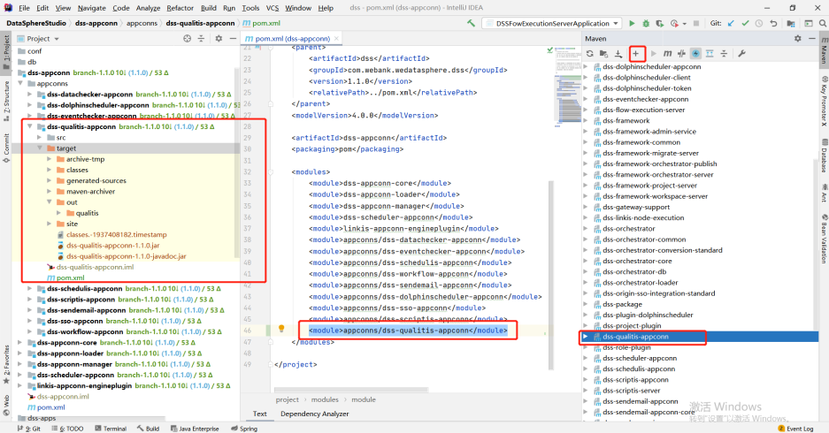
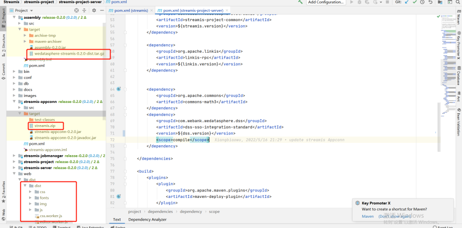
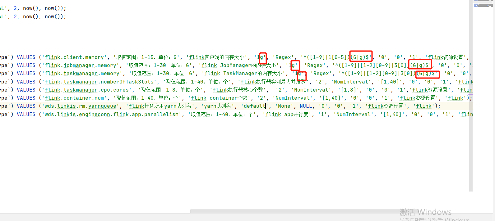

## 环境以及版本

- jdk-8 , maven-3.6.3
- node-14.15.0(是否需要自己编译前端代码调整)
- Gradle-4.6(是否编译Qualitis质量服务)
- hadoop-3.1.1,Spark-3.0.1,Hive-3.1.2,Flink-1.13.2,Sqoop-1.4.7 (Apache版本)
- linkis-1.1.1
- DataSphereStudio-1.1.0
- Schudulis-0.7.0
- Qualitis-0.9.2
- Visualis-1.0.0
- Streamis-0.2.0
- Exchangis-1.0.0
- Chrome建议100以下的版本

## 各组件场景以及版本

| 系统名字         | 版本  | 场景                                                         |
| ---------------- | ----- | ------------------------------------------------------------ |
| linkis           | 1.1.1 | 引擎编排,运行执行hive,spark,flinkSql,shell,python等,数据源统一管理等 |
| DataSphereStudio | 1.1.0 | 实现对任务的dag编排,实现整合其他系统的规范以及统一接入,提供基于SparkSql的服务Api |
| Schudulis        | 0.7.0 | 任务调度,以及调度详情和重跑,并且提供基于选择时间的补漏数据   |
| Qualitis         | 0.9.2 | 提供内置Sql的版本等功能,对常见的数据质量以及可以自定义sql,对一些不符合规则的数据进行校验并写入到对应的库中 |
| Exchangis        | 1.0.0 | Hive到Mysql,Mysql到Hive之间的数据交换                        |
| Streamis         | 0.2.0 | 流式开发应用中心                                             |
| Visualis         | 1.0.0 | 可视化报表展示,可以分享外链接                                |


## 部署顺序

  从序号3之后的顺序可以自己选择进行调整.但是在部署exchangis中需要注意一点,将exchangis的sqoop引擎插件,给copy到linkis的lib下的engine插件包下
Schedulis,Qualitis,Exchangis,Streamis,Visualis等系统,都是通过各自的appconn来与dss进行整合,注意每次整合组件-appconn后,进行重启dss对应的服务模块或者重启dss

1. linkis
1. DataSphereStudio
1. Schedulis
1. Qualitis
1. Exchangis
1. Streamis
1. Visualis


如果你集成了Skywalking的话,就可以在扩拓扑图中,看到服务的状态和连接状态,如下图

同时你也可以看清晰到在追踪中看到调用链路,如下图,也便于你定位具体服务的错误日志文件


## 依赖调整以及打包

### linkis

由于spark是采用了3.x版本的,scala也是需要升级到12版本
[原项目代码地址](https://github.com/apache/incubator-linkis/tree/release-1.1.1)
[适配修改代码参考地址](https://github.com/ruY9527/incubator-linkis/tree/release-1.1.1-hadoop3.x)

#### linkis的pom文件

```xml
<hadoop.version>3.1.1</hadoop.version>
<scala.version>2.12.10</scala.version>
<scala.binary.version>2.12</scala.binary.version>

<!-- 将hadoop-hdfs 替换成为hadoop-hdfs-client -->
<dependency>
    <groupId>org.apache.hadoop</groupId>
    <artifactId>hadoop-hdfs-client</artifactId>
    <version>${hadoop.version}</version>
```

#### linkis-hadoop-common的pom文件

```xml
       <!-- 注意这里的 <version>${hadoop.version}</version> , 根据你有没有遇到错误来进行调整 --> 
       <dependency>
            <groupId>org.apache.hadoop</groupId>
            <artifactId>hadoop-hdfs-client</artifactId>
            <version>${hadoop.version}</version>
        </dependency>
```

#### linkis-engineplugin-hive的pom文件

```xml
<hive.version>3.1.2</hive.version>
```

#### linkis-engineplugin-spark的pom文件

```xml
<spark.version>3.0.1</spark.version>
```

SparkScalaExecutor 中 getField 方法需调整下代码

```java
protected def getField(obj: Object, name: String): Object = {
    // val field = obj.getClass.getField(name)
    val field = obj.getClass.getDeclaredField("in0")
        field.setAccessible(true)
        field.get(obj)
  }
```

#### linkis-engineconn-plugin-flink的pom文件

```xml
<flink.version>1.13.2</flink.version>
```

由于flink1.12.2版本和1.13.2有些类的调整,这里目前参考社区同学给出的临时"暴力"方法: 将1.12.2部分的类给copy到1.13.2,调整scala版本到12,自己编译
涉及到flink具体的模块: flink-sql-client_${scala.binary.version}

```
-- 注意,下列的类是从1.12.2给copy到1.13.2版本来
org.apache.flink.table.client.config.entries.DeploymentEntry
org.apache.flink.table.client.config.entries.ExecutionEntry
org.apache.flink.table.client.gateway.local.CollectBatchTableSink
org.apache.flink.table.client.gateway.local.CollectStreamTableSink
```



#### linkis-engineplugin-python

[参考pr](https://github.com/apache/incubator-linkis/commit/7a26e85c53fc7cd55ddefbd78b1748b00f85ddd6)
如果linkis-engineplugin-python下的resource/python的python.py文件中,有import pandas as pd , 如果不想安装pandas的话,需对其进行移除

#### linkis-label-common

org.apache.linkis.manager.label.conf.LabelCommonConfig
修改默认版本,便于后续的自编译调度组件使用

```
    public static final CommonVars<String> SPARK_ENGINE_VERSION =
            CommonVars.apply("wds.linkis.spark.engine.version", "3.0.1");

    public static final CommonVars<String> HIVE_ENGINE_VERSION =
            CommonVars.apply("wds.linkis.hive.engine.version", "3.1.2");
```

#### linkis-computation-governance-common

org.apache.linkis.governance.common.conf.GovernanceCommonConf
修改默认版本,便于后续的自编译调度组件使用

```
  val SPARK_ENGINE_VERSION = CommonVars("wds.linkis.spark.engine.version", "3.0.1")

  val HIVE_ENGINE_VERSION = CommonVars("wds.linkis.hive.engine.version", "3.1.2")
```

#### 编译

确保以上修改和环境都有,依次执行

```shell
    cd incubator-linkis-x.x.x
    mvn -N  install
    mvn clean install -DskipTests
```

#### 编译错误

- 如果你整理进行编译的时候,出现了错误,尝试单独进入到一个模块中进行编译,看是否有错误,根据具体的错误来进行调整
- 比如下面举例(群友适配cdh低版本的时候,存在py4j版本不适配): 如果你遇到了这种问题,可以调整下有对应方法的版本来进行是否适配


### DataSphereStudio

[原项目代码地址](https://github.com/WeBankFinTech/DataSphereStudio/tree/1.1.0)
[适配修改代码参考地址](https://github.com/ruY9527/DataSphereStudio/tree/1.1.0-hadoop3.x)

#### DataSphereStudio的pom文件

由于dss依赖了linkis,所有编译dss之前编译linkis

```xml
<!-- scala 环境一致 -->
<scala.version>2.12.10</scala.version>
```

#### dss-dolphinschuduler-token

DolphinSchedulerTokenRestfulApi: 去掉类型的转换

```
responseRef.getValue("expireTime")
```

#### web调整

 [前端编译地址](https://github.com/WeBankFinTech/DataSphereStudio-Doc/blob/main/zh_CN/%E5%BC%80%E5%8F%91%E6%96%87%E6%A1%A3/%E5%89%8D%E7%AB%AF%E7%BC%96%E8%AF%91%E6%96%87%E6%A1%A3.md)
[参考pr](https://github.com/WeBankFinTech/DataSphereStudio/commit/1dc9d99648e9f78b2dfb4776df4b9f46ef530c8a)
将如下目录从master分支的内容覆盖,或者web基于master分支去build


#### 编译

```shell
    cd DataSphereStudio
    mvn -N  install
    mvn clean install -DskipTests
```

### Schedulis

[原项目代码地址](https://github.com/WeBankFinTech/Schedulis/tree/release-0.7.0)
[适配修改代码参考地址](https://github.com/ruY9527/Schedulis/tree/release-0.7.0-hadoop.x)

#### Schedulis的pom文件

```xml
       <hadoop.version>3.1.1</hadoop.version>
       <hive.version>3.1.2</hive.version>
       <spark.version>3.0.1</spark.version>
```

####  azkaban-jobtype

下载对应版本的jobtype文件(注意对应好版本): [下载地址](https://github.com/WeBankFinTech/Schedulis/blob/master/docs/schedulis_deploy_cn.md)
下载完后,将整个jobtypes放在jobtypes下


### Qualitis

[原项目代码地址](https://github.com/WeBankFinTech/Qualitis/tree/release-0.9.2)

#### forgerock包下载

[release地址](https://github.com/WeBankFinTech/Qualitis/releases) 下的[release-0.9.1](https://github.com/WeBankFinTech/Qualitis/releases/tag/release-0.9.1),解压完后放在.m2\repository\org下即可.

#### 编译

gradle建议使用4.6

```shell
cd Qualitis
gradle clean distZip
```

编译完后,会再qualitis下有一个qualitis-0.9.2.zip文件


#### dss-qualitis-appconn编译

将appconn内从给copy到DataSphereStudio下的appconns中(创建dss-qualitis-appconn文件夹),如下图
对dss-qualitis-appconn进行编译,out下的qualitis就是dss整合qualitis的包


### Exchangis

[原项目代码地址](https://github.com/WeBankFinTech/Exchangis/tree/release-1.0.0)
[适配修改代码参考地址](https://github.com/ruY9527/Exchangis/tree/release-1.0.0-hadoop3.x)

#### Exchangis的pom文件

```xml
<!-- scala 版本保持一致 -->
<scala.version>2.12.10</scala.version>
```

#### 后端编译

[官方编译文档](https://github.com/WeBankFinTech/Exchangis/blob/dev-1.0.0/docs/zh_CN/ch1/exchangis_deploy_cn.md)
assembly-package的target包中wedatasphere-exchangis-1.0.0.tar.gz是自身的服务包
linkis-engineplugin-sqoop是需要放入linkis中(lib/linkis-engineconn-plugins)
exchangis-appconn.zip是需要放入dss中(dss-appconns)

```xml
mvn clean install 
```


#### 前端编译

如果前端你是自己用nginx部署的话,需要注意是拿到dist下面dist文件夹


### Visualis

[原项目代码地址](https://github.com/WeBankFinTech/Visualis/tree/v1.0.0)
[适配修改代码参考地址](https://github.com/ruY9527/Visualis/tree/v1.0.0-hadoop3.x)

#### Visualis的pom文件

```xml
<scala.version>2.12.10</scala.version>
```

#### 编译

 [官方编译文档](https://github.com/WeBankFinTech/Visualis/blob/master/visualis_docs/zh_CN/Visualis_deploy_doc_cn.md)
assembly下的target中visualis-server-zip是自身服务的包
visualis-appconn的target是visualis.zip是dss需要的包(dss-appconns)
build是前端打出来的包

```xml
cd Visualis
mvn -N install
mvn clean package -DskipTests=true
```


### Streamis

[原项目代码地址](https://github.com/WeBankFinTech/Streamis/tree/0.2.0)
[适配修改代码参考地址](https://github.com/ruY9527/Streamis/tree/0.2.0-hadoop3.x)

#### Streamis的pom文件

```xml
<scala.version>2.12.10</scala.version>
```

streamis-project-server的pom文件

```xml
       <!-- 如果你这里是1.0.1的话,就调整到${dss.version} -->
       <dependency>
            <groupId>com.webank.wedatasphere.dss</groupId>
            <artifactId>dss-sso-integration-standard</artifactId>
            <version>${dss.version}</version>
            <scope>compile</scope>
        </dependency>
```

#### 编译

 [官方编译文档](https://github.com/WeBankFinTech/Streamis/blob/main/docs/zh_CN/0.2.0/Streamis%E5%AE%89%E8%A3%85%E6%96%87%E6%A1%A3.md)
assembly下target包wedatasphere-streamis-0.2.0-dist.tar.gz是自身后端服务的包
streamis-appconn下target的streamis.zip包是dss需要的(dss-appconns)
dist下的dist是前端的包

```xml
cd ${STREAMIS_CODE_HOME}
mvn -N install
mvn clean install
```



## 安装部署

[官方部署地址](https://linkis.apache.org/zh-CN/docs/1.1.1/deployment/quick-deploy)
[常见错误地址](https://linkis.apache.org/zh-CN/blog/2022/02/21/linkis-deploy)

### 路径统一

建议将相关的组件,部署同一个路径(比如我这里全部解压在/home/hadoop/application下)


### linkis部署注意点

#### deploy-config文件夹

db.sh中, MYSQL配置的linkis连接的地址,HIVE的元数据连接地址
linkis-env.sh

```shell
-- 保存script脚本的路径,下一次会有一个用户名字的文件夹,对应用户的脚本就存放在该文件夹中
WORKSPACE_USER_ROOT_PATH=file:///home/hadoop/logs/linkis
-- 存放物料以及引擎执行的log文件
HDFS_USER_ROOT_PATH=hdfs:///tmp/linkis
-- 引擎每次执行的log以及启动engineConnExec.sh相关的信息
ENGINECONN_ROOT_PATH=/home/hadoop/logs/linkis/apps
-- Yarn主节点访问地址(Active resourcemanager)
YARN_RESTFUL_URL
-- Hadoop/Hive/Spark的conf地址
HADOOP_CONF_DIR
HIVE_CONF_DIR
SPARK_CONF_DIR
-- 指定对应的版本
SPARK_VERSION=3.0.1
HIVE_VERSION=3.1.2
-- 指定linkis安装后的路径,比如我这里就同意指定在对应组件下的路径
LINKIS_HOME=/home/hadoop/application/linkis/linkis-home
```

#### flink

如果你使用了flink的话,可以尝试从 [flink-engine.sql](./img/flink-engine.sql) 导入到linkis的数据库中.

需要修改@FLINK_LABEL版本为自己对应的版本,yarn的队列默认是default.

同时这个版本,如果你遇见了"1G"转换数字类型的错误,尝试去掉1g的单位以及正则校验的规则.参考如下:



#### lzo使用

如果你的hive使用了lzo的话,将对应的lzo的jar包给copy到hive路径下.比如下面路径:

```
lib/linkis-engineconn-plugins/hive/dist/v3.1.2/lib
```

#### 常见问题注意点

- Mysql的驱动包一定要copy到/lib/linkis-commons/public-module/和/lib/linkis-spring-cloud-services/linkis-mg-gateway/
- 初始化密码在conf/linkis-mg-gateway.properties中的wds.linkis.admin.password
- ps-cs 在启动脚本中,有可能存在存在失败的情况,如果有的话,使用 sh linkis-daemon.sh ps-cs , 对其进行单独启动
- 目前日志是有时间备份的话,有时候之前的错误日志找不到的话,可能是备份到对应日期的文件夹里去了
- 目前lib/linkis-engineconn-plugins是默认只有spark/shell/python/hive,如果你想要appconn,flink,sqoop就分别去dss中,linkis和exchangis中获取
- 配置文件版本检查

```shell
linkis.properties中,flink看有没有使用
wds.linkis.spark.engine.version=3.0.1
wds.linkis.hive.engine.version=3.1.2
wds.linkis.flink.engine.version=1.13.2
```


#### 错误记录

1. 版本不兼容,如果你遇到了下面这种错误的话,是scala版本是否没有完全保持一致,检查后再编译一下即可.


2. yarn配置Active节点地址,如果是配置了Standby地址的话,就会出现如下的错误


3. 

### DSS部署注意点

[官方安装文档](https://github.com/WeBankFinTech/DataSphereStudio-Doc/tree/main/zh_CN)

#### config文件夹

db.sh: 配置dss的数据库
config.sh

```shell
-- dss的安装路径,比如我这里就定义在dss下的文件夹中
DSS_INSTALL_HOME=/home/hadoop/application/dss/dss
```

#### conf文件夹

dss.properties

```properties
# 主要检查spark/hive等版本有,如果没有,就追加上
wds.linkis.spark.engine.version=3.0.1
wds.linkis.hive.engine.version=3.1.2
wds.linkis.flink.engine.version=1.13.2
```

dss-flow-execution-server.properties

```properties
# 主要检查spark/hive等版本有,如果没有,就追加上
wds.linkis.spark.engine.version=3.0.1
wds.linkis.hive.engine.version=3.1.2
wds.linkis.flink.engine.version=1.13.2
```

如果调度是想使用dolphinscheduler的话,请参数这个pr添加对应的spark/hive版本
[参考pr](https://github.com/WeBankFinTech/DataSphereStudio/pull/914/files)

#### dss-appconns

exchangis,qualitis,streamis,visualis 都分别要从 Exchangis , Qualitis , Streamis, Visualis 的项目去获取

#### 常见问题注意点

- 由于dss我们整合了schedulis,qualitis,exchangis等组件,所有创建一个项目会同步调用这些组件的接口创建,所以确保dss_appconn_instance中的配置路径都是正确的,可以访问的
- chrome浏览器建议内核使用10版本一下的,否则会出现你可以单独Scdulis,Qaulitis等组件,但是却无法通过dss登录成功问题
- hostname和ip,如果是使用ip访问的话,执行appconn-install.sh安装的时候,也确保是ip. 否则会出现访问其他组件的时候,会提示没有登录或者没有权限


### Schedulis部署注意点

 [官方部署文档](https://github.com/WeBankFinTech/Schedulis/blob/master/docs/schedulis_deploy_cn.md)

#### conf文件夹

azkaban.properties

```properties
# azkaban.jobtype.plugin.dir和executor.global.properties这里最好改成绝对路径
# Azkaban JobTypes Plugins
azkaban.jobtype.plugin.dir=/home/hadoop/application/schedulis/apps/schedulis_0.7.0_exec/plugins/jobtypes

# Loader for projects
executor.global.properties=/home/hadoop/application/schedulis/apps/schedulis_0.7.0_exec/conf/global.properties

# 引擎的版本
wds.linkis.spark.engine.version=3.0.1
wds.linkis.hive.engine.version=3.1.2
wds.linkis.flink.engine.version=1.13.2
```

#### web模块

plugins/viewer/system/conf:  这里需要配置数据库连接地址,与schedulis保持一致
azkaban.properties:  用户参数和系统管理的配置

```properties
viewer.plugins=system
viewer.plugin.dir=/home/hadoop/application/schedulis/apps/schedulis_0.7.0_web/plugins/viewer
```

#### 常见问题注意点

如果出现资源或者web界面出现没有css等静态文件的话,将相关的路径修改为绝对路径
如果出现配置文件加载不到的问题,也可以将路径修改为绝对路径
比如:

```
### web模块中
web.resource.dir=/home/hadoop/application/schedulis/apps/schedulis_0.7.0_web/web/
viewer.plugin.dir=/home/hadoop/application/schedulis/apps/schedulis_0.7.0_web/plugins/viewer

### exec模块中
azkaban.jobtype.plugin.dir=/home/hadoop/application/schedulis/apps/schedulis_0.7.0_exec/plugins/jobtypes
executor.global.properties=/home/hadoop/application/schedulis/apps/schedulis_0.7.0_exec/conf/global.properties
```

### Qualitis部署注意点

[官方部署文档](https://github.com/WeBankFinTech/Qualitis/blob/master/docs/zh_CN/ch1/%E5%BF%AB%E9%80%9F%E6%90%AD%E5%BB%BA%E6%89%8B%E5%86%8C%E2%80%94%E2%80%94%E5%8D%95%E6%9C%BA%E7%89%88.md)

#### conf文件夹

application-dev.yml

```properties
  # 这里配置正确的spark版本
  spark:
    application:
      name: IDE
      reparation: 50
    engine:
      name: spark
      version: 3.0.1
```

### Exchangis部署注意点

[官方部署文档](https://github.com/WeBankFinTech/Exchangis/blob/dev-1.0.0/docs/zh_CN/ch1/exchangis_deploy_cn.md)

#### 常见问题注意点

如果点击数据源出现没有发布的错误的话,可以尝试将linkis_ps_dm_datasource的published_version_id值修改为1(如果是null的话)

### Visualis

[官方部署文档](https://github.com/WeBankFinTech/Visualis/blob/master/visualis_docs/zh_CN/Visualis_deploy_doc_cn.md)

#### 常见问题注意点

如果出现预览视图一致出不来的话,请检查bin/phantomjs该文件是否完整上传.
如果能看到如下结果的话,说明是上传是完整的

```properties
./phantomjs -v
2.1.1
```

### Streamis

 [官方部署文档](https://github.com/WeBankFinTech/Streamis/blob/main/docs/zh_CN/0.2.0/Streamis%E5%AE%89%E8%A3%85%E6%96%87%E6%A1%A3.md)

### dss-appconn

qualitis,exchangis,streamis,visualis是分别要从各种的模块中编译好,copy到dss下的dss-appconns中,然后执行bin下的appconn-install.sh来为各自的组件进行安装
如果你在整合的时候,如果到一些如下的Sql脚本错误的话,请检测错误的Sql周边是否有注释,如果有的话,删掉注释再重新appconn-install一遍尝试

比如qualitis举例,下面的ip和host端口,根据自己具体使用的来

```
qualitis
172.21.129.78
8090
```

## Nginx部署举例

 linkis.conf:   dss/linkis/visualis 前端
 exchangis.conf:  exchangis前端
 streamis.conf:      streamis前端
 Schedulis和Qualitis是分别在自己项目中.
 linkis/visualis需要将前端打包出来的dist或者build在这里修改为对应组件的名字


#### linkis.conf

```
server {
listen       8089;# 访问端口
server_name  localhost;
#charset koi8-r;
#access_log  /var/log/nginx/host.access.log  main;

location /dss/visualis {
# 修改为自己的前端路径
root   /home/hadoop/application/webs; # 静态文件目录
autoindex on;
}

location /dss/linkis {
# 修改为自己的前端路径
root   /home/hadoop/application/webs; # linkis管理台的静态文件目录
autoindex on;
}

location / {
# 修改为自己的前端路径
root   /home/hadoop/application/webs/dist; # 静态文件目录
#root /home/hadoop/dss/web/dss/linkis;
index  index.html index.html;
}

location /ws {
proxy_pass http://172.21.129.210:9001;#后端Linkis的地址
proxy_http_version 1.1;
proxy_set_header Upgrade $http_upgrade;
proxy_set_header Connection upgrade;
}

location /api {
proxy_pass http://172.21.129.210:9001; #后端Linkis的地址
proxy_set_header Host $host;
proxy_set_header X-Real-IP $remote_addr;
proxy_set_header x_real_ipP $remote_addr;
proxy_set_header remote_addr $remote_addr;
proxy_set_header X-Forwarded-For $proxy_add_x_forwarded_for;
proxy_http_version 1.1;
proxy_connect_timeout 4s;
proxy_read_timeout 600s;
proxy_send_timeout 12s;
proxy_set_header Upgrade $http_upgrade;
proxy_set_header Connection upgrade;
}

#error_page  404              /404.html;
# redirect server error pages to the static page /50x.html
#
error_page   500 502 503 504  /50x.html;
location = /50x.html {
root   /usr/share/nginx/html;
}
}

```

#### exchangis.conf

```
server {
            listen       9800; # 访问端口 如果该端口被占用，则需要修改
            server_name  localhost;
            #charset koi8-r;
            #access_log  /var/log/nginx/host.access.log  main;
            location / {
            # 修改为自己路径
            root   /home/hadoop/application/webs/exchangis/dist/dist; # Exchangis 前端部署目录
            autoindex on;
            }

            location /api {
            proxy_pass http://172.21.129.210:9001;  # 后端Linkis的地址，需要修改
            proxy_set_header Host $host;
            proxy_set_header X-Real-IP $remote_addr;
            proxy_set_header x_real_ipP $remote_addr;
            proxy_set_header remote_addr $remote_addr;
            proxy_set_header X-Forwarded-For $proxy_add_x_forwarded_for;
            proxy_http_version 1.1;
            proxy_connect_timeout 4s;
            proxy_read_timeout 600s;
            proxy_send_timeout 12s;
            proxy_set_header Upgrade $http_upgrade;
            proxy_set_header Connection upgrade;
            }

            #error_page  404              /404.html;
            # redirect server error pages to the static page /50x.html
            #
            error_page   500 502 503 504  /50x.html;
            location = /50x.html {
            root   /usr/share/nginx/html;
            }
        }

```

#### streamis.conf

```
server {
    listen       9088;# 访问端口 如果该端口被占用，则需要修改
    server_name  localhost;
    location / {
    # 修改为自己的路径
        root   /home/hadoop/application/webs/streamis/dist/dist; # 请修改成Streamis前端的静态文件目录
        index  index.html index.html;
    }
    location /api {
    proxy_pass http://172.21.129.210:9001; #后端Linkis的地址,请修改成Linkis网关的ip和端口
    proxy_set_header Host $host;
    proxy_set_header X-Real-IP $remote_addr;
    proxy_set_header x_real_ipP $remote_addr;
    proxy_set_header remote_addr $remote_addr;
    proxy_set_header X-Forwarded-For $proxy_add_x_forwarded_for;
    proxy_http_version 1.1;
    proxy_connect_timeout 4s;
    proxy_read_timeout 600s;
    proxy_send_timeout 12s;
    proxy_set_header Upgrade $http_upgrade;
    proxy_set_header Connection upgrade;
    }

    #error_page  404              /404.html;
    # redirect server error pages to the static page /50x.html
    #
    error_page   500 502 503 504  /50x.html;
    location = /50x.html {
    root   /usr/share/nginx/html;
    }
}
```

