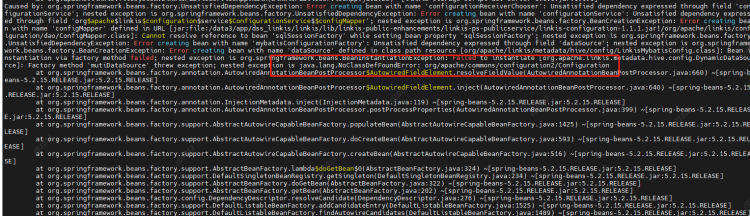
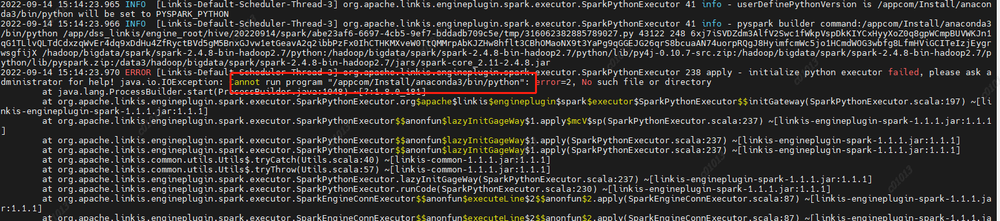
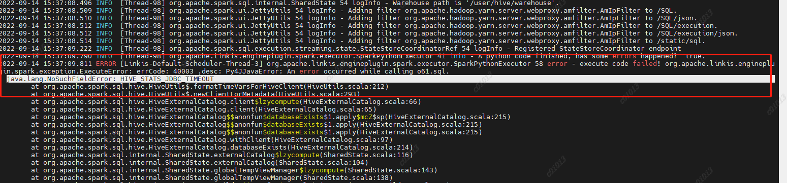

### 前言

随着业务的发展和社区产品的更新迭代，我们发现Linkis1.X在资源管理，引擎管理方面有极大的性能提升，可以更好的满足数据中台的建设。相较于0.9.3版本和我们之前使用的平台， 在用户体验方面也得到很大的提升，任务失败页面无法方便查看详情等问题也都得到改善，因此决定升级Linkis以及WDS套件，那么如下是具体的实践操作，希望给大家带来参考。 

## 一、环境

#### CDH6.3.2 各组件版本

- hadoop:3.0.0-cdh6.3.2
- hive:2.1.1-cdh6.3.2
- spark：2.4.8

#### 硬件环境

2台 128G 云物理机

## 二、Linkis安装部署

### 2.1编译代码or release安装包？

本次安装部署采用的是**release安装包**方式部署。为了适配司内CDH6.3.2版本，hadoop和hive的相关依赖包需要替换成CDH6.3.2版本，这里采用的是直接替换安装包的方式。需要替换的依赖包与模块如下l列表所示。

```
--涉及到的模块
linkis-engineconn-plugins/spark
linkis-engineconn-plugins/hive
/linkis-commons/public-module
/linkis-computation-governance/
```


```
-----需要更换cdh包的列表
./lib/linkis-engineconn-plugins/spark/dist/v2.4.8/lib/hive-shims-0.23-2.1.1-cdh6.3.2.jar
./lib/linkis-engineconn-plugins/spark/dist/v2.4.8/lib/hive-shims-scheduler-2.1.1-cdh6.3.2.jar
./lib/linkis-engineconn-plugins/spark/dist/v2.4.8/lib/hadoop-annotations-3.0.0-cdh6.3.2.jar
./lib/linkis-engineconn-plugins/spark/dist/v2.4.8/lib/hadoop-auth-3.0.0-cdh6.3.2.jar
./lib/linkis-engineconn-plugins/spark/dist/v2.4.8/lib/hadoop-common-3.0.0-cdh6.3.2.jar
./lib/linkis-engineconn-plugins/spark/dist/v2.4.8/lib/hadoop-hdfs-3.0.0-cdh6.3.2.jar
./lib/linkis-engineconn-plugins/spark/dist/v2.4.8/lib/hadoop-hdfs-client-3.0.0-cdh6.3.2.jar
./lib/linkis-engineconn-plugins/hive/dist/v2.1.1/lib/hadoop-client-3.0.0-cdh6.3.2.jar
./lib/linkis-engineconn-plugins/hive/dist/v2.1.1/lib/hadoop-mapreduce-client-common-3.0.0-cdh6.3.2.jar
./lib/linkis-engineconn-plugins/hive/dist/v2.1.1/lib/hadoop-mapreduce-client-jobclient-3.0.0-cdh6.3.2.jar
./lib/linkis-engineconn-plugins/hive/dist/v2.1.1/lib/hadoop-yarn-api-3.0.0-cdh6.3.2.jar
./lib/linkis-engineconn-plugins/hive/dist/v2.1.1/lib/hadoop-yarn-client-3.0.0-cdh6.3.2.jar
./lib/linkis-engineconn-plugins/hive/dist/v2.1.1/lib/hadoop-yarn-server-common-3.0.0-cdh6.3.2.jar
./lib/linkis-engineconn-plugins/hive/dist/v2.1.1/lib/hadoop-hdfs-client-3.0.0-cdh6.3.2.jar
./lib/linkis-engineconn-plugins/hive/dist/v2.1.1/lib/hadoop-mapreduce-client-core-3.0.0-cdh6.3.2.jar
./lib/linkis-engineconn-plugins/hive/dist/v2.1.1/lib/hadoop-mapreduce-client-shuffle-3.0.0-cdh6.3.2.jar
./lib/linkis-engineconn-plugins/hive/dist/v2.1.1/lib/hadoop-yarn-common-3.0.0-cdh6.3.2.jar
./lib/linkis-engineconn-plugins/flink/dist/v1.12.2/lib/hadoop-annotations-3.0.0-cdh6.3.2.jar
./lib/linkis-engineconn-plugins/flink/dist/v1.12.2/lib/hadoop-auth-3.0.0-cdh6.3.2.jar
./lib/linkis-engineconn-plugins/flink/dist/v1.12.2/lib/hadoop-mapreduce-client-core-3.0.0-cdh6.3.2.jar
./lib/linkis-engineconn-plugins/flink/dist/v1.12.2/lib/hadoop-yarn-api-3.0.0-cdh6.3.2.jar
./lib/linkis-engineconn-plugins/flink/dist/v1.12.2/lib/hadoop-yarn-client-3.0.0-cdh6.3.2.jar
./lib/linkis-engineconn-plugins/flink/dist/v1.12.2/lib/hadoop-yarn-common-3.0.0-cdh6.3.2.jar
./lib/linkis-commons/public-module/hadoop-annotations-3.0.0-cdh6.3.2.jar
./lib/linkis-commons/public-module/hadoop-auth-3.0.0-cdh6.3.2.jar
./lib/linkis-commons/public-module/hadoop-common-3.0.0-cdh6.3.2.jar
./lib/linkis-commons/public-module/hadoop-hdfs-client-3.0.0-cdh6.3.2.jar
./lib/linkis-computation-governance/linkis-cg-linkismanager/hadoop-annotations-3.0.0-cdh6.3.2.jar
./lib/linkis-computation-governance/linkis-cg-linkismanager/hadoop-auth-3.0.0-cdh6.3.2.jar
./lib/linkis-computation-governance/linkis-cg-linkismanager/hadoop-yarn-api-3.0.0-cdh6.3.2.jar
./lib/linkis-computation-governance/linkis-cg-linkismanager/hadoop-yarn-client-3.0.0-cdh6.3.2.jar
./lib/linkis-computation-governance/linkis-cg-linkismanager/hadoop-yarn-common-3.0.0-cdh6.3.2.jar

```

### 2.2部署过程中遇到的问题

1、kerberos配置
需要在linkis.properties公共配置中添加
各个引擎conf也需要添加

```
wds.linkis.keytab.enable=true
wds.linkis.keytab.file=/hadoop/bigdata/kerberos/keytab
wds.linkis.keytab.host.enabled=false
wds.linkis.keytab.host=your_host
```

2、更换Hadoop依赖包后启动报错java.lang.NoClassDefFoundError:org/apache/commons/configuration2/Configuration


原因：Configuration类冲突，在linkis-commons模块下在添加一个commons-configuration2-2.1.1.jar解决冲突

3、script中运行spark、python等报错no plugin for XXX
现象：在配置文件中修改完spark/python的版本后，启动引擎报错no plugin for XXX

原因：LabelCommonConfig.java和GovernaceCommonConf.scala这两个类中写死了引擎的版本，修改相应版本，编译后替换掉linkis以及其他组件（包括schedulis等）里面所有包含这两个类的jar（linkis-computation-governance-common-1.1.1.jar和linkis-label-common-1.1.1.jar）

4、python引擎执行报错，初始化失败

- 修改python.py,移除引入pandas模块

- 配置python加载目录，修改python引擎的linkis-engineconn.properties

  ```
  pythonVersion=/usr/local/bin/python3.6
  ```

  

5、运行pyspark任务失败报错

原因：未设置PYSPARK_VERSION
解决方法：
在/etc/profile下设置两个参数

```
export PYSPARK_PYTHON=/usr/local/bin/python3.6

export PYSPARK_DRIVER_PYTHON=/usr/local/bin/python3.6
```


6、执行pyspark任务报错
java.lang.NoSuchFieldError: HIVE_STATS_JDBC_TIMEOUT

原因：spark2.4.8里面使用的是hive1.2.1的包，但是我们的hive升级到了2.1.1版本，hive2里面已经去掉了这个参数，然后spark-sql里面的代码依然是要调用hive的这个参数的，然后就报错了，
所以在spark-sql/hive代码中删除掉了HIVE_STATS_JDBC_TIMEOUT这个参数，重新编译后打包，替换spark2.4.8中的spark-hive_2.11-2.4.8.jar


7、jdbc引擎执行出现代理用户异常

现象：用A用户去执行一个jdbc任务1，引擎选了可以复用，然后我也用B用户去执行一个jdbc任务2，发现 任务2的提交人是A
分析原因：
ConnectionManager::getConnection

这里创建datasource的时候是根据key来判断是否创建，而这个key是jdbc url ，但这种粒度可能有点大，因为有可能是不同的用户去访问同一个数据源，比如说hive,他们的url是一样的，但是账号密码是不一样的，所以当第一个用户去创建datasource时，username已经指定了，第二个用户进来的时候，发现这个数据源存在，就直接拿这个数据源去用，而不是创建一个新的datasource，所以造成了用户B提交的代码通过A去执行了。  
解决方法：数据源缓存map的key粒度降低，改成jdbc.url+jdbc.user。


## 三、DSS部署

安装过程参考官网文档进行安装配置，下面说明一下在安装调试过程中遇到的一些事项。

#### 3.1 DSS 左侧数据库展示的数据库列表显示不全

分析：DSS数据源模块显示的数据库信息是来源于hive的元数据库，但由于CDH6中通过sentry进行权限控制，大部分的hive表元数据信息没有存在于hive metastore中，所以展示的数据存在缺失。
解决方法：
将原有逻辑改造成使用jdbc链接hive的方式，从jdbc中获取表数据展示。
简单逻辑描述：
jdbc的properties信息通过linkis控制台配置的IDE-jdbc的配置信息获取。
DBS：通过connection.getMetaData()获取schema
TBS：connection.getMetaData().getTables()获取对应db下的tables
COLUMNS:通过执行describe  table 获取表的columns信息

#### 3.2 DSS 工作流中执行jdbc脚本报错 jdbc.name is empty

分析：dss workflow中默认执行的creator是Schedulis，由于在管理台中未配置Schedulis的相关引擎参数，导致读取的参数全为空。
在控制台中添加Schedulis的Category时报错，”Schedulis目录已存在“。由于调度系统中的creator是schedulis，导致无法添加Schedulis Category,为了更好的标识各个系统，所以将dss workflow中默认执行的creator改成nodeexcetion，该参数可以在dss-flow-execution-server.properties中添加wds.linkis.flow.job.creator.v1=nodeexecution一行配置即可。