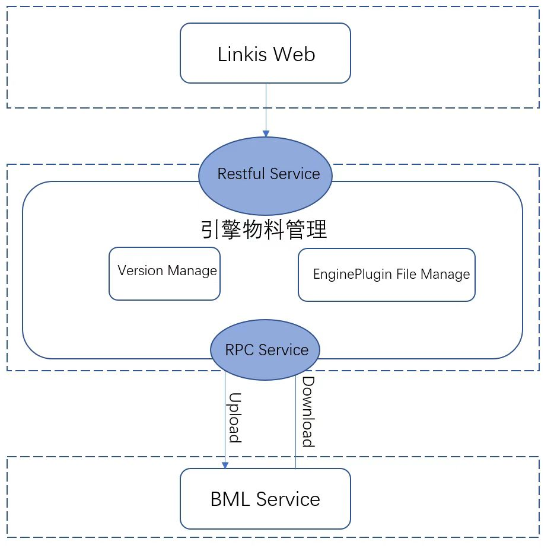

# 总览

## 背景

引擎物料管理是linkis引擎物料管理系统，主要用来管理Linkis的引擎物料文件，存储用户的各种引擎文件，包括引擎类型、引擎版本等信息。总体流程为压缩文件经前端浏览器上传至物料库（BML），物料压缩文件解压、校验，需要执行时如果发现本地不存在该引擎，则需要去物料库中寻找并下载安装注册从而执行。

具备以下功能点：

1)、支持上传打包好的引擎文件，上传文件大小受nginx的配置影响，文件类型为zip文件类型，在windows环境下自行打包zip压缩文件不支持。

2)、支持对已有的引擎物料进行更新，更新后在BML中新增一个bml引擎物料的存储版本，可以对当前的版本进行回滚和删除。

3)、一个引擎涉及两个引擎物料，分别是lib和conf，可以进行分别管理。

## 架构图

## 架构说明

1、引擎物料管理在Linkis web管理台中，需要管理员权限，在开发调试时需要设置测试环境下的管理员字段。

2、引擎物料管理涉及引擎物料文件的增加、更新、删除，物料文件分为lib和conf分别存储。文件中涉及两个版本的概念，一个是引擎本身的版本，另一个则是物料版本，在更新操作中物料如果存在修改则会新增一个物料版本并将其存储在BML中，支持物料版本的删除和回滚。

3、利用BML Service对引擎物料文件进行存储，通过RPC调用BML的服务对文件进行存储，得到存储的资源id和版本并保存。

### 核心流程

1. 上传zip类型的引擎插件文件，先存储在引擎插件Home目录中并解压文件，之后进行启动刷新程序。
2. 对解压后的引擎文件中的conf、lib目录进行压缩，上传至BML（物料管理系统）中，分别获取对应的BML的资源id和资源版本，读取对应引擎名称和版本信息。
3. 在引擎物料资源表中，新增引擎物料的记录，每次上传都会分别产生lib和conf两条数据。除了记录这个引擎的名称和类型信息外，最重要的是记录了该引擎在物料管理系统中的信息，包括引擎的资源id和版本信息，关联至BML中的资源表。

## 数据库设计

引擎物料资源信息表(linkis_cg_engine_conn_plugin_bml_resources)

| 字段名 | 作用  | 备注  |
| --- | --- | --- |
| id  | 引擎物料包标识id | Primary key |
| engine_conn_type | 存放资源的位置 | 如Spark |
| version | 引擎的版本 | 如Spark的v2.4.3 |
| file_name | 引擎文件名 | 如lib.zip |
| file_size | 引擎文件大小 |     |
| last_modified | 文件最后的修改时间 |     |
| bml_resource_id | 记录资源在BML（物料管理系统）中的id | 用于在BML中标识引擎文件的id |
| bml_resource_version | 记录资源在BML中的版本 | 如v000001 |
| create_time | 资源的创建时间 |     |
| last_update_time | 资源最后的更新时间 |     |