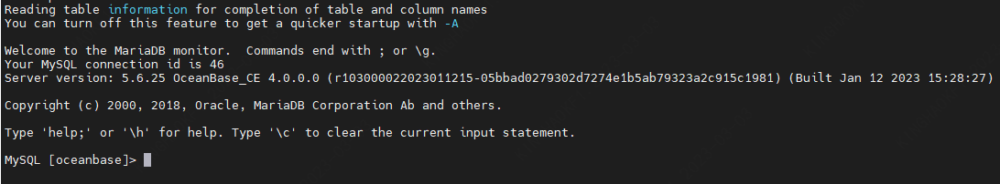
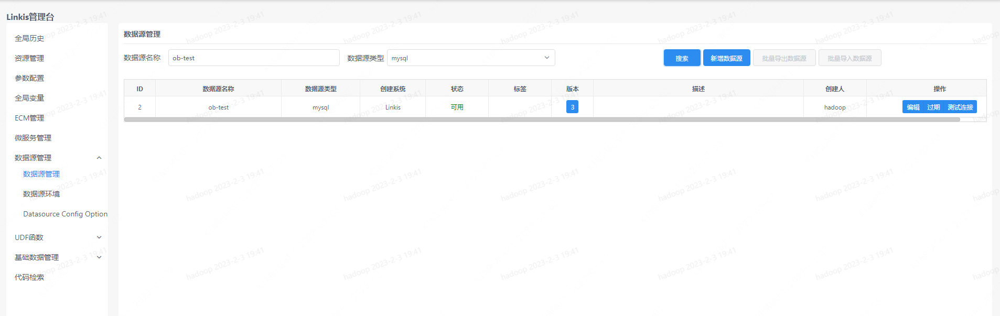
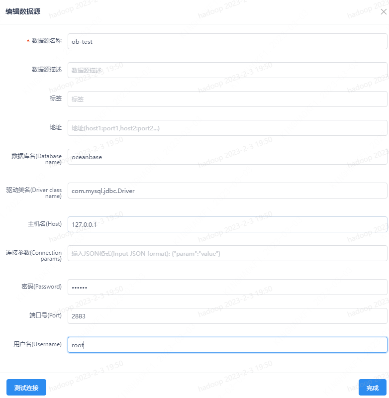
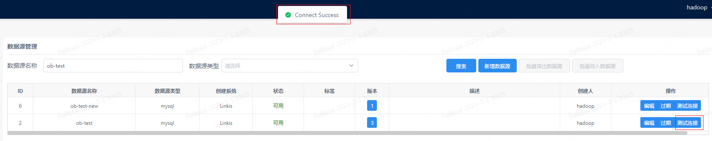
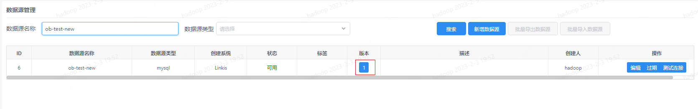
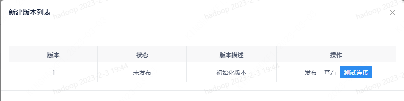

本文主要介绍在 `Linkis` 1.3.2 版本中，整合 OceanBase 数据库。 OceanBase 数据库兼容 MySQL 5.7/8.0 的绝大部分功能和语法。因此可以将 OceanBase 数据库当成 MySQL 来使用。

## 1. 准备工作
### 1.1 环境安装

安装部署 OceanBase 数据库，参看[快速体验OceanBase](https://www.oceanbase.com/docs/community-observer-cn-10000000000901197)

### 1.2 环境验证
可以使用 MySQL 命令验证 OceanBase 数据库安装情况。
```sql
mysql -h${ip} -P${port} -u${username} -p${password} -D${db_name}
```
连接成功如下图所示：


## 2. Linkis提交 OceanBase 数据库任务
### 2.1 通过 shell 提交任务
```shell
 sh ./bin/linkis-cli -engineType jdbc-4 -codeType jdbc -code "show tables" -submitUser hadoop -proxyUser hadoop -runtimeMap wds.linkis.jdbc.connect.url=jdbc:mysql://${ip}:${port}/${db_name} -runtimeMap wds.linkis.jdbc.driver=com.mysql.jdbc.Driver -runtimeMap wds.linkis.jdbc.username=${username} -runtimeMap wds.linkis.jdbc.password=${password}
```

### 2.2 通过 Linkis SDK 提交任务
`Linkis` 提供了 `Java` 和 `Scala` 的 `SDK` 向 `Linkis` 服务端提交任务。具体可以参考 [JAVA SDK Manual](/docs/latest/user-guide/sdk-manual.md)。对于 `OceanBase` 任务您只需要修改 `Demo` 中的 `EngineConnType` 和 `CodeType` 参数即可:
```java
Map<String, Object> labels = new HashMap<String, Object>();
labels.put(LabelKeyConstant.ENGINE_TYPE_KEY, "jdbc-4"); // required engineType Label
labels.put(LabelKeyConstant.USER_CREATOR_TYPE_KEY, "hadoop-IDE");// required execute user and creator
labels.put(LabelKeyConstant.CODE_TYPE_KEY, "jdbc"); // required codeType
```

### 2.3 多数据源支持
地址：登陆管理台-->数据源管理

步骤1：新建数据源





步骤2：连接测试

点击测试连接按钮进行测试


步骤3：发布数据源





步骤4：通过指定数据源名称提交 OceanBase 任务

请求URL：`http://${gateway_url}:${port}/api/rest_j/v1/entrance/submit`

请求方式：POST

请求参数：
```json
{
    "executionContent": {
        "code": "show databases",
        "runType": "jdbc"
    },
    "params": {
        "variable": {},
        "configuration": {
            "startup": {},
            "runtime": {
                "wds.linkis.engine.runtime.datasource": "ob-test"
            }
        }
    },
    "labels": {
        "engineType": "jdbc-4"
    }
}
```
响应结果：
```json
{
    "method": "/api/entrance/submit",
    "status": 0,
    "message": "OK",
    "data": {
        "taskID": 93,
        "execID": "exec_id018017linkis-cg-entrance000830fb1364:9104IDE_hadoop_jdbc_0"
    }
}
```
管理台查看任务执行情况：


