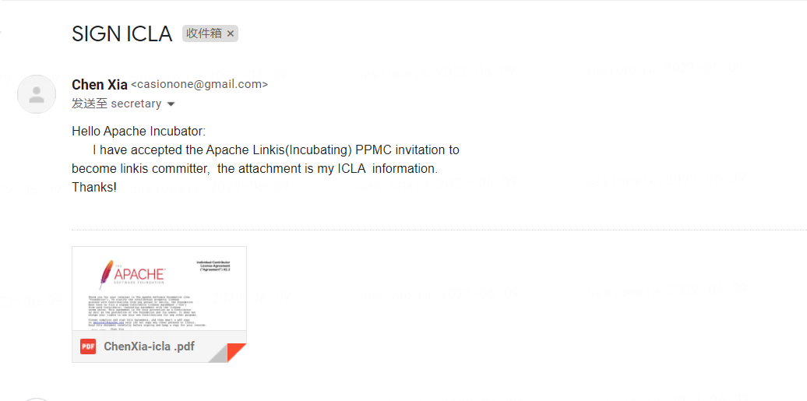

## Apache ICLA 签署流程指南
>注：本文参考 incubator-shenyu-website项目的Apache ICLA 签署流程指南文档 https://shenyu.apache.org/zh/community/icla/

Apache CLA 全称 Apache Contributor License Agreement，签署ICLA的目的是定义向ASF贡献的文档，保护知识产权，避免后续法律纠纷。ICLA在官方存档后生效，贡献者方可参与Apache项目。

当我们需要签署ICLA时步骤如下:

**1. 打开链接 [官网Licenses](https://www.apache.org/licenses/#clas) 在Contributor License Agreements 下找到CLAs并进入页面。**


**2. 在页面上方我们可以看到两个下载链接，选择ICLA(个人CLA)并下载文件。**


**3. 打开PDF，ICLA需要填写的是两个部分，均需要全英文填写。**

> 注意事项:
> - 姓名需要填写拼音，姓与名之间空一格，首字母均为大写，名在前姓氏在后。
> - Committer相关的签署，则preferred Apache id(s)是必填项。


**4.文件最下方的署名。** 官网支持手写或者[PDF签名软件](https://smallpdf.com/cn/sign-pdf)


**5.签署完之后将icla.pdf命令为 `姓名拼音-icla.pdf` 发送到导师提供的邮箱（邮箱地址为`secretary@apache.org`），下面是邮件模板：**

```html
To: secretary@apache.org
Subject: Accept to become a linkis committer
Content:

Hello Apache Incubator:
    I have accepted the Apache Linkis(Incubator) PPMC 
invitation to become linkis committer, the attachment 
is my ICLA information.
Thanks!
```

下面是一个具体样例：



**6.邮箱发送成功之后Apache  linkis 官方社区告知下**

## 手动签名和PDF软件签名DEMO

> PDF在线签名
> - 下载PDF源文件
> - 填写项目与个人信息
> - 打开PDF在线签署网址 如 https://smallpdf.com/cn/sign-pdf
> - 进入签名
> - 保存下载已签名pdf
> - 发送到指定邮箱


> 手写签名
> - 下载PDF源文件
> - 填写项目与个人信息n
> - 打印文件
> - 手写签名
> - 拍照转成**单个pdf** 文件
> - 发送到指定邮箱

示例文件可以参考 https://github.com/casionone/incubator-linkis-website/tree/dev/resource/wangming-icla.pdf