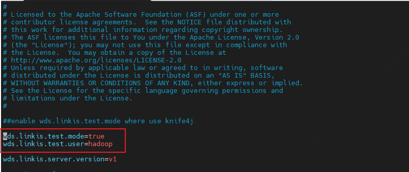
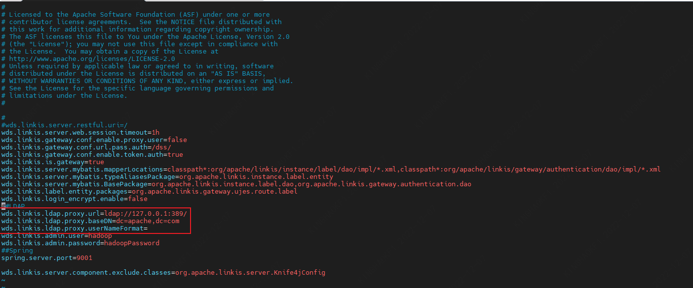
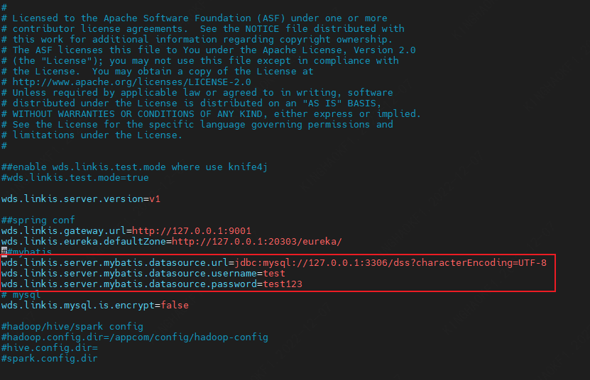
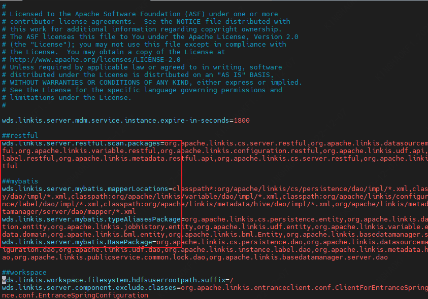

# 一、软硬件环境建议配置

Linkis 在上层应用程序和底层引擎之间构建了一层计算中间件。 作为一款开源分布式计算中间件，可以很好地部署和运行在 Intel 架构服务器及主流虚拟化环境下，并支持主流的Linux操作系统环境

## 1.1. Linux 操作系统版本要求

| 操作系统 | 版本  |
| --- | --- |
| Red Hat Enterprise Linux | 7.0 及以上 |
| CentOS | 7.0 及以上 |
| Oracle Enterprise Linux | 7.0 及以上 |
| Ubuntu LTS | 16.04 及以上 |

> **注意：** 以上 Linux 操作系统可运行在物理服务器以及 VMware、KVM、XEN 主流虚拟化环境上

## 1.2. 服务器建议配置

Linkis 支持运行在 Intel x86-64 架构的 64 位通用硬件服务器平台。对生产环境的服务器硬件配置有以下建议：

### 生产环境

| **CPU** | **内存** | **硬盘类型** | **网络** | **实例数量** |
| --- | --- | --- | --- | --- |
| 16核+ | 32GB+ | SAS | 千兆网卡 | 1+  |

> **注意：**
> 
> - 以上建议配置为部署 Linkis的最低配置，生产环境强烈推荐使用更高的配置
> - 硬盘大小配置建议 50GB+ ，系统盘和数据盘分开

## 1.3. 软件要求

Linkis二进制包基于以下软件版本进行编译：

| 组件  | 版本  | 说明  |
| --- | --- | --- |
| Hadoop | 2.7.2 |     |
| Hive | 2.3.3 |     |
| Spark | 2.4.3 |     |
| Flink | 1.12.2 |     |
| openLooKeng | 1.5.0 |     |
| Sqoop | 1.4.6 |     |
| ElasticSearch | 7.6.2 |     |
| Presto | 0.234 |     |
| Python | Python2 |     |

> **注意：**
> 如果本地安装组件版本与上述不一致，需要进行修改对应组件版本，自行编译二进制包进行安装。

## 1.4. 客户端 Web 浏览器要求

Linkis推荐 Chrome 73版本进行前端访问

# 二、 常用场景

## 2.1 开启测试模式
开发过程需要免密接口，可在`linkis.properties`替换或追加此配置

|           参数名          | 默认值   |  描述                                                       |
| ------------------------- | -------  | -----------------------------------------------------------|
| wds.linkis.test.mode | false | 是否打开调试模式，如果设置为 true，所有微服务都支持免密登录，且所有EngineConn打开远程调试端口 |
| wds.linkis.test.user | hadoop | 当wds.linkis.test.mode=true时，免密登录的默认登录用户 |

## 2.2 登录用户设置
Apache Linkis 默认使用配置文件来管理admin用户，可以在`linkis-mg-gateway.properties`替换或追加此配置。如需多用户可接入LDAP实现。

|           参数名          | 默认值   |  描述                                                       |
| ------------------------- | -------  | -----------------------------------------------------------|
| wds.linkis.admin.user | hadoop | 管理员用户名 |
| wds.linkis.admin.password | 123456 | 管理员用户密码 |

## 2.3 LDAP设置
Apache Linkis 可以通过参数接入LDAP实现多用户管理，可以在`linkis-mg-gateway.properties`替换或追加此配置。

|           参数名          | 默认值   |  描述                                                       |
| ------------------------- | -------  | -----------------------------------------------------------|
| wds.linkis.ldap.proxy.url | 无 | LDAP URL地址 |
| wds.linkis.ldap.proxy.baseDN | 无 | LDAP baseDN地址 |
| wds.linkis.ldap.proxy.userNameFormat | 无 |  |

## 2.4 关闭资源检查
Apache Linkis 提交任务时有时会调试异常，如：资源不足；可以在`linkis-cg-linkismanager.properties`替换或追加此配置。

|           参数名          | 默认值   |  描述                                                       |
| ------------------------- | -------  | -----------------------------------------------------------|
| wds.linkis.manager.rm.request.enable | true | 资源检查 |

## 2.5 开启引擎调试
Apache Linkis EC可以开启调试模式，可以在`linkis-cg-linkismanager.properties`替换或追加此配置。

|           参数名          | 默认值   |  描述                                                       |
| ------------------------- | -------  | -----------------------------------------------------------|
| wds.linkis.engineconn.debug.enable | true | 是否开启引擎调试 |

## 2.6 Hive元数据配置
Apache Linkis 的public-service服务需要读取hive的元数据；可以在`linkis-ps-publicservice.properties`替换或追加此配置。

|           参数名          | 默认值   |  描述                                                       |
| ------------------------- | -------  | -----------------------------------------------------------|
| hive.meta.url | 无 | HiveMetaStore数据库的URL。 |
| hive.meta.user | 无 | HiveMetaStore数据库的user |
| hive.meta.password | 无 | HiveMetaStore数据库的password |

## 2.7 Linkis 数据库配置
Apache Linkis 访问默认使用Mysql作为数据存储，可以在`linkis.properties`替换或追加此配置。

|           参数名          | 默认值   |  描述                                                       |
| ------------------------- | -------  | -----------------------------------------------------------|
| wds.linkis.server.mybatis.datasource.url | 无 | 数据库连接字符串，例如：jdbc:mysql://127.0.0.1:3306/dss?characterEncoding=UTF-8 |
| wds.linkis.server.mybatis.datasource.username | 无 | 数据库用户名，例如：root |
| wds.linkis.server.mybatis.datasource.password | 无 | 数据库密码，例如：root |

## 2.8 Linkis Session 缓存配置
Apache Linkis 支持使用redis进行session的共享；可以在`linkis.properties`替换或追加此配置。

|           参数名          | 默认值   |  描述                                                       |
| ------------------------- | -------  | -----------------------------------------------------------|
| linkis.session.redis.cache.enabled | None | 是否开启 |
| linkis.session.redis.host | 127.0.0.1 | 主机名 |
| linkis.session.redis.port | 6379 | 端口，例如 |
| linkis.session.redis.password | None | 密码 |

## 2.9 Linkis 模块开发配置
Apache Linkis 开发时可通过此参数，自定义加载模块的数据库、Rest接口、实体对象；可以在`linkis-ps-publicservice.properties`进行修改，多个模块之间使用逗号分割。

|           参数名          | 默认值   |  描述                                                       |
| ------------------------- | -------  | -----------------------------------------------------------|
| wds.linkis.server.restful.scan.packages | 无 | restful 扫描包，例如：org.apache.linkis.basedatamanager.server.restful |
| wds.linkis.server.mybatis.mapperLocations | 无 | mybatis mapper文件路径，例如： classpath*:org/apache/linkis/basedatamanager/server/dao/mapper/*.xml|
| wds.linkis.server.mybatis.typeAliasesPackage | 无 | 实体别名扫描包，例如：org.apache.linkis.basedatamanager.server.domain |
| wds.linkis.server.mybatis.BasePackage | 无 | 数据库dao层扫描，例如：org.apache.linkis.basedatamanager.server.dao |

## 2.10 Linkis 模块开发配置
Apache Linkis 开发时可通过此参数，自定义加载模块的路由；可以在`linkis.properties`进行修改，多个模块之间使用逗号分割。

|           参数名          | 默认值   |  描述                                                       |
| ------------------------- | -------  | -----------------------------------------------------------|
| wds.linkis.gateway.conf.publicservice.list | cs,contextservice,data-source-manager,metadataQuery,metadatamanager,query,jobhistory,application,configuration,filesystem,udf,variable,microservice,errorcode,bml,datasource,basedata-manager | publicservice服务支持路由的模块 |

## 2.11 Linkis 文件系统及物料存放路径
Apache Linkis 开发时可通过此参数，自定义加载模块的路由；可以在`linkis.properties`进行修改，多个模块之间使用逗号分割。

|           参数名          | 默认值   |  描述                                                       |
| ------------------------- | -------  | -----------------------------------------------------------|
| wds.linkis.filesystem.root.path | file:///tmp/linkis/ | 本地用户目录，需在该目录下建立以用户名为名称的文件夹 |
| wds.linkis.filesystem.hdfs.root.path | hdfs:///tmp/ | HDFS用户目录 |
| wds.linkis.bml.is.hdfs | true | 是否启用hdfs |
| wds.linkis.bml.hdfs.prefix | /apps-data | hdfs路径 |
| wds.linkis.bml.local.prefix | /apps-data | 本地路径 |

