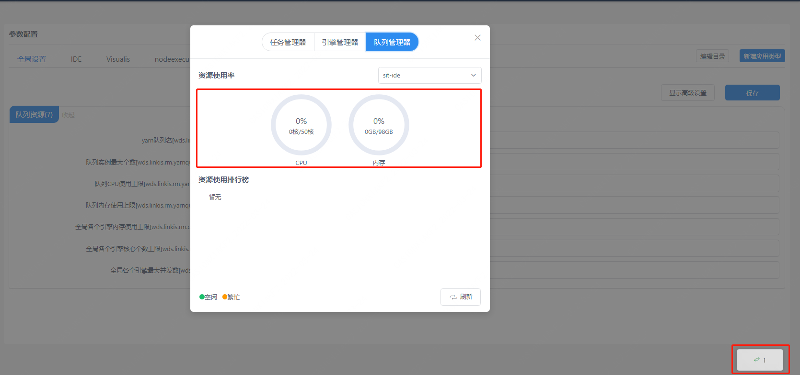
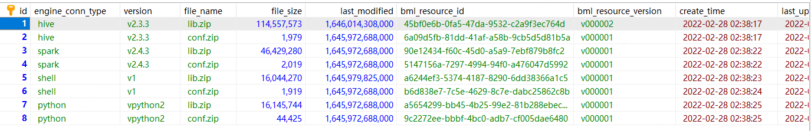
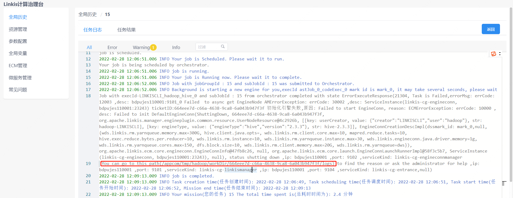
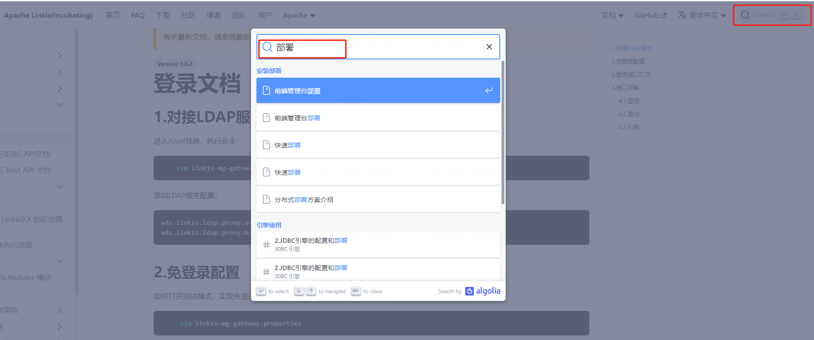

## 1. 首次安装准备事项

### 1.1 Linux服务器

**硬件要求**  
安装linkis 微服务近6个，至少3G内存。每个微服务默认配置启动的jvm -Xmx 内存大小为 512M（内存不够的情况下，可以尝试调小至256/128M，内存足够情况下也可以调大）。


### 1.2 添加部署用户

> 部署用户: linkis核心进程的启动用户，同时此用户会默认作为管理员权限，<font color="red">部署过程中会生成对应的管理员登录密码，位于`conf/linkis-mg-gateway.properties`文件中</font>
> Linkis支持指定提交、执行的用户。linkis主要进程服务会通过`sudo -u ${linkis-user}` 切换到对应用户下，然后执行对应的引擎启动命令，所以引擎`linkis-engine`进程归属的用户是任务的执行者（因此部署用户需要有sudo权限，而且是免密的）。

以hadoop用户为例（<font color="red">linkis中很多配置用户默认都使用hadoop用户，建议初次安装者使用hadoop用户，否则在安装过程中可能会遇到很多意想不到的错误</font>）:

先查看系统中是否已经有 hadoop 用户，若已经存在，则直接授权即可，若不存在，先创建用户，再授权。

查看是否已存在 hadoop 用户
```shell script
$ id hadoop
uid=2001(hadoop) gid=2001(hadoop) groups=2001(hadoop)
```

若不存在，则需要创建 hadoop 用户，并加入 hadoop 用户组
```shell script
$ sudo useradd hadoop -g hadoop
$ vi /etc/sudoers
#免密配置
hadoop ALL=(ALL) NOPASSWD: NOPASSWD: ALL
```

<font color='red'>以下操作都是在hadoop用户下进行</font>

### 1.3 依赖环境
 
Linkis需要的环境引擎如下列表所示，这些必需的引擎在安装检查脚本`${LINKIS_HOME}/bin/checkENv.sh`中检查。

| 引擎类型           | 是否必装 | 安装直通车                                                                                                       |
|----------------|------|-------------------------------------------------------------------------------------------------------------|
| JDK（1.8.0 141） | 必需   | [安装JDK和设置JAVA_HOME](https://docs.oracle.com/cd/E19509-01/820-5483/6ngsiu065/index.html)                     |
| mysql（5.5+）    | 必需   | [安装MySQL](https://docs.oracle.com/cd/E69403_01/html/E56873/mysql.html)                                      |
| Python(3.6.8)  | 必需   | [Python安装和使用](https://docs.python.org/zh-cn/3/using/index.html)                                             |
| Nginx(1.14.1)  | 必需   | [Nginx安装指南](http://nginx.org/en/linux_packages.html#instructions)                                           |
| Hadoop（(2.7.2） | 必需   | [Hadoop快速入门](https://hadoop.apache.org/docs/r1.0.4/cn/quickstart.html#%E5%AE%89%E8%A3%85%E8%BD%AF%E4%BB%B6) |
| Spark（2.4.3）   | 必需   | [Spark安装入门](https://spark.apache.org/downloads.html)                                                        |
| Hive(3.1.3)    | 必需   | [Hive安装指南](https://cwiki.apache.org/confluence/display/hive/adminmanual+installation)                       |

## 2. 配置修改

### 2.1 安装包准备

- 方式1：从官网[下载地址](https://linkis.apache.org/zh-CN/download/main):https://linkis.apache.org/zh-CN/download/main
，下载对应的安装包（项目安装包和管理台安装包）。
- 方式2：根据[Linkis 编译打包](../development/build)和[前端管理台编译](../development/build-console) 自行编译出项目安装包和管理台安装包。

上传安装包`apache-linkis-x.x.x-bin.tar.gz`后，进行解压安装包 

```shell script
$ tar -xvf apache-linkis-x.x.x-bin.tar.gz
```

解压后的目录结构如下
```shell script
-rw-r--r-- 1 hadoop hadoop 518192043 Jun 20 09:50 apache-linkis-x.x.x-bin.tar.gz
drwxrwxr-x 2 hadoop hadoop      4096 Jun 20 09:56 bin  //执行环境检查和安装的脚本
drwxrwxr-x 2 hadoop hadoop      4096 Jun 20 09:56 deploy-config // 部署时依赖的DB等环境配置信息
drwxrwxr-x 4 hadoop hadoop      4096 Jun 20 09:56 docker
drwxrwxr-x 4 hadoop hadoop      4096 Jun 20 09:56 helm
-rwxrwxr-x 1 hadoop hadoop     84732 Jan 22  2020 LICENSE
drwxr-xr-x 2 hadoop hadoop     20480 Jun 20 09:56 licenses
drwxrwxr-x 7 hadoop hadoop      4096 Jun 20 09:56 linkis-package // 实际的软件包，包括lib/服务启动脚本工具/db的初始化脚本/微服务的配置文件等
-rwxrwxr-x 1 hadoop hadoop    119503 Jan 22  2020 NOTICE
-rw-r--r-- 1 hadoop hadoop     11959 Jan 22  2020 README_CN.md
-rw-r--r-- 1 hadoop hadoop     12587 Jan 22  2020 README.md

```

### 2.2 配置数据库信息

`vim deploy-config/linkis-env.sh`

```shell script
# 选择linkis业务数据库类型，默认mysql
# 如果使用postgresql，请改为postgresql
# 注意: 当前配置只适用于linkis>=1.4.0
dbType=mysql
```

`vim deploy-config/db.sh`

```shell script
# Linkis自身业务的数据库信息 - mysql
MYSQL_HOST=xx.xx.xx.xx
MYSQL_PORT=3306
MYSQL_DB=linkis_test
MYSQL_USER=test
MYSQL_PASSWORD=xxxxx

# Linkis自身业务的数据库信息 - postgresql
# 注意: 以下配置只适用于linkis>=1.4.0
PG_HOST=xx.xx.xx.xx
PG_PORT=5432
PG_DB=linkis_test
PG_SCHEMA=linkis_test
PG_USER=test
PG_PASSWORD=123456

# 提供 Hive 元数据数据库的 DB 信息，如果不涉及hive引擎（或则只是简单试用），可以不配置 
#主要是配合scriptis一起使用，如果不配置，会默认尝试通过$HIVE_CONF_DIR 中的配置文件获取
HIVE_META_URL="jdbc:mysql://10.10.10.10:3306/hive_meta_demo?useUnicode=true&amp;characterEncoding=UTF-8" 
HIVE_META_USER=demo   # HiveMeta元数据库的用户
HIVE_META_PASSWORD=demo123    # HiveMeta元数据库的密码
```


### 2.3 配置基础变量

文件位于`deploy-config/linkis-env.sh`。

#### 部署用户 
```shell script
deployUser=hadoop #执行部署的用户，为 1.2 步骤给中创建的用户
```

#### 基础目录配置（可选）
:::caution 注意
根据实际情况确定是否需要调整，可以选择使用默认值
:::


```shell script

# 指定用户使用的目录路径，一般用于存储用户的脚本文件和日志文件等，是用户的工作空间。 对应的配置文件配置项为  wds.linkis.filesystem.root.path(linkis.properties)
WORKSPACE_USER_ROOT_PATH=file:///tmp/linkis 

# 结果集日志等文件路径，用于存储Job的结果集文件  wds.linkis.resultSet.store.path(linkis-cg-entrance.properties) //如果未配置 使用HDFS_USER_ROOT_PATH的配置
RESULT_SET_ROOT_PATH=file:///tmp/linkis 

# 结果集日志等文件路径，用于存储Job的结果集文件  wds.linkis.filesystem.hdfs.root.path(linkis.properties)
HDFS_USER_ROOT_PATH=hdfs:///tmp/linkis 
  
# 存放执行引擎的工作路径，需要部署用户有写权限的本地目录   wds.linkis.engineconn.root.dir(linkis-cg-engineconnmanager.properties)
ENGINECONN_ROOT_PATH=/appcom/tmp 
```

#### Yarn的ResourceManager的地址

:::caution 注意
如果需要使用Spark引擎 则需要配置 
:::

```shell script

#可以通过访问http://xx.xx.xx.xx:8088/ws/v1/cluster/scheduler 接口确认是否可以正常访问
YARN_RESTFUL_URL=http://xx.xx.xx.xx:8088 
```
执行spark任务时，需要使用到yarn的ResourceManager，linkis默认它是未开启权限验证的，如果ResourceManager开启了密码权限验证，请安装部署后，
修改数据库表 `linkis_cg_rm_external_resource_provider` 插入yarn数据信息,详细可以参考[查看yarn地址是否配置正确](#811-查看yarn地址是否配置正确)

#### 基础组件环境信息 

:::caution 注意
可以通过用户的系统环境变量配置, 如果通过系统环境变量配置的，deploy-config/linkis-env.sh配置文件中可以不进行配置 直接注释掉。
:::

```shell script
##如果不使用Hive、Spark等引擎且不依赖Hadoop，则不需要配置以下环境变量

#HADOOP  
HADOOP_HOME=/appcom/Install/hadoop
HADOOP_CONF_DIR=/appcom/config/hadoop-config

#Hive
HIVE_HOME=/appcom/Install/hive
HIVE_CONF_DIR=/appcom/config/hive-config

#Spark
SPARK_HOME=/appcom/Install/spark
SPARK_CONF_DIR=/appcom/config/spark-config
```


#### LDAP 登录配置（可选）

:::caution 注意
默认是使用静态用户和密码,静态用户即部署用户，静态密码会在执行部署是随机生成一个密码串，存储于`${LINKIS_HOME}/conf/linkis-mg-gateway.properties`(>=1.0.3版本)。
:::


```shell script
#LDAP配置，默认Linkis只支持部署用户登录，如果需要支持多用户登录可以使用LDAP，需要配置以下参数：
#LDAP_URL=ldap://localhost:1389/
#LDAP_BASEDN=dc=webank,dc=com
```


#### JVM内存配置（可选）
>微服务启动jvm内存配置，可以根据机器实际情况进行调整，如果机器内存资源较少，可以尝试调小至256/128M
```shell script
## java application default jvm memory
export SERVER_HEAP_SIZE="512M"
```

#### 安装目录配置（可选）
> Linkis最终会被安装到此目录下，不配置默认是与当前安装包同一级目录下

```shell script
##The decompression directory and the installation directory need to be inconsistent
LINKIS_HOME=/appcom/Install/LinkisInstall
```

#### 无HDFS模式部署（可选 >1.1.2版本支持） 

> 在没有HDFS 的环境中部署 Linkis 服务，以方便更轻量化的学习使用和调试。去HDFS模式部署不支持hive/spark/flink引擎等任务

修改 `linkis-env.sh` 文件，修改以下内容
```bash
#使用[file://]路径模式代替[hdfs://]模式 
WORKSPACE_USER_ROOT_PATH=file:///tmp/linkis/ 
HDFS_USER_ROOT_PATH=file:///tmp/linkis 
RESULT_SET_ROOT_PATH=file:///tmp/linkis 

export ENABLE_HDFS=false
export ENABLE_HIVE=false
export ENABLE_SPARK=false
```

#### kerberos 认证（可选）

> 默认 Linkis 未开启 kerberos 认证，如果使用的hive集群开启了 kerberos 模式认证，需要配置如下参数。

修改 `linkis-env.sh` 文件，修改内容如下
```bash
#HADOOP
HADOOP_KERBEROS_ENABLE=true
HADOOP_KEYTAB_PATH=/appcom/keytab/
```

### 2.4 配置 Token
文件位于 `bin/install.sh`

Linkis 1.3.2 版本为保证系统安全性已将 Token 值改为32位随机生成，具体可查看[Token变更说明](https://linkis.apache.org/zh-CN/docs/1.3.2/feature/update-token/)。

使用随机生成Token，初次与[WDS其它组件](https://github.com/WeDataSphere/DataSphereStudio/blob/master/README-ZH.md)对接时会遇到很多 Token 验证失败的问题，建议初次安装时不使用随机生成Token，修改如下配置为 true 即可。 

```
DEBUG_MODE=true
```

### 2.5 注意事项

**全量安装**

对于全量安装新版本 Linkis 时， install.sh 脚本中会自动处理配置文件和数据库 Token 保持一致。因此 Linkis 服务自身 Token 无需修改。各应用可通过管理台查询并使用新 Token。

**版本升级**

版本升级时，数据库 Token 并未修改，因此无需修改配置文件和应用 Token。

**Token 过期问题**

当遇到 Token 令牌无效或已过期问题时可以检查 Token 是否配置正确，可通过管理台 ==> 基础数据管理 ==> 令牌管理，查询 Token。

**Python 版本问题**
Linkis 升级为 1.4.0 后默认 Spark 版本升级为 3.x，无法兼容 python2。因此如果需要使用 pyspark 功能需要做如下修改。
1. 映射 python2 命令为 python3
```
sudo ln -snf /usr/bin/python3 /usr/bin/python2
```
2. spark 引擎连接器配置 $LINKIS_HOME/lib/linkis-engineconn-plugins/spark/dist/3.2.1/conf/linkis-engineconn.properties 中添加如下配置，指定python安装路径
```
pyspark.python3.path=/usr/bin/python3
```

## 3. 安装和启动

### 3.1 执行安装脚本：

```bash
    sh bin/install.sh
```

install.sh脚本会询问您是否需要初始化数据库并导入元数据。如果选择初始化，会把数据库中的表数据清空重新初始化。

**<font color="red">第一次安装必须选清空数据库</font>**

:::tip 注意
- 如果出现报错，又不清楚具体是执行什么命令报错，可以加 -x 参数`sh -x bin/install.sh`，将shell脚本执行过程日志打印出来，方便定位问题。
- 权限问题:`mkdir: cannot create directory ‘xxxx’: Permission denied`,请确认部署用户是否拥有该路径的读写权限。
:::

执行成功提示如下:
```shell script
`Congratulations! You have installed Linkis x.x.x successfully, please use sh /data/Install/linkis/sbin/linkis-start-all.sh to start it!  
Your default account password is [hadoop/5e8e312b4]`
```

### <font color="red">3.2 添加mysql驱动包</font>

:::caution 注意
因为mysql-connector-java驱动是GPL2.0协议，不满足Apache开源协议关于license的政策，因此从1.0.3版本开始，提供的Apache版本官方部署包，默认是没有mysql-connector-java-x.x.x.jar的依赖包（**若是通过集成的全家桶物料包安装，则无需手动添加**），安装部署时需要自行添加依赖到对应的lib包中。 可以在对应的目录下查看是否存在，如果不存在则需要添加。

:::

下载mysql驱动 以 8.0.28 版本为例：[下载链接](https://repo1.maven.org/maven2/mysql/mysql-connector-java/8.0.28/mysql-connector-java-8.0.28.jar)

拷贝mysql 驱动包至lib包下 
```
cp mysql-connector-java-8.0.28.jar  ${LINKIS_HOME}/lib/linkis-spring-cloud-services/linkis-mg-gateway/
cp mysql-connector-java-8.0.28.jar  ${LINKIS_HOME}/lib/linkis-commons/public-module/
```
### 3.3 添加postgresql驱动包 (可选)
如果选择使用postgresql作为业务数据库，需要手动添加postgresql驱动
下载postgresql驱动 以42.5.4版本为例：[下载链接](https://repo1.maven.org/maven2/org/postgresql/postgresql/42.5.4/postgresql-42.5.4.jar)
拷贝postgresql驱动包至lib包下
```
cp postgresql-42.5.4.jar  ${LINKIS_HOME}/lib/linkis-spring-cloud-services/linkis-mg-gateway/
cp postgresql-42.5.4.jar  ${LINKIS_HOME}/lib/linkis-commons/public-module/
```
### 3.4 配置调整（可选）
> 以下操作，跟依赖的环境有关，根据实际情况，确定是否需要操作 

#### 3.4.1 Yarn的认证 

执行spark任务时，需要使用到yarn的ResourceManager，通过配置项`YARN_RESTFUL_URL=http://xx.xx.xx.xx:8088 `控制。
执行安装部署时，会将`YARN_RESTFUL_URL=http://xx.xx.xx.xx:8088` 信息更新到数据库表中 `linkis_cg_rm_external_resource_provider`中时候，默认访问yarn资源是不需权限验证的，
如果yarn的ResourceManager开启了密码权限验证，请安装部署后，修改数据库表 `linkis_cg_rm_external_resource_provider` 中生成的yarn数据信息,
详细可以参考[查看yarn地址是否配置正确](#811-查看yarn地址是否配置正确)。

#### 3.4.2 session 
如果您是对Linkis的升级。同时部署DSS或者其他项目，但其它软件中引入的依赖linkis版本<1.1.1(主要看lib包中，所依赖的Linkis的linkis-module-x.x.x.jar包 <1.1.1），则需要修改位于`${LINKIS_HOME}/conf/linkis.properties`文件。
```shell
echo "wds.linkis.session.ticket.key=bdp-user-ticket-id" >> linkis.properties
```

#### 3.4.3 S3 模式
> 目前支持将引擎执行日志和结果存储到 S3 文件系统 
> 
> 注意: linkis没有对 S3 做权限适配，所以无法对其做赋权操作

`vim $LINKIS_HOME/conf/linkis.properties`
```shell script
# s3 file system
linkis.storage.s3.access.key=xxx
linkis.storage.s3.secret.key=xxx
linkis.storage.s3.endpoint=http://xxx.xxx.xxx.xxx:xxx
linkis.storage.s3.region=xxx
linkis.storage.s3.bucket=xxx
```

`vim $LINKIS_HOME/conf/linkis-cg-entrance.properties`
```shell script
wds.linkis.entrance.config.log.path=s3:///linkis/logs
wds.linkis.resultSet.store.path=s3:///linkis/results
```

### 3.5 启动服务
```shell script
sh sbin/linkis-start-all.sh
```

### 3.6 安装后配置的修改
安装完成后，如果需要修改配置（因端口冲突或则某些配置有问题需要调整配置），可以重新执行安装，或则修改对应服务的配置`${LINKIS_HOME}/conf/*properties`文件后，重启对应的服务，如：`sh sbin/linkis-daemon.sh start ps-publicservice`。


### 3.7 检查服务是否正常启动 
访问eureka服务页面（http://eurekaip:20303），
默认会启动6个 Linkis 微服务，其中下图linkis-cg-engineconn服务为运行任务才会启动。


```shell script
LINKIS-CG-ENGINECONNMANAGER 引擎管理服务 
LINKIS-CG-ENTRANCE  计算治理入口服务
LINKIS-CG-LINKISMANAGER  计算治理管理服务 
LINKIS-MG-EUREKA        微服务注册中心服务   
LINKIS-MG-GATEWAY  网关服务 
LINKIS-PS-PUBLICSERVICE 公共服务 
```

注意：在 Linkis 1.3.1 中已将 LINKIS-PS-CS、LINKIS-PS-DATA-SOURCE-MANAGER、LINKIS-PS-METADATAMANAGER服务合并到LINKIS-PS-PUBLICSERVICE，将LINKIS-CG-ENGINEPLUGIN服务合并到LINKIS-CG-LINKISMANAGER。

如果有服务未启动，可以在对应的log/${服务名}.log文件中查看详细异常日志。

### 3.8 配置 Token

Linkis 原有默认 Token 固定且长度太短存在安全隐患。因此 Linkis 1.3.2 将原有固定 Token 改为随机生成，并增加 Token 长度。

新 Token 格式：应用简称-32 位随机数，如BML-928a721518014ba4a28735ec2a0da799。

Token 可能在 Linkis 服务自身使用，如通过 Shell 方式执行任务、BML 上传等，也可能在其它应用中使用，如 DSS、Qualitis 等应用访问 Linkis。

#### 查看 Token
**通过 SQL 语句查看**
```sql
select * from linkis_mg_gateway_auth_token;
```
**通过管理台查看**

登录管理台 -> 基础数据管理 -> 令牌管理 


#### 检查 Token 配置

Linkis 服务本身使用 Token 时，配置文件中 Token 需与数据库中 Token 一致。通过应用简称前缀匹配。

$LINKIS_HOME/conf/linkis.properties文件 Token 配置

```
linkis.configuration.linkisclient.auth.token.value=BML-928a721518014ba4a28735ec2a0da799
wds.linkis.client.common.tokenValue=BML-928a721518014ba4a28735ec2a0da799
wds.linkis.bml.auth.token.value=BML-928a721518014ba4a28735ec2a0da799
wds.linkis.context.client.auth.value=BML-928a721518014ba4a28735ec2a0da799
wds.linkis.errorcode.auth.token=BML-928a721518014ba4a28735ec2a0da799

wds.linkis.client.test.common.tokenValue=LINKIS_CLI-215af9e265ae437ca1f070b17d6a540d

wds.linkis.filesystem.token.value=WS-52bce72ed51741c7a2a9544812b45725
wds.linkis.gateway.access.token=WS-52bce72ed51741c7a2a9544812b45725

wds.linkis.server.dsm.auth.token.value=DSM-65169e8e1b564c0d8a04ee861ca7df6e
```

$LINKIS_HOME/conf/linkis-cli/linkis-cli.properties文件 Token 配置
```
wds.linkis.client.common.tokenValue=BML-928a721518014ba4a28735ec2a0da799
```

其它应用使用 Token 时，需要修改其 Token 配置与数据库中 Token 一致。

## 4. 安装web前端
web端是使用nginx作为静态资源服务器的，访问请求流程是:
`Linkis管理台请求->nginx ip:port->linkis-gateway ip:port-> 其他服务`

### 4.1 下载前端安装包并解压
```shell script
tar -xvf apache-linkis-x.x.x-web-bin.tar.gz
```

### 4.2 修改配置config.sh
```shell script
#访问管理台的端口
linkis_port="8188"

#linkis-mg-gateway服务地址
linkis_url="http://localhost:9020"
```

### 4.3 执行部署脚本

```shell script
# nginx 需要sudo权限进行安装
sudo sh install.sh
```
安装后，linkis的nginx配置文件默认是 在`/etc/nginx/conf.d/linkis.conf`
nginx的日志文件在 `/var/log/nginx/access.log` 和`/var/log/nginx/error.log`
生成的linkis管理台的nginx配置文件示例如下:
```nginx

        server {
            listen       8188;# 访问端口 如果端口被占用，则需要修改
            server_name  localhost;
            #charset koi8-r;
            #access_log  /var/log/nginx/host.access.log  main;
            location / {
            root   /appcom/Install/linkis-web/dist; # 静态文件目录 
            index  index.html index.html;
            }
            location /ws {
            proxy_pass http://localhost:9020;#后端Linkis的地址
            proxy_http_version 1.1;
            proxy_set_header Upgrade $http_upgrade;
            proxy_set_header Connection upgrade;
            }

            location /api {
            proxy_pass http://localhost:9020; #后端Linkis的地址
            proxy_set_header Host $host;
            proxy_set_header X-Real-IP $remote_addr;
            proxy_set_header x_real_ipP $remote_addr;
            proxy_set_header remote_addr $remote_addr;
            proxy_set_header X-Forwarded-For $proxy_add_x_forwarded_for;
            proxy_http_version 1.1;
            proxy_connect_timeout 4s;
            proxy_read_timeout 600s;
            proxy_send_timeout 12s;
            proxy_set_header Upgrade $http_upgrade;
            proxy_set_header Connection upgrade;
            }

            #error_page  404              /404.html;
            # redirect server error pages to the static page /50x.html
            #
            error_page   500 502 503 504  /50x.html;
            location = /50x.html {
            root   /usr/share/nginx/html;
            }
        }
```

如果需要修改端口或则静态资源目录等，请修改`/etc/nginx/conf.d/linkis.conf` 文件后执行 `sudo nginx -s reload` 命令
:::caution 注意
- 目前暂未集成visualis功能，安装过程中如果提示安装linkis/visualis失败，可以忽略 。
- 查看nginx是否正常启动：检查nginx进程是否存在 `ps -ef |grep nginx` 。
- 检查nginx的配置是否正确 `sudo nginx -T ` 。
- 如果端口被占用，可以修改nginx启动的服务端口`/etc/nginx/conf.d/linkis.conf`listen端口值，保存后重新启动。
- 如果访问管理台出现接口502，或则`Unexpected token < in JSON at position 0`异常，请确认linkis-mg-gateway是否正常启动，如果正常启动，查看nginx配置文件中配置的linkis-mg-gateway服务地址是否正确。
:::

### 4.4 登录管理台

浏览器登陆 `http://xx.xx.xx.xx:8188/#/login`
用户名/密码在`{LINKIS_HOME}/conf/linkis-mg-gateway.properties`中查看。
```shell script
wds.linkis.admin.user= #用户
wds.linkis.admin.password= #密码

```

## 5. 验证基础功能
>根据实际需求，验证对应的引擎任务

```
#引擎的engineType 拼接的版本号，一定要与实际的相匹配，以下示例是默认的版本号 
#shell 引擎任务
sh bin/linkis-cli -submitUser  hadoop  -engineType shell-1 -codeType shell  -code "whoami"

#hive引擎任务
sh bin/linkis-cli -submitUser  hadoop  -engineType hive-3.1.3  -codeType hql  -code "show tables"

#spark引擎任务
sh bin/linkis-cli -submitUser  hadoop  -engineType spark-3.2.1 -codeType sql  -code "show tables"

#python引擎任务
sh bin/linkis-cli -submitUser  hadoop  -engineType python-python2 -codeType python  -code 'print("hello, world!")'
```
如果验证失败，请参考【步骤8】进行排查。

## 6. 开发工具IDE（Scriptis）的安装(可选)
安装Scripti工具后，可以支持在web页面在线写SQL、Pyspark、HiveQL等脚本，详细指引见[工具Scriptis的安装部署](integrated/install-scriptis)。

## 7. 支持的引擎 

### 7.1 引擎适配列表

请注意：Linkis的单独安装包默认只包含Python、Shell、Hive、Spark四个引擎，如果有其他的引擎(如jdbc/flink/sqoop等引擎)使用场景，可以手动安装，具体请参考 [EngineConnPlugin引擎插件安装文档](install-engineconn)。

本版本已适配的支持引擎列表如下：

| 引擎类型       | 适配情况       | 官方安装包是否包含 |
|---------------|-------------------|------|
| Python        | >=1.0.0 已适配   | 包含   |
| Shell         | >=1.0.0 已适配   | 包含   |
| Hive          | >=1.0.0 已适配   | 包含   |
| Spark         | >=1.0.0 已适配   | 包含   |
| Pipeline      | >=1.0.0 已适配   | **不包含** |
| JDBC          | >=1.0.0 已适配   | **不包含** |
| Flink         | >=1.0.0 已适配   | **不包含** |
| openLooKeng   | >=1.1.1 已适配   | **不包含** |
| Sqoop         | >=1.1.2 已适配  | **不包含** |
| Trino         | >=1.3.2 已适配  | **不包含** |
| Presto        | >=1.3.2 已适配  | **不包含** |
| Elasticsearch | >=1.3.2 已适配  | **不包含** |
| Seatunnel     | >=1.3.2 已适配  | **不包含** |
| Impala        | >=1.4.0 已适配  | **不包含** |


### 7.2  查看部署的引擎

#### 方式1: 查看引擎lib包目录

```
$ tree linkis-package/lib/linkis-engineconn-plugins/ -L 3
linkis-package/lib/linkis-engineconn-plugins/
├── hive
│   ├── dist
│   │   └── 3.1.3  #版本为 3.1.3 engineType 为hive-3.1.3
│   └── plugin
│       └── 3.1.3
├── python
│   ├── dist
│   │   └── python2
│   └── plugin
│       └── python2 #版本为python2 engineType 为python-python2
├── shell
│   ├── dist
│   │   └── 1
│   └── plugin
│       └── 1
└── spark
    ├── dist
    │   └── 3.2.1
    └── plugin
        └── 3.2.1
```

#### 方式2: 查看linkis的数据库表
```shell script
select *  from linkis_cg_engine_conn_plugin_bml_resources
```
### 7.3 非默认引擎检查
非默认引擎的检查通过手工执行脚本`sh $LINKIS_HOME/bin/checkAdd.sh ${engineType}`来检查，具体脚本参见目录（`$LINKIS_HOME/bin/checkAdd.sh`) 。具体的检查方法如下：

```shell script
function print_usage(){
  echo "Usage: checkAdd [EngineName]"
  echo " EngineName : The Engine name that you want to check"
  echo " Engine list as bellow: JDBC Flink openLooKeng  Presto Sqoop Elasticsearch "
}
```

非默认引擎检查过程中使用到的参数分为两类：一类是数据引擎连接信息，在`$LINKIS_HOME/deploy-config/db.sh`中定义；另一类是引用参数，包括检查开关、版本定义、java路径等，在`$LINKIS_HOME/deploy-config/db.sh`定义。相关的引擎及参数描述如下：

| 引擎类型          | 使用到的参数                                                                                                          | 参数描述                                     |
|---------------|-----------------------------------------------------------------------------------------------------------------|------------------------------------------|
| JDBC          | ${MYSQL_HOST}, ${MYSQL_PORT}, ${MYSQL_DB}, ${MYSQL_USER}, ${MYSQL_PASSWORD}                                     | MySQL引擎连接信息，包括主机IP、端口、数据库名、用户、密码         |
| JDBC          | ${MYSQL_CONNECT_JAVA_PATH}                                                                                      | MySQL驱动连接所在目录                            |
| Flink         | ${FLINK_HOME}                                                                                                   | 定义 FLink 安装所在目录，包含Flink执行脚本和样例           |
| openLooKeng   | ${OLK_HOST}, ${OLK_PORT}, ${OLK_CATALOG}, ${OLK_SCHEMA}, {OLK_USER}, ${OLK_PASSWORD}                            | openLooKeng引擎连接信息，包括主机IP、端口、编目、模式、用户名、密码 |
| openLooKeng   | ${OLK_JDBC_PATH}                                                                                                | openLooKeng连接器目录                         |
| Presto        | ${PRESTO_HOST}, ${PRESTO_PORT}, ${PRESTO_CATALOG}, ${PRESTO_SCHEMA}                                             | Presto引擎连接信息，包括主机IP、端口、编目、模式             |
| Sqoop         | ${HIVE_META_URL}, ${HIVE_META_USER}, ${HIVE_META_PASSWORD}                                                      | sqoop连接hive的连接信息，包括服务地址、用户名、密码           |
| Elasticsearch | ${ES_RESTFUL_URL}                                                                                               | Elasticsearch服务地址                        |
| Impala        | ${IMPALA_HOST}, ${IMPALA_PORT}                                                                                  | impala连接信息，包括主机 IP 、端口                   |
| Trino         | ${TRINO_COORDINATOR_HOST}, ${TRINO_COORDINATOR_PORT}, ${TRINO_COORDINATOR_CATALOG}, ${TRINO_COORDINATOR_SCHEMA} | trino连接信息，包括主机IP、端口、类别、编目、模式             |
| Seatunnel     | ${SEATUNNEL_HOST}, ${SEATUNNEL_PORT}                                                                            | Seatunnel连接信息，包括主机IP、端口                  |

## 8. 常见异常问题排查指引
### 8.1. Yarn队列检查

>如果需要使用到spark/hive/flink引擎

登录后查看能否正常显示yarn队列资源(点击页面右下角按钮)(需要先安装前端)。

正常如下图所示:    


若如果无法显示：可以按以下指引调整

#### 8.1.1 查看yarn地址是否配置正确
数据库表 `linkis_cg_rm_external_resource_provider` `
插入yarn数据信息
```sql
INSERT INTO `linkis_cg_rm_external_resource_provider`
(`resource_type`, `name`, `labels`, `config`) VALUES
('Yarn', 'default', NULL,
'{\r\n"rmWebAddress": "http://xx.xx.xx.xx:8088",\r\n"hadoopVersion": "3.3.4",\r\n"authorEnable":false,\r\n"user":"hadoop",\r\n"pwd":"123456"\r\n}'
);

config字段属性

"rmWebAddress": "http://xx.xx.xx.xx:8088",  #需要带上http以及端口
"hadoopVersion": "3.3.4",
"authorEnable":true, //是否需要认证 可以在浏览器中通过访问http://xx.xx.xx.xx:8088验证用户名和密码
"user":"user",//用户名
"pwd":"pwd"//密码

```
更新后，因为程序中有使用到缓存，想要立即生效，需要重启linkis-cg-linkismanager服务。
```shell script
sh sbin/linkis-daemon.sh  restart cg-linkismanager
```

#### 8.1.2 查看yarn队列是否存在
异常信息:`desc: queue ide is not exists in YARN.`表明配置的yarn队列不存在，需要进行调整。

修改方式:`linkis管理台/参数配置>全局设置>yarn队列名[wds.linkis.rm.yarnqueue]`，修改一个可以使用的yarn队列，以使用的yarn 队列可以在 `rmWebAddress:http://xx.xx.xx.xx:8088/cluster/scheduler` 上查看到。

查看可用的yarn队列
- 查看yarn队列地址：http://ip:8888/cluster/scheduler

### 8.2 检查引擎物料资源是否上传成功

```sql
#登陆到linkis的数据库 
select *  from linkis_cg_engine_conn_plugin_bml_resources
```

正常如下：


查看引擎的物料记录是否存在(如果有更新,查看更新时间是否正确)

- 如果不存在或则未更新，先尝试手动刷新物料资源(详细见[引擎物料资源刷新](install-engineconn#23-引擎刷新))。
- 通过`log/linkis-cg-linkismanager.log`日志，查看物料失败的具体原因，很多时候可能是hdfs目录没有权限导致。
- 检查gateway地址配置是否正确`conf/linkis.properties`的配置项`wds.linkis.gateway.url`。

引擎的物料资源默认上传到hdfs目录为 `/apps-data/${deployUser}/bml`。

```shell script
hdfs dfs -ls /apps-data/hadoop/bml
#如果没有该目录 请手动创建目录并授予${deployUser}读写权限
hdfs dfs -mkdir  /apps-data
hdfs dfs -chown hadoop:hadoop   /apps-data
```

### 8.3 登陆密码问题

linkis默认是使用静态用户和密码,静态用户即部署用户，静态密码会在执行部署是随机生成一个密码串，存储于

`${LINKIS_HOME}/conf/linkis-mg-gateway.properties`（>=1.0.3版本）。

### 8.4 版本兼容性问题

linkis默认支持的引擎，与dss兼容关系可以查看[此文档](https://github.com/apache/linkis/blob/master/README.md) 。


### 8.5 如何定位服务端异常日志

linkis的微服务比较多，若对系统不熟悉，有时候无法定位到具体哪个模块出现了异常，可以通过全局日志搜索方式。
```shell script
tail -f log/* |grep -5n exception(或则tail -f log/* |grep -5n ERROR)  
less log/* |grep -5n exception(或则less log/* |grep -5n ERROR)  
```


### 8.6 执行引擎任务的异常排查

** step1:找到引擎的启动部署目录 **  

- 方式1：如果执行日志中有显示，可以在管理台上查看到 如下图:        

- 方式2:如果方式1中没有找到，可以通过找到`conf/linkis-cg-engineconnmanager.properties`配置的`wds.linkis.engineconn.root.dir`的参数，该值就是引擎启动部署的目录，子目录按执行引擎的用户进行了隔离

```shell script
# 如果不清楚taskid，可以按时间排序后进行选择 ll -rt /appcom/tmp/${执行的用户}/${日期}/${引擎}/  
cd /appcom/tmp/${执行的用户}/${日期}/${引擎}/${taskId}  
```
目录大体如下 
```shell script
conf -> /appcom/tmp/engineConnPublickDir/6a09d5fb-81dd-41af-a58b-9cb5d5d81b5a/v000002/conf #引擎的配置文件  
engineConnExec.sh #生成的引擎的启动脚本  
lib -> /appcom/tmp/engineConnPublickDir/45bf0e6b-0fa5-47da-9532-c2a9f3ec764d/v000003/lib #引擎依赖的包  
logs #引擎启动执行的相关日志  
```

**step2：查看引擎的日志**
```shell script
less logs/stdout  
```

**step3：尝试手动执行脚本（如果需要）**  
可以通过尝试手动执行脚本，进行调试
``` 
sh -x engineConnExec.sh  
```

### 8.7 如何修改注册中心eureka的端口
有时候当eureka的端口被其他服务占用,无法使用默认的eureka端口的时候,需要对eureka端口进行修改,这里把对eureka端口的修改分为执行安装之前和执行安装之后两种情况。

1.执行安装之前修改注册中心eureka端口
```
1. 进入apache-linkis-x.x.x-bin.tar.gz的解压目录
2. 执行 vi deploy-config/linkis-env.sh
3. 修改EUREKA_PORT=20303为EUREKA_PORT=端口号
```
2.执行安装之后修改注册中心eureka端口  
```
1. 进入${LINKIS_HOME}/conf目录

2. 执行grep -r 20303 ./* ,查询结果如下所示:
      ./application-eureka.yml:  port: 20303
      ./application-eureka.yml:      defaultZone: http://ip:20303/eureka/
      ./application-linkis.yml:      defaultZone: http://ip:20303/eureka/
      ./linkis-env.sh:EUREKA_PORT=20303
      ./linkis.properties:wds.linkis.eureka.defaultZone=http://ip:20303/eureka/

3. 将对应位置的端口修改为新的端口,并且重启所有服务sh restart sbin/linkis-start-all.sh
```


### 8.8 CDH适配版本的注意事项

CDH本身不是使用的官方标准的hive/spark包,进行适配时，最好修改linkis的源码中的hive/spark版本的依赖，进行重新编译部署。  
具体可以参考CDH适配博文    
[【Linkis1.0——CDH5环境中的安装与踩坑】](https://mp.weixin.qq.com/s/__QxC1NoLQFwme1yljy-Nw)  
[【DSS1.0.0+Linkis1.0.2——CDH5环境中的试用记录】](https://mp.weixin.qq.com/s/9Pl9P0hizDWbbTBf1yzGJA)  
[【DSS1.0.0与Linkis1.0.2——JDBC引擎相关问题汇总】](https://mp.weixin.qq.com/s/vcFge4BNiEuW-7OC3P-yaw)  
[【DSS1.0.0与Linkis1.0.2——Flink引擎相关问题汇总】](https://mp.weixin.qq.com/s/VxZ16IPMd1CvcrvHFuU4RQ)

### 8.9 Http接口的调试

- 方式1 可以开启[免登陆模式指引](/docs/latest/api/login-api/#2免登录配置)
- 方式2 postman中的，请求头带上登陆成功的cookie值
  cookie值可以在浏览器端登陆成功后，获取
  

```shell script
Cookie: bdp-user-ticket-id=xxxxxxxxxxxxxxxxxxxxxxxxxxx
```
- 方式3 http请求头添加静态的Token令牌  
  Token在conf/linkis.properties进行配置
  如:TEST-AUTH=hadoop,root,user01
```shell script
Token-Code:TEST-AUTH
Token-User:hadoop
```

### 8.10 异常问题的排查流程

首先要按上述步骤检查服务/环境等是否都正常启动,然后按上述罗列的一些场景的方式进行基础问题的排查 。

[QA文档](https://docs.qq.com/doc/DSGZhdnpMV3lTUUxq)中查找是否有解决方案，链接：https://docs.qq.com/doc/DSGZhdnpMV3lTUUxq  
通过搜索issue中的内容,看是否能找到解决方案。    
    
通过官网文档搜索，对于某些问题，可以通过官网搜索关键字进行查询，比如搜索"部署"相关。(如果出现404,请浏览器中刷新一下)          



## 9. 相关的资料如何获取
linkis官网文档正在不断的完善,可以在本官网查看相关文档。

相关博文链接如下。
- Linkis的技术博文集  https://github.com/apache/linkis/issues/1233
- 公众号技术博文https://mp.weixin.qq.com/mp/homepage?__biz=MzI4MDkxNzUxMg==&hid=1&sn=088cbf2bbed1c80d003c5865bc92ace8&scene=18
- 官网文档 https://linkis.apache.org/zh-CN/docs/latest/about/introduction
- bili技术分享视频 https://space.bilibili.com/598542776?spm_id_from=333.788.b_765f7570696e666f.2  


