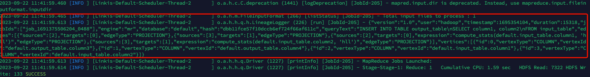

本文主要介绍在 `Linkis` 中， `Hive` 引擎血缘采集方案。


## 1. 介绍

Hive 提供了一个内置的Hook LineageLogger，它用于记录查询执行期间生成的血缘信息。通过使用 LineageLogger Hook，你可以捕获和记录查询的输入和输出表以及列级别的血缘关系

## 2. 将hive血缘采集至日志

### 2.1 修改`hive-site.xml`

```shell
vim $HIVE_HOME/conf/hive-site.xml

增加如下配置
<property>
    <name>hive.exec.post.hooks</name>
    <value>org.apache.hadoop.hive.ql.hooks.LineageLogger</value>
</property>
```

### 2.2 修改`hive-log4j2.properties`

```shell
vim $HIVE_HOME/conf/hive-log4j2.properties

增加如下配置
og4j.logger.org.apache.hadoop.hive.ql.hooks.LineageLogger=INFO
```

### 2.3 提交任务
```shell
sh ./bin/linkis-cli -engineType hive-3.1.3 \
-codeType hql -code  \
"CREATE TABLE input_table (
  column1 INT,
  column2 STRING
);
CREATE TABLE output_table (
  column3 INT,
  column4 STRING
);
INSERT INTO TABLE output_table
SELECT column1, column2
FROM input_table;"  \
-submitUser hadoop -proxyUser hadoop
```

### 2.4 查看日志
```shell
cat /appcom/tmp/hadoop/20230922/hive/946375fe-f189-487c-b3a7-f9fa821edace/logs/stdout 
```

输出结果如下:


详细信息如下:
```json
{
  "version":"1.0",
  "user":"hadoop",
  "timestamp":1695354104,
  "duration":15318,
  "jobIds":[
    "job_1691375506204_0488"
  ],
  "engine":"mr",
  "database":"default",
  "hash":"dbb11fce57f10dccb6ef724f66af611c",
  "queryText":"INSERT INTO TABLE output_table\nSELECT column1, column2\nFROM input_table",
  "edges":[
    {
      "sources":[
        2
      ],
      "targets":[
        0
      ],
      "edgeType":"PROJECTION"
    },
    {
      "sources":[
        3
      ],
      "targets":[
        1
      ],
      "edgeType":"PROJECTION"
    },
    {
      "sources":[
        2
      ],
      "targets":[
        0
      ],
      "expression":"compute_stats(default.input_table.column1, 'hll')",
      "edgeType":"PROJECTION"
    },
    {
      "sources":[
        3
      ],
      "targets":[
        1
      ],
      "expression":"compute_stats(default.input_table.column2, 'hll')",
      "edgeType":"PROJECTION"
    }
  ],
  "vertices":[
    {
      "id":0,
      "vertexType":"COLUMN",
      "vertexId":"default.output_table.column3"
    },
    {
      "id":1,
      "vertexType":"COLUMN",
      "vertexId":"default.output_table.column4"
    },
    {
      "id":2,
      "vertexType":"COLUMN",
      "vertexId":"default.input_table.column1"
    },
    {
      "id":3,
      "vertexType":"COLUMN",
      "vertexId":"default.input_table.column2"
    }
  ]
}
```

