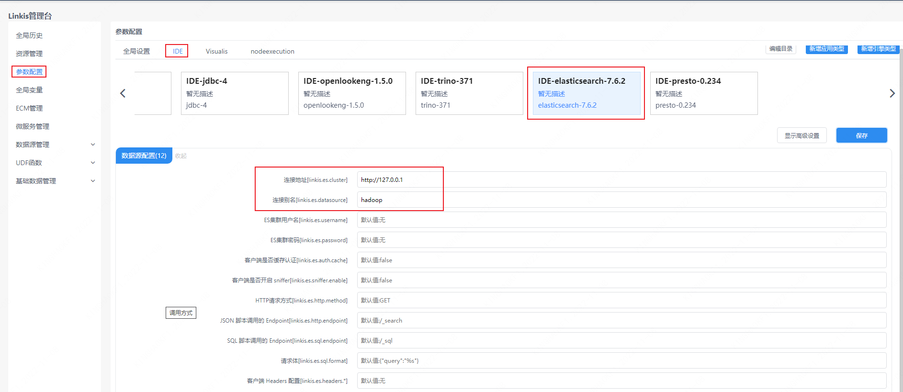

本文主要介绍在 `Linkis` 中，`ElasticSearch` 引擎连接器的安装、使用和配置。

## 1. 前置工作
### 1.1 引擎连接器安装

如果您希望在您的 `Linkis` 服务上使用 `ElasticSearch` 引擎连接器，您需要安装 `ElasticSearch` 服务并保证服务可用。

### 1.2 服务验证
通过如下命令验证 `ElasticSearch` 引擎连接器服务是否可用，如服务已开启用户验证则需要增加  `--user username:password`
```
curl [--user username:password] http://ip:port/_cluster/healty?pretty
```
输出如下内容代表 `ElasticSearch` 服务可用，注意集群 `status` 为 `green`
```json
{
  "cluster_name" : "docker-cluster",
  "status" : "green",
  "timed_out" : false,
  "number_of_nodes" : 1,
  "number_of_data_nodes" : 1,
  "active_primary_shards" : 7,
  "active_shards" : 7,
  "relocating_shards" : 0,
  "initializing_shards" : 0,
  "unassigned_shards" : 0,
  "delayed_unassigned_shards" : 0,
  "number_of_pending_tasks" : 0,
  "number_of_in_flight_fetch" : 0,
  "task_max_waiting_in_queue_millis" : 0,
  "active_shards_percent_as_number" : 100.0
}
```
## 2. 引擎连接器安装

### 2.1 引擎连接器准备（二选一）[非默认引擎连接器](./overview.md)

方式一：直接下载引擎连接器包

[Linkis 引擎连接器下载](https://linkis.apache.org/zh-CN/blog/2022/04/15/how-to-download-engineconn-plugin)

方式二：单独编译引擎连接器（需要有 `maven` 环境）

```
# 编译
cd ${linkis_code_dir}/linkis-engineconn-plugins/elasticsearch/
mvn clean install
# 编译出来的引擎连接器包，位于如下目录中
${linkis_code_dir}/linkis-engineconn-plugins/elasticsearch/target/out/
```

[EngineConnPlugin 引擎连接器安装](../deployment/install-engineconn.md)

### 2.2 引擎连接器的上传和加载

将 2.1 中的引擎连接器包上传到服务器的引擎连接器目录下
```bash 
${LINKIS_HOME}/lib/linkis-engineplugins
```
上传后目录结构如下所示
```
linkis-engineconn-plugins/
├── elasticsearch
│   ├── dist
│   │   └── v7.6.2
│   │       ├── conf
│   │       └── lib
│   └── plugin
│       └── 7.6.2
```
### 2.3 引擎连接器刷新

#### 2.3.1 重启刷新
通过重启 `linkis-cg-linkismanager` 服务刷新引擎连接器
```bash
cd ${LINKIS_HOME}/sbin
sh linkis-daemon.sh restart cg-linkismanager
```

### 2.3.2 检查引擎连接器是否刷新成功
可以查看数据库中的 `linkis_engine_conn_plugin_bml_resources` 这张表的`last_update_time` 是否为触发刷新的时间。

```sql
#登陆到linkis的数据库 
select * from linkis_cg_engine_conn_plugin_bml_resources;
```

## 3.引擎连接器使用

### 3.1 通过 `Linkis-cli` 提交任务
**`-codeType` 参数说明**
- `essql`：通过 `SQL` 脚本的方式执行 `ElasticSearch` 引擎连接器任务
- `esjson`：通过 `JSON` 脚本的方式执行 `ElasticSearch` 引擎连接器任务

**`essql` 方式示例**

**注意：** 使用这种形式， `ElasticSearch` 服务必须安装SQL插件，安装方式参考：https://github.com/NLPchina/elasticsearch-sql#elasticsearch-762
```shell
 sh ./bin/linkis-cli -submitUser hadoop \
 -engineType elasticsearch-7.6.2 -codeType essql \
 -code '{"sql": "select * from kibana_sample_data_ecommerce limit 10' \
 -runtimeMap linkis.es.http.method=GET \
 -runtimeMap linkis.es.http.endpoint=/_sql \
 -runtimeMap linkis.es.datasource=hadoop  \
 -runtimeMap linkis.es.cluster=127.0.0.1:9200
```

**`esjson` 方式示例**
```shell
sh ./bin/linkis-cli -submitUser hadoop \
-engineType elasticsearch-7.6.2 -codeType esjson \
-code '{"query": {"match": {"order_id": "584677"}}}' \
-runtimeMap linkis.es.http.method=GET \
-runtimeMap linkis.es.http.endpoint=/kibana_sample_data_ecommerce/_search \
-runtimeMap linkis.es.datasource=hadoop  \
-runtimeMap linkis.es.cluster=127.0.0.1:9200
```

更多 `Linkis-Cli` 命令参数参考： [Linkis-Cli 使用](../user-guide/linkiscli-manual.md)

## 4. 引擎连接器配置说明

### 4.1 默认配置说明

| 配置                     | 默认值          |是否必须    | 说明                                     |
| ------------------------ | ------------------- | ---|---------------------------------------- |
| linkis.es.cluster        | 127.0.0.1:9200    |是  | ElasticSearch 集群，多个节点使用逗号分隔 |
| linkis.es.datasource        | hadoop            |是  | ElasticSearch datasource |
| linkis.es.username       | 无    |否              | ElasticSearch 集群用户名                 |
| linkis.es.password       | 无       |否           | ElasticSearch 集群密码                   |
| linkis.es.auth.cache     | false       |否        | 客户端是否缓存认证                       |
| linkis.es.sniffer.enable | false          |否     | 客户端是否开启 sniffer                   |
| linkis.es.http.method    | GET               |否  | 调用方式                                 |
| linkis.es.http.endpoint  | /_search           |否 | JSON 脚本调用的 Endpoint                 |
| linkis.es.sql.endpoint   | /_sql             |否  | SQL 脚本调用的 Endpoint                  |
| linkis.es.sql.format     | {"query":"%s"} |否| SQL 脚本调用的模板，%s 替换成 SQL 作为请求体请求Es 集群 |
| linkis.es.headers.* | 无 |否| 客户端 Headers 配置 |
| linkis.engineconn.concurrent.limit | 100|否 | 引擎连接器最大并发 |

### 4.2 配置修改
如果默认参数不满足时，有如下几中方式可以进行一些基础参数配置

#### 4.2.1 管理台配置



注意: 修改 `IDE` 标签下的配置后需要指定 `-creator IDE` 才会生效（其它标签类似），如：

```shell
sh ./bin/linkis-cli -creator IDE -submitUser hadoop \
-engineType elasticsearch-7.6.2 -codeType esjson \
-code '{"query": {"match": {"order_id": "584677"}}}' \
-runtimeMap linkis.es.http.method=GET \
-runtimeMap linkis.es.http.endpoint=/kibana_sample_data_ecommerce/_search 
```

#### 4.2.2 任务接口配置
提交任务接口，通过参数 `params.configuration.runtime` 进行配置

```shell
http 请求参数示例 
{
    "executionContent": {"code": "select * from kibana_sample_data_ecommerce limit 10;", "runType":  "essql"},
    "params": {
                    "variable": {},
                    "configuration": {
                            "runtime": {
                                "linkis.es.cluster":"http://127.0.0.1:9200",
                                "linkis.es.datasource":"hadoop",
                                "linkis.es.username":"",
                                "linkis.es.password":""
                                }
                            }
                    },
    "labels": {
        "engineType": "elasticsearch-7.6.2",
        "userCreator": "hadoop-IDE"
    }
}
```

#### 4.2.3 文件配置
通过修改目录 `${LINKIS_HOME}/lib/linkis-engineconn-plugins/elasticsearch/dist/v7.6.2/conf/` 中的 `linkis-engineconn.properties` 文件进行配置，如下图：


### 4.3 引擎连接器相关数据表

`Linkis` 是通过引擎连接器标签来进行管理的，所涉及的数据表信息如下所示。

```
linkis_ps_configuration_config_key:  插入引擎连接器的配置参数的key和默认values
linkis_cg_manager_label：插入引擎连接器label如：elasticsearch-7.6.2
linkis_ps_configuration_category： 插入引擎连接器的目录关联关系
linkis_ps_configuration_config_value： 插入引擎连接器需要展示的配置
linkis_ps_configuration_key_engine_relation:配置项和引擎连接器的关联关系
```

表中与引擎连接器相关的初始数据如下

```sql
-- set variable
SET @ENGINE_LABEL="elasticsearch-7.6.2";
SET @ENGINE_ALL=CONCAT('*-*,',@ENGINE_LABEL);
SET @ENGINE_IDE=CONCAT('*-IDE,',@ENGINE_LABEL);
SET @ENGINE_NAME="elasticsearch";

-- engine label
insert into `linkis_cg_manager_label` (`label_key`, `label_value`, `label_feature`, `label_value_size`, `update_time`, `create_time`) VALUES ('combined_userCreator_engineType', @ENGINE_ALL, 'OPTIONAL', 2, now(), now());
insert into `linkis_cg_manager_label` (`label_key`, `label_value`, `label_feature`, `label_value_size`, `update_time`, `create_time`) VALUES ('combined_userCreator_engineType', @ENGINE_IDE, 'OPTIONAL', 2, now(), now());

select @label_id := id from `linkis_cg_manager_label` where label_value = @ENGINE_IDE;
insert into `linkis_ps_configuration_category` (`label_id`, `level`) VALUES (@label_id, 2);

-- configuration key
INSERT INTO `linkis_ps_configuration_config_key` (`key`, `description`, `name`, `default_value`, `validate_type`, `validate_range`, `engine_conn_type`, `is_hidden`, `is_advanced`, `level`, `treeName`) VALUES ('linkis.es.cluster', '例如:http://127.0.0.1:9200', '连接地址', 'http://127.0.0.1:9200', 'None', '', @ENGINE_NAME, 0, 0, 1, '数据源配置');
INSERT INTO `linkis_ps_configuration_config_key` (`key`, `description`, `name`, `default_value`, `validate_type`, `validate_range`, `engine_conn_type`, `is_hidden`, `is_advanced`, `level`, `treeName`) VALUES ('linkis.es.datasource', '连接别名', '连接别名', 'hadoop', 'None', '', @ENGINE_NAME, 0, 0, 1, '数据源配置');
INSERT INTO `linkis_ps_configuration_config_key` (`key`, `description`, `name`, `default_value`, `validate_type`, `validate_range`, `engine_conn_type`, `is_hidden`, `is_advanced`, `level`, `treeName`) VALUES ('linkis.es.username', 'username', 'ES集群用户名', '无', 'None', '', @ENGINE_NAME, 0, 0, 1, '数据源配置');
INSERT INTO `linkis_ps_configuration_config_key` (`key`, `description`, `name`, `default_value`, `validate_type`, `validate_range`, `engine_conn_type`, `is_hidden`, `is_advanced`, `level`, `treeName`) VALUES ('linkis.es.password', 'password', 'ES集群密码', '无', 'None', '', @ENGINE_NAME, 0, 0, 1, '数据源配置');
INSERT INTO `linkis_ps_configuration_config_key` (`key`, `description`, `name`, `default_value`, `validate_type`, `validate_range`, `engine_conn_type`, `is_hidden`, `is_advanced`, `level`, `treeName`) VALUES ('linkis.es.auth.cache', '客户端是否缓存认证', '客户端是否缓存认证', 'false', 'None', '', @ENGINE_NAME, 0, 0, 1, '数据源配置');
INSERT INTO `linkis_ps_configuration_config_key` (`key`, `description`, `name`, `default_value`, `validate_type`, `validate_range`, `engine_conn_type`, `is_hidden`, `is_advanced`, `level`, `treeName`) VALUES ('linkis.es.sniffer.enable', '客户端是否开启 sniffer', '客户端是否开启 sniffer', 'false', 'None', '', @ENGINE_NAME, 0, 0, 1, '数据源配置');
INSERT INTO `linkis_ps_configuration_config_key` (`key`, `description`, `name`, `default_value`, `validate_type`, `validate_range`, `engine_conn_type`, `is_hidden`, `is_advanced`, `level`, `treeName`) VALUES ('linkis.es.http.method', '调用方式', 'HTTP请求方式', 'GET', 'None', '', @ENGINE_NAME, 0, 0, 1, '数据源配置');
INSERT INTO `linkis_ps_configuration_config_key` (`key`, `description`, `name`, `default_value`, `validate_type`, `validate_range`, `engine_conn_type`, `is_hidden`, `is_advanced`, `level`, `treeName`) VALUES ('linkis.es.http.endpoint', '/_search', 'JSON 脚本调用的 Endpoint', '/_search', 'None', '', @ENGINE_NAME, 0, 0, 1, '数据源配置');
INSERT INTO `linkis_ps_configuration_config_key` (`key`, `description`, `name`, `default_value`, `validate_type`, `validate_range`, `engine_conn_type`, `is_hidden`, `is_advanced`, `level`, `treeName`) VALUES ('linkis.es.sql.endpoint', '/_sql', 'SQL 脚本调用的 Endpoint', '/_sql', 'None', '', @ENGINE_NAME, 0, 0, 1, '数据源配置');
INSERT INTO `linkis_ps_configuration_config_key` (`key`, `description`, `name`, `default_value`, `validate_type`, `validate_range`, `engine_conn_type`, `is_hidden`, `is_advanced`, `level`, `treeName`) VALUES ('linkis.es.sql.format', 'SQL 脚本调用的模板，%s 替换成 SQL 作为请求体请求Es 集群', '请求体', '{"query":"%s"}', 'None', '', @ENGINE_NAME, 0, 0, 1, '数据源配置');
INSERT INTO `linkis_ps_configuration_config_key` (`key`, `description`, `name`, `default_value`, `validate_type`, `validate_range`, `engine_conn_type`, `is_hidden`, `is_advanced`, `level`, `treeName`) VALUES ('linkis.es.headers.*', '客户端 Headers 配置', '客户端 Headers 配置', '无', 'None', '', @ENGINE_NAME, 0, 0, 1, '数据源配置');
INSERT INTO `linkis_ps_configuration_config_key` (`key`, `description`, `name`, `default_value`, `validate_type`, `validate_range`, `engine_conn_type`, `is_hidden`, `is_advanced`, `level`, `treeName`) VALUES ('linkis.engineconn.concurrent.limit', '引擎连接器最大并发', '引擎连接器最大并发', '100', 'None', '', @ENGINE_NAME, 0, 0, 1, '数据源配置');

-- key engine relation
insert into `linkis_ps_configuration_key_engine_relation` (`config_key_id`, `engine_type_label_id`)
(select config.id as config_key_id, label.id AS engine_type_label_id FROM `linkis_ps_configuration_config_key` config
INNER JOIN `linkis_cg_manager_label` label ON config.engine_conn_type = @ENGINE_NAME and label_value = @ENGINE_ALL);

-- engine default configuration
insert into `linkis_ps_configuration_config_value` (`config_key_id`, `config_value`, `config_label_id`)
(select relation.config_key_id AS config_key_id, '' AS config_value, relation.engine_type_label_id AS config_label_id FROM `linkis_ps_configuration_key_engine_relation` relation
INNER JOIN `linkis_cg_manager_label` label ON relation.engine_type_label_id = label.id AND label.label_value = @ENGINE_ALL);

```
