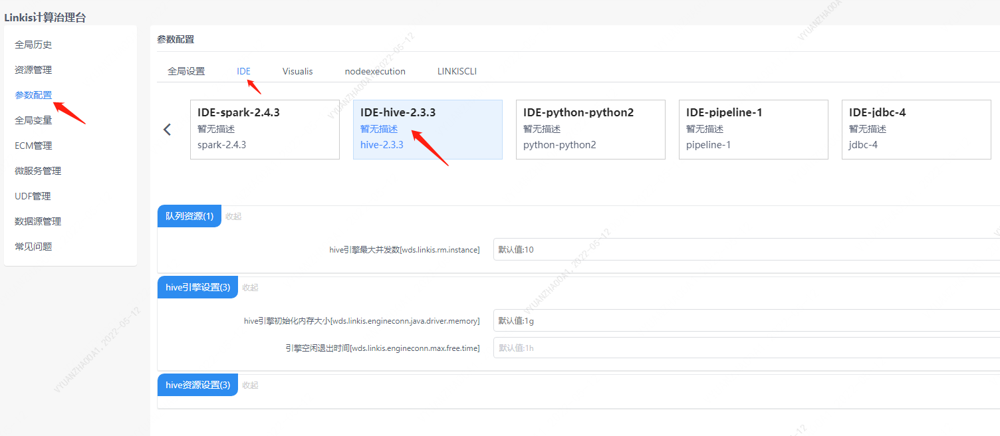

本文主要介绍在 `Linkis` 中， `Hive` 引擎连接器的安装、使用和配置。

## 1. 前置工作
### 1.1 擎使用前的环境配置

如果您希望在您的服务器上使用 `Hive` 引擎连接器，您需要保证以下的环境变量已经设置正确并且引擎连接器的启动用户是有这些环境变量的。

强烈建议您在执行 `Hive` 任务之前，检查下执行用户的这些环境变量。

| 环境变量名      | 环境变量内容   | 备注 |
|-----------------|----------------|------|
| JAVA_HOME       | JDK安装路径    | 必须 |
| HADOOP_HOME     | Hadoop安装路径 | 必须 |
| HADOOP_CONF_DIR | Hadoop配置路径 | 必须 |
| HIVE_CONF_DIR  | Hive配置路径   | 必须 |

### 1.1 环境验证
```
# 链接hive
bin/hive

# 测试命令
show databases;

# 能够链接成功，并正常输出数据库信息代表环境配置成功
hive (default)> show databases;
OK
databases_name
default
```

## 2. 引擎插件安装 [默认引擎](./overview.md)

`linkis` 发布的二进制安装包中默认包含了 `Hive` 引擎插件，用户无需额外安装。

`Hive` 的版本是支持 `Hive1.x` 和` Hive2.x` ，默认是支持 `Hive on MapReduce` ，如果您想改成 `Hive on Tez` ，需要您按照此 `PR` 进行一下修改。

<https://github.com/apache/incubator-linkis/pull/541>

默认支持的 `Hive` 版本是2.3.3，如果您想修改 `Hive` 的版本，您可以找到 `linkis-engineplugin-hive` 模块，修改 `<hive.version\>` 标签，然后单独编译此模块即可

[EngineConnPlugin引擎插件安装](../deployment/install-engineconn.md)

## 3. 引擎的使用

### 3.1 通过 `Linkis-cli` 提交任务

```shell
sh ./bin/linkis-cli -engineType hive-2.3.3 \
-codeType hql -code "show databases"  \
-submitUser hadoop -proxyUser hadoop
```

更多 `Linkis-Cli` 命令参数参考： [`Linkis-Cli` 使用](../user-guide/linkiscli-manual.md)

### 3.2 通过Linkis SDK提交任务

`Linkis` 提供了 `Java` 和 `Scala` 的 `SDK` 向 `Linkis` 服务端提交任务。具体可以参考 [JAVA SDK Manual](../user-guide/sdk-manual.md)。对于 `Hive` 任务你只需要修改 `Demo` 中的 `EngineConnType` 和 `CodeType` 参数即可:

```java
Map<String, Object> labels = new HashMap<String, Object>();
labels.put(LabelKeyConstant.ENGINE_TYPE_KEY, "hive-2.3.3"); // required engineType Label
labels.put(LabelKeyConstant.USER_CREATOR_TYPE_KEY, "hadoop-IDE");// required execute user and creator
labels.put(LabelKeyConstant.CODE_TYPE_KEY, "hql"); // required codeType
```

## 4. 引擎连接器配置说明

### 4.1 默认配置说明
| 配置                     | 默认值          |是否必须    | 说明                                     |
| ------------------------ | ------------------- | ---|---------------------------------------- |
| wds.linkis.rm.instance        | 10    |否  | 引擎连接器最大并发数 |
| wds.linkis.engineconn.java.driver.memory        | 1g            |否  | 引擎连接器初始化内存大小 |
| wds.linkis.engineconn.max.free.time       | 1h    |否              | 引擎连接器空闲退出时间 |

### 4.2 队列资源配置
`Hive` 的 `MapReduce` 任务是需要用到 `yarn` 的资源，所以需要设置队列。

    

### 4.3 配置修改
如果默认参数不满足时，有如下几中方式可以进行一些基础参数配置

#### 4.3.1 管理台配置



注意: 修改 `IDE` 标签下的配置后需要指定 `-creator IDE` 才会生效（其它标签类似），如：

```shell
sh ./bin/linkis-cli -creator IDE \
-engineType hive-2.3.3 -codeType hql \
-code "show databases"  \
-submitUser hadoop -proxyUser hadoop
```

#### 4.3.2 任务接口配置
提交任务接口，通过参数 `params.configuration.runtime` 进行配置

```shell
http 请求参数示例 
{
    "executionContent": {"code": "show databases;", "runType":  "sql"},
    "params": {
                    "variable": {},
                    "configuration": {
                            "runtime": {
                                "wds.linkis.rm.instance":"10"
                                }
                            }
                    },
    "labels": {
        "engineType": "hive-2.3.3",
        "userCreator": "hadoop-IDE"
    }
}
```

### 4.4 引擎连接器相关数据表

`Linkis` 是通过引擎连接器标签来进行管理的，所涉及的数据表信息如下所示。

```
linkis_ps_configuration_config_key:  插入引擎连接器的配置参数的key和默认values
linkis_cg_manager_label：插入引擎连接器标签如：hive-2.3.3
linkis_ps_configuration_category： 插入引擎连接器的目录关联关系
linkis_ps_configuration_config_value： 插入引擎连接器需要展示的配置
linkis_ps_configuration_key_engine_relation:配置项和引擎连接器的关联关系
```

表中与引擎连接器相关的初始数据如下

```sql
-- set variable
SET @HIVE_LABEL="hive-2.3.3";
SET @HIVE_ALL=CONCAT('*-*,',@HIVE_LABEL);
SET @HIVE_IDE=CONCAT('*-IDE,',@HIVE_LABEL);

-- engine label
insert into `linkis_cg_manager_label` (`label_key`, `label_value`, `label_feature`, `label_value_size`, `update_time`, `create_time`) VALUES ('combined_userCreator_engineType', @HIVE_ALL, 'OPTIONAL', 2, now(), now());
insert into `linkis_cg_manager_label` (`label_key`, `label_value`, `label_feature`, `label_value_size`, `update_time`, `create_time`) VALUES ('combined_userCreator_engineType', @HIVE_IDE, 'OPTIONAL', 2, now(), now());

select @label_id := id from linkis_cg_manager_label where `label_value` = @HIVE_IDE;
insert into linkis_ps_configuration_category (`label_id`, `level`) VALUES (@label_id, 2);

-- configuration key
INSERT INTO `linkis_ps_configuration_config_key` (`key`, `description`, `name`, `default_value`, `validate_type`, `validate_range`, `is_hidden`, `is_advanced`, `level`, `treeName`, `engine_conn_type`) VALUES ('wds.linkis.rm.instance', '范围：1-20，单位：个', 'hive引擎连接器最大并发数', '10', 'NumInterval', '[1,20]', '0', '0', '1', '队列资源', 'hive');
INSERT INTO `linkis_ps_configuration_config_key` (`key`, `description`, `name`, `default_value`, `validate_type`, `validate_range`, `is_hidden`, `is_advanced`, `level`, `treeName`, `engine_conn_type`) VALUES ('wds.linkis.engineconn.java.driver.memory', '取值范围：1-10，单位：G', 'hive引擎连接器初始化内存大小','1g', 'Regex', '^([1-9]|10)(G|g)$', '0', '0', '1', 'hive引擎连接器设置', 'hive');
INSERT INTO `linkis_ps_configuration_config_key` (`key`, `description`, `name`, `default_value`, `validate_type`, `validate_range`, `is_hidden`, `is_advanced`, `level`, `treeName`, `engine_conn_type`) VALUES ('hive.client.java.opts', 'hive客户端进程参数', 'hive引擎连接器启动时jvm参数','', 'None', NULL, '1', '1', '1', 'hive引擎连接器设置', 'hive');
INSERT INTO `linkis_ps_configuration_config_key` (`key`, `description`, `name`, `default_value`, `validate_type`, `validate_range`, `is_hidden`, `is_advanced`, `level`, `treeName`, `engine_conn_type`) VALUES ('mapred.reduce.tasks', '范围：-1-10000，单位：个', 'reduce数', '-1', 'NumInterval', '[-1,10000]', '0', '1', '1', 'hive资源设置', 'hive');
INSERT INTO `linkis_ps_configuration_config_key` (`key`, `description`, `name`, `default_value`, `validate_type`, `validate_range`, `is_hidden`, `is_advanced`, `level`, `treeName`, `engine_conn_type`) VALUES ('wds.linkis.engineconn.max.free.time', '取值范围：3m,15m,30m,1h,2h', '引擎连接器空闲退出时间','1h', 'OFT', '[\"1h\",\"2h\",\"30m\",\"15m\",\"3m\"]', '0', '0', '1', 'hive引擎连接器设置', 'hive');

-- key engine relation
insert into `linkis_ps_configuration_key_engine_relation` (`config_key_id`, `engine_type_label_id`)
(select config.id as `config_key_id`, label.id AS `engine_type_label_id` FROM linkis_ps_configuration_config_key config
INNER JOIN linkis_cg_manager_label label ON config.engine_conn_type = 'hive' and label_value = @HIVE_ALL);

-- engine default configuration
insert into `linkis_ps_configuration_config_value` (`config_key_id`, `config_value`, `config_label_id`)
(select `relation`.`config_key_id` AS `config_key_id`, '' AS `config_value`, `relation`.`engine_type_label_id` AS `config_label_id` FROM linkis_ps_configuration_key_engine_relation relation
INNER JOIN linkis_cg_manager_label label ON relation.engine_type_label_id = label.id AND label.label_value = @HIVE_ALL);
```

## 5. Hive修改日志展示
默认的日志界面是不显示 `application_id` 以及 `task` 完成数量的,用户可以根据需要输出该日志
引擎连接器内的 `log4j2-engineconn.xml/log4j2.xml` 配置文件中需要修改的代码块如下
1. `appenders` 组件下需要添加
```xml
        <Send name="SendPackage" >
            <PatternLayout pattern="%d{yyyy-MM-dd HH:mm:ss.SSS} %-5level [%t] %logger{36} %L %M - %msg%xEx%n"/>
        </Send>
```
2. `root` 组件下需要添加
```xml
        <appender-ref ref="SendPackage"/>
```
3. `loggers` 组件下需要添加
```xml
        <logger name="org.apache.hadoop.hive.ql.exec.StatsTask" level="info" additivity="true">
            <appender-ref ref="SendPackage"/>
        </logger>
```
进行如上相关修改后日志可以增加任务 `task` 进度信息，显示为如下样式
```
2022-04-08 11:06:50.228 INFO  [Linkis-Default-Scheduler-Thread-3] SessionState 1111 printInfo - Status: Running (Executing on YARN cluster with App id application_1631114297082_432445)
2022-04-08 11:06:50.248 INFO  [Linkis-Default-Scheduler-Thread-3] SessionState 1111 printInfo - Map 1: -/-	Reducer 2: 0/1	
2022-04-08 11:06:52.417 INFO  [Linkis-Default-Scheduler-Thread-3] SessionState 1111 printInfo - Map 1: 0/1	Reducer 2: 0/1	
2022-04-08 11:06:55.060 INFO  [Linkis-Default-Scheduler-Thread-3] SessionState 1111 printInfo - Map 1: 0(+1)/1	Reducer 2: 0/1	
2022-04-08 11:06:57.495 INFO  [Linkis-Default-Scheduler-Thread-3] SessionState 1111 printInfo - Map 1: 1/1	Reducer 2: 0(+1)/1	
2022-04-08 11:06:57.899 INFO  [Linkis-Default-Scheduler-Thread-3] SessionState 1111 printInfo - Map 1: 1/1	Reducer 2: 1/1	
```

完整 `xml` 配置文件范例如下：
```xml
<!--
  ~ Copyright 2019 WeBank
  ~
  ~ Licensed under the Apache License, Version 2.0 (the "License");
  ~ you may not use this file except in compliance with the License.
  ~ You may obtain a copy of the License at
  ~
  ~ http://www.apache.org/licenses/LICENSE-2.0
  ~
  ~ Unless required by applicable law or agreed to in writing, software
  ~ distributed under the License is distributed on an "AS IS" BASIS,
  ~ WITHOUT WARRANTIES OR CONDITIONS OF ANY KIND, either express or implied.
  ~ See the License for the specific language governing permissions and
  ~ limitations under the License.
  -->
  
<configuration status="error" monitorInterval="30">
    <appenders>
        <Console name="Console" target="SYSTEM_OUT">
            <ThresholdFilter level="INFO" onMatch="ACCEPT" onMismatch="DENY"/>
            <PatternLayout pattern="%d{yyyy-MM-dd HH:mm:ss.SSS} %-5level [%t] %logger{36} %L %M - %msg%xEx%n"/>
        </Console>

        <Send name="Send" >
            <Filters>
                <ThresholdFilter level="WARN" onMatch="ACCEPT" onMismatch="DENY" />
            </Filters>
            <PatternLayout pattern="%d{yyyy-MM-dd HH:mm:ss.SSS} %-5level [%t] %logger{36} %L %M - %msg%xEx%n"/>
        </Send>

        <Send name="SendPackage" >
            <PatternLayout pattern="%d{yyyy-MM-dd HH:mm:ss.SSS} %-5level [%t] %logger{36} %L %M - %msg%xEx%n"/>
        </Send>

        <Console name="stderr" target="SYSTEM_ERR">
            <ThresholdFilter level="ERROR" onMatch="ACCEPT" onMismatch="DENY" />
            <PatternLayout pattern="%d{HH:mm:ss.SSS} %-5level %class{36} %L %M - %msg%xEx%n"/>
        </Console>
    </appenders>

    <loggers>
      <root level="INFO">
            <appender-ref ref="stderr"/>
            <appender-ref ref="Console"/>
            <appender-ref ref="Send"/>
            <appender-ref ref="SendPackage"/>
        </root>
        <logger name="org.apache.hadoop.hive.ql.exec.StatsTask" level="info" additivity="true">
            <appender-ref ref="SendPackage"/>
        </logger>
        <logger name="org.springframework.boot.diagnostics.LoggingFailureAnalysisReporter" level="error" additivity="true">
            <appender-ref ref="stderr"/>
        </logger>
        <logger name="com.netflix.discovery" level="warn" additivity="true">
            <appender-ref ref="Send"/>
        </logger>
        <logger name="org.apache.hadoop.yarn" level="warn" additivity="true">
            <appender-ref ref="Send"/>
        </logger>
        <logger name="org.springframework" level="warn" additivity="true">
            <appender-ref ref="Send"/>
        </logger>
        <logger name="org.apache.linkis.server.security" level="warn" additivity="true">
            <appender-ref ref="Send"/>
        </logger>
        <logger name="org.apache.hadoop.hive.ql.exec.mr.ExecDriver" level="fatal" additivity="true">
            <appender-ref ref="Send"/>
        </logger>
        <logger name="org.apache.hadoop.hdfs.KeyProviderCache" level="fatal" additivity="true">
            <appender-ref ref="Send"/>
        </logger>
        <logger name="org.spark_project.jetty" level="ERROR" additivity="true">
            <appender-ref ref="Send"/>
        </logger>
        <logger name="org.eclipse.jetty" level="ERROR" additivity="true">
            <appender-ref ref="Send"/>
        </logger>
        <logger name="org.springframework" level="ERROR" additivity="true">
            <appender-ref ref="Send"/>
        </logger>
        <logger name="org.reflections.Reflections" level="ERROR" additivity="true">
            <appender-ref ref="Send"/>
        </logger>

        <logger name="org.apache.hadoop.ipc.Client" level="ERROR" additivity="true">
            <appender-ref ref="Send"/>
        </logger>

   </loggers>
</configuration>
```
