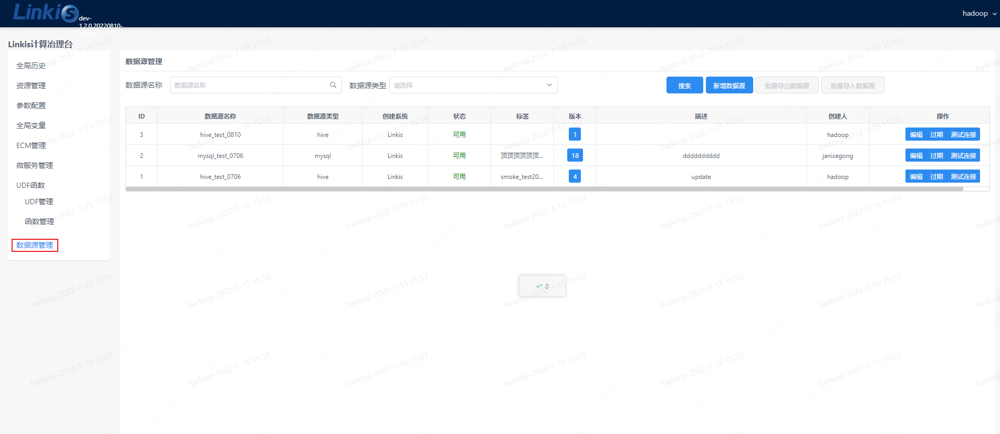
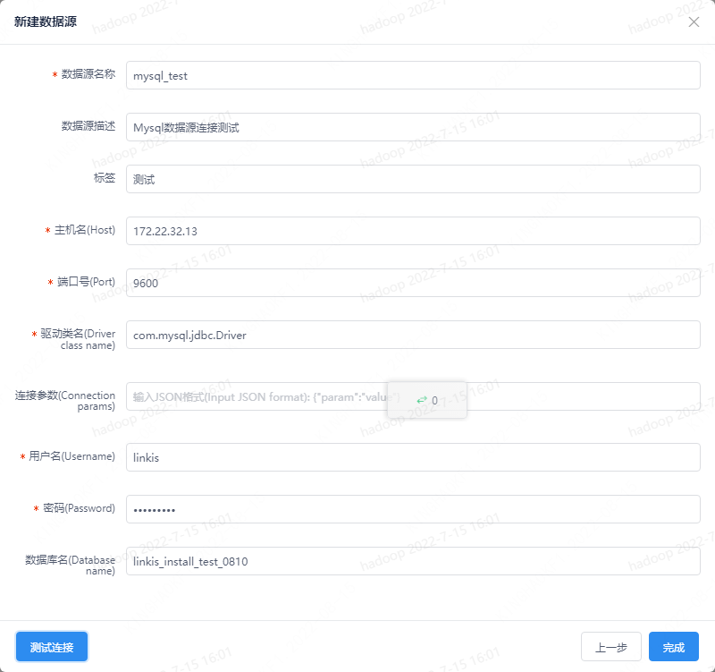
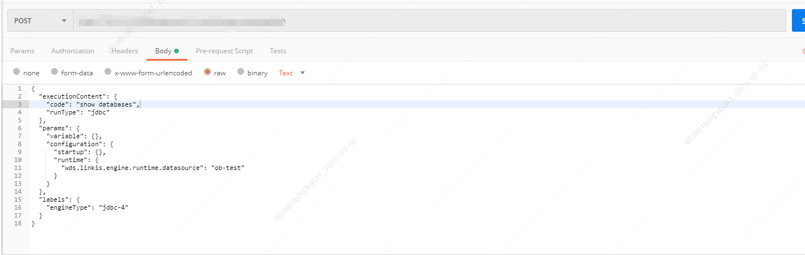
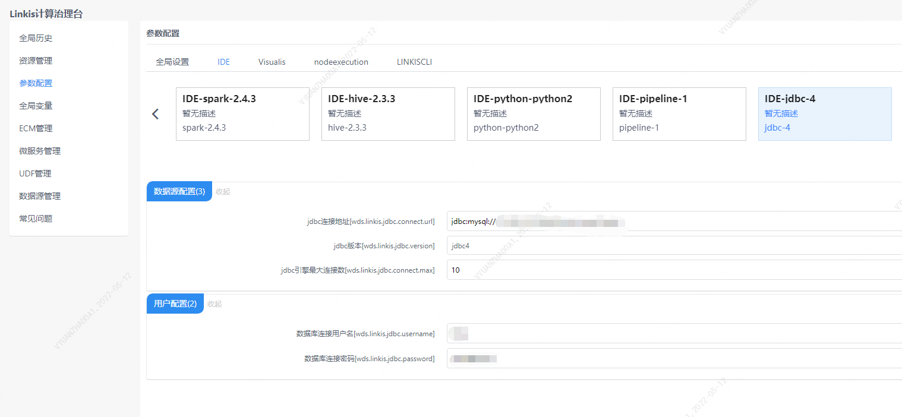

本文主要介绍在 `Linkis` 中， `JDBC` 引擎插件的安装、使用和配置。

## 1. 前置工作
### 1.1 环境安装

如果您希望在您的服务器上使用 `JDBC` 引擎，您需要准备 `JDBC` 连接信息，如 `MySQL` 数据库的连接地址、用户名和密码等

### 1.2 环境验证（以 `Mysql` 为例）
```
mysql -uroot -P 3306 -h 127.0.0.1 -p 123456
```
输出如下信息代表 `JDBC` 连接信息可用
```
mysql: [Warning] Using a password on the command line interface can be insecure.
Welcome to the MySQL monitor.  Commands end with ; or \g.
Your MySQL connection id is 9
Server version: 5.7.39 MySQL Community Server (GPL)

Copyright (c) 2000, 2022, Oracle and/or its affiliates.

Oracle is a registered trademark of Oracle Corporation and/or its
affiliates. Other names may be trademarks of their respective
owners.

Type 'help;' or '\h' for help. Type '\c' to clear the current input statement.

mysql>
```

## 2. 引擎插件安装

### 2.1 引擎插件准备（二选一）[非默认引擎](./overview.md)

方式一：直接下载引擎插件包

[Linkis 引擎插件下载](https://linkis.apache.org/zh-CN/blog/2022/04/15/how-to-download-engineconn-plugin)

方式二：单独编译引擎插件（需要有 `maven` 环境）

```
# 编译
cd ${linkis_code_dir}/linkis-engineconn-plugins/jdbc/
mvn clean install
# 编译出来的引擎插件包，位于如下目录中
${linkis_code_dir}/linkis-engineconn-plugins/jdbc/target/out/
```

[EngineConnPlugin 引擎插件安装](../deployment/install-engineconn.md)

### 2.2 引擎插件的上传和加载

将 2.1 中的引擎插件包上传到服务器的引擎目录下
```bash 
${LINKIS_HOME}/lib/linkis-engineplugins
```
上传后目录结构如下所示
```
linkis-engineconn-plugins/
├── jdbc
│   ├── dist
│   │   └── v4
│   │       ├── conf
│   │       └── lib
│   └── plugin
│       └── 4
```

### 2.3 引擎刷新

#### 2.3.1 重启刷新
通过重启 `linkis-cg-linkismanager` 服务刷新引擎
```bash
cd ${LINKIS_HOME}/sbin
sh linkis-daemon.sh restart cg-linkismanager
```

### 2.3.2 检查引擎是否刷新成功

可以查看数据库中的 `linkis_engine_conn_plugin_bml_resources` 这张表的 `last_update_time` 是否为触发刷新的时间。

```sql
#登陆到 `linkis` 的数据库 
select * from linkis_cg_engine_conn_plugin_bml_resources;
```

## 3. 引擎的使用

### 3.1 通过 `Linkis-cli` 提交任务

```shell
sh ./bin/linkis-cli -engineType jdbc-4 \
-codeType jdbc -code "show tables" \
-submitUser hadoop -proxyUser hadoop
```

更多 `Linkis-Cli` 命令参数参考： [Linkis-Cli 使用](../user-guide/linkiscli-manual.md)

### 3.2 通过 `Linkis SDK` 提交任务

`Linkis` 提供了 `Java` 和 `Scala` 的 `SDK` 向 `Linkis` 服务端提交任务。具体可以参考 [JAVA SDK Manual](../user-guide/sdk-manual.md)。对于 `JDBC` 任务您只需要修改 `Demo` 中的 `EngineConnType` 和 `CodeType` 参数即可:

```java
Map<String, Object> labels = new HashMap<String, Object>();
labels.put(LabelKeyConstant.ENGINE_TYPE_KEY, "jdbc-4"); // required engineType Label
labels.put(LabelKeyConstant.USER_CREATOR_TYPE_KEY, "hadoop-IDE");// required execute user and creator
labels.put(LabelKeyConstant.CODE_TYPE_KEY, "jdbc"); // required codeType
```

### 3.3 多数据源支持
从 `Linkis 1.2.0` 开始，提供了 `JDBC` 引擎多数据源的支持，我们首先可以在控制台管理不同的数据源。地址：登陆管理台-->数据源管理-->新增数据源



图3-3 数据源管理



图3-4 数据源连接测试

数据源添加完成之后，就可以使用 `JDBC` 引擎的多数据源切换功能，有两种方式：
1、 通过接口参数指定数据源名称参数，如下图：


参数示例：
```json
{
    "executionContent": {"code": "show databases", "runType":  "jdbc"},
    "params": {"variable": {}, "configuration": {"startup":{}, 
    "runtime": 
    	{ 
    		"dataSources": {"wds.linkis.engine.runtime.datasource": "test_mysql"
    	}
    }}},
    "source":  {"scriptPath": ""},
    "labels": {
        "engineType": "jdbc-4",
        "userCreator": "hadoop-IDE"
    }
}
```

参数：`wds.linkis.engine.runtime.datasource` 为固定名称的配置，不要随意修改名称定义

2、 通过 `DSS` 的 `Scripts` 代码提交入口下拉筛选需要提交的数据源，如下图：

当前 `dss-1.1.0` 还暂不支持下拉选择数据源名称， `PR` 在开发中，可以等后续发版或关注相关 `PR` ：
（https://github.com/WeBankFinTech/DataSphereStudio/issues/940）


多数据源的功能说明：

1）在之前的版本中， `JDBC` 引擎对数据源的支持不够完善，尤其是搭配 `Scripts` 使用的时候， `JDBC` 脚本类型只能绑定控制台的一套 `JDBC` 引擎参数，
当我们有多数据源的切换需求时，只能修改 `JDBC` 引擎的连接参数，比较麻烦。

2）配合数据源管理，我们引入 `JDBC` 引擎的多数据源切换功能，可以实现只设置数据源名称，就可把作业提交到不同的 `JDBC` 服务之上，普通用户不需要
维护数据源的连接信息，避免了配置繁琐，也满足了数据源连接密码等配置的安全性需要。

3）多数据源管理中设置的数据源，只有发布之后，并且没有过期的数据源才能被 `JDBC` 引擎加载到，否则会反馈给用户不同类型的异常提示。

4） `JDBC` 引擎参数的加载优先级为：任务提交传参 > 选择数据源的参数 > 控制台JDBC引擎的参数


## 4. 引擎配置说明

### 4.1 默认配置说明

| 配置                     | 默认值          |是否必须    | 说明                                     |
| ------------------------ | ------------------- | ---|---------------------------------------- |
| wds.linkis.jdbc.connect.url        | jdbc:mysql://127.0.0.1:10000    |是  | jdbc连接地址 |
| wds.linkis.jdbc.driver       | 无            |是  | jdbc连接驱动 |
| wds.linkis.jdbc.username       | 无    |是              | 数据库连接用户名                 |
| wds.linknis.jdbc.password       | 无       |是           | 数据库链接密码                   |
| wds.linkis.jdbc.connect.max     | 10       |否        | jdbc引擎最大连接数                       |
| wds.linkis.jdbc.version     | jdbc4       |否        | jdbc版本                       |

### 4.2 配置修改
如果默认参数不满足时，有如下几中方式可以进行一些基础参数配置


#### 4.2.1 管理台配置



注意: 修改 `IDE` 标签下的配置后需要指定 `-creator IDE` 才会生效（其它标签类似），如：

```shell
sh ./bin/linkis-cli -creator IDE \
-engineType jdbc-4 -codeType jdbc \
-code "show tables"  \
-submitUser hadoop -proxyUser hadoop \
-runtimeMap wds.linkis.jdbc.connect.url=jdbc:mysql://127.0.0.1:3306 \
-runtimeMap wds.linkis.jdbc.driver=com.mysql.jdbc.Driver \
-runtimeMap wds.linkis.jdbc.username=root \
-runtimeMap wds.linkis.jdbc.password=123456 \
```

#### 4.2.2 任务接口配置
提交任务接口，通过参数 `params.configuration.runtime` 进行配置

```shell
http 请求参数示例 
{
    "executionContent": {"code": "show databases;", "runType":  "jdbc"},
    "params": {
                    "variable": {},
                    "configuration": {
                            "runtime": {
                                    "wds.linkis.jdbc.connect.url":"jdbc:mysql://127.0.0.1:3306/test",  
                                    "wds.linkis.jdbc.driver":"com.mysql.jdbc.Driver",
                                    "wds.linkis.jdbc.username":"test",
                                    "wds.linkis.jdbc.password":"test23"
                                }
                            }
                    },
    "labels": {
        "engineType": "jdbc-4",
        "userCreator": "hadoop-IDE"
    }
}
```
### 4.3 引擎相关数据表

`Linkis` 是通过引擎标签来进行管理的，所涉及的数据表信息如下所示。

```
linkis_ps_configuration_config_key:  插入引擎的配置参数的key和默认values
linkis_cg_manager_label：插入引擎label如：jdbc-4
linkis_ps_configuration_category： 插入引擎的目录关联关系
linkis_ps_configuration_config_value： 插入引擎需要展示的配置
linkis_ps_configuration_key_engine_relation:配置项和引擎的关联关系
```

表中与引擎相关的初始数据如下

```sql
-- set variable
SET @JDBC_LABEL="jdbc-4";
SET @JDBC_ALL=CONCAT('*-*,',@JDBC_LABEL);
SET @JDBC_IDE=CONCAT('*-IDE,',@JDBC_LABEL);

-- engine label
insert into `linkis_cg_manager_label` (`label_key`, `label_value`, `label_feature`, `label_value_size`, `update_time`, `create_time`) VALUES ('combined_userCreator_engineType', @JDBC_ALL, 'OPTIONAL', 2, now(), now());
insert into `linkis_cg_manager_label` (`label_key`, `label_value`, `label_feature`, `label_value_size`, `update_time`, `create_time`) VALUES ('combined_userCreator_engineType', @JDBC_IDE, 'OPTIONAL', 2, now(), now());

select @label_id := id from linkis_cg_manager_label where `label_value` = @JDBC_IDE;
insert into linkis_ps_configuration_category (`label_id`, `level`) VALUES (@label_id, 2);

-- configuration key
insert into `linkis_ps_configuration_config_key` (`key`, `description`, `name`, `default_value`, `validate_type`, `validate_range`, `is_hidden`, `is_advanced`, `level`, `treeName`, `engine_conn_type`) VALUES ('wds.linkis.jdbc.connect.url', '例如:jdbc:mysql://127.0.0.1:10000', 'jdbc连接地址', 'jdbc:mysql://127.0.0.1:10000', 'Regex', '^\\s*jdbc:\\w+://([^:]+)(:\\d+)(/[^\\?]+)?(\\?\\S*)?$', '0', '0', '1', '数据源配置', 'jdbc');
insert into `linkis_ps_configuration_config_key` (`key`, `description`, `name`, `default_value`, `validate_type`, `validate_range`, `is_hidden`, `is_advanced`, `level`, `treeName`, `engine_conn_type`) VALUES ('wds.linkis.jdbc.driver', '例如:com.mysql.jdbc.Driver', 'jdbc连接驱动', '', 'None', '', '0', '0', '1', '用户配置', 'jdbc');
insert into `linkis_ps_configuration_config_key` (`key`, `description`, `name`, `default_value`, `validate_type`, `validate_range`, `is_hidden`, `is_advanced`, `level`, `treeName`, `engine_conn_type`) VALUES ('wds.linkis.jdbc.version', '取值范围：jdbc3,jdbc4', 'jdbc版本','jdbc4', 'OFT', '[\"jdbc3\",\"jdbc4\"]', '0', '0', '1', '用户配置', 'jdbc');
insert into `linkis_ps_configuration_config_key` (`key`, `description`, `name`, `default_value`, `validate_type`, `validate_range`, `is_hidden`, `is_advanced`, `level`, `treeName`, `engine_conn_type`) VALUES ('wds.linkis.jdbc.username', 'username', '数据库连接用户名', '', 'None', '', '0', '0', '1', '用户配置', 'jdbc');
insert into `linkis_ps_configuration_config_key` (`key`, `description`, `name`, `default_value`, `validate_type`, `validate_range`, `is_hidden`, `is_advanced`, `level`, `treeName`, `engine_conn_type`) VALUES ('wds.linkis.jdbc.password', 'password', '数据库连接密码', '', 'None', '', '0', '0', '1', '用户配置', 'jdbc');
insert into `linkis_ps_configuration_config_key` (`key`, `description`, `name`, `default_value`, `validate_type`, `validate_range`, `is_hidden`, `is_advanced`, `level`, `treeName`, `engine_conn_type`) VALUES ('wds.linkis.jdbc.connect.max', '范围：1-20，单位：个', 'jdbc引擎最大连接数', '10', 'NumInterval', '[1,20]', '0', '0', '1', '数据源配置', 'jdbc');

-- key engine relation
insert into `linkis_ps_configuration_key_engine_relation` (`config_key_id`, `engine_type_label_id`)
(select config.id as `config_key_id`, label.id AS `engine_type_label_id` FROM linkis_ps_configuration_config_key config
INNER JOIN linkis_cg_manager_label label ON config.engine_conn_type = 'jdbc' and label_value = @JDBC_ALL);

insert into `linkis_ps_configuration_config_value` (`config_key_id`, `config_value`, `config_label_id`)
(select `relation`.`config_key_id` AS `config_key_id`, '' AS `config_value`, `relation`.`engine_type_label_id` AS `config_label_id` FROM linkis_ps_configuration_key_engine_relation relation
INNER JOIN linkis_cg_manager_label label ON relation.engine_type_label_id = label.id AND label.label_value = @JDBC_ALL);
```
