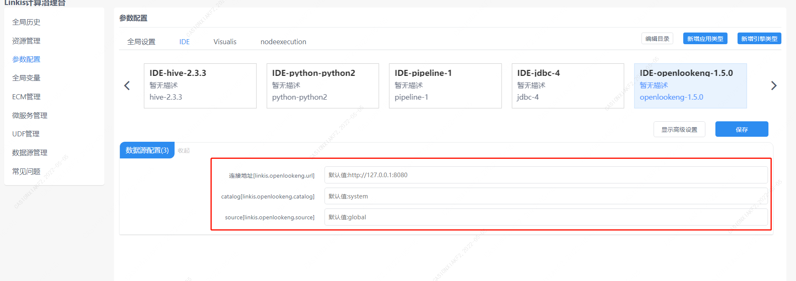

本文主要介绍在 `Linkis` `中，openLooKeng` 引擎插件的安装、使用和配置。

## 1. 前置工作
### 1.1 环境安装

如果您希望部署使用 `openLooKeng` 引擎，您需要准备一套可用的 `openLooKeng` 环境。

### 1.2 服务验证

```shell
# 准备 hetu-cli
wget https://download.openlookeng.io/1.5.0/hetu-cli-1.5.0-executable.jar
mv hetu-cli-1.5.0-executable.jar hetu-cli
chmod +x hetu-cli

#  链接服务
./hetu-cli --server 172.22.32.6:9090 --catalog tpcds --schema default

# 执行查询语句
lk:default> select d_date_sk, d_date_id, d_date, d_month_seq from tpcds.sf1.date_dim order by d_date limit 5;

# 得到如下输出代表服务可用
 d_date_sk |    d_date_id     |   d_date   | d_month_seq
-----------+------------------+------------+-------------
   2415022 | AAAAAAAAOKJNECAA | 1900-01-02 |           0
   2415023 | AAAAAAAAPKJNECAA | 1900-01-03 |           0
   2415024 | AAAAAAAAALJNECAA | 1900-01-04 |           0
   2415025 | AAAAAAAABLJNECAA | 1900-01-05 |           0
   2415026 | AAAAAAAACLJNECAA | 1900-01-06 |           0
(5 rows)

Query 20221110_043803_00011_m9gmv, FINISHED, 1 node
Splits: 33 total, 33 done (100.00%)
0:00 [73K rows, 0B] [86.8K rows/s, 0B/s]
```

## 2. 引擎插件安装

### 2.1 引擎插件准备（二选一）[非默认引擎](./overview.md)

方式一：直接下载引擎插件包

[Linkis 引擎插件下载](https://linkis.apache.org/zh-CN/blog/2022/04/15/how-to-download-engineconn-plugin)

方式二：单独编译引擎插件（需要有 `maven` 环境）

```
# 编译
${linkis_code_dir}/linkis-enginepconn-pugins/engineconn-plugins/openlookeng/
mvn clean install
# 编译出来的引擎插件包，位于如下目录中
${linkis_code_dir}/linkis-engineconn-plugins/openlookeng/target/out/
```
[EngineConnPlugin 引擎插件安装](../deployment/install-engineconn.md)

### 2.2 引擎插件的上传和加载

将 2.1 中的引擎插件包上传到服务器的引擎目录下
```bash 
${LINKIS_HOME}/lib/linkis-engineplugins
```
上传后目录结构如下所示
```
linkis-engineconn-plugins/
├── openlookeng
│   ├── dist
│   │   └── v1.5.0
│   │       ├── conf
│   │       └── lib
│   └── plugin
│       └── 1.5.0
```

### 2.3 引擎刷新

#### 2.3.1 重启刷新
通过重启 `linkis-cg-linkismanager` 服务刷新引擎
```bash
cd ${LINKIS_HOME}/sbin
sh linkis-daemon.sh restart cg-linkismanager
```

### 2.3.2 检查引擎是否刷新成功
可以查看数据库中的 `linkis_engine_conn_plugin_bml_resources` 这张表的 `last_update_time` 是否为触发刷新的时间。

```sql
#登陆到 `linkis` 的数据库 
select * from linkis_cg_engine_conn_plugin_bml_resources;
```

## 3. 引擎的使用

### 3.1 通过 `Linkis-cli` 提交任务

```shell
sh ./bin/linkis-cli -engineType openlookeng-1.5.0 \
-codeType sql -code 'select * from tpcds.sf1.date_dim;' \
-submitUser hadoop -proxyUser hadoop \
-runtimeMap linkis.openlookeng.url=http://127.0.0.1:8080 
```

更多 `Linkis-Cli` 命令参数参考： [Linkis-Cli 使用](../user-guide/linkiscli-manual.md)

### 3.2 通过 `Linkis SDK` 提交任务

`Linkis` 提供了 `Java` 和 `Scala` 的 `SDK` 向 `Linkis` 服务端提交任务。具体可以参考 [JAVA SDK Manual](../user-guide/sdk-manual.md)。对于 `JDBC` 任务您只需要修改 `Demo` 中的 `EngineConnType` 和 `CodeType` 参数即可:

```java
Map<String, Object> labels = new HashMap<String, Object>();
labels.put(LabelKeyConstant.ENGINE_TYPE_KEY, "openlookeng-1.5.0"); // required engineType Label
labels.put(LabelKeyConstant.USER_CREATOR_TYPE_KEY, "hadoop-IDE");// required execute user and creator
labels.put(LabelKeyConstant.CODE_TYPE_KEY, "sql"); // required codeType
```

## 4. 引擎配置说明

### 4.1 默认配置说明
| 配置                     | 默认值          |是否必须    | 说明                                     |
| ------------------------ | ------------------- | ---|---------------------------------------- |
| linkis.openlookeng.url        | http://127.0.0.1:8080    |是  | 链接地址 |
| linkis.openlookeng.catalog        | system            |是  | catalog |
| linkis.openlookeng.source       | global    |否              | source |

### 4.2 配置修改
如果默认参数不满足时，有如下几中方式可以进行一些基础参数配置

#### 4.2.1 管理台配置



注意: 修改 `IDE` 标签下的配置后需要指定 `-creator IDE` 才会生效（其它标签类似），如：

```shell
sh ./bin/linkis-cli -creator IDE \
-engineType openlookeng-1.5.0 -codeType sql \
-code 'select * from tpcds.sf1.date_dim;' \
-submitUser hadoop -proxyUser hadoop 
```

#### 4.2.2 任务接口配置
提交任务接口，通过参数 `params.configuration.runtime` 进行配置

```shell
http 请求参数示例 
{
    "executionContent": {"code": "select * from tpcds.sf1.date_dim;", "runType":  "sql"},
    "params": {
                    "variable": {},
                    "configuration": {
                            "runtime": {
                                "linkis.openlookeng.url":"http://127.0.0.1:9090"
                                }
                            }
                    },
    "labels": {
        "engineType": "openlookeng-1.5.0",
        "userCreator": "hadoop-IDE"
    }
}
```

### 4.3 引擎相关数据表

`Linkis` 是通过引擎标签来进行管理的，所涉及的数据表信息如下所示。

```
linkis_ps_configuration_config_key:  插入引擎的配置参数的key和默认values
linkis_cg_manager_label：插入引擎label如：openlookeng-1.5.0
linkis_ps_configuration_category： 插入引擎的目录关联关系
linkis_ps_configuration_config_value： 插入引擎需要展示的配置
linkis_ps_configuration_key_engine_relation:配置项和引擎的关联关系
```

表中与引擎相关的初始数据如下

```sql
-- set variable
SET @OPENLOOKENG_LABEL="openlookeng-1.5.0";
SET @OPENLOOKENG_ALL=CONCAT('*-*,',@OPENLOOKENG_LABEL);
SET @OPENLOOKENG_IDE=CONCAT('*-IDE,',@OPENLOOKENG_LABEL);

-- engine label
insert into `linkis_cg_manager_label` (`label_key`, `label_value`, `label_feature`, `label_value_size`, `update_time`, `create_time`) VALUES ('combined_userCreator_engineType', @OPENLOOKENG_ALL, 'OPTIONAL', 2, now(), now());
insert into `linkis_cg_manager_label` (`label_key`, `label_value`, `label_feature`, `label_value_size`, `update_time`, `create_time`) VALUES ('combined_userCreator_engineType', @OPENLOOKENG_IDE, 'OPTIONAL', 2, now(), now());

select @label_id := id from linkis_cg_manager_label where `label_value` = @OPENLOOKENG_IDE;
insert into linkis_ps_configuration_category (`label_id`, `level`) VALUES (@label_id, 2);

-- configuration key
INSERT INTO `linkis_ps_configuration_config_key` (`key`, `description`, `name`, `default_value`, `validate_type`, `validate_range`, `engine_conn_type`, `is_hidden`, `is_advanced`, `level`, `treeName`) VALUES ('linkis.openlookeng.url', '例如:http://127.0.0.1:8080', '连接地址', 'http://127.0.0.1:8080', 'Regex', '^\\s*http://([^:]+)(:\\d+)(/[^\\?]+)?(\\?\\S*)?$', 'openlookeng', 0, 0, 1, '数据源配置');
INSERT INTO `linkis_ps_configuration_config_key` (`key`, `description`, `name`, `default_value`, `validate_type`, `validate_range`, `engine_conn_type`, `is_hidden`, `is_advanced`, `level`, `treeName`) VALUES ('linkis.openlookeng.catalog', 'catalog', 'catalog', 'system', 'None', '', 'openlookeng', 0, 0, 1, '数据源配置');
INSERT INTO `linkis_ps_configuration_config_key` (`key`, `description`, `name`, `default_value`, `validate_type`, `validate_range`, `engine_conn_type`, `is_hidden`, `is_advanced`, `level`, `treeName`) VALUES ('linkis.openlookeng.source', 'source', 'source', 'global', 'None', '', 'openlookeng', 0, 0, 1, '数据源配置');

-- key engine relation
insert into `linkis_ps_configuration_key_engine_relation` (`config_key_id`, `engine_type_label_id`)
(select config.id as `config_key_id`, label.id AS `engine_type_label_id` FROM linkis_ps_configuration_config_key config
INNER JOIN linkis_cg_manager_label label ON config.engine_conn_type = 'openlookeng' and label_value = @OPENLOOKENG_ALL);

-- openlookeng default configuration
insert into `linkis_ps_configuration_config_value` (`config_key_id`, `config_value`, `config_label_id`)
(select `relation`.`config_key_id` AS `config_key_id`, '' AS `config_value`, `relation`.`engine_type_label_id` AS `config_label_id` FROM linkis_ps_configuration_key_engine_relation relation
INNER JOIN linkis_cg_manager_label label ON relation.engine_type_label_id = label.id AND label.label_value = @OPENLOOKENG_ALL);

```

