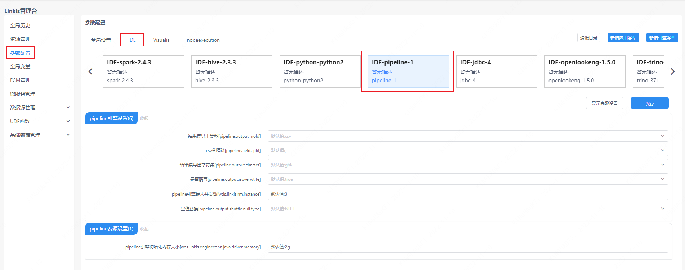

`Pipeline` 主要是用来对文件进行导入和导出的。本文主要介绍在 `Linkis` 中， `Pipeline` 引擎插件的安装、使用和配置。

## 1. 引擎插件安装

### 1.1 引擎插件准备（二选一）[非默认引擎](./overview.md)

方式一：直接下载引擎插件包

[Linkis 引擎插件下载](https://linkis.apache.org/zh-CN/blog/2022/04/15/how-to-download-engineconn-plugin)

方式二：单独编译引擎插件（需要有 `maven` 环境）

```
# 编译
cd ${linkis_code_dir}/linkis-engineconn-plugins/pipeline/
mvn clean install
# 编译出来的引擎插件包，位于如下目录中
${linkis_code_dir}/linkis-engineconn-plugins/pipeline/target/out/
```
[EngineConnPlugin 引擎插件安装](../deployment/install-engineconn.md)

### 1.2 引擎插件的上传和加载

将 1.1 中的引擎插件包上传到服务器的引擎目录下
```bash 
${LINKIS_HOME}/lib/linkis-engineplugins
```
上传后目录结构如下所示
```
linkis-engineconn-plugins/
├── pipeline
│   ├── dist
│   │   └── v1
│   │       ├── conf
│   │       └── lib
│   └── plugin
│       └── 1
```
### 1.3 引擎刷新

#### 1.3.1 重启刷新
通过重启 `linkis-cg-linkismanager` 服务刷新引擎
```bash
cd ${LINKIS_HOME}/sbin
sh linkis-daemon.sh restart cg-linkismanager
```

### 1.3.2 检查引擎是否刷新成功
可以查看数据库中的 `linkis_engine_conn_plugin_bml_resources` 这张表的 `last_update_time` 是否为触发刷新的时间。

```sql
#登陆到linkis的数据库 
select * from linkis_cg_engine_conn_plugin_bml_resources;
```

## 2 引擎的使用

因为 `Pipeline` 引擎主要用来导入导出文件为主，现在我们假设从A向B导入文件为介绍案例

### 2.1 通过 `Linkis-cli` 提交任务

```shell
sh bin/linkis-cli -submitUser  hadoop  \
-engineType pipeline-1  -codeType pipeline  \
-code "from hdfs:///000/000/000/A.dolphin  to file:///000/000/000/B.csv"
```
`from hdfs:///000/000/000/A.dolphin  to file:///000/000/000/B.csv` 该内容 2.3 有解释

更多 `Linkis-Cli` 命令参数参考： [Linkis-Cli 使用](../user-guide/linkiscli-manual.md)

## 3. 引擎配置说明

### 3.1 默认配置说明

| 配置                     | 默认值          |是否必须    | 说明                                     |
| ------------------------ | ------------------- | ---|---------------------------------------- |
| pipeline.output.mold        | csv    |否  |结果集导出类型 |
| pipeline.field.split        | ,            |否  | csv分隔符 |
| pipeline.output.charset       | gbk    |否              | 结果集导出字符集                 |
| pipeline.output.isoverwrite       | true       |否           | 是否覆写                  |
| wds.linkis.rm.instance     | 3       |否        | pipeline引擎最大并发数        |
| pipeline.output.shuffle.null.type | NULL          |否     | 空值替换 |
| wds.linkis.engineconn.java.driver.memory | 2g   |否  | pipeline引擎初始化内存大小  |

### 4.2 配置修改
如果默认参数不满足时，有如下几中方式可以进行一些基础参数配置

#### 4.2.1 管理台配置



注意: 修改 `IDE` 标签下的配置后需要指定 `-creator IDE` 才会生效（其它标签类似），如：

```shell
sh bin/linkis-cli -creator IDE \
-submitUser hadoop \
-engineType pipeline-1  \
-codeType pipeline \
-code "from hdfs:///000/000/000/A.dolphin to file:///000/000/000/B.csv"
```

#### 4.2.2 任务接口配置
提交任务接口，通过参数 `params.configuration.runtime` 进行配置

```shell
http 请求参数示例 
{
    "executionContent": {"code": "from hdfs:///000/000/000/A.dolphin to file:///000/000/000/B.csv", "runType":  "pipeline"},
    "params": {
                    "variable": {},
                    "configuration": {
                            "runtime": {
                                "pipeline.output.mold":"csv",
                                "pipeline.output.charset":"gbk"
                                }
                            }
                    },
    "labels": {
        "engineType": "pipeline-1",
        "userCreator": "hadoop-IDE"
    }
}
```

### 4.3 引擎相关数据表

`Linkis` 是通过引擎标签来进行管理的，所涉及的数据表信息如下所示。

```
linkis_ps_configuration_config_key:  插入引擎的配置参数的key和默认values
linkis_cg_manager_label：插入引擎label如：pipeline-1
linkis_ps_configuration_category： 插入引擎的目录关联关系
linkis_ps_configuration_config_value： 插入引擎需要展示的配置
linkis_ps_configuration_key_engine_relation:配置项和引擎的关联关系
```

表中与引擎相关的初始数据如下

```sql
-- set variable
SET @PIPELINE_LABEL="pipeline-1";
SET @PIPELINE_ALL=CONCAT('*-*,',@PIPELINE_LABEL);
SET @PIPELINE_IDE=CONCAT('*-IDE,',@PIPELINE_LABEL);

-- engine label
insert into `linkis_cg_manager_label` (`label_key`, `label_value`, `label_feature`, `label_value_size`, `update_time`, `create_time`) VALUES ('combined_userCreator_engineType', @PIPELINE_ALL, 'OPTIONAL', 2, now(), now());
insert into `linkis_cg_manager_label` (`label_key`, `label_value`, `label_feature`, `label_value_size`, `update_time`, `create_time`) VALUES ('combined_userCreator_engineType', @PIPELINE_IDE, 'OPTIONAL', 2, now(), now());

select @label_id := id from linkis_cg_manager_label where `label_value` = @PIPELINE_IDE;
insert into linkis_ps_configuration_category (`label_id`, `level`) VALUES (@label_id, 2);

-- configuration key
INSERT INTO `linkis_ps_configuration_config_key` (`key`, `description`, `name`, `default_value`, `validate_type`, `validate_range`, `is_hidden`, `is_advanced`, `level`, `treeName`, `engine_conn_type`) VALUES ('pipeline.output.mold', '取值范围：csv或excel', '结果集导出类型','csv', 'OFT', '[\"csv\",\"excel\"]', '0', '0', '1', 'pipeline引擎设置', 'pipeline');
INSERT INTO `linkis_ps_configuration_config_key` (`key`, `description`, `name`, `default_value`, `validate_type`, `validate_range`, `is_hidden`, `is_advanced`, `level`, `treeName`, `engine_conn_type`) VALUES ('pipeline.field.split', '取值范围：，或\\t', 'csv分隔符',',', 'OFT', '[\",\",\"\\\\t\"]', '0', '0', '1', 'pipeline引擎设置', 'pipeline');
INSERT INTO `linkis_ps_configuration_config_key` (`key`, `description`, `name`, `default_value`, `validate_type`, `validate_range`, `is_hidden`, `is_advanced`, `level`, `treeName`, `engine_conn_type`) VALUES ('pipeline.output.charset', '取值范围：utf-8或gbk', '结果集导出字符集','gbk', 'OFT', '[\"utf-8\",\"gbk\"]', '0', '0', '1', 'pipeline引擎设置', 'pipeline');
INSERT INTO `linkis_ps_configuration_config_key` (`key`, `description`, `name`, `default_value`, `validate_type`, `validate_range`, `is_hidden`, `is_advanced`, `level`, `treeName`, `engine_conn_type`) VALUES ('pipeline.output.isoverwrite', '取值范围：true或false', '是否覆写','true', 'OFT', '[\"true\",\"false\"]', '0', '0', '1', 'pipeline引擎设置', 'pipeline');
INSERT INTO `linkis_ps_configuration_config_key` (`key`, `description`, `name`, `default_value`, `validate_type`, `validate_range`, `is_hidden`, `is_advanced`, `level`, `treeName`, `engine_conn_type`) VALUES ('wds.linkis.rm.instance', '范围：1-3，单位：个', 'pipeline引擎最大并发数','3', 'NumInterval', '[1,3]', '0', '0', '1', 'pipeline引擎设置', 'pipeline');
INSERT INTO `linkis_ps_configuration_config_key` (`key`, `description`, `name`, `default_value`, `validate_type`, `validate_range`, `is_hidden`, `is_advanced`, `level`, `treeName`, `engine_conn_type`) VALUES ('wds.linkis.engineconn.java.driver.memory', '取值范围：1-10，单位：G', 'pipeline引擎初始化内存大小','2g', 'Regex', '^([1-9]|10)(G|g)$', '0', '0', '1', 'pipeline资源设置', 'pipeline');
INSERT INTO `linkis_ps_configuration_config_key` (`key`, `description`, `name`, `default_value`, `validate_type`, `validate_range`, `is_hidden`, `is_advanced`, `level`, `treeName`, `engine_conn_type`) VALUES ('pipeline.output.shuffle.null.type', '取值范围：NULL或者BLANK', '空值替换','NULL', 'OFT', '[\"NULL\",\"BLANK\"]', '0', '0', '1', 'pipeline引擎设置', 'pipeline');

-- key engine relation
insert into `linkis_ps_configuration_key_engine_relation` (`config_key_id`, `engine_type_label_id`)
(select config.id as `config_key_id`, label.id AS `engine_type_label_id` FROM linkis_ps_configuration_config_key config
INNER JOIN linkis_cg_manager_label label ON config.engine_conn_type = 'pipeline' and label_value = @PIPELINE_ALL);

-- engine default configuration
insert into `linkis_ps_configuration_config_value` (`config_key_id`, `config_value`, `config_label_id`)
(select `relation`.`config_key_id` AS `config_key_id`, '' AS `config_value`, `relation`.`engine_type_label_id` AS `config_label_id` FROM linkis_ps_configuration_key_engine_relation relation
INNER JOIN linkis_cg_manager_label label ON relation.engine_type_label_id = label.id AND label.label_value = @PIPELINE_ALL);

```
