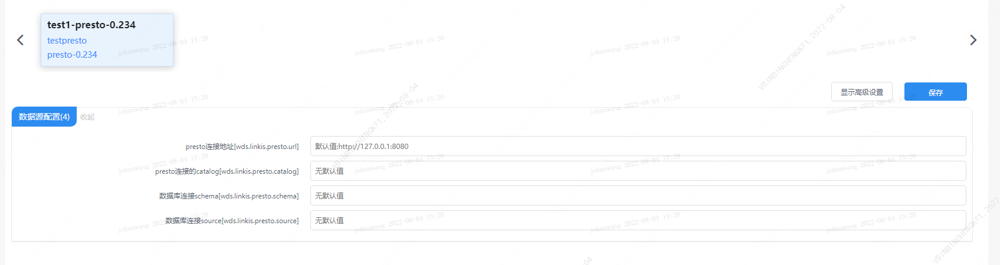

本文主要介绍在 `Linkis` 中，`Presto` 引擎插件的安装、使用和配置。


## 1. 前置工作

### 1.1 引擎安装

如果您希望在您的 `Linkis` 服务上使用 `Presto` 引擎，您需要安装 `Presto` 服务并保证服务可用。

### 1.2 服务验证

```shell
# 准备 presto-cli
wget https://repo1.maven.org/maven2/com/facebook/presto/presto-cli/0.234/presto-cli-0.234-executable.jar
mv presto-cli-0.234-executable.jar presto-cli
chmod +x presto-cli

#  执行任务
./presto-cli --server localhost:8082 --execute 'show tables from system.jdbc'

# 得到如下输出代表服务可用
"attributes"
"catalogs"
"columns"
"procedure_columns"
"procedures"
"pseudo_columns"
"schemas"
"super_tables"
"super_types"
"table_types"
"tables"
"types"
"udts"
```

## 2. 引擎插件部署

### 2.1 引擎插件准备（二选一）[非默认引擎](./overview.md)

方式一：直接下载引擎插件包

[Linkis 引擎插件下载](https://linkis.apache.org/zh-CN/blog/2022/04/15/how-to-download-engineconn-plugin)

方式二：单独编译引擎插件（需要有 `maven` 环境）

```
# 编译
cd ${linkis_code_dir}/linkis-engineconn-plugins/presto/
mvn clean install
# 编译出来的引擎插件包，位于如下目录中
${linkis_code_dir}/linkis-engineconn-plugins/presto/target/out/
```
[EngineConnPlugin 引擎插件安装](../deployment/install-engineconn.md)

### 2.2 引擎插件的上传和加载

将 2.1 中的引擎包上传到服务器的引擎目录下
```bash 
${LINKIS_HOME}/lib/linkis-engineplugins
```
上传后目录结构如下所示
```
linkis-engineconn-plugins/
├── presto
│   ├── dist
│   │   └── v0.234
│   │       ├── conf
│   │       └── lib
│   └── plugin
│       └── 0.234
```

### 2.3 引擎刷新

#### 2.3.1 重启刷新
通过重启 `linkis-cg-linkismanager` 服务刷新引擎
```bash
cd ${LINKIS_HOME}/sbin
sh linkis-daemon.sh restart cg-linkismanager
```

### 2.3.2 检查引擎是否刷新成功
可以查看数据库中的 `linkis_engine_conn_plugin_bml_resources` 这张表的`last_update_time` 是否为触发刷新的时间。

```sql
#登陆到 `linkis` 的数据库 
select * from linkis_cg_engine_conn_plugin_bml_resources;
```

## 3. 引擎的使用

### 3.1 通过 `Linkis-cli` 提交任务 

```shell
 sh ./bin/linkis-cli -engineType presto-0.234 \
 -codeType psql -code 'show tables;' \
 -submitUser hadoop -proxyUser hadoop
```

如果管理台，任务接口，配置文件，均未配置（配置方式见 4.2 ）时可在 `Linkis-cli` 客户端中通过 `-runtimeMap` 属性进行配置

```shell
sh ./bin/linkis-cli -engineType presto-0.234 \
-codeType  tsql -code 'show tables;'  \
-runtimeMap wds.linkis.presto.url=http://127.0.0.1:8080 \
-runtimeMap wds.linkis.presto.catalog=hive \
-runtimeMap  wds.linkis.presto.schema=default  \
-runtimeMap wds.linkis.presto.catalog=hive \
-submitUser hadoop -proxyUser hadoop
```

更多 `Linkis-Cli` 命令参数参考： [Linkis-Cli 使用](../user-guide/linkiscli-manual.md)

## 4. 引擎配置说明

### 4.1 默认配置说明

| 配置                                   | 默认值                | 说明                                        | 是否必须 |
| -------------------------------------- | --------------------- | ------------------------------------------- | -------- |
| wds.linkis.presto.url                  | http://127.0.0.1:8080 | Presto 集群连接                             | true |
| wds.linkis.presto.username             | default               | Presto 集群用户名                           | false |
| wds.linkis.presto.password             | 无                    | Presto 集群密码                             | false |
| wds.linkis.presto.catalog              | system                | 查询的 Catalog                              | true |
| wds.linkis.presto.schema               | 无                    | 查询的 Schema                               | true |
| wds.linkis.presto.source               | global                | 查询使用的 source                           | false |
| presto.session.query_max_total_memory  | 8GB                   | 查询使用最大的内存                          | false |
| wds.linkis.presto.http.connectTimeout  | 60                    | Presto 客户端的 connect timeout（单位：秒） | false |
| wds.linkis.presto.http.readTimeout     | 60                    | Presto 客户端的 read timeout（单位：秒）    | false |
| wds.linkis.engineconn.concurrent.limit | 100                   | Presto 引擎最大并发数                       | false |

### 4.2 配置修改

如果默认参数不满足时，有如下几中方式可以进行一些基础参数配置

#### 4.2.1 管理台配置



注意: 修改 `IDE` 标签下的配置后需要指定 `-creator IDE` 才会生效（其它标签类似），如：

```shell
sh ./bin/linkis-cli -creator IDE \
-engineType presto-0.234 -codeType  tsql \
-code 'show tables;' \
-submitUser hadoop -proxyUser hadoop
```

#### 4.2.2 任务接口配置
提交任务接口，通过参数 `params.configuration.runtime` 进行配置

```shell
http 请求参数示例 
{
    "executionContent": {"code": "show teblas;", "runType":  "psql"},
    "params": {
                    "variable": {},
                    "configuration": {
                            "runtime": {
                                "wds.linkis.presto.url":"http://127.0.0.1:9090",
                                "wds.linkis.presto.catalog ":"hive",
                                "wds.linkis.presto.schema ":"default",
                                "wds.linkis.presto.source ":""
                                }
                            }
                    },
    "source":  {"scriptPath": "file:///mnt/bdp/hadoop/1.sql"},
    "labels": {
        "engineType": "presto-0.234",
        "userCreator": "hadoop-IDE"
    }
}
```

#### 4.2.3 文件配置
通过修改目录 `install path/lib/linkis-engineconn-plugins/presto/dist/v0.234/conf/` 中的 `linkis-engineconn.properties` 文件进行配置，如下图：


### 4.3 引擎相关数据表

`Linkis` 是通过引擎标签来进行管理的，所涉及的数据表信息如下所示。

```
linkis_ps_configuration_config_key:  插入引擎的配置参数的key和默认values
linkis_cg_manager_label：插入引擎label如：presto-0.234
linkis_ps_configuration_category： 插入引擎的目录关联关系
linkis_ps_configuration_config_value： 插入引擎需要展示的配置
linkis_ps_configuration_key_engine_relation:配置项和引擎的关联关系
```

表中与引擎相关的初始数据如下


```sql
-- set variable
SET @PRESTO_LABEL="presto-0.234";
SET @PRESTO_ALL=CONCAT('*-*,',@PRESTO_LABEL);
SET @PRESTO_IDE=CONCAT('*-IDE,',@PRESTO_LABEL);
SET @PRESTO_NAME="presto";

-- engine label
insert into `linkis_cg_manager_label` (`label_key`, `label_value`, `label_feature`, `label_value_size`, `update_time`, `create_time`) VALUES ('combined_userCreator_engineType',@PRESTO_ALL, 'OPTIONAL', 2, now(), now());
insert into `linkis_cg_manager_label` (`label_key`, `label_value`, `label_feature`, `label_value_size`, `update_time`, `create_time`) VALUES ('combined_userCreator_engineType',@PRESTO_IDE, 'OPTIONAL', 2, now(), now());

select @label_id := id from `linkis_cg_manager_label` where `label_value` = @PRESTO_IDE;
insert into `linkis_ps_configuration_category` (`label_id`, `level`) VALUES (@label_id, 2);

-- configuration key
INSERT INTO `linkis_ps_configuration_config_key` (`key`, `description`, `name`, `default_value`, `validate_type`, `validate_range`, `engine_conn_type`, `is_hidden`, `is_advanced`, `level`, `treeName`) VALUES ('wds.linkis.presto.url', 'Presto 集群连接', 'presto连接地址', 'http://127.0.0.1:8080', 'None', NULL, @PRESTO_NAME, 0, 0, 1, '数据源配置');
INSERT INTO `linkis_ps_configuration_config_key` (`key`, `description`, `name`, `default_value`, `validate_type`, `validate_range`, `engine_conn_type`, `is_hidden`, `is_advanced`, `level`, `treeName`) VALUES ('wds.linkis.presto.catalog', '查询的 Catalog ', 'presto连接的catalog', 'hive', 'None', NULL, @PRESTO_NAME, 0, 0, 1, '数据源配置');
INSERT INTO `linkis_ps_configuration_config_key` (`key`, `description`, `name`, `default_value`, `validate_type`, `validate_range`, `engine_conn_type`, `is_hidden`, `is_advanced`, `level`, `treeName`) VALUES ('wds.linkis.presto.schema', '查询的 Schema ', '数据库连接schema', '', 'None', NULL, @PRESTO_NAME, 0, 0, 1, '数据源配置');
INSERT INTO `linkis_ps_configuration_config_key` (`key`, `description`, `name`, `default_value`, `validate_type`, `validate_range`, `engine_conn_type`, `is_hidden`, `is_advanced`, `level`, `treeName`) VALUES ('wds.linkis.presto.source', '查询使用的 source ', '数据库连接source', '', 'None', NULL, @PRESTO_NAME, 0, 0, 1, '数据源配置');

-- key engine relation
insert into `linkis_ps_configuration_key_engine_relation` (`config_key_id`, `engine_type_label_id`)
(select config.id as `config_key_id`, label.id AS `engine_type_label_id` FROM linkis_ps_configuration_config_key config
INNER JOIN linkis_cg_manager_label label ON config.engine_conn_type = @PRESTO_NAME and label_value = @PRESTO_ALL);

-- engine default configuration
insert into `linkis_ps_configuration_config_value` (`config_key_id`, `config_value`, `config_label_id`)
(select `relation`.`config_key_id` AS `config_key_id`, '' AS `config_value`, `relation`.`engine_type_label_id` AS `config_label_id` FROM linkis_ps_configuration_key_engine_relation relation
INNER JOIN linkis_cg_manager_label label ON relation.engine_type_label_id = label.id AND label.label_value = @PRESTO_ALL);
```