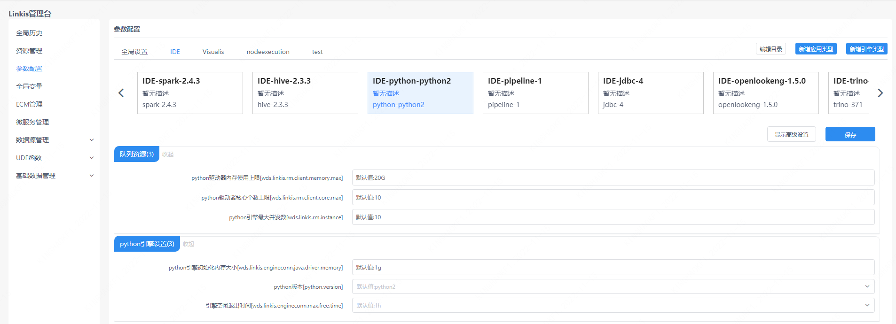
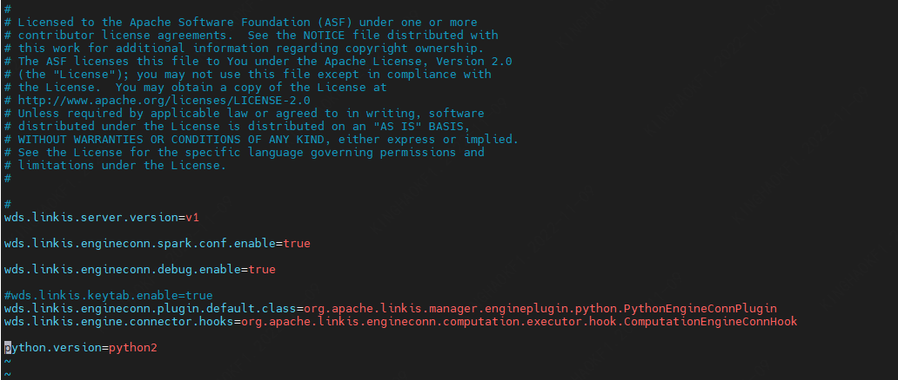

本文主要介绍在 `Linkis` 中， `Python` 引擎插件的安装、使用和配置。

## 1. 前置工作
### 1.1 环境安装

如果您希望在您的服务器上使用 `Python` 引擎，您需要保证用户的 `PATH` 中是有 `Python` 的执行目录和执行权限。

### 1.2 环境验证
```
python --version
```
正常输出 `Python` 版本信息代表 `Python` 环境可用
```
Python 3.6.0
```

## 2. 引擎插件安装 [默认引擎](./overview.md)

`Linkis` 发布的二进制安装包中默认包含了 `Python` 引擎插件，用户无需额外安装。

[EngineConnPlugin引擎插件安装](../deployment/install-engineconn.md)

## 3. 引擎的使用

### 3.1 通过 `Linkis-cli` 提交任务

```shell
sh ./bin/linkis-cli -engineType python-python2 \
-codeType python -code "print(\"hello\")"  \
-submitUser hadoop -proxyUser hadoop
```
更多 `Linkis-Cli` 命令参数参考： [Linkis-Cli 使用](../user-guide/linkiscli-manual.md)

### 3.2 通过 `Linkis SDK` 提交任务

`Linkis` 提供了 `Java` 和 `Scala` 的 `SDK` 向 `Linkis` 服务端提交任务。 具体可以参考 [JAVA SDK Manual](../user-guide/sdk-manual.md)。对于 `Python` 任务您只需要修改 `EngineConnType` 和 `CodeType` 参数即可。

```java
Map<String, Object> labels = new HashMap<String, Object>();
labels.put(LabelKeyConstant.ENGINE_TYPE_KEY, "python-python2"); // required engineType Label
labels.put(LabelKeyConstant.USER_CREATOR_TYPE_KEY, "hadoop-IDE");// required execute user and creator
labels.put(LabelKeyConstant.CODE_TYPE_KEY, "python"); // required codeType 
```

## 4. 引擎配置说明

### 4.1 配置修改
`Python` 引擎插件支持 `Python2` 和 `Python3` ，您可以简单更改配置就可以完成 `Python` 版本的切换，不需要重新编译 `Python` 的引擎版本。 `Python` 引擎支持多种配置修改方式，具体操作如下。

#### 4.1.1 通过命令参数显示指定（仅当前命令生效）

```shell
#1：cli的方式提交任务进行版本切换,命令末端设置版本 python.version=python3 (python3：创建软连接时生成文件的名称，可自定义命名)
sh ./bin/linkis-cli -engineType python-python2 \
-codeType python -code "print(\"hello\")"  \
-submitUser hadoop -proxyUser hadoop  \
-confMap  python.version=python3

#2：cli的方式提交任务进行版本切换,命令设置加入版本路径 python.version=/usr/bin/python (/usr/bin/python：创建软连接时生成文件的路径)
sh ./bin/linkis-cli -engineType python-python2 \
-codeType python -code "print(\"hello\")"  \
-submitUser hadoop -proxyUser hadoop  \
-confMap  python.version=/usr/bin/python

```

#### 4.1.2 管理台配置



注意: 修改IDE标签下的配置后需要指定 `-creator IDE` 才会生效（其它标签类似），如：

```shell
sh ./bin/linkis-cli -creator IDE -engineType \
python-python2 -codeType python -code "print(\"hello\")"  \
-submitUser hadoop -proxyUser hadoop  \
-confMap  python.version=python3
```

#### 4.2.2 任务接口配置
提交任务接口，通过参数 `params.configuration.runtime` 进行配置

```shell
http 请求参数示例 
{
    "executionContent": {"code": "print(\"hello\")", "runType":  "python"},
    "params": {
                "variable": {},
                "configuration": {
                        "runtime": {
                                "python.version":"python2",
                                "wds.linkis.engineconn.max.free.time":"1h"
                        }
                }
        },
    "labels": {
        "engineType": "python-python2",
        "userCreator": "IDE"
    }
}
```

#### 4.2.3 文件配置
通过修改目录 `${LINKIS_HOME}/lib/linkis-engineconn-plugins/python/dist/vpython2/conf/` 中的 `linkis-engineconn.properties` 文件进行配置，如下图：



### 4.3 引擎相关数据表

`Linkis` 是通过引擎标签来进行管理的，所涉及的数据表信息如下所示。

```
linkis_ps_configuration_config_key:  插入引擎的配置参数的key和默认values
linkis_cg_manager_label：插入引擎label如：python-python2
linkis_ps_configuration_category： 插入引擎的目录关联关系
linkis_ps_configuration_config_value： 插入引擎需要展示的配置
linkis_ps_configuration_key_engine_relation:配置项和引擎的关联关系
```

表中与引擎相关的初始数据如下

```sql
-- set variable
SET @PYTHON_LABEL="python-python2";
SET @PYTHON_ALL=CONCAT('*-*,',@PYTHON_LABEL);
SET @PYTHON_IDE=CONCAT('*-IDE,',@PYTHON_LABEL);

-- engine label
insert into `linkis_cg_manager_label` (`label_key`, `label_value`, `label_feature`, `label_value_size`, `update_time`, `create_time`) VALUES ('combined_userCreator_engineType', @PYTHON_ALL, 'OPTIONAL', 2, now(), now());
insert into `linkis_cg_manager_label` (`label_key`, `label_value`, `label_feature`, `label_value_size`, `update_time`, `create_time`) VALUES ('combined_userCreator_engineType', @PYTHON_IDE, 'OPTIONAL', 2, now(), now());

select @label_id := id from linkis_cg_manager_label where `label_value` = @PYTHON_IDE;
insert into linkis_ps_configuration_category (`label_id`, `level`) VALUES (@label_id, 2);

-- configuration key
INSERT INTO `linkis_ps_configuration_config_key` (`key`, `description`, `name`, `default_value`, `validate_type`, `validate_range`, `is_hidden`, `is_advanced`, `level`, `treeName`, `engine_conn_type`) VALUES ('wds.linkis.rm.client.memory.max', '取值范围：1-100，单位：G', 'python驱动器内存使用上限', '20G', 'Regex', '^([1-9]\\d{0,1}|100)(G|g)$', '0', '0', '1', '队列资源', 'python');
INSERT INTO `linkis_ps_configuration_config_key` (`key`, `description`, `name`, `default_value`, `validate_type`, `validate_range`, `is_hidden`, `is_advanced`, `level`, `treeName`, `engine_conn_type`) VALUES ('wds.linkis.rm.client.core.max', '取值范围：1-128，单位：个', 'python驱动器核心个数上限', '10', 'Regex', '^(?:[1-9]\\d?|[1234]\\d{2}|128)$', '0', '0', '1', '队列资源', 'python');
INSERT INTO `linkis_ps_configuration_config_key` (`key`, `description`, `name`, `default_value`, `validate_type`, `validate_range`, `is_hidden`, `is_advanced`, `level`, `treeName`, `engine_conn_type`) VALUES ('wds.linkis.rm.instance', '范围：1-20，单位：个', 'python引擎最大并发数', '10', 'NumInterval', '[1,20]', '0', '0', '1', '队列资源', 'python');
INSERT INTO `linkis_ps_configuration_config_key` (`key`, `description`, `name`, `default_value`, `validate_type`, `validate_range`, `is_hidden`, `is_advanced`, `level`, `treeName`, `engine_conn_type`) VALUES ('wds.linkis.engineconn.java.driver.memory', '取值范围：1-2，单位：G', 'python引擎初始化内存大小', '1g', 'Regex', '^([1-2])(G|g)$', '0', '0', '1', 'python引擎设置', 'python');
INSERT INTO `linkis_ps_configuration_config_key` (`key`, `description`, `name`, `default_value`, `validate_type`, `validate_range`, `is_hidden`, `is_advanced`, `level`, `treeName`, `engine_conn_type`) VALUES ('python.version', '取值范围：python2,python3', 'python版本','python2', 'OFT', '[\"python3\",\"python2\"]', '0', '0', '1', 'python引擎设置', 'python');
INSERT INTO `linkis_ps_configuration_config_key` (`key`, `description`, `name`, `default_value`, `validate_type`, `validate_range`, `is_hidden`, `is_advanced`, `level`, `treeName`, `engine_conn_type`) VALUES ('wds.linkis.engineconn.max.free.time', '取值范围：3m,15m,30m,1h,2h', '引擎空闲退出时间','1h', 'OFT', '[\"1h\",\"2h\",\"30m\",\"15m\",\"3m\"]', '0', '0', '1', 'python引擎设置', 'python');

-- key engine relation
insert into `linkis_ps_configuration_key_engine_relation` (`config_key_id`, `engine_type_label_id`)
(select config.id as `config_key_id`, label.id AS `engine_type_label_id` FROM linkis_ps_configuration_config_key config
INNER JOIN linkis_cg_manager_label label ON config.engine_conn_type = 'python' and label_value = @PYTHON_ALL);

-- engine default configuration
insert into `linkis_ps_configuration_config_value` (`config_key_id`, `config_value`, `config_label_id`)
(select `relation`.`config_key_id` AS `config_key_id`, '' AS `config_value`, `relation`.`engine_type_label_id` AS `config_label_id` FROM linkis_ps_configuration_key_engine_relation relation
INNER JOIN linkis_cg_manager_label label ON relation.engine_type_label_id = label.id AND label.label_value = @PYTHON_ALL);
```
