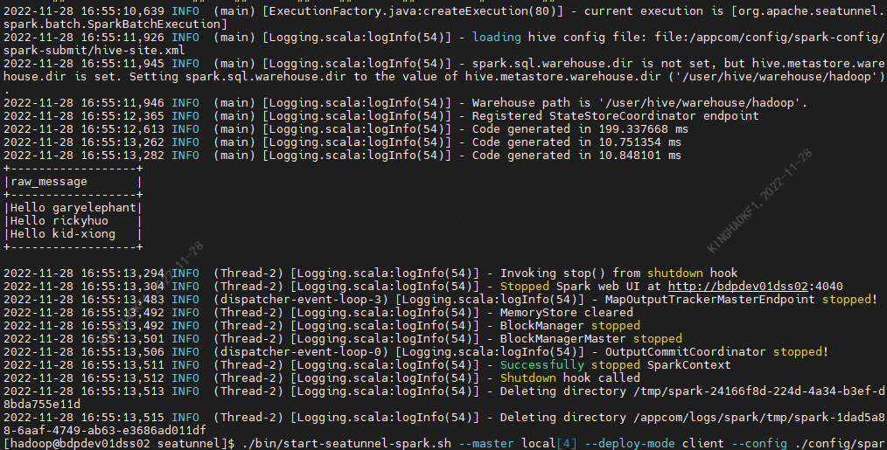

本文主要介绍在 `Linkis` 中，`Seatunnel` 引擎插件的安装、使用和配置。

## 1. 前置工作

### 1.1 引擎安装

如果您希望在您的 `Linkis` 服务上使用 `Seatunnel` 引擎，您需要安装 `Seatunnel` 引擎。而且 `Seatunnel` 是依赖 `Spark` 或 `Flink` 环境，使用 `linkis-seatunnel` 引擎前，强烈建议本地跑通 `Seatunnel` 环境。

`Seatunnel 2.1.2` 下载地址：https://dlcdn.apache.org/incubator/seatunnel/2.1.2/apache-seatunnel-incubating-2.1.2-bin.tar.gz

| 环境变量名称 | 环境变量内容 | 是否需要                             |
|-----------------|----------------|----------------------------------------|
| JAVA_HOME       | JDK安装路径 | 需要                           |
| SEATUNNEL_HOME     | Seatunnel安装路径 | 需要                           |
|SPARK_HOME| Spark安装路径 | Seatunnel执行基于Spark就需要 |
|FLINK_HOME| Flink安装路径 | Seatunnel执行基于Flink就需要 |

表1-1 环境配置清单

| Linkis变量名称      | 变量内容                                       | 是否必须                                                       |
| --------------------------- | ---------------------------------------------------------- | ------------------------------------------------------------ |
| wds.linkis.engine.seatunnel.plugin.home | Seatunnel安装路径           | 是 |

### 1.2 引擎环境验证

以执行 `Spark` 任务为例

```shell
cd $SEATUNNEL_HOME
./bin/start-seatunnel-spark.sh --master local[4] --deploy-mode client --config ./config/spark.batch.conf.template
```
输出结果如下：



## 2. 引擎插件部署

### 2.1 引擎插件准备（二选一）[非默认引擎](./overview.md)

方式一：直接下载引擎插件包

[Linkis 引擎插件下载](https://linkis.apache.org/zh-CN/blog/2022/04/15/how-to-download-engineconn-plugin)

方式二：单独编译引擎插件（需要有 `maven` 环境）

```
# 编译
cd ${linkis_code_dir}/linkis-engineconn-plugins/seatunnel/
mvn clean install
# 编译出来的引擎插件包，位于如下目录中
${linkis_code_dir}/linkis-engineconn-plugins/seatunnel/target/out/
```
[EngineConnPlugin 引擎插件安装](../deployment/install-engineconn.md)

### 2.2 引擎插件的上传和加载

将 2.1 中的引擎包上传到服务器的引擎目录下
```bash 
${LINKIS_HOME}/lib/linkis-engineplugins
```
上传后目录结构如下所示
```
linkis-engineconn-plugins/
├── seatunnel
│   ├── dist
│   │   └── v2.1.2
│   │       ├── conf
│   │       └── lib
│   └── plugin
│       └── 2.1.2
```

### 2.3 引擎刷新

#### 2.3.1 重启刷新
通过重启 `linkis-cg-linkismanager` 服务刷新引擎
```bash
cd ${LINKIS_HOME}/sbin
sh linkis-daemon.sh restart cg-linkismanager
```

### 2.3.2 检查引擎是否刷新成功
可以查看数据库中的 `linkis_engine_conn_plugin_bml_resources` 这张表的`last_update_time` 是否为触发刷新的时间。

```sql
#登陆到 `linkis` 的数据库 
select * from linkis_cg_engine_conn_plugin_bml_resources;
```

## 3. 引擎的使用

### 3.1 通过 `Linkis-cli` 提交任务 


```shell
sh ./bin/linkis-cli --mode once -code 'test'  -engineType seatunnel-2.1.2 -codeType sspark  -labelMap userCreator=hadoop-seatunnel -labelMap engineConnMode=once -jobContentMap code='env {
   spark.app.name = "SeaTunnel"
   spark.executor.instances = 2
   spark.executor.cores = 1
   spark.executor.memory = "1g"
   }
   source { 
     Fake {
       result_table_name = "my_dataset"
     }
   }
   transform {}
   sink {Console {}}' -jobContentMap master=local[4] -jobContentMap deploy-mode=client -sourceMap jobName=OnceJobTest  -submitUser hadoop -proxyUser hadoop
```

### 3.2 通过 OnceEngineConn 提交任务

OnceEngineConn 通过 LinkisManagerClient 调用 LinkisManager 的 createEngineConn 接口，并将代码发送到创建的 Seatunnel 引擎，然后 Seatunnel 引擎开始执行。 Client 的使用也非常简单，首先创建一个新的 maven 项目，或者在项目中引入以下依赖项

```xml
<dependency>
    <groupId>org.apache.linkis</groupId>
    <artifactId>linkis-computation-client</artifactId>
    <version>${linkis.version}</version>
</dependency>
```

**示例代码**
```java
package org.apache.linkis.computation.client;
import org.apache.linkis.common.conf.Configuration;
import org.apache.linkis.computation.client.once.simple.SubmittableSimpleOnceJob;
import org.apache.linkis.computation.client.utils.LabelKeyUtils;
public class SeatunnelOnceJobTest {
    public static void main(String[] args) {
        LinkisJobClient.config().setDefaultServerUrl("http://ip:9001");
        String code =
                "\n"
                        + "env {\n"
                        + "  spark.app.name = \"SeaTunnel\"\n"
                        + "  spark.executor.instances = 2\n"
                        + "  spark.executor.cores = 1\n"
                        + "  spark.executor.memory = \"1g\"\n"
                        + "}\n"
                        + "\n"
                        + "source {\n"
                        + "  Fake {\n"
                        + "    result_table_name = \"my_dataset\"\n"
                        + "  }\n"
                        + "\n"
                        + "}\n"
                        + "\n"
                        + "transform {\n"
                        + "}\n"
                        + "\n"
                        + "sink {\n"
                        + "  Console {}\n"
                        + "}";
        SubmittableSimpleOnceJob onceJob =
                LinkisJobClient.once()
                        .simple()
                        .builder()
                        .setCreateService("seatunnel-Test")
                        .setMaxSubmitTime(300000)
                        .addLabel(LabelKeyUtils.ENGINE_TYPE_LABEL_KEY(), "seatunnel-2.1.2")
                        .addLabel(LabelKeyUtils.USER_CREATOR_LABEL_KEY(), "hadoop-seatunnel")
                        .addLabel(LabelKeyUtils.ENGINE_CONN_MODE_LABEL_KEY(), "once")
                        .addStartupParam(Configuration.IS_TEST_MODE().key(), true)
                        .addExecuteUser("hadoop")
                        .addJobContent("runType", "sspark")
                        .addJobContent("code", code)
                        .addJobContent("master", "local[4]")
                        .addJobContent("deploy-mode", "client")
                        .addSource("jobName", "OnceJobTest")
                        .build();
        onceJob.submit();
        System.out.println(onceJob.getId());
        onceJob.waitForCompleted();
        System.out.println(onceJob.getStatus());
        LinkisJobMetrics jobMetrics = onceJob.getJobMetrics();
        System.out.println(jobMetrics.getMetrics());
    }
}
```
## 4. 引擎配置说明

### 4.1 默认配置说明

| 配置                                   | 默认值                | 说明                                        | 是否必须 |
| -------------------------------------- | --------------------- | ------------------------------------------- | -------- |
| wds.linkis.engine.seatunnel.plugin.home                  | /opt/linkis/seatunnel  | Seatunnel安装路径                          | true |
### 4.2 配置修改

如果默认参数不满足时，有如下几中方式可以进行一些基础参数配置

#### 4.2.1 客户端配置参数

```shell
sh ./bin/linkis-cli --mode once -code 'test'  \
-engineType seatunnel-2.1.2 -codeType sspark  \
-labelMap userCreator=hadoop-seatunnel -labelMap engineConnMode=once \
-jobContentMap code='env {
   spark.app.name = "SeaTunnel"
   spark.executor.instances = 2
   spark.executor.cores = 1
   spark.executor.memory = "1g"
   }
   source { 
     Fake {
       result_table_name = "my_dataset"
     }
   }
   transform {}
   sink {Console {}}' -jobContentMap master=local[4] \
   -jobContentMap deploy-mode=client \
   -sourceMap jobName=OnceJobTest  \
   -runtimeMap wds.linkis.engine.seatunnel.plugin.home=/opt/linkis/seatunnel \
   -submitUser hadoop -proxyUser hadoop 
```

#### 4.2.2 任务接口配置
提交任务接口，通过参数 `params.configuration.runtime` 进行配置

```shell
http 请求参数示例 
{
    "executionContent": {"code": 'env {
    spark.app.name = "SeaTunnel"
    spark.executor.instances = 2
    spark.executor.cores = 1
    spark.executor.memory = "1g"
    }
    source { 
        Fake {
            result_table_name = "my_dataset"
        }
    }
    transform {}
    sink {Console {}}', 
    "runType":  "sql"},
    "params": {
        "variable": {},
        "configuration": {
                "runtime": {
                    "wds.linkis.engine.seatunnel.plugin.home":"/opt/linkis/seatunnel"
                    }
                }
        },
    "labels": {
        "engineType": "seatunnel-2.1.2",
        "userCreator": "hadoop-IDE"
    }
}
```