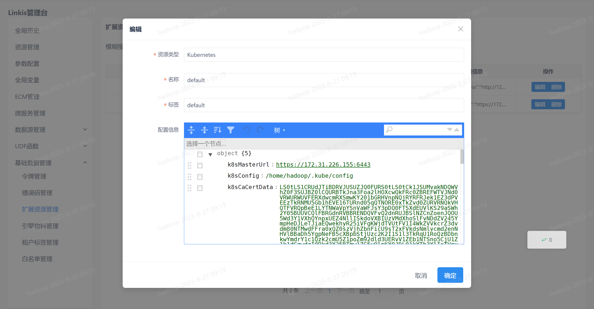
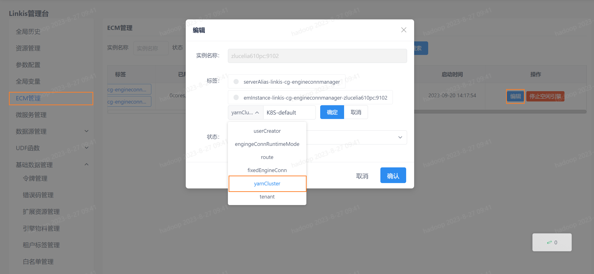

本文主要介绍在 `Linkis` 中， `Spark` 引擎插件的安装、使用和配置。

## 1. 前置工作
### 1.1 引擎安装

如果您希望在您的服务器上使用 `Spark` 引擎，您需要保证以下的环境变量已经设置正确并且引擎的启动用户是有这些环境变量的。

强烈建议您在执行 `Spark` 任务之前，检查下执行用户的这些环境变量。

| 环境变量名      | 环境变量内容   | 备注                                   |
|-----------------|----------------|----------------------------------------|
| JAVA_HOME       | JDK安装路径    | 必须                                   |
| HADOOP_HOME     | Hadoop安装路径 | 必须                                   |
| HADOOP_CONF_DIR | Hadoop配置路径 | 必须                                   |
| HIVE_CONF_DIR   | Hive配置路径   | 必须                                   |
| SPARK_HOME      | Spark安装路径  | 必须                                   |
| SPARK_CONF_DIR  | Spark配置路径  | 必须                                   |
| python          | python        | 建议使用anaconda的python作为默认python   |

### 1.2 环境验证
通过 `pyspark` 验证 `Spark` 是否安装成功
```
pyspark

#进入pyspark虚拟环境后，出现spark的logo则说明环境安装成功
Welcome to
      ____              __
     / __/__  ___ _____/ /__
    _\ \/ _ \/ _ `/ __/  '_/
   /__ / .__/\_,_/_/ /_/\_\   version 3.2.1
      /_/

Using Python version 2.7.13 (default, Sep 30 2017 18:12:43)
SparkSession available as 'spark'.
```

## 2. 引擎插件安装 [默认引擎](./overview.md)

`Linkis` 发布的二进制安装包中默认包含了 `Spark` 引擎插件，用户无需额外安装。

理论上 `Linkis` 支持的 `Spark2.x` 以上的所有版本。默认支持的版本为 `Spark3.2.1` 。如果您想使用其他的 `Spark` 版本，如 `Spark2.1.0` ，则您仅仅需要将插件 `Spark` 的版本进行修改，然后进行编译即可。具体的，您可以找到 `linkis-engineplugin-spark` 模块，将 `maven` 依赖中 `<spark.version>` 标签的值改成 2.1.0 ，然后单独编译此模块即可。

[EngineConnPlugin引擎插件安装](../deployment/install-engineconn.md)

## 3. 引擎的使用

### 3.1 通过 `Linkis-cli` 提交任务

```shell
# codeType对应关系 py-->pyspark  sql-->sparkSQL scala-->Spark scala
sh ./bin/linkis-cli -engineType spark-3.2.1 -codeType sql -code "show databases"  -submitUser hadoop -proxyUser hadoop

# 可以在提交参数通过-confMap wds.linkis.yarnqueue=dws  来指定yarn 队列
sh ./bin/linkis-cli -engineType spark-3.2.1 -codeType sql  -confMap wds.linkis.yarnqueue=dws -code "show databases"  -submitUser hadoop -proxyUser hadoop
```
更多 `Linkis-Cli` 命令参数参考： [Linkis-Cli 使用](../user-guide/linkiscli-manual.md)

### 3.2 通过 `Linkis SDK` 提交任务

`Linkis` 提供了 `Java` 和 `Scala` 的 `SDK` 向 `Linkis` 服务端提交任务。具体可以参考 [JAVA SDK Manual](../user-guide/sdk-manual.md)。对于 `Spark` 任务你只需要修改 `Demo` 中的 `EngineConnType` 和 `CodeType` 参数即可:

```java
Map<String, Object> labels = new HashMap<String, Object>();
labels.put(LabelKeyConstant.ENGINE_TYPE_KEY, "spark-3.2.1"); // required engineType Label
labels.put(LabelKeyConstant.USER_CREATOR_TYPE_KEY, "hadoop-IDE");// required execute user and creator
labels.put(LabelKeyConstant.CODE_TYPE_KEY, "sql"); // required codeType py,sql,scala
```

Spark还支持提交Scala代码和Pyspark代码：
````java

//scala 
labels.put(LabelKeyConstant.CODE_TYPE_KEY, "scala");
code:
val df=spark.sql("show tables")
show(df)        
//pyspark
/labels.put(LabelKeyConstant.CODE_TYPE_KEY, "py");
code:
df=spark.sql("show tables")
show(df)
````

### 3.3 通过提交jar包执行任务

通过 `OnceEngineConn` 提交任务（通过 spark-submit 提交 jar 包执行任务），提交方式参考 `org.apache.linkis.computation.client.SparkOnceJobTest`

```java
public class SparkOnceJobTest {

    public static void main(String[] args)  {

        LinkisJobClient.config().setDefaultServerUrl("http://127.0.0.1:9001");

        String submitUser = "linkis";
        String engineType = "spark";

        SubmittableSimpleOnceJob onceJob =
                // region
                LinkisJobClient.once().simple().builder()
                        .setCreateService("Spark-Test")
                        .setMaxSubmitTime(300000)
                        .setDescription("SparkTestDescription")
                        .addExecuteUser(submitUser)
                        .addJobContent("runType", "jar")
                        .addJobContent("spark.app.main.class", "org.apache.spark.examples.JavaWordCount")
                        // 提交的jar包获取的参数
                        .addJobContent("spark.app.args", "hdfs:///tmp/test_word_count.txt") // WordCount 测试文件
                        .addLabel("engineType", engineType + "-2.4.7")
                        .addLabel("userCreator", submitUser + "-IDE")
                        .addLabel("engineConnMode", "once")
                        .addStartupParam("spark.app.name", "spark-submit-jar-test-linkis") // yarn上展示的 Application Name
                        .addStartupParam("spark.executor.memory", "1g")
                        .addStartupParam("spark.driver.memory", "1g")
                        .addStartupParam("spark.executor.cores", "1")
                        .addStartupParam("spark.executor.instance", "1")
                        .addStartupParam("spark.app.resource", "hdfs:///tmp/spark/spark-examples_2.11-2.3.0.2.6.5.0-292.jar")
                        .addSource("jobName", "OnceJobTest")
                        .build();
        // endregion
        onceJob.submit();
        onceJob.waitForCompleted(); // 网络临时不通会导致异常，建议后期修改 SDK，现阶段使用，需要做异常处理
        // 网络临时不通会导致异常，建议后期修改 SDK，现阶段使用，需要做异常处理
        onceJob.waitForCompleted();
    }
}
```

### 3.4 通过 Restful API 提交任务

运行脚本类型包括 `sql`、`scala`、`python`、`data_calc(格式为json)`。

[任务提交执行Restful API文档](../api/linkis-task-operator.md)

```http request
POST /api/rest_j/v1/entrance/submit
Content-Type: application/json
Token-Code: dss-AUTH
Token-User: linkis

{
    "executionContent": {
        // 脚本内容，可以是sql，python，scala，json
        "code": "show databases",
        // 运行的脚本类型 sql, py（pyspark）, scala, data_calc
        "runType": "sql"
    },
    "params": {
        "variable": {
        },
        "configuration": {
            // spark 启动参数，非必填
            "startup": {
                "spark.executor.memory": "1g",
                "spark.driver.memory": "1g",
                "spark.executor.cores": "1",
                "spark.executor.instances": 1
            }
        }
    },
    "source":  {
        // 非必填，file:/// 或者 hdfs:///
        "scriptPath": "file:///tmp/hadoop/test.sql"
    },
    "labels": {
        // 格式为：引擎类型-版本
        "engineType": "spark-3.2.1",
        // userCreator: linkis 为用户名。IDE 是系统名，在 Linkis 后台管理。
        "userCreator": "linkis-IDE"
    }
}
```

### 3.5 通过 `Linkis-cli` 提交spark yarn cluster任务

上传jar包和配置
```shell
# 上传linkis spark引擎的lib下的jar包 (根据您的实际安装目录修改以下参数)
cd /appcom/Install/linkis/lib/linkis-engineconn-plugins/spark/dist/3.2.1/lib
hdfs dfs -put *.jar hdfs:///spark/cluster

# 上传linkis 配置文件 (根据您的实际安装目录修改以下参数)
cd /appcom/Install/linkis/conf
hdfs dfs -put * hdfs:///spark/cluster

# 上传hive-site.xml  (根据您的实际安装目录修改以下参数)
cd $HIVE_CONF_DIR
hdfs dfs -put hive-site.xml hdfs:///spark/cluster
```
可以通过`linkis.spark.yarn.cluster.jars`参数来修改`hdfs:///spark/cluster` 

执行测试用例
```shell
# 使用 `engingeConnRuntimeMode=yarnCluster` 来指定yarn cluster模式
sh ./bin/linkis-cli -engineType spark-3.2.1 -codeType sql -labelMap engingeConnRuntimeMode=yarnCluster -submitUser hadoop -proxyUser hadoop -code "select 123"
```

### 3.6 通过 `Linkis-cli` 提交spark k8s cluster任务

提交任务前，请在Kubernetes上安装metric server，在资源校验过程中会调用到相关的API。

#### 3.6.1 拓展资源配置

用户首先需要在Linkis控制台中配置拓展资源信息，在**Linkis控制台->基础数据管理->拓展资源管理**中新增Kubernetes集群配置，如下图所示。其中**资源类型**必须设置为`Kubernetes`，**名称**可自定义。

 

**配置信息**中需要设置的参数如下表所示：

| 配置              | 说明                                                         |
| ----------------- | ------------------------------------------------------------ |
| k8sMasterUrl      | API Server的完整URL，如`https://xxx.xxx.xxx.xxx:6443`，该参数必须配置 |
| k8sConfig         | kubeconfig文件的位置，如`/home/hadoop/.kube/config`，如果配置了该参数，则不需要配置以下三个参数 |
| k8sCaCertData     | kubeconfig中集群的CA证书，对应`certificate-authority-data`，如果不配置k8sConfig，则需要配置该参数 |
| k8sClientCertData | kubeconfig中的客户端证书，对应`client-certificate-data`，如果不配置k8sConfig，则需要配置该参数 |
| k8sClientKeyData  | kubeconfig中的客户端私钥，对应`client-key-data`，如果不配置k8sConfig，则需要配置该参数 |

#### 3.6.2 ECM标签配置

配置完拓展资源后，需要在**ECM管理**中配置对应ECM的集群标签信息，如图所示，其中标签类型选择`yarnCluster`，标签值填写`K8S-集群名称`，这里的集群名称指的是上一步拓展资源配置中的名称，如名称配置为`default`，则此处标签值应设置为`K8S-default`。

> 由于`ClusterLabel`的兼容性问题，暂未修改其Key值（yarnCluster）。



#### 3.6.3 提交参数说明

以linkis-cli为例，提交任务需要设置的参数：

* 指定执行任务的集群，如配置集群时集群名称为`default`，则提交任务时需要指定`k8sCluster`参数的值为`'K8S-default'`；
* 为区分operator提交任务方式，需要指定`spark.master`参数为`k8s-native`；
* 目前k8s上的once job任务仅支持cluster运行模式，需要设置`spark.submit.deployMode`为`cluster`。

其他Linkis参数和Spark参数的对照如下：

| Linkis参数                              | Spark参数                                               | 默认值              |
| --------------------------------------- | ------------------------------------------------------- | ------------------- |
| linkis.spark.k8s.master.url             | --master                                                | 空字符串            |
| linkis.spark.k8s.serviceAccount         | spark.kubernetes.authenticate.driver.serviceAccountName | 空字符串            |
| linkis.spark.k8s.image                  | spark.kubernetes.container.image                        | apache/spark:v3.2.1 |
| linkis.spark.k8s.imagePullPolicy        | spark.kubernetes.container.image.pullPolicy             | Always              |
| linkis.spark.k8s.namespace              | spark.kubernetes.namespace                              | default             |
| linkis.spark.k8s.ui.port                | spark.ui.port                                           | 4040                |
| linkis.spark.k8s.executor.request.cores | spark.kubernetes.executor.request.cores                 | 1                   |
| linkis.spark.k8s.driver.request.cores   | spark.kubernetes.driver.request.cores                   | 1                   |

#### 3.6.4 提交命令示例

提交jar任务

```shell
linkis-cli --mode once \
-engineType spark-3.2.1 \
-labelMap engineConnMode=once \
-k8sCluster 'K8S-default' \
-jobContentMap runType='jar' \
-jobContentMap spark.app.main.class='org.apache.spark.examples.SparkPi' \
-confMap spark.master='k8s-native' \
-confMap spark.app.name='spark-submit-jar-k8s' \
-confMap spark.app.resource='local:///opt/spark/examples/jars/spark-examples_2.12-3.2.1.jar' \
-confMap spark.submit.deployMode='cluster' \
-confMap linkis.spark.k8s.serviceAccount='spark' \
-confMap linkis.spark.k8s.master.url='k8s://https://xxx.xxx.xxx.xxx:6443' \
-confMap linkis.spark.k8s.config.file='/home/hadoop/.kube/config' \
-confMap linkis.spark.k8s.imagePullPolicy='IfNotPresent' \
-confMap linkis.spark.k8s.namespace='default'
```

提交py任务

```shell
linkis-cli --mode once \
-engineType spark-3.2.1 \
-labelMap engineConnMode=once \
-k8sCluster 'K8S-default' \
-jobContentMap runType='py' \
-confMap spark.master='k8s-native' \
-confMap spark.app.name='spark-submit-py-k8s' \
-confMap spark.app.resource='local:///opt/spark/examples/src/main/python/pi.py' \
-confMap spark.submit.deployMode='cluster' \
-confMap spark.submit.pyFiles='local:///opt/spark/examples/src/main/python/wordcount.py' \
-confMap linkis.spark.k8s.serviceAccount='spark' \
-confMap linkis.spark.k8s.master.url='k8s://https://xxx.xxx.xxx.xxx:6443' \
-confMap linkis.spark.k8s.config.file='/home/hadoop/.kube/config' \
-confMap linkis.spark.k8s.imagePullPolicy='IfNotPresent' \
-confMap linkis.spark.k8s.namespace='default' \
-confMap linkis.spark.k8s.image="apache/spark-py:v3.2.1"
```

#### 3.6.5 补充说明

**旧版本升级说明**

* 需要使用`linkis-dist/package/db/upgrade/1.5.0_schema/mysql/linkis_ddl.sql`进行升级数据库字段，具体是将`linkis_cg_manager_label`的`label_key`字段长度从32增加到50。

  ```sql
  ALTER TABLE `linkis_cg_manager_label` MODIFY COLUMN label_key varchar(50);
  ```

* 1.5.0版本以前，构建CombineLabel时是不包括ClusterLabel的，为兼容旧版本，当提交的ClusterLabel值为Yarn-default时，构建CombineLabel时仍然不包含ClusterLabel，可通过设置`linkis.combined.without.yarn.default`为false来关闭该功能（默认为true）。

  > 具体原因是，如果在旧版本有提交过跟该ClusterLabel相关的任务，在数据库会有对应的资源记录，当升级到新版本之后，由于CombineLabel包含了ClusterLabel，所以在提交该类型的任务时，数据库的资源记录会发生冲突，所以为兼容旧版本，对于Yarn-default（ClusterLabel默认值）的CombineLabel构建仍然不包含ClusterLabel。
  > 如果是直接安装的最新版本，则不需要考虑这个问题，因为数据库里没有会发生冲突的记录，可以将`linkis.combined.without.yarn.default`设置为false以提升可读性。

**提交任务的校验过程**

提交Spark Once Job任务到K8S要经过两层资源校验，两层校验通过后任务才会真正提交到K8S集群：

1. 首先会进行用户的资源配额校验，详细过程参考[**ResourceManager 架构**](architecture/feature/computation-governance-services/linkis-manager/resource-manager.md)。
2. 其次会进行K8S集群的资源校验，如果当前namespace下配置了resourceQuota，则优先通过resourceQuota来进行校验，否则直接通过metric server计算集群的可用资源来进行校验。

## 4.引擎配置说明

### 4.1 默认配置说明
| 配置                     | 默认值          |是否必须    | 说明                                     |
| ------------------------ | ------------------- | ---|---------------------------------------- |
| wds.linkis.rm.instance        | 10    |否  | 引擎最大并发数 |
| spark.executor.cores        | 1            |否  | spark执行器核心个数 |
| spark.driver.memory       | 1g    |否              | spark执行器实例最大并发数 |
| spark.executor.memory       | 1g    |否              | spark执行器内存大小 |
| wds.linkis.engineconn.max.free.time       | 1h    |否              | 引擎空闲退出时间 |
| spark.python.version       | python2    |否              | python版本 |

### 4.2 队列资源配置
因为 `Spark` 任务的执行需要队列的资源，须要设置自己能够执行的队列。    

 


### 4.3 配置修改
如果默认参数不满足时，有如下几中方式可以进行一些基础参数配置

#### 4.3.1 管理台配置
用户可以进行自定义的设置，比如 `Spark` 会话 `executor` 个数和 `executor` 的内存。这些参数是为了用户能够更加自由地设置自己的 `spark` 的参数，另外 `Spark` 其他参数也可以进行修改，比如的 `pyspark` 的 `python` 版本等。


注意: 修改 `IDE` 标签下的配置后需要指定 `-creator IDE` 才会生效（其它标签类似），如：

```shell
sh ./bin/linkis-cli -creator IDE \
-engineType spark-3.2.1 -codeType sql \
-code "show databases"  \
-submitUser hadoop -proxyUser hadoop
```

#### 4.3.2 任务接口配置
提交任务接口，通过参数 `params.configuration.runtime` 进行配置

```shell
http 请求参数示例 
{
    "executionContent": {"code": "show databases;", "runType":  "sql"},
    "params": {
        "variable": {},
        "configuration": {
            "runtime": {
                "wds.linkis.rm.instance":"10"
            }
        }
    },
    "labels": {
        "engineType": "spark-3.2.1",
        "userCreator": "hadoop-IDE"
    }
}
```

### 4.4 引擎相关数据表

`Linkis` 是通过引擎标签来进行管理的，所涉及的数据表信息如下所示。

```
linkis_ps_configuration_config_key:  插入引擎的配置参数的key和默认values
linkis_cg_manager_label：插入引擎label如：spark-3.2.1
linkis_ps_configuration_category： 插入引擎的目录关联关系
linkis_ps_configuration_config_value： 插入引擎需要展示的配置
linkis_ps_configuration_key_engine_relation:配置项和引擎的关联关系
```

表中与引擎相关的初始数据如下

```sql
-- set variable
SET @SPARK_LABEL="spark-3.2.1";
SET @SPARK_ALL=CONCAT('*-*,',@SPARK_LABEL);
SET @SPARK_IDE=CONCAT('*-IDE,',@SPARK_LABEL);

-- engine label
insert into `linkis_cg_manager_label` (`label_key`, `label_value`, `label_feature`, `label_value_size`, `update_time`, `create_time`) VALUES ('combined_userCreator_engineType', @SPARK_ALL, 'OPTIONAL', 2, now(), now());
insert into `linkis_cg_manager_label` (`label_key`, `label_value`, `label_feature`, `label_value_size`, `update_time`, `create_time`) VALUES ('combined_userCreator_engineType', @SPARK_IDE, 'OPTIONAL', 2, now(), now());

select @label_id := id from linkis_cg_manager_label where `label_value` = @SPARK_IDE;
insert into linkis_ps_configuration_category (`label_id`, `level`) VALUES (@label_id, 2);

-- configuration key
INSERT INTO `linkis_ps_configuration_config_key` (`key`, `description`, `name`, `default_value`, `validate_type`, `validate_range`, `is_hidden`, `is_advanced`, `level`, `treeName`, `engine_conn_type`) VALUES ('wds.linkis.rm.instance', '范围：1-20，单位：个', 'spark引擎最大并发数', '10', 'NumInterval', '[1,20]', '0', '0', '1', '队列资源', 'spark');
INSERT INTO `linkis_ps_configuration_config_key` (`key`, `description`, `name`, `default_value`, `validate_type`, `validate_range`, `is_hidden`, `is_advanced`, `level`, `treeName`, `engine_conn_type`) VALUES ('spark.executor.instances', '取值范围：1-40，单位：个', 'spark执行器实例最大并发数', '1', 'NumInterval', '[1,40]', '0', '0', '2', 'spark资源设置', 'spark');
INSERT INTO `linkis_ps_configuration_config_key` (`key`, `description`, `name`, `default_value`, `validate_type`, `validate_range`, `is_hidden`, `is_advanced`, `level`, `treeName`, `engine_conn_type`) VALUES ('spark.executor.cores', '取值范围：1-8，单位：个', 'spark执行器核心个数',  '1', 'NumInterval', '[1,8]', '0', '0', '1','spark资源设置', 'spark');
INSERT INTO `linkis_ps_configuration_config_key` (`key`, `description`, `name`, `default_value`, `validate_type`, `validate_range`, `is_hidden`, `is_advanced`, `level`, `treeName`, `engine_conn_type`) VALUES ('spark.executor.memory', '取值范围：1-15，单位：G', 'spark执行器内存大小', '1g', 'Regex', '^([1-9]|1[0-5])(G|g)$', '0', '0', '3', 'spark资源设置', 'spark');
INSERT INTO `linkis_ps_configuration_config_key` (`key`, `description`, `name`, `default_value`, `validate_type`, `validate_range`, `is_hidden`, `is_advanced`, `level`, `treeName`, `engine_conn_type`) VALUES ('spark.driver.cores', '取值范围：只能取1，单位：个', 'spark驱动器核心个数', '1', 'NumInterval', '[1,1]', '0', '1', '1', 'spark资源设置','spark');
INSERT INTO `linkis_ps_configuration_config_key` (`key`, `description`, `name`, `default_value`, `validate_type`, `validate_range`, `is_hidden`, `is_advanced`, `level`, `treeName`, `engine_conn_type`) VALUES ('spark.driver.memory', '取值范围：1-15，单位：G', 'spark驱动器内存大小','1g', 'Regex', '^([1-9]|1[0-5])(G|g)$', '0', '0', '1', 'spark资源设置', 'spark');
INSERT INTO `linkis_ps_configuration_config_key` (`key`, `description`, `name`, `default_value`, `validate_type`, `validate_range`, `is_hidden`, `is_advanced`, `level`, `treeName`, `engine_conn_type`) VALUES ('wds.linkis.engineconn.max.free.time', '取值范围：3m,15m,30m,1h,2h', '引擎空闲退出时间','1h', 'OFT', '[\"1h\",\"2h\",\"30m\",\"15m\",\"3m\"]', '0', '0', '1', 'spark引擎设置', 'spark');
INSERT INTO `linkis_ps_configuration_config_key` (`key`, `description`, `name`, `default_value`, `validate_type`, `validate_range`, `is_hidden`, `is_advanced`, `level`, `treeName`, `engine_conn_type`) VALUES ('spark.tispark.pd.addresses', NULL, NULL, 'pd0:2379', 'None', NULL, '0', '0', '1', 'tidb设置', 'spark');
INSERT INTO `linkis_ps_configuration_config_key` (`key`, `description`, `name`, `default_value`, `validate_type`, `validate_range`, `is_hidden`, `is_advanced`, `level`, `treeName`, `engine_conn_type`) VALUES ('spark.tispark.tidb.addr', NULL, NULL, 'tidb', 'None', NULL, '0', '0', '1', 'tidb设置', 'spark');
INSERT INTO `linkis_ps_configuration_config_key` (`key`, `description`, `name`, `default_value`, `validate_type`, `validate_range`, `is_hidden`, `is_advanced`, `level`, `treeName`, `engine_conn_type`) VALUES ('spark.tispark.tidb.password', NULL, NULL, NULL, 'None', NULL, '0', '0', '1', 'tidb设置', 'spark');
INSERT INTO `linkis_ps_configuration_config_key` (`key`, `description`, `name`, `default_value`, `validate_type`, `validate_range`, `is_hidden`, `is_advanced`, `level`, `treeName`, `engine_conn_type`) VALUES ('spark.tispark.tidb.port', NULL, NULL, '4000', 'None', NULL, '0', '0', '1', 'tidb设置', 'spark');
INSERT INTO `linkis_ps_configuration_config_key` (`key`, `description`, `name`, `default_value`, `validate_type`, `validate_range`, `is_hidden`, `is_advanced`, `level`, `treeName`, `engine_conn_type`) VALUES ('spark.tispark.tidb.user', NULL, NULL, 'root', 'None', NULL, '0', '0', '1', 'tidb设置', 'spark');
INSERT INTO `linkis_ps_configuration_config_key` (`key`, `description`, `name`, `default_value`, `validate_type`, `validate_range`, `is_hidden`, `is_advanced`, `level`, `treeName`, `engine_conn_type`) VALUES ('spark.python.version', '取值范围：python2,python3', 'python版本','python2', 'OFT', '[\"python3\",\"python2\"]', '0', '0', '1', 'spark引擎设置', 'spark');

-- key engine relation
insert into `linkis_ps_configuration_key_engine_relation` (`config_key_id`, `engine_type_label_id`)
(select config.id as `config_key_id`, label.id AS `engine_type_label_id` FROM linkis_ps_configuration_config_key config
INNER JOIN linkis_cg_manager_label label ON config.engine_conn_type = 'spark' and label.label_value = @SPARK_ALL);

-- engine default configuration
insert into `linkis_ps_configuration_config_value` (`config_key_id`, `config_value`, `config_label_id`)
(select `relation`.`config_key_id` AS `config_key_id`, '' AS `config_value`, `relation`.`engine_type_label_id` AS `config_label_id` FROM linkis_ps_configuration_key_engine_relation relation
INNER JOIN linkis_cg_manager_label label ON relation.engine_type_label_id = label.id AND label.label_value = @SPARK_ALL);

```