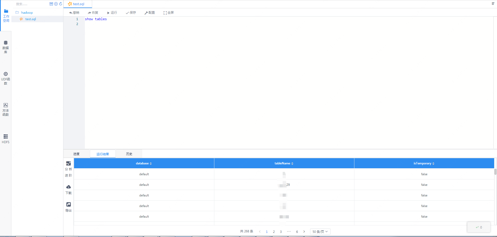
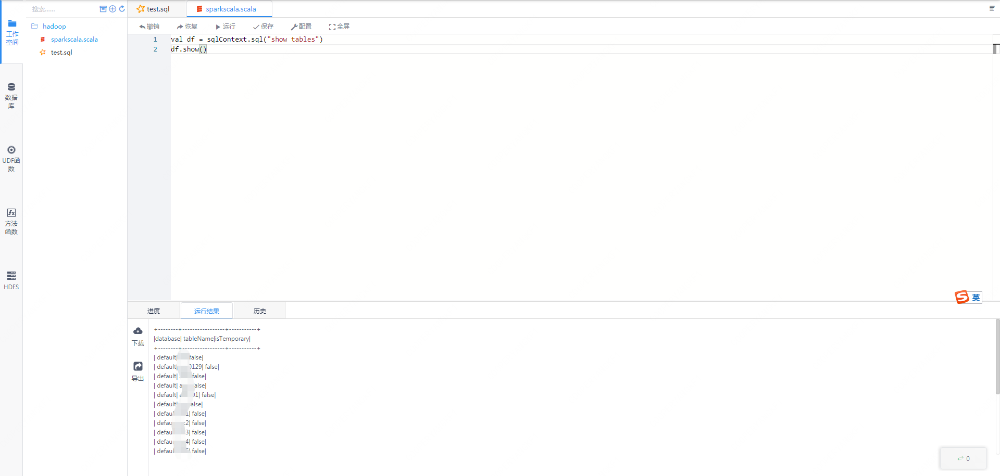
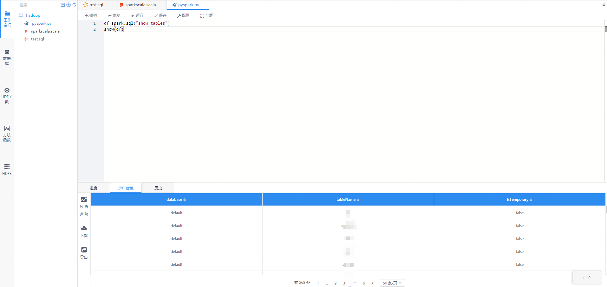

本文主要介绍在 Linkis 中，Spark 引擎插件的安装、使用和配置。

## 1. 前置工作
### 1.1 引擎安装

如果您希望在您的服务器上使用spark引擎，您需要保证以下的环境变量已经设置正确并且引擎的启动用户是有这些环境变量的。

强烈建议您在执行spark任务之前，检查下执行用户的这些环境变量。

| 环境变量名      | 环境变量内容   | 备注                                   |
|-----------------|----------------|----------------------------------------|
| JAVA_HOME       | JDK安装路径    | 必须                                   |
| HADOOP_HOME     | Hadoop安装路径 | 必须                                   |
| HADOOP_CONF_DIR | Hadoop配置路径 | 必须                                   |
| HIVE_CONF_DIR   | Hive配置路径   | 必须                                   |
| SPARK_HOME      | Spark安装路径  | 必须                                   |
| SPARK_CONF_DIR  | Spark配置路径  | 必须                                   |
| python          | python        | 建议使用anaconda的python作为默认python   |

### 1.2 环境验证
通过pyspark验证Spark是否安装成功
```
pyspark

#进入pyspark虚拟环境后，出现spark的logo则说明环境安装成功
Welcome to
      ____              __
     / __/__  ___ _____/ /__
    _\ \/ _ \/ _ `/ __/  '_/
   /__ / .__/\_,_/_/ /_/\_\   version 2.4.3
      /_/

Using Python version 2.7.13 (default, Sep 30 2017 18:12:43)
SparkSession available as 'spark'.
```

## 2.引擎插件安装

linkis发布的二进制安装包中默认包含了 Spark 引擎插件，用户无需额外安装。

理论上Linkis支持的spark2.x以上的所有版本。默认支持的版本为Spark2.4.3。如果您想使用其他的spark版本，如spark2.1.0，则您仅仅需要将插件spark的版本进行修改，然后进行编译即可。具体的，您可以找到linkis-engineplugin-spark模块，将maven依赖中"spark.version"标签的值改成2.1.0，然后单独编译此模块即可。

## 3.spark引擎的使用

### 3.1 通过Linkis-cli提交任务

```shell
# codeType对应关系 py-->pyspark  sql-->sparkSQL scala-->Spark scala
sh ./bin/linkis-cli -engineType spark-2.4.3 -codeType sql -code "show databases"  -submitUser hadoop -proxyUser hadoop

# 可以在提交参数通过-confMap wds.linkis.yarnqueue=dws  来指定yarn 队列
sh ./bin/linkis-cli -engineType spark-2.4.3 -codeType sql  -confMap wds.linkis.yarnqueue=dws -code "show databases"  -submitUser hadoop -proxyUser hadoop
```
更多 Linkis-Cli 命令参数参考： [Linkis-Cli 使用](../user-guide/linkiscli-manual.md)

### 3.2 通过Linkis SDK进行使用

Linkis提供了Java和Scala 的SDK向Linkis服务端提交任务. 具体可以参考 [JAVA SDK Manual](../user-guide/sdk-manual.md).
对于Spark任务你只需要修改Demo中的EngineConnType和CodeType参数即可:

```java
Map<String, Object> labels = new HashMap<String, Object>();
labels.put(LabelKeyConstant.ENGINE_TYPE_KEY, "spark-2.4.3"); // required engineType Label
labels.put(LabelKeyConstant.USER_CREATOR_TYPE_KEY, "hadoop-IDE");// required execute user and creator
labels.put(LabelKeyConstant.CODE_TYPE_KEY, "sql"); // required codeType py,sql,scala
```

### 3.3 Scriptis的使用方式

[Scriptis](https://github.com/WeBankFinTech/Scriptis)的使用方式是最简单的，您可以直接进入Scriptis，新建sql、scala或者pyspark脚本进行执行。

sql的方式是最简单的，您可以新建sql脚本然后编写进行执行，执行的时候，会有进度的显示。如果一开始用户是没有spark引擎的话，sql的执行会启动一个spark会话(这里可能会花一些时间)，
SparkSession初始化之后，就可以开始执行sql。



spark-scala的任务，我们已经初始化好了sqlContext等变量，用户可以直接使用这个sqlContext进行sql的执行。



类似的，pyspark的方式中，我们也已经初始化好了SparkSession，用户可以直接使用spark.sql的方式进行执行sql。



## 4.引擎配置说明

### 4.1 默认配置说明
| 配置                     | 默认值          |是否必须    | 说明                                     |
| ------------------------ | ------------------- | ---|---------------------------------------- |
| wds.linkis.rm.instance        | 10    |否  | 引擎最大并发数 |
| spark.executor.cores        | 1            |否  | spark执行器核心个数 |
| spark.driver.memory       | 1g    |否              | spark执行器实例最大并发数 |
| spark.executor.memory       | 1g    |否              | spark执行器内存大小 |
| wds.linkis.engineconn.max.free.time       | 1h    |否              | 引擎空闲退出时间 |
| spark.python.version       | python2    |否              | python版本 |

### 4.2 队列资源配置
因为spark的执行需要队列的资源，须要设置自己能够执行的队列。    

 


### 4.3 配置修改
如果默认参数不满足时，有如下几中方式可以进行一些基础参数配置

#### 4.3.1 管理台配置
用户可以进行自定义的设置，比如spark会话executor个数和executor的内存。这些参数是为了用户能够更加自由地设置自己的spark的参数，另外spark其他参数也可以进行修改，比如的pyspark的python版本等。


注意: 修改IDE标签下的配置后需要指定 -creator IDE 才会生效（其它标签类似），如：

```shell
sh ./bin/linkis-cli -creator IDE -engineType spark-2.4.3 -codeType sql -code "show databases"  -submitUser hadoop -proxyUser hadoop
```

#### 4.3.2 任务接口配置
提交任务接口，通过参数params.configuration.runtime进行配置

```shell
http 请求参数示例 
{
    "executionContent": {"code": "show databases;", "runType":  "sql"},
    "params": {
                    "variable": {},
                    "configuration": {
                            "runtime": {
                                "wds.linkis.rm.instance":"10"
                                }
                            }
                    },
    "labels": {
        "engineType": "spark-2.4.3",
        "userCreator": "hadoop-IDE"
    }
}
```

### 4.4 引擎相关数据表

Linkis 是通过引擎标签来进行管理的，所涉及的数据表信息如下所示。

```
linkis_ps_configuration_config_key:  插入引擎的配置参数的key和默认values
linkis_cg_manager_label：插入引擎label如：spark-2.4.3
linkis_ps_configuration_category： 插入引擎的目录关联关系
linkis_ps_configuration_config_value： 插入引擎需要展示的配置
linkis_ps_configuration_key_engine_relation:配置项和引擎的关联关系
```

表中与 spark 引擎相关的初始数据如下

```sql
-- set variable
SET @SPARK_LABEL="spark-2.4.3";
SET @SPARK_ALL=CONCAT('*-*,',@SPARK_LABEL);
SET @SPARK_IDE=CONCAT('*-IDE,',@SPARK_LABEL);

-- engine label
insert into `linkis_cg_manager_label` (`label_key`, `label_value`, `label_feature`, `label_value_size`, `update_time`, `create_time`) VALUES ('combined_userCreator_engineType', @SPARK_ALL, 'OPTIONAL', 2, now(), now());
insert into `linkis_cg_manager_label` (`label_key`, `label_value`, `label_feature`, `label_value_size`, `update_time`, `create_time`) VALUES ('combined_userCreator_engineType', @SPARK_IDE, 'OPTIONAL', 2, now(), now());

select @label_id := id from linkis_cg_manager_label where `label_value` = @SPARK_IDE;
insert into linkis_ps_configuration_category (`label_id`, `level`) VALUES (@label_id, 2);

-- configuration key
INSERT INTO `linkis_ps_configuration_config_key` (`key`, `description`, `name`, `default_value`, `validate_type`, `validate_range`, `is_hidden`, `is_advanced`, `level`, `treeName`, `engine_conn_type`) VALUES ('wds.linkis.rm.instance', '范围：1-20，单位：个', 'spark引擎最大并发数', '10', 'NumInterval', '[1,20]', '0', '0', '1', '队列资源', 'spark');
INSERT INTO `linkis_ps_configuration_config_key` (`key`, `description`, `name`, `default_value`, `validate_type`, `validate_range`, `is_hidden`, `is_advanced`, `level`, `treeName`, `engine_conn_type`) VALUES ('spark.executor.instances', '取值范围：1-40，单位：个', 'spark执行器实例最大并发数', '1', 'NumInterval', '[1,40]', '0', '0', '2', 'spark资源设置', 'spark');
INSERT INTO `linkis_ps_configuration_config_key` (`key`, `description`, `name`, `default_value`, `validate_type`, `validate_range`, `is_hidden`, `is_advanced`, `level`, `treeName`, `engine_conn_type`) VALUES ('spark.executor.cores', '取值范围：1-8，单位：个', 'spark执行器核心个数',  '1', 'NumInterval', '[1,8]', '0', '0', '1','spark资源设置', 'spark');
INSERT INTO `linkis_ps_configuration_config_key` (`key`, `description`, `name`, `default_value`, `validate_type`, `validate_range`, `is_hidden`, `is_advanced`, `level`, `treeName`, `engine_conn_type`) VALUES ('spark.executor.memory', '取值范围：1-15，单位：G', 'spark执行器内存大小', '1g', 'Regex', '^([1-9]|1[0-5])(G|g)$', '0', '0', '3', 'spark资源设置', 'spark');
INSERT INTO `linkis_ps_configuration_config_key` (`key`, `description`, `name`, `default_value`, `validate_type`, `validate_range`, `is_hidden`, `is_advanced`, `level`, `treeName`, `engine_conn_type`) VALUES ('spark.driver.cores', '取值范围：只能取1，单位：个', 'spark驱动器核心个数', '1', 'NumInterval', '[1,1]', '0', '1', '1', 'spark资源设置','spark');
INSERT INTO `linkis_ps_configuration_config_key` (`key`, `description`, `name`, `default_value`, `validate_type`, `validate_range`, `is_hidden`, `is_advanced`, `level`, `treeName`, `engine_conn_type`) VALUES ('spark.driver.memory', '取值范围：1-15，单位：G', 'spark驱动器内存大小','1g', 'Regex', '^([1-9]|1[0-5])(G|g)$', '0', '0', '1', 'spark资源设置', 'spark');
INSERT INTO `linkis_ps_configuration_config_key` (`key`, `description`, `name`, `default_value`, `validate_type`, `validate_range`, `is_hidden`, `is_advanced`, `level`, `treeName`, `engine_conn_type`) VALUES ('wds.linkis.engineconn.max.free.time', '取值范围：3m,15m,30m,1h,2h', '引擎空闲退出时间','1h', 'OFT', '[\"1h\",\"2h\",\"30m\",\"15m\",\"3m\"]', '0', '0', '1', 'spark引擎设置', 'spark');
INSERT INTO `linkis_ps_configuration_config_key` (`key`, `description`, `name`, `default_value`, `validate_type`, `validate_range`, `is_hidden`, `is_advanced`, `level`, `treeName`, `engine_conn_type`) VALUES ('spark.tispark.pd.addresses', NULL, NULL, 'pd0:2379', 'None', NULL, '0', '0', '1', 'tidb设置', 'spark');
INSERT INTO `linkis_ps_configuration_config_key` (`key`, `description`, `name`, `default_value`, `validate_type`, `validate_range`, `is_hidden`, `is_advanced`, `level`, `treeName`, `engine_conn_type`) VALUES ('spark.tispark.tidb.addr', NULL, NULL, 'tidb', 'None', NULL, '0', '0', '1', 'tidb设置', 'spark');
INSERT INTO `linkis_ps_configuration_config_key` (`key`, `description`, `name`, `default_value`, `validate_type`, `validate_range`, `is_hidden`, `is_advanced`, `level`, `treeName`, `engine_conn_type`) VALUES ('spark.tispark.tidb.password', NULL, NULL, NULL, 'None', NULL, '0', '0', '1', 'tidb设置', 'spark');
INSERT INTO `linkis_ps_configuration_config_key` (`key`, `description`, `name`, `default_value`, `validate_type`, `validate_range`, `is_hidden`, `is_advanced`, `level`, `treeName`, `engine_conn_type`) VALUES ('spark.tispark.tidb.port', NULL, NULL, '4000', 'None', NULL, '0', '0', '1', 'tidb设置', 'spark');
INSERT INTO `linkis_ps_configuration_config_key` (`key`, `description`, `name`, `default_value`, `validate_type`, `validate_range`, `is_hidden`, `is_advanced`, `level`, `treeName`, `engine_conn_type`) VALUES ('spark.tispark.tidb.user', NULL, NULL, 'root', 'None', NULL, '0', '0', '1', 'tidb设置', 'spark');
INSERT INTO `linkis_ps_configuration_config_key` (`key`, `description`, `name`, `default_value`, `validate_type`, `validate_range`, `is_hidden`, `is_advanced`, `level`, `treeName`, `engine_conn_type`) VALUES ('spark.python.version', '取值范围：python2,python3', 'python版本','python2', 'OFT', '[\"python3\",\"python2\"]', '0', '0', '1', 'spark引擎设置', 'spark');

-- key engine relation
insert into `linkis_ps_configuration_key_engine_relation` (`config_key_id`, `engine_type_label_id`)
(select config.id as `config_key_id`, label.id AS `engine_type_label_id` FROM linkis_ps_configuration_config_key config
INNER JOIN linkis_cg_manager_label label ON config.engine_conn_type = 'spark' and label.label_value = @SPARK_ALL);

-- engine default configuration
insert into `linkis_ps_configuration_config_value` (`config_key_id`, `config_value`, `config_label_id`)
(select `relation`.`config_key_id` AS `config_key_id`, '' AS `config_value`, `relation`.`engine_type_label_id` AS `config_label_id` FROM linkis_ps_configuration_key_engine_relation relation
INNER JOIN linkis_cg_manager_label label ON relation.engine_type_label_id = label.id AND label.label_value = @SPARK_ALL);

```