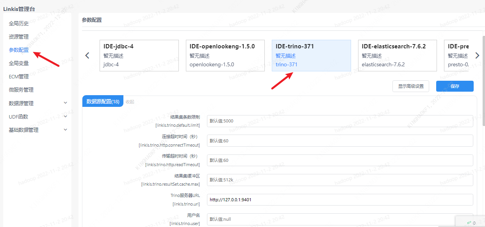

本文主要介绍在 `Linkis` 中，`Trino` 引擎插件的安装、使用和配置。


## 1. 前置工作

### 1.1 引擎安装

如果您希望在您的 `Linkis` 服务上使用 `Trino` 引擎，您需要安装 `Trino` 服务并保证服务可用。

### 1.2 服务验证

```shell
# 准备 trino-cli
wget https://repo1.maven.org/maven2/io/trino/trino-cli/374/trino-cli-374-executable.jar
mv trino-cli-374-executable.jar trino-cli
chmod +x trino-cli

#  执行任务
./trino-cli --server localhost:8080 --execute 'show tables from system.jdbc'

# 得到如下输出代表服务可用
"attributes"
"catalogs"
"columns"
"procedure_columns"
"procedures"
"pseudo_columns"
"schemas"
"super_tables"
"super_types"
"table_types"
"tables"
"types"
"udts"
```

## 2. 引擎插件部署

### 2.1 引擎插件准备（二选一）[非默认引擎](./overview.md)

方式一：直接下载引擎插件包

[Linkis 引擎插件下载](https://linkis.apache.org/zh-CN/blog/2022/04/15/how-to-download-engineconn-plugin)

方式二：单独编译引擎插件（需要有 `maven` 环境）

```
# 编译
cd ${linkis_code_dir}/linkis-engineconn-plugins/trino/
mvn clean install
# 编译出来的引擎插件包，位于如下目录中
${linkis_code_dir}/linkis-engineconn-plugins/trino/target/out/
```
[EngineConnPlugin 引擎插件安装](../deployment/install-engineconn.md)

### 2.2 引擎插件的上传和加载

将 2.1 中的引擎包上传到服务器的引擎目录下
```bash 
${LINKIS_HOME}/lib/linkis-engineplugins
```
上传后目录结构如下所示
```
linkis-engineconn-plugins/
├── trino
│   ├── dist
│   │   └── v371
│   │       ├── conf
│   │       └── lib
│   └── plugin
│       └── 371
```

### 2.3 引擎刷新

#### 2.3.1 重启刷新
通过重启 `linkis-cg-linkismanager` 服务刷新引擎
```bash
cd ${LINKIS_HOME}/sbin
sh linkis-daemon.sh restart cg-linkismanager
```

### 2.3.2 检查引擎是否刷新成功
可以查看数据库中的 `linkis_engine_conn_plugin_bml_resources` 这张表的`last_update_time` 是否为触发刷新的时间。

```sql
#登陆到 `linkis` 的数据库 
select * from linkis_cg_engine_conn_plugin_bml_resources;
```

## 3 引擎的使用

### 3.1 通过 `Linkis-cli` 提交任务 

```shell
 sh ./bin/linkis-cli -submitUser hadoop \
 -engineType trino-371 -codeType sql \
 -code 'select * from system.jdbc.schemas limit 10' \
 -runtimeMap linkis.trino.url=http://127.0.0.1:8080
```

如果管理台，任务接口，配置文件，均未配置（配置方式见 4.2 ）时可在 `Linkis-cli` 客户端中通过 `-runtimeMap` 属性进行配置

```shell
sh ./bin/linkis-cli -engineType trino-371 \
-codeType  sql -code 'select * from system.jdbc.schemas limit 10;'  \
-runtimeMap linkis.trino.urll=http://127.0.0.1:8080 \
-runtimeMap linkis.trino.catalog=hive \
-runtimeMap linkis.trino.schema=default \
-submitUser hadoop -proxyUser hadoop
```

更多 `Linkis-Cli` 命令参数参考： [Linkis-Cli 使用](../user-guide/linkiscli-manual.md)

## 4. 引擎配置说明

### 4.1 默认配置说明

| 配置                                   | 默认值                | 说明                                        | 是否必须 |
| -------------------------------------- | --------------------- | ------------------------------------------- | -------- |
| linkis.trino.url                  | http://127.0.0.1:8080 | Trino 集群连接 URL                             | true |
| linkis.trino.default.limit | 5000 | 否 | 结果集条数限制 |
| linkis.trino.http.connectTimeout | 60 | 否 | 连接超时时间（秒） |
| linkis.trino.http.readTimeout | 60 | 否 | 传输超时时间（秒）|
| linkis.trino.resultSet.cache.max | 512k | 否 | 结果集缓冲区 |
| linkis.trino.user | null | 否 | 用户名 |
| linkis.trino.password | null | 否 | 密码 |
| linkis.trino.passwordCmd | null | 否 | 密码回调命令 |
| linkis.trino.catalog | system | 否 | Catalog |
| linkis.trino.schema | null | 否 | Schema |
| linkis.trino.ssl.insecured | false | 否 | 验证SSL证书 |
| linkis.engineconn.concurrent.limit | 100 | 否 | 引擎最大并发数 |
| linkis.trino.ssl.key.store | null | 否 | keystore路径 |
| linkis.trino.ssl.keystore.password | null | 否 | keystore密码 |
| linkis.trino.ssl.keystore.type | null | 否 | keystore类型 |
| linkis.trino.ssl.truststore | null | 否 | truststore |
| linkis.trino.ss..truststore.type | null  | 否 | trustore类型 |
| linkis.trino.ssl.truststore.password | null | 否 | truststore密码 |

### 4.2 配置修改

如果默认参数不满足时，有如下几中方式可以进行一些基础参数配置

#### 4.2.1 管理台配置



注意: 修改 `IDE` 标签下的配置后需要指定 `-creator IDE` 才会生效（其它标签类似），如：

```shell
sh ./bin/linkis-cli -creator IDE -submitUser hadoop \
 -engineType trino-371 -codeType sql \
 -code 'select * from system.jdbc.schemas limit 10' \
 -runtimeMap linkis.trino.url=http://127.0.0.1:8080
```

#### 4.2.2 任务接口配置
提交任务接口，通过参数 `params.configuration.runtime` 进行配置

```shell
http 请求参数示例 
{
    "executionContent": {"code": "select * from system.jdbc.schemas limit 10;", "runType":  "sql"},
    "params": {
                    "variable": {},
                    "configuration": {
                            "runtime": {
                                "linkis.trino.url":"http://127.0.0.1:8080",
                                "linkis.trino.catalog ":"hive",
                                "linkis.trino.schema ":"default"
                                }
                            }
                    },
    "labels": {
        "engineType": "trino-371",
        "userCreator": "hadoop-IDE"
    }
}
```

### 4.3 引擎相关数据表

`Linkis` 是通过引擎标签来进行管理的，所涉及的数据表信息如下所示。

```
linkis_ps_configuration_config_key:  插入引擎的配置参数的key和默认values
linkis_cg_manager_label：插入引擎label如：trino-375
linkis_ps_configuration_category： 插入引擎的目录关联关系
linkis_ps_configuration_config_value： 插入引擎需要展示的配置
linkis_ps_configuration_key_engine_relation:配置项和引擎的关联关系
```

表中与引擎相关的初始数据如下


```sql
-- set variable
SET @TRINO_LABEL="trino-371";
SET @TRINO_IDE=CONCAT('*-IDE,',@TRINO_LABEL);
SET @TRINO_ALL=CONCAT('*-*,',@TRINO_LABEL);

-- engine label
insert into `linkis_cg_manager_label` (`label_key`, `label_value`, `label_feature`, `label_value_size`, `update_time`, `create_time`) VALUES ('combined_userCreator_engineType', @TRINO_IDE, 'OPTIONAL', 2, now(), now());
insert into `linkis_cg_manager_label` (`label_key`, `label_value`, `label_feature`, `label_value_size`, `update_time`, `create_time`) VALUES ('combined_userCreator_engineType', @TRINO_ALL, 'OPTIONAL', 2, now(), now());
select @label_id := id from `linkis_cg_manager_label` where label_value = @TRINO_IDE;
insert into `linkis_ps_configuration_category` (`label_id`, `level`) VALUES (@label_id, 2);

-- configuration key
INSERT INTO `linkis_ps_configuration_config_key` (`key`, `description`, `name`, `default_value`, `validate_type`, `validate_range`, `engine_conn_type`, `is_hidden`, `is_advanced`, `level`, `treeName`) VALUES ('linkis.trino.default.limit', '查询的结果集返回条数限制', '结果集条数限制', '5000', 'None', '', 'trino', 0, 0, 1, '数据源配置');
INSERT INTO `linkis_ps_configuration_config_key` (`key`, `description`, `name`, `default_value`, `validate_type`, `validate_range`, `engine_conn_type`, `is_hidden`, `is_advanced`, `level`, `treeName`) VALUES ('linkis.trino.http.connectTimeout', '连接Trino服务器的超时时间', '连接超时时间（秒）', '60', 'None', '', 'trino', 0, 0, 1, '数据源配置');
INSERT INTO `linkis_ps_configuration_config_key` (`key`, `description`, `name`, `default_value`, `validate_type`, `validate_range`, `engine_conn_type`, `is_hidden`, `is_advanced`, `level`, `treeName`) VALUES ('linkis.trino.http.readTimeout', '等待Trino服务器返回数据的超时时间', '传输超时时间（秒）', '60', 'None', '', 'trino', 0, 0, 1, '数据源配置');
INSERT INTO `linkis_ps_configuration_config_key` (`key`, `description`, `name`, `default_value`, `validate_type`, `validate_range`, `engine_conn_type`, `is_hidden`, `is_advanced`, `level`, `treeName`) VALUES ('linkis.trino.resultSet.cache.max', 'Trino结果集缓冲区大小', '结果集缓冲区', '512k', 'None', '', 'trino', 0, 0, 1, '数据源配置');
INSERT INTO `linkis_ps_configuration_config_key` (`key`, `description`, `name`, `default_value`, `validate_type`, `validate_range`, `engine_conn_type`, `is_hidden`, `is_advanced`, `level`, `treeName`) VALUES ('linkis.trino.url', 'Trino服务器URL', 'Trino服务器URL', 'http://127.0.0.1:9401', 'None', '', 'trino', 0, 0, 1, '数据源配置');
INSERT INTO `linkis_ps_configuration_config_key` (`key`, `description`, `name`, `default_value`, `validate_type`, `validate_range`, `engine_conn_type`, `is_hidden`, `is_advanced`, `level`, `treeName`) VALUES ('linkis.trino.user', '用于连接Trino查询服务的用户名', '用户名', 'null', 'None', '', 'trino', 0, 0, 1, '数据源配置');
INSERT INTO `linkis_ps_configuration_config_key` (`key`, `description`, `name`, `default_value`, `validate_type`, `validate_range`, `engine_conn_type`, `is_hidden`, `is_advanced`, `level`, `treeName`) VALUES ('linkis.trino.password', '用于连接Trino查询服务的密码', '密码', 'null', 'None', '', 'trino', 0, 0, 1, '数据源配置');
INSERT INTO `linkis_ps_configuration_config_key` (`key`, `description`, `name`, `default_value`, `validate_type`, `validate_range`, `engine_conn_type`, `is_hidden`, `is_advanced`, `level`, `treeName`) VALUES ('linkis.trino.passwordCmd', '用于连接Trino查询服务的密码回调命令', '密码回调命令', 'null', 'None', '', 'trino', 0, 0, 1, '数据源配置');
INSERT INTO `linkis_ps_configuration_config_key` (`key`, `description`, `name`, `default_value`, `validate_type`, `validate_range`, `engine_conn_type`, `is_hidden`, `is_advanced`, `level`, `treeName`) VALUES ('linkis.trino.catalog', '连接Trino查询时使用的catalog', 'Catalog', 'system', 'None', '', 'trino', 0, 0, 1, '数据源配置');
INSERT INTO `linkis_ps_configuration_config_key` (`key`, `description`, `name`, `default_value`, `validate_type`, `validate_range`, `engine_conn_type`, `is_hidden`, `is_advanced`, `level`, `treeName`) VALUES ('linkis.trino.schema', '连接Trino查询服务的默认schema', 'Schema', '', 'None', '', 'trino', 0, 0, 1, '数据源配置');
INSERT INTO `linkis_ps_configuration_config_key` (`key`, `description`, `name`, `default_value`, `validate_type`, `validate_range`, `engine_conn_type`, `is_hidden`, `is_advanced`, `level`, `treeName`) VALUES ('linkis.trino.ssl.insecured', '是否忽略服务器的SSL证书', '验证SSL证书', 'false', 'None', '', 'trino', 0, 0, 1, '数据源配置');
INSERT INTO `linkis_ps_configuration_config_key` (`key`, `description`, `name`, `default_value`, `validate_type`, `validate_range`, `engine_conn_type`, `is_hidden`, `is_advanced`, `level`, `treeName`) VALUES ('linkis.engineconn.concurrent.limit', '引擎最大并发', '引擎最大并发', '100', 'None', '', 'trino', 0, 0, 1, '数据源配置');
INSERT INTO `linkis_ps_configuration_config_key` (`key`, `description`, `name`, `default_value`, `validate_type`, `validate_range`, `engine_conn_type`, `is_hidden`, `is_advanced`, `level`, `treeName`) VALUES ('linkis.trino.ssl.keystore', 'Trino服务器SSL keystore路径', 'keystore路径', 'null', 'None', '', 'trino', 0, 0, 1, '数据源配置');
INSERT INTO `linkis_ps_configuration_config_key` (`key`, `description`, `name`, `default_value`, `validate_type`, `validate_range`, `engine_conn_type`, `is_hidden`, `is_advanced`, `level`, `treeName`) VALUES ('linkis.trino.ssl.keystore.type', 'Trino服务器SSL keystore类型', 'keystore类型', 'null', 'None', '', 'trino', 0, 0, 1, '数据源配置');
INSERT INTO `linkis_ps_configuration_config_key` (`key`, `description`, `name`, `default_value`, `validate_type`, `validate_range`, `engine_conn_type`, `is_hidden`, `is_advanced`, `level`, `treeName`) VALUES ('linkis.trino.ssl.keystore.password', 'Trino服务器SSL keystore密码', 'keystore密码', 'null', 'None', '', 'trino', 0, 0, 1, '数据源配置');
INSERT INTO `linkis_ps_configuration_config_key` (`key`, `description`, `name`, `default_value`, `validate_type`, `validate_range`, `engine_conn_type`, `is_hidden`, `is_advanced`, `level`, `treeName`) VALUES ('linkis.trino.ssl.truststore', 'Trino服务器SSL truststore路径', 'truststore路径', 'null', 'None', '', 'trino', 0, 0, 1, '数据源配置');
INSERT INTO `linkis_ps_configuration_config_key` (`key`, `description`, `name`, `default_value`, `validate_type`, `validate_range`, `engine_conn_type`, `is_hidden`, `is_advanced`, `level`, `treeName`) VALUES ('linkis.trino.ssl.truststore.type', 'Trino服务器SSL truststore类型', 'truststore类型', 'null', 'None', '', 'trino', 0, 0, 1, '数据源配置');
INSERT INTO `linkis_ps_configuration_config_key` (`key`, `description`, `name`, `default_value`, `validate_type`, `validate_range`, `engine_conn_type`, `is_hidden`, `is_advanced`, `level`, `treeName`) VALUES ('linkis.trino.ssl.truststore.password', 'Trino服务器SSL truststore密码', 'truststore密码', 'null', 'None', '', 'trino', 0, 0, 1, '数据源配置');


-- key engine relation
insert into `linkis_ps_configuration_key_engine_relation` (`config_key_id`, `engine_type_label_id`)
(select config.id as config_key_id, label.id AS engine_type_label_id FROM `linkis_ps_configuration_config_key` config
INNER JOIN `linkis_cg_manager_label` label ON config.engine_conn_type = 'trino' and label_value = @TRINO_ALL);

-- engine default configuration
insert into `linkis_ps_configuration_config_value` (`config_key_id`, `config_value`, `config_label_id`)
(select relation.config_key_id AS config_key_id, '' AS config_value, relation.engine_type_label_id AS config_label_id FROM `linkis_ps_configuration_key_engine_relation` relation
INNER JOIN `linkis_cg_manager_label` label ON relation.engine_type_label_id = label.id AND label.label_value = @TRINO_ALL);
```