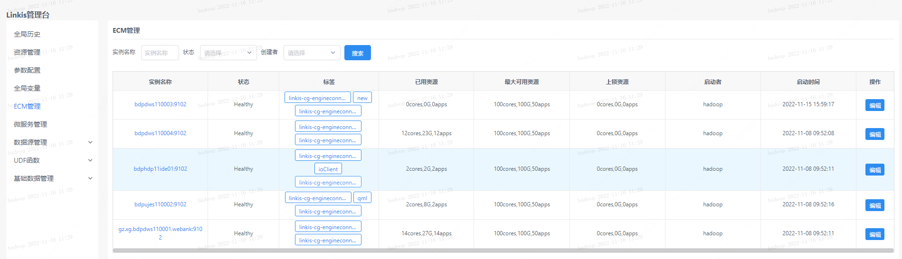
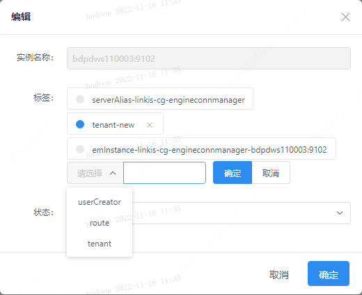
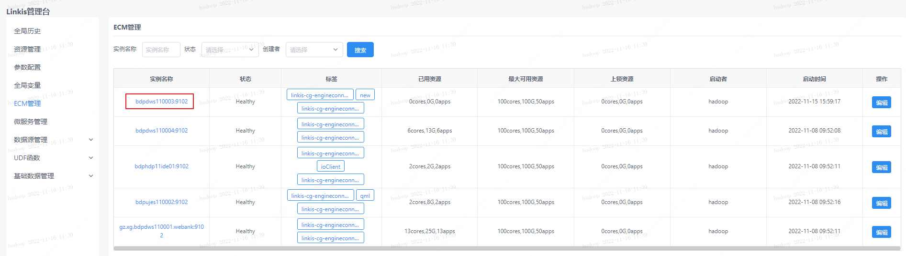
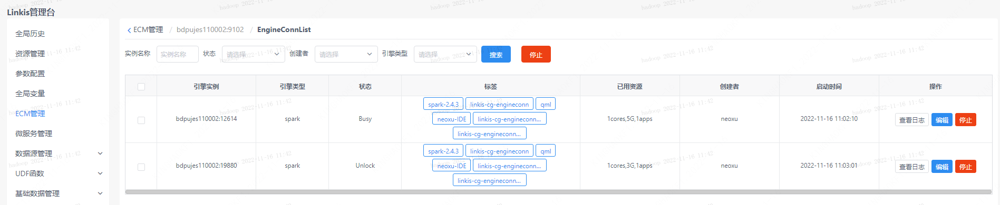
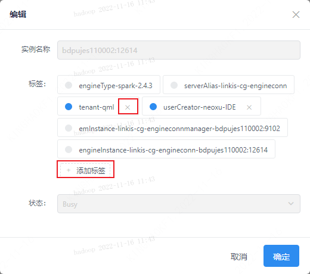

ECM 管理界面仅 Linkis 计算治理台管理员可见，该页面用于管理 ECM 和所有引擎。该界面可以查看到ECM的状态信息、修改ECM标签信息、修改ECM状态信息以及查询各个ECM下的所有引擎信息。

## 1. 实例查看
一个 ECM 实例就是一个 ECM服务。用户可以根据需求启动多个 ECM 服务来提高请求处理效率。该页面可以查看 ECM 实例信息，包括名称、标签以及资源等信息。并且可以通过实例名称、状态、创建者等关键字对 ECM 实例进行过虑。

## 2. 标签管理
ECM 服务是根据标签进行请求过虑和处理的。每个服务包含默认标签和用户自定义标签。只有携带 ECM 服务所属标签信息的请求才会被当前服务处理。点击编辑按钮，可以编辑ECM的标签信息（仅允许编辑用户自定义标签），以及修改ECM的状态。

最常用的是租户标签 tenant，用户可以通过该标签进行租户请求隔离。

## 3. ECM 下的引擎信息

点击 ECM 的实例名称，可以查看该 ECM 下所有的引擎信息。并对引擎进行管理，包括引擎停止、添加或删除用户自定义标签、查看引擎日志等操作。

同样的给 ECM 实例下的引擎打标签后，可以更细粒度的控制处理请求的具体引擎。
